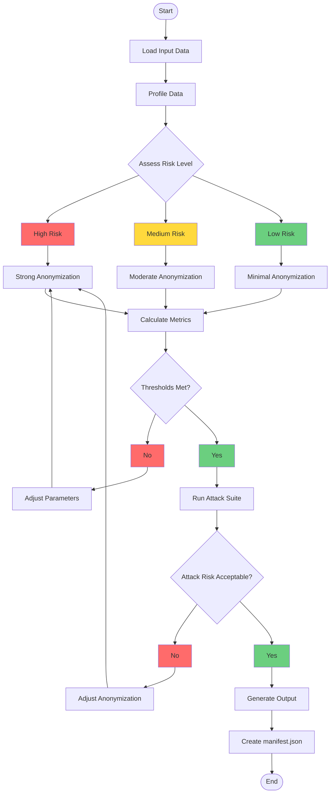
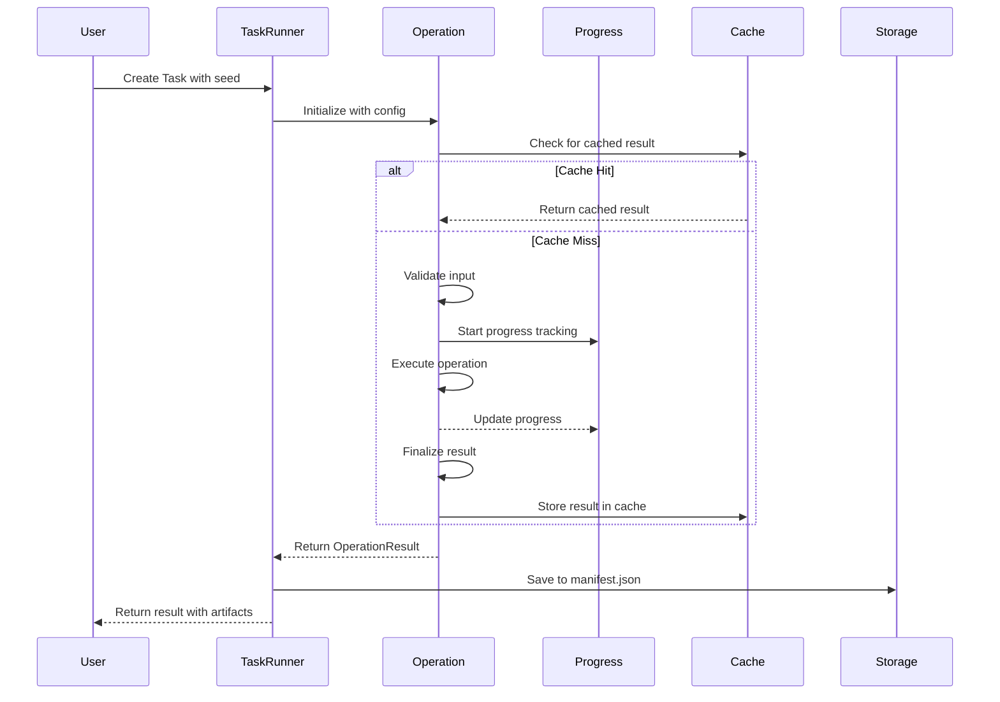
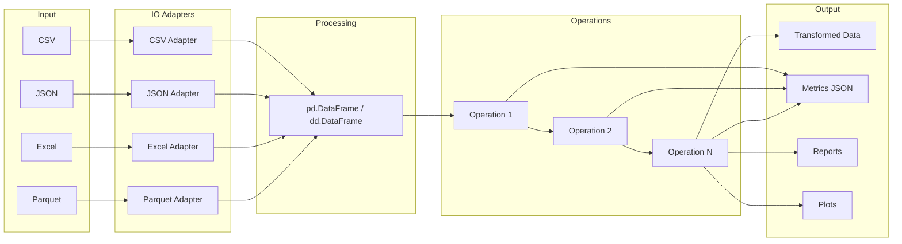
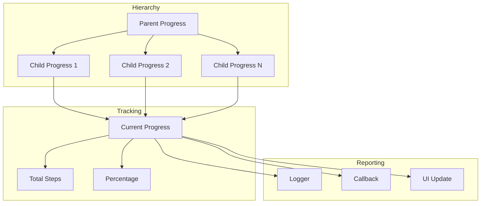
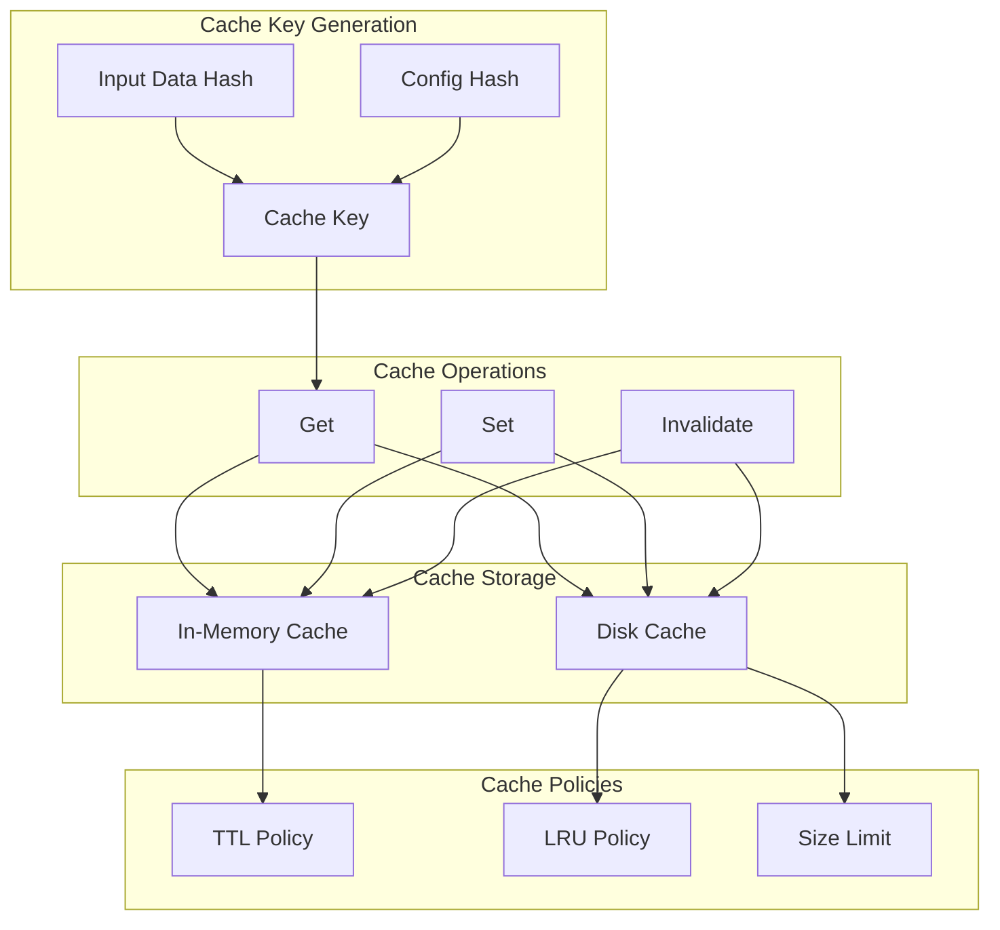
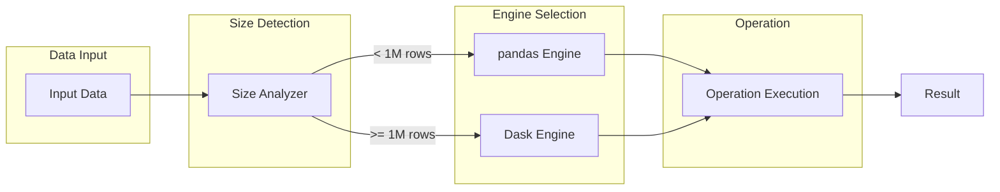
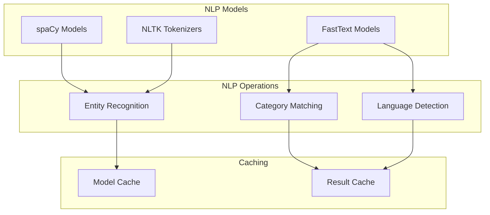

# PAMOLA.CORE Data Flows and Component Interactions

**Version:** 0.1.0
**Last Updated:** 2026-03-12

## Overview

This document describes data processing flows, task execution patterns, and component interactions in PAMOLA.CORE.

## Data Processing Flow

### Anonymization Decision Flow



### Task Execution Flow



### Data Processing Pipeline



## Component Interactions

### Operation Registry

```mermaid
flowchart TB
    subgraph RegistrationStage[Registration]
        Op1[Operation Class 1]
        Op2[Operation Class 2]
        OpN[Operation Class N]
    end

    subgraph RegistryStage[Registry]
        Reg[OperationRegistry]
        Meta[Metadata Store]
        Dep[Dependency Graph]
    end

    subgraph DiscoveryStage[Discovery]
        API[API Request]
        DiscoverySvc[Discovery Service]
    end

    subgraph InstantiationStage[Instantiation]
        Factory[Operation Factory]
        Instance[Operation Instance]
    end

    Op1 -->|@register_operation| Reg
    Op2 -->|@register_operation| Reg
    OpN -->|@register_operation| Reg

    Reg --> Meta
    Reg --> Dep

    API --> DiscoverySvc
    DiscoverySvc --> Reg
    Reg --> Factory
    Factory --> Instance
```

### Progress Tracking



### Caching Strategy



## Integration Patterns

### Dual Engine Support



### NLP Integration



## References

- [system-architecture.md](./system-architecture.md) - Core system architecture
- [architecture-security.md](./architecture-security.md) - Security and performance architecture
- [code-standards.md](./code-standards.md) - Development guidelines
