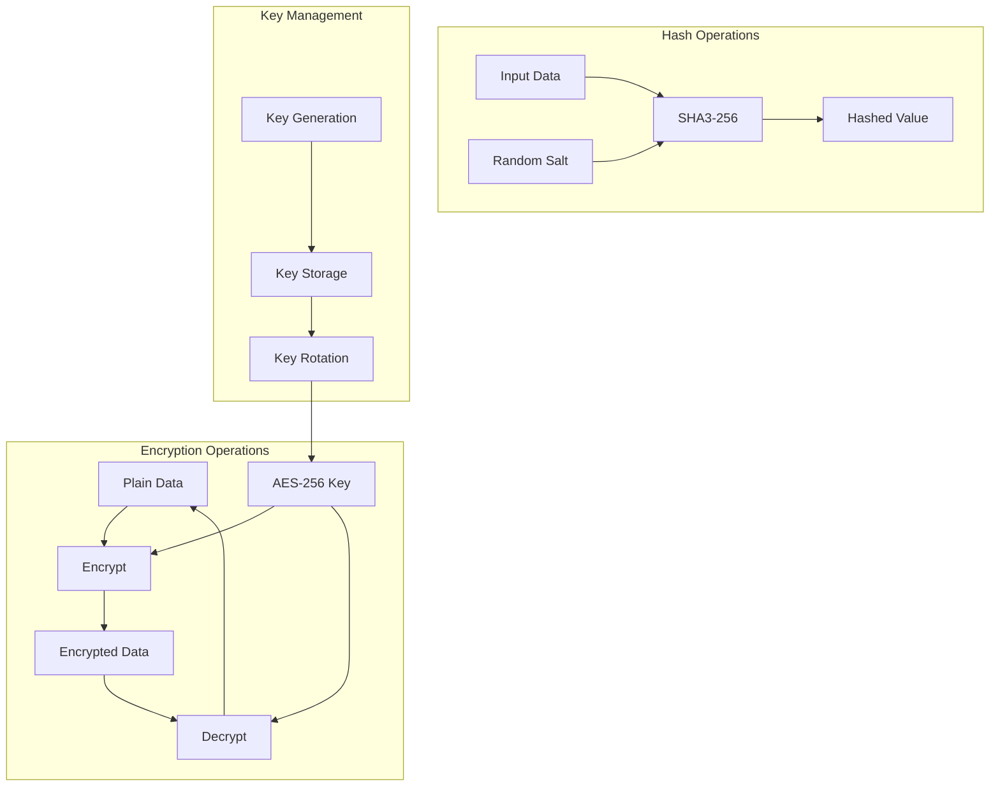
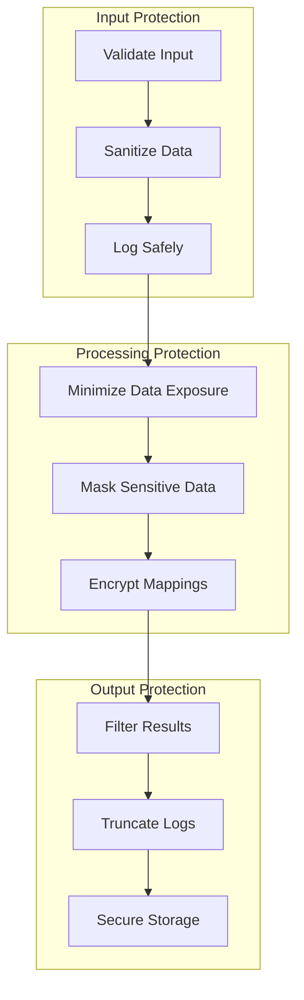
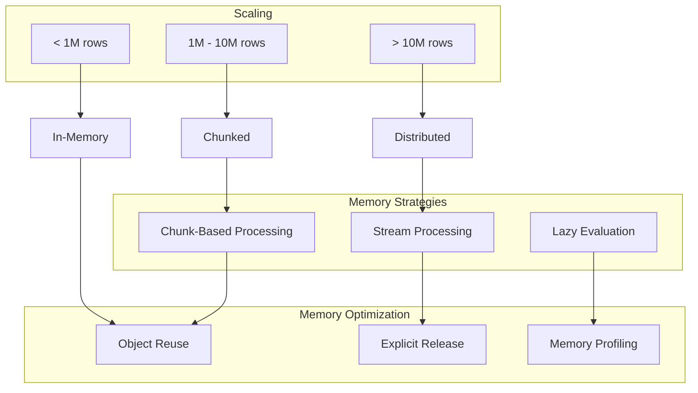
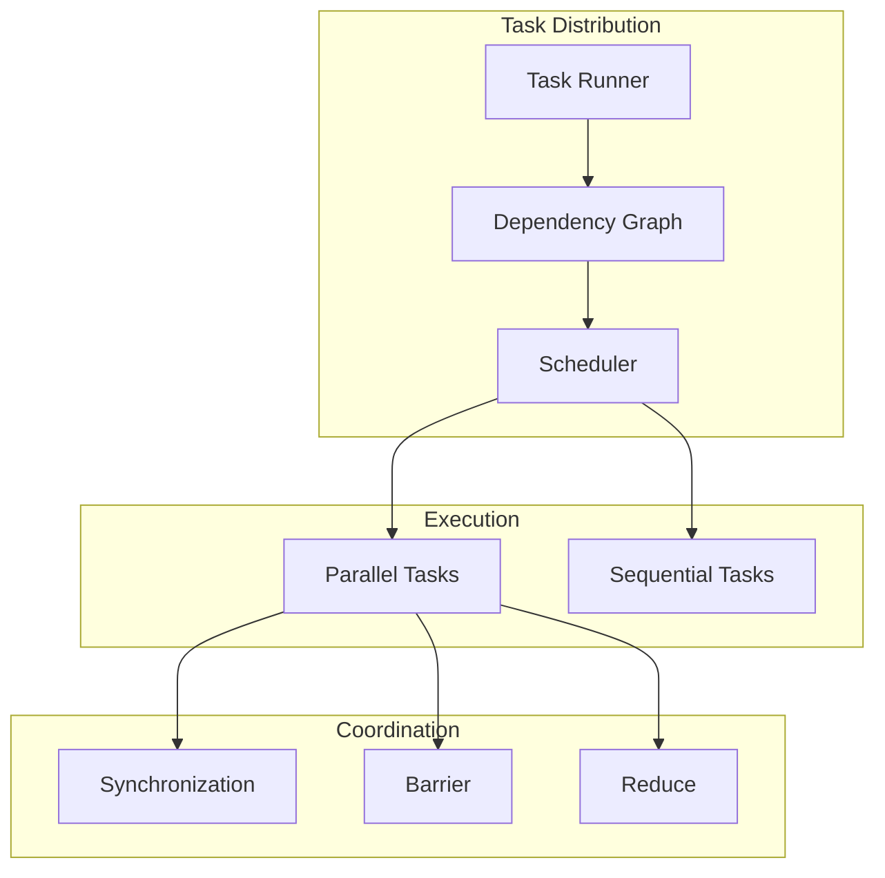
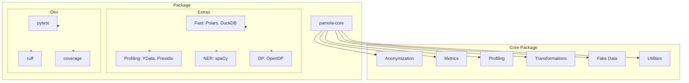

# PAMOLA.CORE Security and Performance Architecture

**Version:** 0.1.0
**Last Updated:** 2026-03-12

## Overview

This document describes the security architecture, performance optimization strategies, and deployment patterns for PAMOLA.CORE.

## Security Architecture

### Cryptography Integration



### Data Protection Flow



### Security Features

| Feature | Implementation | Purpose |
|---------|---------------|---------|
| **Hashing** | SHA3-256 | Irreversible pseudonymization |
| **Encryption** | AES-256 | Reversible pseudonymization with mapping storage |
| **Key Management** | Secure key generation and rotation | Protect encryption keys |
| **Input Validation** | Pydantic schemas | Prevent injection attacks |
| **Audit Trail** | manifest.json | Full operation reproducibility |

## Performance Architecture

### Memory Management



### Parallel Processing



### Performance Optimization Strategies

| Strategy | Implementation | Use Case |
|----------|---------------|----------|
| **Vectorization** | NumPy/pandas operations | Single-field transformations |
| **Chunking** | Dask partitions | Large datasets (>1M rows) |
| **Caching** | Result cache with TTL | Repeated operations |
| **Lazy Loading** | Dask lazy evaluation | Memory-constrained environments |
| **Progress Tracking** | Hierarchical tracker | Long-running operations |

## Deployment Architecture

### Package Structure



### Installation Options

```bash
# Core package
pip install pamola-core

# With performance extras
pip install pamola-core[fast]       # + Polars, ConnectorX, DuckDB

# With profiling extras
pip install pamola-core[profiling]  # + YData-profiling, Presidio

# With NER support
pip install pamola-core[ner]        # + spaCy for short text NER

# With differential privacy
pip install pamola-core[dp]         # + OpenDP for formal DP guarantees

# Development installation
pip install pamola-core[dev]        # + pytest, coverage, ruff
```

### Deployment Considerations

| Environment | Memory | Recommended Setup |
|-------------|--------|-------------------|
| **Development** | 4GB+ | Core + dev dependencies |
| **Testing** | 8GB+ | Core + all extras + dev |
| **Production (Small)** | 8GB+ | Core + required extras |
| **Production (Large)** | 16GB+ | Core + fast + Dask cluster |

## Compliance Considerations

### GDPR Alignment

- **Pseudonymization** (Art. 4(5)): Hash-based and mapping-based operations
- **Data Minimization** (Art. 25): Suppression and filtering operations
- **Security** (Art. 32): Encryption and secure storage

### HIPAA Safe Harbor

- 18 identifier types supported for removal/generalization
- Configurable suppression thresholds
- Audit trail via manifest.json

## References

- [system-architecture.md](./system-architecture.md) - Core system architecture
- [architecture-data-flows.md](./architecture-data-flows.md) - Data flows and component interactions
- [project-roadmap.md](./project-roadmap.md) - Development roadmap
