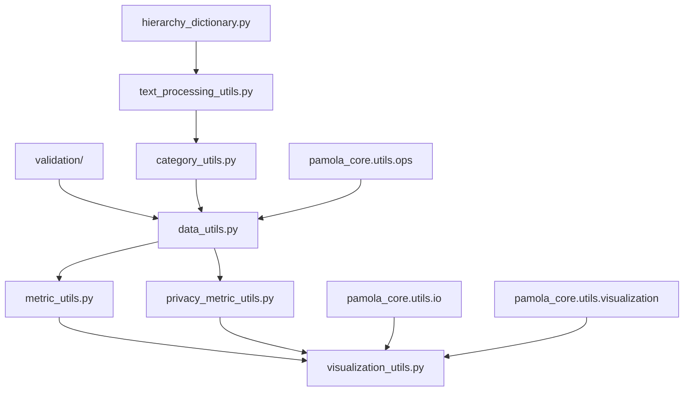

# PAMOLA.CORE Anonymization Commons Package Documentation

## Package Overview

The `pamola_core.anonymization.commons` package provides a comprehensive set of utilities and helper functions specifically designed for privacy-preserving data anonymization operations within the PAMOLA.CORE framework. This package serves as the foundation for all anonymization operations, offering standardized validation, metrics collection, visualization, and data processing capabilities tailored for privacy-enhancing transformations.

### Purpose

The commons package centralizes privacy-specific functionality that is shared across all anonymization operations, ensuring consistency, reusability, and maintainability. It bridges the gap between general-purpose data processing utilities in the core framework and the specific needs of privacy-preserving operations.

### Key Design Principles

1. **Privacy-First**: All utilities are designed with privacy preservation as the primary concern
2. **Lightweight**: Focuses on fast, efficient operations suitable for real-time processing
3. **Framework Integration**: Seamlessly integrates with PAMOLA.CORE's operations framework
4. **Extensibility**: Provides a foundation that can be extended for specialized anonymization needs
5. **Validation-Centric**: Comprehensive validation ensures data integrity and privacy guarantees

## Package Architecture

```
pamola_core/anonymization/commons/
├── __init__.py                      # Package initialization and exports
├── category_utils.py                # Category analysis and manipulation
├── data_utils.py                    # Privacy-specific data processing
├── hierarchy_dictionary.py          # Hierarchical generalization support
├── metric_utils.py                  # Lightweight anonymization metrics
├── privacy_metric_utils.py          # Real-time privacy monitoring
├── text_processing_utils.py         # Text normalization and matching
├── validation_utils.py              # Legacy validation interface (deprecated)
├── visualization_utils.py           # Visualization helpers
└── validation/                      # Modular validation subsystem
    ├── __init__.py                  # Validation package exports
    ├── base.py                      # Base validator classes
    ├── decorators.py                # Validation decorators
    ├── exceptions.py                # Custom exceptions
    ├── field_validators.py          # Field-level validators
    ├── file_validators.py           # File/path validators
    ├── strategy_validators.py       # Strategy parameter validators
    └── type_validators.py           # Data type validators
```

### Module Relationships



## Module Documentation

### 1. category_utils.py - Category Analysis and Manipulation

**Purpose**: Provides statistical analysis, distribution metrics, and grouping strategies for categorical data.

#### Key Functions

```python
def analyze_category_distribution(series: pd.Series, 
                                 top_n: int = 20,
                                 min_frequency: int = 1,
                                 calculate_entropy: bool = True,
                                 calculate_gini: bool = True,
                                 calculate_concentration: bool = True) -> Dict[str, Any]:
    """
    Comprehensive analysis of category distribution.
    
    Returns:
        Dict containing:
        - total_categories: int
        - total_records: int
        - frequency_distribution: Dict[str, int]
        - percentage_distribution: Dict[str, float]
        - top_n_categories: List[Tuple[str, int, float]]
        - rare_categories: List[str]
        - entropy: float (if calculated)
        - gini_coefficient: float (if calculated)
        - concentration_ratio_5: float (if calculated)
        - concentration_ratio_10: float (if calculated)
        - coverage_90_percentile: int
    """

def identify_rare_categories(series: pd.Series,
                           count_threshold: int = 10,
                           percent_threshold: float = 0.01,
                           combined_criteria: bool = True) -> Tuple[Set[str], Dict[str, Dict[str, Any]]]:
    """
    Identify rare categories based on multiple criteria.
    
    Returns:
        Tuple of (rare_categories, detailed_info)
    """

def group_rare_categories(series: pd.Series,
                         grouping_strategy: str = "single_other",
                         threshold: Union[int, float] = 10,
                         max_groups: int = 10,
                         group_prefix: str = "GROUP_",
                         preserve_top_n: Optional[int] = None) -> Tuple[pd.Series, Dict[str, Any]]:
    """
    Group rare categories using various strategies:
    - "single_other": All rare → "OTHER"
    - "numbered": "GROUP_001", "GROUP_002", etc.
    - "frequency_bands": Group by frequency ranges
    - "similarity": Group by string similarity
    - "alphabetical": Group by first letter/prefix
    - "length": Group by value length
    
    Returns:
        Tuple of (grouped_series, grouping_info)
    """

def calculate_category_entropy(series: pd.Series,
                             base: float = 2.0,
                             normalize: bool = True) -> float:
    """Calculate Shannon entropy of categorical distribution."""

def calculate_gini_coefficient(series: pd.Series) -> float:
    """Calculate Gini coefficient for category distribution."""

def calculate_concentration_metrics(series: pd.Series,
                                  top_k: List[int] = [5, 10, 20]) -> Dict[str, float]:
    """Calculate concentration ratios (CR-k)."""

def find_category_clusters(categories: List[str],
                         similarity_threshold: float = 0.8,
                         min_cluster_size: int = 2) -> Dict[str, List[str]]:
    """Find clusters of similar categories."""

def suggest_grouping_strategy(series: pd.Series,
                            target_categories: Optional[int] = None,
                            min_group_size: int = 10) -> Dict[str, Any]:
    """Suggest optimal grouping strategy based on distribution."""

def create_frequency_bands(series: pd.Series,
                         n_bands: int = 5,
                         method: str = "equal_frequency") -> Dict[str, str]:
    """Create frequency-based grouping bands."""

def validate_category_mapping(original: pd.Series,
                            mapped: pd.Series,
                            mapping: Dict[str, str]) -> Dict[str, Any]:
    """Validate category mapping consistency."""

def calculate_semantic_diversity(categories: List[str],
                               method: str = "token_overlap") -> float:
    """Calculate semantic diversity of categories."""

# Safe wrapper for external calls
def calculate_semantic_diversity_safe(categories: List[str]) -> float:
    """Safe wrapper that delegates to calculate_semantic_diversity."""
```

### 2. data_utils.py - Privacy-Specific Data Processing

**Purpose**: Provides privacy-aware data processing functions that extend general-purpose utilities with privacy-specific logic.

#### Key Functions

```python
def process_nulls(series: pd.Series, 
                  strategy: str = "PRESERVE", 
                  anonymize_value: str = "SUPPRESSED") -> pd.Series:
    """
    Process null values with privacy-aware strategies.
    
    Strategies:
        - "PRESERVE": Keep nulls as is
        - "EXCLUDE": Remove nulls
        - "ANONYMIZE": Replace with anonymize_value
    """

def filter_records_conditionally(df: pd.DataFrame,
                                risk_field: Optional[str] = None,
                                risk_threshold: float = 5.0,
                                operator: str = "ge",
                                condition_field: Optional[str] = None,
                                condition_values: Optional[List] = None) -> Tuple[pd.DataFrame, pd.Series]:
    """Filter DataFrame records based on risk scores and conditions."""

def handle_vulnerable_records(df: pd.DataFrame,
                             field_name: str,
                             vulnerability_mask: pd.Series,
                             strategy: str = "suppress",
                             replacement_value: Optional[Any] = None) -> pd.DataFrame:
    """
    Handle vulnerable records identified by risk assessment.
    
    Strategies:
        - "suppress": Replace with null
        - "remove": Remove records
        - "mean": Replace with mean (numeric)
        - "mode": Replace with mode (categorical)
        - "custom": Use replacement_value
    """

def create_risk_based_processor(strategy: str = "adaptive",
                               risk_threshold: float = 5.0) -> Callable:
    """
    Factory for creating risk-based processing functions.
    
    Strategies:
        - "conservative": Aggressive anonymization
        - "adaptive": Balance privacy/utility
        - "aggressive": Minimal anonymization
        - "remove": Remove risky records
    """

def create_privacy_level_processor(privacy_level: str = "MEDIUM") -> Dict[str, Any]:
    """
    Create configuration for processing based on privacy level.
    
    Levels: "LOW", "MEDIUM", "HIGH", "VERY_HIGH"
    """

def apply_adaptive_anonymization(df: pd.DataFrame,
                                field_name: str,
                                risk_scores: pd.Series,
                                privacy_level: str = "MEDIUM") -> pd.DataFrame:
    """Apply adaptive anonymization based on risk scores."""

def get_risk_statistics(df: pd.DataFrame, 
                       risk_field: str,
                       thresholds: Optional[List[float]] = None) -> Dict[str, Any]:
    """Calculate statistics for risk values."""

def get_privacy_recommendations(risk_stats: Dict[str, Any]) -> Dict[str, Any]:
    """Generate privacy recommendations based on risk statistics."""
```

### 3. hierarchy_dictionary.py - Hierarchical Generalization Support

**Purpose**: Provides unified interface for loading and managing hierarchical generalizations from external dictionaries.

#### Key Classes and Functions

```python
class HierarchyDictionary:
    """
    Manages hierarchical generalizations for categorical data.
    
    Supports:
        - JSON and CSV formats
        - Multi-level hierarchies (up to 5 levels)
        - Case-insensitive lookups
        - Alias resolution
        - Coverage analysis
    """
    
    def load_from_file(self, filepath: Union[str, Path], 
                      format_type: str = 'auto') -> None:
        """Load hierarchy from JSON or CSV file."""
    
    def get_hierarchy(self, value: str, 
                     level: int = 1,
                     case_sensitive: bool = False) -> Optional[str]:
        """Get generalization at specified level."""
    
    def get_all_values_at_level(self, level: int = 0) -> Set[str]:
        """Get all unique values at a specific hierarchy level."""
    
    def get_coverage(self, values: List[str]) -> Dict[str, Any]:
        """
        Analyze coverage of values in hierarchy.
        
        Returns:
            Dict with coverage_percent, missing_values, etc.
        """
    
    def validate_structure(self) -> Tuple[bool, List[str]]:
        """Validate hierarchy consistency and structure."""
    
    def add_alias(self, value: str, alias: str) -> None:
        """Add alias for a value."""
    
    def get_hierarchy_depth(self, value: str) -> int:
        """Get maximum hierarchy depth for a value."""
    
    def export_to_format(self, filepath: Union[str, Path], 
                        format_type: str = 'json') -> None:
        """Export hierarchy to file."""
```

### 4. metric_utils.py - Lightweight Anonymization Metrics

**Purpose**: Provides process-oriented metrics for monitoring and guiding anonymization operations in real-time.

#### Key Functions

```python
def calculate_anonymization_effectiveness(original_series: pd.Series,
                                         anonymized_series: pd.Series) -> Dict[str, float]:
    """
    Calculate basic effectiveness metrics.
    
    Returns:
        Dict with unique_reduction, suppression_rate, etc.
    """

def calculate_generalization_metrics(original_series: pd.Series,
                                    anonymized_series: pd.Series,
                                    strategy: str,
                                    strategy_params: Dict[str, Any]) -> Dict[str, Any]:
    """Calculate metrics specific to generalization strategies."""

def calculate_categorical_information_loss(original_series: pd.Series,
                                         generalized_series: pd.Series,
                                         category_mapping: Optional[Dict[str, str]] = None) -> float:
    """Calculate information loss for categorical generalization."""

def calculate_generalization_height(value_hierarchy: Dict[str, List[str]],
                                   original_value: str,
                                   generalized_value: str) -> int:
    """Calculate height of generalization in hierarchy."""

def calculate_masking_metrics(original_series: pd.Series,
                             masked_series: pd.Series,
                             mask_char: str = "*") -> Dict[str, float]:
    """Calculate metrics for masking operations."""

def calculate_suppression_metrics(original_series: pd.Series,
                                 suppressed_series: pd.Series) -> Dict[str, float]:
    """Calculate metrics for suppression operations."""

def calculate_process_performance(start_time: float,
                                 end_time: float,
                                 records_processed: int,
                                 batch_count: Optional[int] = None) -> Dict[str, float]:
    """Calculate performance metrics for the anonymization process."""

def collect_operation_metrics(operation_type: str,
                             original_data: pd.Series,
                             processed_data: pd.Series,
                             operation_params: Dict[str, Any],
                             timing_info: Optional[Dict[str, float]] = None) -> Dict[str, Any]:
    """Collect all relevant metrics for an anonymization operation."""

def save_process_metrics(metrics: Dict[str, Any],
                        task_dir: Path,
                        operation_name: str,
                        field_name: str,
                        writer: Optional[DataWriter] = None) -> Optional[Path]:
    """Save process metrics to file."""

def get_process_summary_message(metrics: Dict[str, Any]) -> str:
    """Generate human-readable summary of process metrics."""
```

### 5. privacy_metric_utils.py - Privacy Process Metrics

**Purpose**: Provides lightweight privacy metrics for real-time monitoring without heavy computational overhead.

#### Key Functions

```python
def calculate_anonymization_coverage(original: pd.Series,
                                    anonymized: pd.Series) -> Dict[str, float]:
    """
    Calculate coverage of anonymization process.
    
    Returns:
        Dict with total_coverage, changed_ratio, suppressed_ratio
    """

def calculate_suppression_rate(series: pd.Series,
                              original_nulls: Optional[int] = None) -> float:
    """Calculate suppression rate in anonymized data."""

def get_group_size_distribution(df: pd.DataFrame,
                               quasi_identifiers: List[str],
                               max_groups: int = 100) -> Dict[str, Any]:
    """Get quick distribution of group sizes for quasi-identifiers."""

def calculate_min_group_size(df: pd.DataFrame,
                            quasi_identifiers: List[str],
                            sample_size: Optional[int] = 10000) -> int:
    """Calculate minimum group size (k) for quasi-identifiers."""

def calculate_vulnerable_records_ratio(df: pd.DataFrame,
                                      quasi_identifiers: List[str],
                                      k_threshold: int = 5,
                                      sample_size: Optional[int] = 10000) -> float:
    """Calculate ratio of vulnerable records (k < threshold)."""

def calculate_generalization_level(original: pd.Series,
                                  generalized: pd.Series) -> float:
    """Calculate level of generalization applied."""

def calculate_value_reduction_ratio(original: pd.Series,
                                   anonymized: pd.Series) -> float:
    """Calculate ratio of unique value reduction."""

def calculate_uniqueness_score(series: pd.Series) -> float:
    """Calculate simple uniqueness score for a field."""

def calculate_simple_disclosure_risk(df: pd.DataFrame,
                                    quasi_identifiers: List[str]) -> float:
    """Calculate simple disclosure risk score."""

def check_anonymization_thresholds(metrics: Dict[str, float],
                                  thresholds: Optional[Dict[str, float]] = None) -> Dict[str, bool]:
    """Check if anonymization metrics meet specified thresholds."""

def calculate_batch_metrics(original_batch: pd.DataFrame,
                           anonymized_batch: pd.DataFrame,
                           field_name: str,
                           quasi_identifiers: Optional[List[str]] = None) -> Dict[str, Any]:
    """Calculate all process metrics for a batch."""
```

### 6. text_processing_utils.py - Text Normalization and Matching

**Purpose**: Provides privacy-aware text processing, normalization, and fuzzy matching capabilities.

#### Key Functions

```python
def normalize_text(text: str, 
                  level: str = "basic",
                  preserve_case: bool = False) -> str:
    """
    Normalize text for matching and comparison.
    
    Levels:
        - "none": No normalization
        - "basic": trim, lowercase, normalize whitespace
        - "advanced": remove special chars, normalize unicode
        - "aggressive": alphanumeric only, transliteration
    """

def clean_category_name(name: str,
                       max_length: int = 50,
                       invalid_chars: str = r'[<>:"/\\|?*]') -> str:
    """Clean category names for safe file/field naming."""

def find_closest_category(value: str,
                         categories: List[str],
                         threshold: float = 0.8,
                         method: str = "levenshtein",
                         fallback: Optional[str] = None) -> Optional[str]:
    """
    Find best matching category using string similarity.
    
    Methods:
        - "levenshtein": Edit distance
        - "jaro_winkler": Jaro-Winkler similarity
        - "token_sort": Token-based sorting
    """

def prepare_value_for_matching(value: str,
                              remove_special: bool = True,
                              normalize_unicode: bool = True) -> str:
    """Prepare value for fuzzy matching operations."""

def split_composite_value(value: str,
                         separators: List[str] = ["|", "/", ","]) -> List[str]:
    """Split values like 'IT|Finance' into components."""

def merge_composite_categories(categories: List[str],
                             strategy: str = "first",
                             separator: str = "|") -> str:
    """
    Merge multiple category assignments.
    
    Strategies:
        - "first": Use first category
        - "all": Join all categories
        - "most_specific": Use most specific category
    """

def extract_tokens(text: str,
                  min_length: int = 2,
                  stop_words: Optional[Set[str]] = None) -> List[str]:
    """Extract meaningful tokens from text."""

def calculate_string_similarity(str1: str, str2: str,
                               method: str = "levenshtein") -> float:
    """Calculate similarity between two strings."""

def normalize_whitespace(text: str) -> str:
    """Normalize all whitespace characters to single spaces."""

def remove_accents(text: str) -> str:
    """Remove accents from characters."""
```

### 7. validation/ - Modular Validation Subsystem

**Purpose**: Provides comprehensive, extensible validation framework for anonymization operations.

#### 7.1 validation/base.py - Base Classes

```python
@dataclass
class ValidationResult:
    """Standardized validation result."""
    is_valid: bool
    field_name: Optional[str] = None
    errors: List[str] = field(default_factory=list)
    warnings: List[str] = field(default_factory=list)
    details: Dict[str, Any] = field(default_factory=dict)

class BaseValidator(ABC):
    """Abstract base class for all validators."""
    
    @abstractmethod
    def validate(self, data: Any, **kwargs) -> ValidationResult:
        """Perform validation."""
        pass

class CompositeValidator(BaseValidator):
    """Combines multiple validators."""
    
    def add_validator(self, validator: BaseValidator) -> 'CompositeValidator':
        """Add validator to chain."""
        pass
```

#### 7.2 validation/decorators.py - Validation Decorators

```python
def validate_types(**type_hints):
    """Decorator to validate parameter types."""

def validation_handler(func):
    """Decorator to handle validation exceptions."""

def require_field_exists(field_param: str = 'field_name'):
    """Decorator to ensure field exists in DataFrame."""

def validate_range(param_name: str, min_val: Any = None, max_val: Any = None):
    """Decorator to validate numeric ranges."""
```

#### 7.3 validation/exceptions.py - Custom Exceptions

```python
class ValidationError(Exception):
    """Base validation exception."""

class FieldValidationError(ValidationError):
    """Field-specific validation error."""

class StrategyValidationError(ValidationError):
    """Strategy parameter validation error."""

class TypeValidationError(ValidationError):
    """Data type validation error."""

class FileValidationError(ValidationError):
    """File/path validation error."""
```

#### 7.4 validation/field_validators.py - Field Validators

```python
class NumericFieldValidator(BaseValidator):
    """Validates numeric fields."""
    
    def __init__(self, allow_null: bool = True,
                 min_value: Optional[float] = None,
                 max_value: Optional[float] = None,
                 check_integers: bool = False):
        pass

class CategoricalFieldValidator(BaseValidator):
    """Validates categorical fields."""
    
    def __init__(self, allow_null: bool = True,
                 max_categories: Optional[int] = None,
                 valid_categories: Optional[List[str]] = None):
        pass

class DateTimeFieldValidator(BaseValidator):
    """Validates datetime fields."""

def create_field_validator(field_type: str, **kwargs) -> BaseValidator:
    """Factory for field validators."""

def validate_dataframe_schema(df: pd.DataFrame,
                            schema: Dict[str, Dict[str, Any]],
                            strict: bool = True) -> ValidationResult:
    """Validate entire DataFrame against schema."""
```

#### 7.5 validation/file_validators.py - File/Path Validators

```python
class FilePathValidator(BaseValidator):
    """Validates file paths."""
    
    def __init__(self, must_exist: bool = True,
                 valid_extensions: Optional[List[str]] = None):
        pass

class DirectoryValidator(BaseValidator):
    """Validates directory paths."""

def validate_file_size(filepath: Path,
                      max_size_mb: float = 100) -> ValidationResult:
    """Validate file size constraints."""

def validate_file_encoding(filepath: Path,
                         expected_encoding: str = 'utf-8') -> ValidationResult:
    """Validate file encoding."""
```

#### 7.6 validation/strategy_validators.py - Strategy Validators

```python
class GeneralizationStrategyValidator(BaseValidator):
    """Validates generalization strategies."""

class NullStrategyValidator(BaseValidator):
    """Validates null handling strategies."""

def validate_strategy_parameters(strategy: str,
                               params: Dict[str, Any],
                               valid_strategies: Dict[str, Dict]) -> ValidationResult:
    """Validate strategy-specific parameters."""

def create_strategy_validator(operation_type: str,
                            strategy: str) -> BaseValidator:
    """Factory for strategy validators."""
```

#### 7.7 validation/type_validators.py - Data Type Validators

```python
class IPAddressValidator(BaseValidator):
    """Validates IP addresses."""

class GeographicValidator(BaseValidator):
    """Validates geographic data."""

class FinancialValidator(BaseValidator):
    """Validates financial data formats."""

def validate_specialized_type(data: pd.Series,
                            data_type: str,
                            validation_params: Optional[Dict] = None) -> ValidationResult:
    """Validate specialized data types."""

def infer_data_type(series: pd.Series) -> str:
    """Infer the data type of a series."""
```

### 8. validation_utils.py - Legacy Validation Interface

**Purpose**: Maintains backward compatibility with existing code. New code should use the validation/ subsystem.

```python
# Legacy functions maintained for compatibility
# All functions delegate to new validation subsystem

def validate_field_exists(df: pd.DataFrame, field_name: str,
                         logger_instance: Optional[logging.Logger] = None) -> bool:
    """[DEPRECATED] Use field_validators.FieldExistsValidator"""

def check_field_exists(df: pd.DataFrame, field_name: str) -> None:
    """[DEPRECATED] Use field_validators.require_field_exists decorator"""

# ... other legacy functions ...
```

### 9. visualization_utils.py - Visualization Helpers

**Purpose**: Thin wrapper around pamola_core.utils.visualization with privacy-specific context.

#### Key Functions

```python
def generate_visualization_filename(field_name: str,
                                   operation_name: str,
                                   visualization_type: str,
                                   timestamp: Optional[str] = None,
                                   extension: str = "png") -> str:
    """Generate standardized filename for visualization."""

def register_visualization_artifact(result: Any,
                                   reporter: Any,
                                   path: Path,
                                   field_name: str,
                                   visualization_type: str,
                                   description: Optional[str] = None) -> None:
    """Register visualization artifact with result and reporter."""

def create_comparison_visualization(original_data: pd.Series,
                                   anonymized_data: pd.Series,
                                   task_dir: Path,
                                   field_name: str,
                                   operation_name: str,
                                   timestamp: Optional[str] = None) -> Optional[Path]:
    """Create before/after comparison visualization."""

def create_category_distribution_comparison(original_data: pd.Series,
                                          anonymized_data: pd.Series,
                                          task_dir: Path,
                                          field_name: str,
                                          operation_name: str,
                                          top_n: int = 20) -> Optional[Path]:
    """Create category distribution comparison chart."""

def create_hierarchy_sunburst(hierarchy_dict: Dict[str, Dict],
                            task_dir: Path,
                            field_name: str,
                            operation_name: str) -> Optional[Path]:
    """Create sunburst chart for hierarchical data."""

def create_privacy_metrics_dashboard(metrics: Dict[str, Any],
                                   task_dir: Path,
                                   operation_name: str) -> Optional[Path]:
    """Create dashboard with multiple privacy metrics."""
```

## Import Guidelines for Operations

When implementing new anonymization operations, follow these import patterns:

### Required Imports

```python
# Base classes
from pamola_core.anonymization.base_anonymization import AnonymizationOperation
from pamola_core.utils.ops.op_result import OperationResult
from pamola_core.utils.ops.op_data_source import DataSource

# Validation - use new subsystem
from pamola_core.anonymization.commons.validation import (
    FieldExistsValidator,
    NumericFieldValidator,
    CategoricalFieldValidator,
    create_field_validator,
    ValidationResult
)

# Data processing
from pamola_core.anonymization.commons.data_utils import (
    process_nulls,
    filter_records_conditionally,
    handle_vulnerable_records
)

# Metrics
from pamola_core.anonymization.commons.metric_utils import (
    collect_operation_metrics,
    save_process_metrics
)

# Privacy metrics (if needed)
from pamola_core.anonymization.commons.privacy_metric_utils import (
    calculate_min_group_size,
    calculate_vulnerable_records_ratio
)
```

### Category Operations

```python
# For categorical operations
from pamola_core.anonymization.commons.category_utils import (
    analyze_category_distribution,
    identify_rare_categories,
    group_rare_categories,
    calculate_semantic_diversity_safe  # Use safe wrapper
)

from pamola_core.anonymization.commons.text_processing_utils import (
    normalize_text,
    find_closest_category,
    clean_category_name
)

from pamola_core.anonymization.commons.hierarchy_dictionary import HierarchyDictionary
```

### Visualization

```python
# Always use these helpers, not direct visualization
from pamola_core.anonymization.commons.visualization_utils import (
    create_comparison_visualization,
    create_category_distribution_comparison,
    register_visualization_artifact
)
```

## Anti-Patterns to Avoid

### ❌ Don't Reimplement Common Functions

```python
# WRONG: Custom null handling
def handle_nulls(series, strategy):
    if strategy == "remove":
        return series.dropna()
    # ...

# CORRECT: Use framework function
from pamola_core.anonymization.commons.data_utils import process_nulls
processed = process_nulls(series, strategy="EXCLUDE")
```

### ❌ Don't Use Direct Visualization Calls

```python
# WRONG: Direct matplotlib/plotly
import matplotlib.pyplot as plt
plt.plot(data)

# CORRECT: Use visualization utils
from pamola_core.anonymization.commons.visualization_utils import create_comparison_visualization
path = create_comparison_visualization(original, anonymized, task_dir, field_name, operation_name)
```

### ❌ Don't Create Custom Validation

```python
# WRONG: Manual validation
if field_name not in df.columns:
    raise ValueError("Field not found")

# CORRECT: Use validators
from pamola_core.anonymization.commons.validation import FieldExistsValidator
validator = FieldExistsValidator()
result = validator.validate(df, field_name=field_name)
if not result.is_valid:
    raise FieldValidationError(result.errors[0])
```

### ❌ Don't Calculate Metrics Manually

```python
# WRONG: Manual metric calculation
metrics = {
    "unique_before": len(original.unique()),
    "unique_after": len(anonymized.unique())
}

# CORRECT: Use metric utilities
from pamola_core.anonymization.commons.metric_utils import collect_operation_metrics
metrics = collect_operation_metrics(
    operation_type="generalization",
    original_data=original,
    processed_data=anonymized,
    operation_params=params
)
```

## Performance Considerations

The commons package is optimized for:
- **Batch Processing**: 10K-1M records per batch
- **Real-time Metrics**: <100ms overhead on 100K records
- **Memory Efficiency**: Streaming operations where possible
- **Caching**: LRU caches for repeated operations

## Testing Requirements

When using commons utilities:
1. Mock external dependencies (file I/O, visualization)
2. Test with edge cases (empty data, single value, nulls)
3. Verify metrics are correctly calculated
4. Ensure validators catch invalid inputs
5. Test both success and failure paths

## Migration Guide

For existing code using `validation_utils.py`:

```python
# Old approach
from pamola_core.anonymization.commons.validation_utils import validate_field_exists
valid = validate_field_exists(df, field_name)

# New approach
from pamola_core.anonymization.commons.validation import FieldExistsValidator
validator = FieldExistsValidator()
result = validator.validate(df, field_name=field_name)
valid = result.is_valid
```

## Summary

The commons package provides comprehensive support for privacy-preserving operations. Always use these utilities instead of reimplementing functionality. The framework ensures:

1. **Consistency** across all operations
2. **Performance** through optimized implementations
3. **Correctness** via tested, validated functions
4. **Maintainability** through standardized patterns
5. **Compliance** with privacy requirements