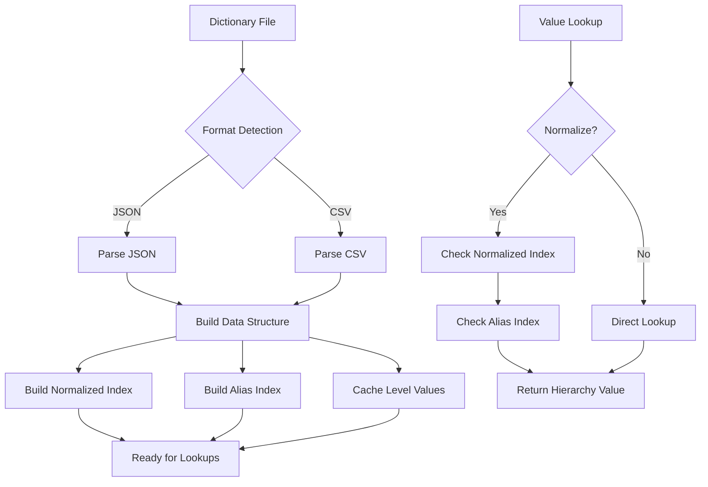

# PAMOLA.CORE Hierarchy Dictionary Module Documentation

**Module:** `pamola_core.anonymization.commons.hierarchy_dictionary`  
**Version:** 1.0.0  
**Status:** Stable  
**Last Updated:** January 2025

## Table of Contents
1. [Overview](#overview)
2. [Key Features](#key-features)
3. [Architecture](#architecture)
4. [Installation & Dependencies](#installation--dependencies)
5. [Core Classes](#core-classes)
6. [File Format Specifications](#file-format-specifications)
7. [Usage Examples](#usage-examples)
8. [Best Practices](#best-practices)
9. [Performance Considerations](#performance-considerations)
10. [Integration Guidelines](#integration-guidelines)

## Overview

The `hierarchy_dictionary.py` module provides a unified interface for loading and managing hierarchical dictionaries used in categorical generalization operations. It serves as the central component for hierarchy-based categorical anonymization within the PAMOLA.CORE framework.

### Purpose

This module enables:
- Consistent value-to-category mappings across different data sources
- Multi-level hierarchy support for progressive generalization
- Format-agnostic dictionary loading (JSON and CSV)
- Efficient lookups with normalization and alias resolution
- Integration with categorical anonymization operations

### Design Philosophy

The module follows these principles:
- **Format Agnostic**: Handles various dictionary structures transparently
- **Performance**: O(1) lookups with normalized key indexing
- **Extensibility**: Easy to add new format parsers or validation rules
- **Integration**: Uses pamola_core.utils.io for all file operations
- **Memory Efficiency**: Indexed storage with size limits

## Key Features

### 1. **Unified Loading Interface**
- Support for JSON and CSV dictionary formats
- Automatic format detection from file extension
- Encryption support through pamola_core.utils.io
- File size validation (max 100MB)

### 2. **Multi-Level Hierarchies**
- Support for up to 5 hierarchy levels
- Progressive generalization capabilities
- Level-based value retrieval
- Cached level value sets

### 3. **Intelligent Lookups**
- Case-insensitive searches with text normalization
- Alias resolution for alternative names
- Fallback mechanisms for missing values
- O(1) lookup performance

### 4. **Validation & Analysis**
- Structure consistency validation
- Coverage analysis for data matching
- Circular reference detection
- Entry count limits (max 1M entries)

### 5. **Metadata Support**
- Format version tracking
- Hierarchy type identification
- Custom metadata fields
- Alias and tag preservation

## Architecture

### Class Structure

```
HierarchyDictionary
├── Attributes
│   ├── _data: Dict[str, Dict[str, Any]]      # Main hierarchy storage
│   ├── _format: Optional[str]                # Source format (json/csv)
│   ├── _metadata: Dict[str, Any]             # Dictionary metadata
│   ├── _levels: List[str]                    # Hierarchy level names
│   ├── _normalized_index: Dict[str, str]     # Normalized lookups
│   ├── _alias_index: Dict[str, str]          # Alias mappings
│   └── _level_values: Dict[int, Set[str]]    # Cached level values
│
├── Public Methods
│   ├── load_from_file()                      # Load dictionary from file
│   ├── get_hierarchy()                       # Get generalized value
│   ├── validate_structure()                  # Validate consistency
│   ├── get_coverage()                        # Calculate coverage stats
│   └── get_all_values_at_level()            # Get values for a level
│
└── Private Methods
    ├── _detect_format()                      # Auto-detect file format
    ├── _parse_json_hierarchy()               # Parse JSON format
    ├── _parse_csv_hierarchy()                # Parse CSV format
    ├── _build_normalized_index()             # Build lookup indices
    ├── _build_alias_index()                  # Build alias mappings
    ├── _cache_level_values()                 # Cache level values
    └── _check_circular_reference()           # Detect circular refs
```

### Integration Points

```python
External Dependencies:
├── pandas                                    # CSV parsing
├── pamola_core.utils.io                            # File operations
│   ├── read_json()                          # JSON loading
│   ├── read_full_csv()                      # CSV loading
│   └── get_file_metadata()                  # File validation
└── pamola_core.anonymization.commons.text_processing_utils
    └── normalize_text()                      # Text normalization
```

### Data Flow



## Installation & Dependencies

### Required Dependencies

```python
# Core dependencies
import pandas as pd
from pathlib import Path
from typing import Dict, List, Optional, Set, Tuple, Union, Any

# PAMOLA.CORE dependencies
from pamola_core.utils.io import read_json, read_full_csv, get_file_metadata
from pamola_core.anonymization.commons.text_processing_utils import normalize_text
```

### Module Import

```python
from pamola_core.anonymization.commons.hierarchy_dictionary import HierarchyDictionary
```

## Core Classes

### HierarchyDictionary Class

The main class for managing hierarchical mappings.

#### Constructor

```python
def __init__(self):
    """Initialize empty hierarchy dictionary."""
```

Creates an empty dictionary instance ready for loading data.

#### load_from_file

```python
def load_from_file(
    self,
    filepath: Union[str, Path],
    format_type: str = 'auto',
    encryption_key: Optional[str] = None
) -> None:
```

**Parameters:**
- `filepath`: Path to dictionary file
- `format_type`: File format ('json', 'csv', or 'auto' for detection)
- `encryption_key`: Encryption key if file is encrypted

**Raises:**
- `ValueError`: If file format is unsupported or file is too large
- `FileNotFoundError`: If file doesn't exist

#### get_hierarchy

```python
def get_hierarchy(
    self,
    value: str,
    level: int = 1,
    normalize: bool = True
) -> Optional[str]:
```

**Parameters:**
- `value`: Value to look up
- `level`: Hierarchy level (1-based, 1 = first level of generalization)
- `normalize`: Whether to normalize the lookup value

**Returns:**
- Generalized value at the specified level or None if not found

#### validate_structure

```python
def validate_structure(self) -> Tuple[bool, List[str]]:
```

**Returns:**
- Tuple of (is_valid, list_of_issues)

#### get_coverage

```python
def get_coverage(
    self,
    values: List[str],
    normalize: bool = True
) -> Dict[str, Any]:
```

**Parameters:**
- `values`: Values to check coverage for
- `normalize`: Whether to normalize values before checking

**Returns:**
- Dictionary with coverage statistics

#### get_all_values_at_level

```python
def get_all_values_at_level(self, level: int) -> Set[str]:
```

**Parameters:**
- `level`: Hierarchy level (1-based)

**Returns:**
- Set of unique values at that level

## File Format Specifications

### JSON Format

#### Basic Structure
```json
{
    "format_version": "1.0",
    "hierarchy_type": "job_titles",
    "levels": ["department", "category", "general"],
    "data": {
        "Software Engineer": {
            "department": "Technology",
            "category": "Engineering",
            "general": "Technical Staff",
            "aliases": ["Developer", "Programmer"],
            "tags": ["IT", "Technical"]
        },
        "Data Scientist": {
            "department": "Technology",
            "category": "Analytics",
            "general": "Technical Staff",
            "aliases": ["ML Engineer", "Data Analyst"]
        }
    }
}
```

#### Alternative Format (Direct Mapping)
```json
{
    "Software Engineer": "Technical Staff",
    "Data Scientist": "Technical Staff",
    "Marketing Manager": "Business Staff",
    "Sales Director": "Business Staff"
}
```

### CSV Format

#### Standard Hierarchy Format
```csv
value,level_1,level_2,level_3,aliases,tags
Software Engineer,Technology,Engineering,Technical Staff,"Developer;Programmer","IT;Technical"
Data Scientist,Technology,Analytics,Technical Staff,"ML Engineer;Data Analyst","IT;Analytics"
Marketing Manager,Business,Marketing,Business Staff,"Brand Manager",Business
Sales Director,Business,Sales,Business Staff,"Sales Manager;VP Sales",Business
```

#### Medical Dictionary Example
```csv
diagnosis,category,super_category,general,common_names
Hypertension,Cardiovascular,Chronic Conditions,Medical Condition,"High Blood Pressure;HTN"
Type 2 Diabetes,Endocrine,Chronic Conditions,Medical Condition,"Diabetes Mellitus;T2DM"
Pneumonia,Respiratory,Infections,Medical Condition,"Lung Infection"
```

## Usage Examples

### Example 1: Basic Dictionary Loading and Lookup

```python
from pamola_core.anonymization.commons.hierarchy_dictionary import HierarchyDictionary

# Create and load dictionary
hierarchy = HierarchyDictionary()
hierarchy.load_from_file('dictionaries/job_titles.json')

# Simple lookup
job_title = "Software Engineer"
level1 = hierarchy.get_hierarchy(job_title, level=1)  # "Technology"
level2 = hierarchy.get_hierarchy(job_title, level=2)  # "Engineering"
level3 = hierarchy.get_hierarchy(job_title, level=3)  # "Technical Staff"

print(f"{job_title} -> L1: {level1}, L2: {level2}, L3: {level3}")

# Case-insensitive lookup
result = hierarchy.get_hierarchy("software engineer", level=2)  # Still works
```

### Example 2: Loading Encrypted CSV Dictionary

```python
# Load encrypted CSV dictionary
hierarchy = HierarchyDictionary()
hierarchy.load_from_file(
    'dictionaries/medical_diagnoses.csv.enc',
    format_type='csv',
    encryption_key='your-encryption-key'
)

# Check structure validity
is_valid, issues = hierarchy.validate_structure()
if not is_valid:
    print(f"Dictionary issues: {issues}")

# Use with aliases
diagnosis = hierarchy.get_hierarchy("HTN", level=1)  # Uses alias
print(f"HTN -> {diagnosis}")  # "Cardiovascular"
```

### Example 3: Coverage Analysis

```python
# Load dictionary
hierarchy = HierarchyDictionary()
hierarchy.load_from_file('dictionaries/locations.json')

# Check coverage for a dataset
locations = [
    "New York", "Los Angeles", "Chicago",
    "Unknown City", "Boston", "Invalid Place"
]

coverage = hierarchy.get_coverage(locations)
print(f"Coverage: {coverage['coverage_percent']:.1f}%")
print(f"Missing values: {coverage['missing_values']}")

# Get all possible values at level 2
level2_values = hierarchy.get_all_values_at_level(2)
print(f"Level 2 categories: {level2_values}")
```

### Example 4: Progressive Generalization

```python
def progressive_generalization(hierarchy, value, target_k=5):
    """Apply progressive generalization until k-anonymity is satisfied."""
    
    for level in range(1, 4):  # Try levels 1-3
        generalized = hierarchy.get_hierarchy(value, level=level)
        
        if generalized:
            # Check if this generalization achieves k-anonymity
            # (simplified - would need actual frequency counts)
            print(f"Level {level}: {value} -> {generalized}")
            
            # In practice, check if group size >= target_k
            # if group_size >= target_k:
            #     return generalized, level
    
    return None, None

# Example usage
hierarchy = HierarchyDictionary()
hierarchy.load_from_file('dictionaries/job_titles.json')

value = "Junior Software Developer"
generalized, level = progressive_generalization(hierarchy, value)
```

### Example 5: Integration with Categorical Anonymization

```python
from pamola_core.anonymization.generalization.categorical_op import CategoricalGeneralizationOperation
from pamola_core.anonymization.commons.hierarchy_dictionary import HierarchyDictionary

class HierarchyBasedGeneralization(CategoricalGeneralizationOperation):
    def __init__(self, field_name: str, hierarchy_file: str, **kwargs):
        super().__init__(field_name=field_name, **kwargs)
        
        # Load hierarchy
        self.hierarchy = HierarchyDictionary()
        self.hierarchy.load_from_file(hierarchy_file)
        
        # Validate coverage
        self.logger.info(f"Loaded hierarchy from {hierarchy_file}")
    
    def generalize_value(self, value: str, level: int = 1) -> str:
        """Generalize a single value using hierarchy."""
        
        generalized = self.hierarchy.get_hierarchy(value, level=level)
        
        if generalized is None:
            # Fallback strategy
            if self.fallback_strategy == "preserve":
                return value
            elif self.fallback_strategy == "other":
                return "OTHER"
            else:
                return "UNKNOWN"
        
        return generalized
```

### Example 6: Building Custom Hierarchies

```python
import json
from pathlib import Path

def build_location_hierarchy(cities_data):
    """Build a location hierarchy from city data."""
    
    hierarchy = {
        "format_version": "1.0",
        "hierarchy_type": "locations",
        "levels": ["state", "region", "country"],
        "data": {}
    }
    
    for city_info in cities_data:
        city = city_info['city']
        hierarchy['data'][city] = {
            "state": city_info['state'],
            "region": city_info['region'],
            "country": city_info['country'],
            "aliases": city_info.get('nicknames', [])
        }
    
    # Save to file
    output_path = Path('dictionaries/locations_hierarchy.json')
    output_path.parent.mkdir(exist_ok=True)
    
    with open(output_path, 'w', encoding='utf-8') as f:
        json.dump(hierarchy, f, indent=2, ensure_ascii=False)
    
    return output_path

# Create hierarchy file
cities = [
    {
        'city': 'New York',
        'state': 'New York',
        'region': 'Northeast',
        'country': 'USA',
        'nicknames': ['NYC', 'Big Apple']
    },
    {
        'city': 'Los Angeles',
        'state': 'California',
        'region': 'West',
        'country': 'USA',
        'nicknames': ['LA', 'City of Angels']
    }
]

hierarchy_file = build_location_hierarchy(cities)

# Load and use
hierarchy = HierarchyDictionary()
hierarchy.load_from_file(hierarchy_file)

# Test with alias
result = hierarchy.get_hierarchy("Big Apple", level=2)
print(result)  # "Northeast"
```

## Best Practices

### 1. **Dictionary Design**

```python
# Good: Clear hierarchy levels with meaningful names
{
    "levels": ["department", "category", "general_role"],
    "data": {
        "Software Engineer": {
            "department": "Technology",
            "category": "Engineering",
            "general_role": "Technical Staff"
        }
    }
}

# Bad: Unclear level names
{
    "levels": ["l1", "l2", "l3"],
    "data": {
        "Software Engineer": {
            "l1": "Tech",
            "l2": "Eng",
            "l3": "Staff"
        }
    }
}
```

### 2. **Performance Optimization**

```python
# Cache hierarchy for repeated use
class OptimizedAnonymizer:
    def __init__(self):
        self._hierarchy_cache = {}
    
    def get_hierarchy(self, dict_path, value, level):
        # Cache hierarchy objects
        if dict_path not in self._hierarchy_cache:
            hierarchy = HierarchyDictionary()
            hierarchy.load_from_file(dict_path)
            self._hierarchy_cache[dict_path] = hierarchy
        
        return self._hierarchy_cache[dict_path].get_hierarchy(value, level)
```

### 3. **Coverage Validation**

```python
def validate_dictionary_coverage(hierarchy, data_series, min_coverage=0.95):
    """Ensure dictionary covers enough of the data."""
    
    unique_values = data_series.dropna().unique().tolist()
    coverage = hierarchy.get_coverage(unique_values)
    
    if coverage['coverage_percent'] / 100 < min_coverage:
        missing_common = pd.Series(coverage['missing_values']).value_counts().head(10)
        
        logger.warning(
            f"Low dictionary coverage: {coverage['coverage_percent']:.1f}%\n"
            f"Common missing values:\n{missing_common}"
        )
        
        return False
    
    return True
```

### 4. **Error Handling**

```python
def safe_hierarchy_lookup(hierarchy, value, level=1, default="UNKNOWN"):
    """Safe lookup with error handling."""
    
    try:
        result = hierarchy.get_hierarchy(value, level=level)
        return result if result is not None else default
        
    except Exception as e:
        logger.error(f"Hierarchy lookup failed for '{value}': {e}")
        return default
```

### 5. **Multi-Dictionary Support**

```python
class MultiDictionaryManager:
    """Manage multiple domain-specific dictionaries."""
    
    def __init__(self):
        self.dictionaries = {}
        self.domain_mapping = {}
    
    def load_dictionary(self, domain, filepath):
        """Load dictionary for specific domain."""
        
        hierarchy = HierarchyDictionary()
        hierarchy.load_from_file(filepath)
        
        # Validate
        is_valid, issues = hierarchy.validate_structure()
        if not is_valid:
            raise ValueError(f"Invalid dictionary for {domain}: {issues}")
        
        self.dictionaries[domain] = hierarchy
    
    def generalize(self, value, domain, level=1):
        """Generalize value using appropriate dictionary."""
        
        if domain not in self.dictionaries:
            raise ValueError(f"No dictionary loaded for domain: {domain}")
        
        return self.dictionaries[domain].get_hierarchy(value, level)
```

## Performance Considerations

### Memory Usage

```python
# Constants that affect memory usage
MAX_DICTIONARY_SIZE_MB = 100  # Maximum file size
MAX_ENTRIES = 1_000_000      # Maximum number of entries

# Memory estimation
# Each entry: ~500 bytes (value + hierarchy + indices)
# 1M entries ≈ 500MB memory
```

### Lookup Performance

```python
# O(1) lookups achieved through:
# 1. Direct dictionary access for exact matches
# 2. Normalized index for case variations
# 3. Alias index for alternative names

# Performance test
import time

hierarchy = HierarchyDictionary()
hierarchy.load_from_file('large_dictionary.json')  # 100K entries

# Time lookups
start = time.time()
for _ in range(10000):
    result = hierarchy.get_hierarchy("Software Engineer", level=2)
elapsed = time.time() - start

print(f"10K lookups in {elapsed:.2f}s ({10000/elapsed:.0f} lookups/sec)")
```

### Optimization Tips

```python
# 1. Pre-load dictionaries at startup
GLOBAL_HIERARCHIES = {}

def initialize_hierarchies():
    """Load all hierarchies at application startup."""
    
    hierarchies = {
        'job_titles': 'dictionaries/job_titles.json',
        'locations': 'dictionaries/locations.csv',
        'medical': 'dictionaries/medical_terms.json'
    }
    
    for name, path in hierarchies.items():
        hierarchy = HierarchyDictionary()
        hierarchy.load_from_file(path)
        GLOBAL_HIERARCHIES[name] = hierarchy

# 2. Use appropriate normalization level
# Basic normalization is faster than aggressive
result = hierarchy.get_hierarchy(value, normalize=True)  # Uses basic

# 3. Batch lookups when possible
def batch_generalize(hierarchy, values, level=1):
    """Generalize multiple values efficiently."""
    
    return [
        hierarchy.get_hierarchy(v, level=level, normalize=True)
        for v in values
    ]
```

## Integration Guidelines

### 1. **With Categorical Generalization Operations**

```python
from pamola_core.anonymization.commons.hierarchy_dictionary import HierarchyDictionary

class CategoryGeneralizer:
    def __init__(self, hierarchy_file):
        self.hierarchy = HierarchyDictionary()
        self.hierarchy.load_from_file(hierarchy_file)
        
        # Pre-calculate coverage for optimization
        self.level_coverage = {}
        for level in range(1, 4):
            values = self.hierarchy.get_all_values_at_level(level)
            self.level_coverage[level] = len(values)
    
    def find_optimal_level(self, target_k):
        """Find generalization level that achieves k-anonymity."""
        
        for level in range(1, 4):
            if self.level_coverage.get(level, 0) <= target_k:
                return level
        
        return 3  # Maximum generalization
```

### 2. **With Data Profiling**

```python
def profile_with_hierarchy(data_series, hierarchy_path):
    """Profile categorical data with hierarchy information."""
    
    # Load hierarchy
    hierarchy = HierarchyDictionary()
    hierarchy.load_from_file(hierarchy_path)
    
    # Calculate coverage
    unique_values = data_series.dropna().unique().tolist()
    coverage = hierarchy.get_coverage(unique_values)
    
    # Analyze generalization potential
    generalization_stats = {}
    
    for level in range(1, 4):
        generalized_values = set()
        
        for value in unique_values:
            gen_value = hierarchy.get_hierarchy(value, level=level)
            if gen_value:
                generalized_values.add(gen_value)
        
        generalization_stats[f'level_{level}_categories'] = len(generalized_values)
        generalization_stats[f'level_{level}_reduction'] = (
            1 - len(generalized_values) / len(unique_values)
        ) * 100
    
    return {
        'coverage': coverage,
        'generalization_potential': generalization_stats
    }
```

### 3. **With Quality Metrics**

```python
def assess_hierarchy_quality(hierarchy, test_data):
    """Assess quality of hierarchy for anonymization."""
    
    metrics = {
        'structure_valid': False,
        'coverage_score': 0.0,
        'granularity_score': 0.0,
        'balance_score': 0.0
    }
    
    # Structure validation
    is_valid, issues = hierarchy.validate_structure()
    metrics['structure_valid'] = is_valid
    metrics['structure_issues'] = len(issues)
    
    # Coverage assessment
    coverage = hierarchy.get_coverage(test_data)
    metrics['coverage_score'] = coverage['coverage_percent'] / 100
    
    # Granularity assessment (variety at each level)
    level_varieties = []
    for level in range(1, 4):
        values = hierarchy.get_all_values_at_level(level)
        level_varieties.append(len(values))
    
    # Good hierarchy has decreasing variety
    if all(level_varieties[i] >= level_varieties[i+1] 
           for i in range(len(level_varieties)-1)):
        metrics['granularity_score'] = 1.0
    
    return metrics
```

## Summary

The `hierarchy_dictionary.py` module provides a robust and efficient system for managing hierarchical dictionaries in categorical anonymization operations. Its key strengths include:

- **Format flexibility** with support for JSON and CSV
- **Performance optimization** through indexing and caching
- **Intelligent lookups** with normalization and aliases
- **Comprehensive validation** for data quality
- **Seamless integration** with the PAMOLA.CORE framework

By following the best practices and integration patterns outlined in this documentation, developers can effectively use hierarchical dictionaries to implement sophisticated categorical generalization strategies that balance privacy protection with data utility.