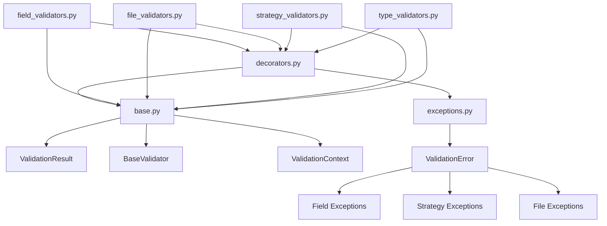

# PAMOLA.CORE Validation Framework Documentation

## Overview

The PAMOLA.CORE validation framework provides a comprehensive, modular system for validating data, parameters, and configurations used in privacy-preserving anonymization operations. Located at `pamola_core/anonymization/commons/validation/`, this framework ensures data quality, parameter correctness, and operational safety through standardized validation interfaces.

## Architecture

### Package Structure

```
pamola_core/anonymization/commons/validation/
├── __init__.py              # Package exports
├── base.py                  # Core infrastructure
├── decorators.py            # Validation decorators
├── exceptions.py            # Custom exceptions
├── field_validators.py      # Field type validators
├── file_validators.py       # File/path validators
├── strategy_validators.py   # Strategy parameter validators
└── type_validators.py       # Specialized type validators
```

### Component Relationships



## Core Components

### 1. Base Infrastructure (`base.py`)

Provides foundational classes and utilities for all validation operations.

#### Key Classes

```python
@dataclass
class ValidationResult:
    """Standardized validation result structure."""
    is_valid: bool
    field_name: Optional[str] = None
    errors: List[str] = field(default_factory=list)
    warnings: List[str] = field(default_factory=list)
    details: Dict[str, Any] = field(default_factory=dict)
    metadata: Dict[str, Any] = field(default_factory=dict)

class BaseValidator(ABC):
    """Abstract base for all validators."""
    @abstractmethod
    def validate(self, data: Any, **kwargs) -> ValidationResult:
        pass

class ValidationContext:
    """Context manager for validation operations."""
    def __init__(self, logger_instance: Optional[Logger] = None,
                 cache_enabled: bool = True):
        pass

class ValidationCache:
    """TTL-based cache for validation results."""
    def __init__(self, ttl: int = 300, max_size: int = 1000):
        pass
```

#### Utility Functions

- `check_field_exists(df: DataFrame, field_name: str) -> bool`
- `check_multiple_fields_exist(df: DataFrame, field_names: List[str]) -> Tuple[bool, List[str]]`
- `is_numeric_type(series: Series) -> bool`
- `is_categorical_type(series: Series) -> bool`
- `is_datetime_type(series: Series) -> bool`
- `safe_sample(data: Series, sample_size: int = 100) -> Series`

### 2. Validation Decorators (`decorators.py`)

Provides decorators for common validation patterns and error handling.

#### Key Decorators

```python
@validation_handler(default_field_name: Optional[str] = None,
                   catch_all_exceptions: bool = True)
# Converts exceptions to ValidationResult

@validate_types(**type_hints)
# Runtime type checking for function arguments

@sanitize_inputs(strip_strings: bool = True,
                normalize_none: bool = True)
# Input sanitization

@skip_if_empty(return_valid: bool = True,
              check_field: Optional[str] = None)
# Skip validation for empty inputs

@requires_field(field_name: str, raise_error: bool = True)
# Ensure DataFrame has required field

@standard_validator(field_name: Optional[str] = None,
                   strip_inputs: bool = True,
                   catch_all: bool = True)
# Composite decorator for common patterns
```

### 3. Custom Exceptions (`exceptions.py`)

Structured exceptions for different validation scenarios.

#### Exception Hierarchy

```python
ValidationError (base)
├── FieldNotFoundError
├── FieldTypeError
├── FieldValueError
├── InvalidStrategyError
├── InvalidParameterError
├── ConditionalValidationError
├── InvalidDataFormatError
├── RangeValidationError
├── FileValidationError
│   ├── FileNotFoundError
│   └── InvalidFileFormatError
├── MultipleValidationErrors
└── ConfigurationError
```

### 4. Field Validators (`field_validators.py`)

Validators for standard data types and field validation.

#### Available Validators

```python
class NumericFieldValidator(BaseValidator):
    def __init__(self, allow_null: bool = True,
                 min_value: Optional[float] = None,
                 max_value: Optional[float] = None,
                 allow_inf: bool = False):
        pass

class CategoricalFieldValidator(BaseValidator):
    def __init__(self, allow_null: bool = True,
                 valid_categories: Optional[List[str]] = None,
                 max_categories: Optional[int] = None):
        pass

class DateTimeFieldValidator(BaseValidator):
    def __init__(self, allow_null: bool = True,
                 min_date: Optional[Union[str, Timestamp]] = None,
                 max_date: Optional[Union[str, Timestamp]] = None,
                 future_dates_allowed: bool = True):
        pass

class BooleanFieldValidator(BaseValidator):
    def __init__(self, allow_null: bool = True):
        pass

class TextFieldValidator(BaseValidator):
    def __init__(self, allow_null: bool = True,
                 min_length: Optional[int] = None,
                 max_length: Optional[int] = None,
                 pattern: Optional[str] = None):
        pass

# Factory function
create_field_validator(field_type: str, **kwargs) -> BaseValidator
```

### 5. File Validators (`file_validators.py`)

Validators for file paths, directories, and configuration files.

#### Available Validators

```python
class FilePathValidator(BaseValidator):
    def __init__(self, must_exist: bool = True,
                 valid_extensions: Optional[List[str]] = None,
                 max_size_mb: Optional[float] = None,
                 check_permissions: bool = True):
        pass

class DirectoryPathValidator(BaseValidator):
    def __init__(self, must_exist: bool = True,
                 create_if_missing: bool = False,
                 check_permissions: bool = True):
        pass

class JSONFileValidator(BaseValidator):
    def __init__(self, schema: Optional[Dict[str, Any]] = None,
                 required_keys: Optional[List[str]] = None):
        pass

class CSVFileValidator(BaseValidator):
    def __init__(self, required_columns: Optional[List[str]] = None,
                 delimiter: str = ',',
                 has_header: bool = True,
                 encoding: str = 'utf-8'):
        pass

class HierarchyFileValidator(BaseValidator):
    def __init__(self, file_format: str = 'auto',
                 validate_structure: bool = True):
        pass

class MultiFileValidator(BaseValidator):
    def __init__(self, file_validator: Optional[BaseValidator] = None,
                 min_files: int = 1,
                 max_files: Optional[int] = None,
                 consistent_format: bool = True):
        pass
```

### 6. Strategy Validators (`strategy_validators.py`)

Validators for anonymization strategies and parameters.

#### Key Functions

```python
# Strategy validation
validate_strategy(strategy: str, valid_strategies: List[str],
                 operation_type: Optional[str] = None) -> ValidationResult

validate_generalization_strategy(strategy: str, data_type: str) -> ValidationResult
validate_noise_strategy(strategy: str) -> ValidationResult
validate_suppression_strategy(strategy: str) -> ValidationResult
validate_masking_strategy(strategy: str) -> ValidationResult
validate_pseudonymization_strategy(strategy: str) -> ValidationResult

# Mode validation
validate_operation_mode(mode: str, valid_modes: Optional[List[str]] = None) -> ValidationResult
validate_null_strategy(strategy: str, valid_strategies: Optional[List[str]] = None) -> ValidationResult

# Parameter validation
validate_bin_count(bin_count: int, min_bins: int = 2, max_bins: int = 1000) -> ValidationResult
validate_precision(precision: int, min_precision: int = -10, max_precision: int = 10) -> ValidationResult
validate_range_limits(range_limits: Tuple[float, float]) -> ValidationResult
validate_percentiles(percentiles: List[float]) -> ValidationResult

# Strategy-specific validation
validate_noise_parameters(noise_level: float, strategy: str,
                        bounds: Optional[Tuple[float, float]] = None) -> ValidationResult
validate_masking_parameters(mask_char: str, preserve_length: bool = True,
                          pattern: Optional[str] = None) -> ValidationResult
validate_hierarchy_parameters(hierarchy_depth: int,
                            merge_threshold: Optional[int] = None) -> ValidationResult

# Composite validation
validate_strategy_compatibility(strategy: str, field_type: str,
                              operation_type: str) -> ValidationResult
validate_output_field_configuration(df: DataFrame, mode: str,
                                  output_field_name: Optional[str] = None,
                                  original_field_name: Optional[str] = None) -> ValidationResult
```

#### Constants

```python
GENERALIZATION_STRATEGIES = {
    "numeric": ["binning", "rounding", "range", "custom"],
    "categorical": ["merge_low_freq", "hierarchy", "frequency_based", "custom"],
    "datetime": ["truncate", "shift", "generalize", "custom"]
}

NOISE_STRATEGIES = ["gaussian", "laplace", "uniform", "custom"]
SUPPRESSION_STRATEGIES = ["cell", "record", "attribute", "conditional"]
MASKING_STRATEGIES = ["full", "partial", "pattern", "format_preserving"]
PSEUDONYMIZATION_STRATEGIES = ["hash", "mapping", "sequential", "random"]

OPERATION_MODES = ["REPLACE", "ENRICH"]
NULL_STRATEGIES = ["PRESERVE", "EXCLUDE", "ERROR", "ANONYMIZE"]
```

### 7. Type Validators (`type_validators.py`)

Validators for specialized data types (network, geographic, temporal, financial).

#### Available Validators

```python
class NetworkValidator(BaseValidator):
    def __init__(self, network_type: str = 'ipv4',
                 sample_size: int = 100,
                 strict: bool = False):
        pass

class GeographicValidator(BaseValidator):
    def __init__(self, geo_type: str = 'coordinates',
                 sample_size: int = 100):
        pass

class TemporalValidator(BaseValidator):
    def __init__(self, min_date: Optional[datetime] = None,
                 max_date: Optional[datetime] = None,
                 check_sequence: bool = False):
        pass

class FinancialValidator(BaseValidator):
    def __init__(self, financial_type: str = 'amount',
                 allow_negative: bool = False,
                 currency: Optional[str] = None):
        pass

class SpecializedTypeValidator(BaseValidator):
    def __init__(self, data_type: str,
                 validation_params: Optional[Dict[str, Any]] = None):
        pass

# Convenience function
validate_specialized_type(data: Series, data_type: str,
                        validation_params: Optional[Dict[str, Any]] = None,
                        field_name: Optional[str] = None) -> ValidationResult
```

## Usage Examples

### Basic Field Validation

```python
from pamola_core.anonymization.commons.validation import (
    NumericFieldValidator,
    ValidationResult
)

# Validate numeric field
validator = NumericFieldValidator(
    min_value=0,
    max_value=100,
    allow_null=False
)

result = validator.validate(df['age'])
if not result.is_valid:
    print(f"Validation errors: {result.errors}")
```

### Strategy Validation

```python
from pamola_core.anonymization.commons.validation import (
    validate_generalization_strategy,
    validate_bin_count
)

# Validate strategy selection
strategy_result = validate_generalization_strategy("binning", "numeric")

# Validate parameters
bin_result = validate_bin_count(10, min_bins=2, max_bins=50)

if strategy_result.is_valid and bin_result.is_valid:
    # Proceed with operation
    pass
```

### File Validation

```python
from pamola_core.anonymization.commons.validation import (
    HierarchyFileValidator,
    DirectoryPathValidator
)

# Validate hierarchy file
hierarchy_validator = HierarchyFileValidator(file_format='json')
result = hierarchy_validator.validate("hierarchies/geographic.json")

# Validate output directory
dir_validator = DirectoryPathValidator(
    must_exist=False,
    create_if_missing=True
)
dir_result = dir_validator.validate("output/anonymized")
```

### Using Decorators

```python
from pamola_core.anonymization.commons.validation import (
    standard_validator,
    requires_field,
    validate_types
)

@standard_validator(field_name="email")
@requires_field("email")
@validate_types(df=pd.DataFrame, threshold=float)
def validate_email_field(df: pd.DataFrame, threshold: float = 0.9):
    # Validation logic here
    if df['email'].str.contains('@').mean() < threshold:
        raise FieldValueError("email", "Too many invalid emails")
    return ValidationResult(is_valid=True)
```

### Specialized Type Validation

```python
from pamola_core.anonymization.commons.validation import validate_specialized_type

# Validate IP addresses
ip_result = validate_specialized_type(
    df['ip_address'],
    data_type='network',
    validation_params={'network_type': 'ipv4'}
)

# Validate geographic coordinates
geo_result = validate_specialized_type(
    df['location'],
    data_type='geo',
    validation_params={'geo_type': 'coordinates'}
)

# Validate financial amounts
fin_result = validate_specialized_type(
    df['transaction_amount'],
    data_type='financial',
    validation_params={
        'financial_type': 'amount',
        'allow_negative': False
    }
)
```

### Composite Validation

```python
from pamola_core.anonymization.commons.validation import (
    CompositeValidator,
    NumericFieldValidator,
    create_field_validator
)

# Chain multiple validators
validator_chain = CompositeValidator([
    NumericFieldValidator(min_value=0, max_value=150),
    create_field_validator('numeric', allow_null=False)
])

result = validator_chain.validate(df['age'])
```

### Error Handling

```python
from pamola_core.anonymization.commons.validation import (
    ValidationError,
    FieldNotFoundError,
    MultipleValidationErrors,
    raise_if_errors
)

errors = []

try:
    # Validation that might fail
    if 'required_field' not in df.columns:
        errors.append(FieldNotFoundError(
            'required_field',
            available_fields=list(df.columns)
        ))
except ValidationError as e:
    errors.append(e)

# Raise if any errors collected
raise_if_errors(errors)  # Raises MultipleValidationErrors if errors exist
```

## Best Practices

1. **Use Type-Specific Validators**: Choose the appropriate validator for your data type rather than generic validation.

2. **Leverage Decorators**: Use decorators to reduce boilerplate and ensure consistent error handling.

3. **Check Results**: Always check `ValidationResult.is_valid` before proceeding with operations.

4. **Handle Warnings**: Pay attention to warnings even when validation passes.

5. **Cache Expensive Validations**: Use `@cached_validation` for validations that are expensive and frequently repeated.

6. **Compose Validators**: Use `CompositeValidator` to chain related validations.

7. **Provide Context**: Include field names and operation context in validation calls for better error messages.

## Integration with Anonymization Operations

The validation framework integrates seamlessly with anonymization operations:

```python
from pamola_core.anonymization.base_anonymization_op import AnonymizationOperation
from pamola_core.anonymization.commons.validation import (
    validate_generalization_strategy,
    NumericFieldValidator
)

class MyAnonymizationOp(AnonymizationOperation):
    def __init__(self, field_name: str, strategy: str, **kwargs):
        # Validate strategy
        strategy_result = validate_generalization_strategy(strategy, "numeric")
        if not strategy_result.is_valid:
            raise ValueError(f"Invalid strategy: {strategy_result.errors}")
        
        super().__init__(field_name=field_name, **kwargs)
        self.strategy = strategy
    
    def execute(self, data_source, task_dir, reporter, **kwargs):
        df = data_source.get_dataframe("main")
        
        # Validate field
        validator = NumericFieldValidator(min_value=0)
        field_result = validator.validate(df[self.field_name])
        
        if not field_result.is_valid:
            return OperationResult(
                status=OperationStatus.ERROR,
                error_message=f"Field validation failed: {field_result.errors}"
            )
        
        # Proceed with anonymization...
```

The validation framework ensures data quality and parameter correctness throughout the anonymization pipeline, providing clear error messages and maintaining consistency across all operations.