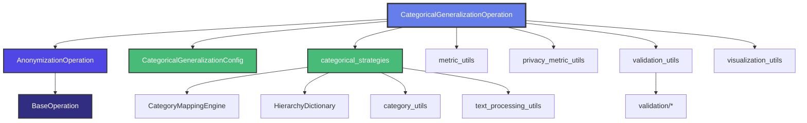

# PAMOLA.CORE Categorical Generalization Module Documentation

**Version:** 4.0.0  
**Date:** June 15, 2025  
**Status:** Production Ready  
**Package:** `pamola_core.anonymization.generalization`

## Table of Contents

1. [Overview](#overview)
2. [Architecture](#architecture)
3. [Installation & Setup](#installation--setup)
4. [Core Components](#core-components)
5. [Usage Guide](#usage-guide)
6. [API Reference](#api-reference)
7. [Configuration](#configuration)
8. [Strategies](#strategies)
9. [Performance & Scalability](#performance--scalability)
10. [Examples](#examples)
11. [Troubleshooting](#troubleshooting)
12. [Migration Guide](#migration-guide)

## Overview

The Categorical Generalization module provides privacy-preserving transformations for categorical and textual data through hierarchical generalization, frequency-based grouping, and external dictionary mappings. It's designed to achieve k-anonymity while preserving data utility.

### Key Features

- **Multiple Generalization Strategies**: Hierarchy-based, frequency-based, and rare category merging
- **External Dictionary Support**: JSON and CSV hierarchical dictionaries
- **Thread-Safe Operation**: Concurrent processing with proper state management
- **Large Dataset Support**: Automatic Dask switching for datasets > 1M records
- **Comprehensive Metrics**: Privacy metrics, information loss, and performance tracking
- **Rich Visualizations**: Distribution comparisons, hierarchy sunbursts, and metric dashboards
- **Flexible NULL Handling**: Multiple strategies for NULL value processing
- **Error Recovery**: Configurable error handling with batch-level recovery

### Design Principles

1. **Facade Pattern**: Minimal orchestration layer delegating to specialized modules
2. **Thread Safety**: All operations are thread-safe with RLock protection
3. **Performance**: Vectorized operations, caching, and adaptive batch sizing
4. **Extensibility**: Easy to add new strategies or customize behavior
5. **Observability**: Comprehensive logging with trace IDs and metrics

## Architecture

### Module Structure

```
pamola_core/anonymization/
├── base_anonymization_op.py        # Base class for all anonymization operations (v3.0.0)
├── generalization/
│   └── categorical.py              # Main facade (v4.0.0)
└── commons/
    ├── __init__.py
    ├── categorical_config.py       # Configuration management
    ├── categorical_strategies.py   # Strategy implementations
    ├── category_mapping.py         # Thread-safe mapping engine
    ├── category_utils.py           # Category analysis utilities
    ├── data_utils.py              # Data processing utilities
    ├── hierarchy_dictionary.py     # Hierarchy dictionary management
    ├── metric_utils.py            # Metrics collection
    ├── privacy_metric_utils.py    # Privacy-specific metrics
    ├── text_processing_utils.py   # Text normalization and matching
    ├── validation_utils.py        # Validation framework facade
    ├── visualization_utils.py     # Visualization helpers
    └── validation/                # Modular validation subsystem
        ├── __init__.py
        ├── base.py               # Base validator classes
        ├── decorators.py         # Validation decorators
        ├── exceptions.py         # Custom exceptions
        ├── field_validators.py   # Field-level validators
        ├── file_validators.py    # File/path validators
        ├── strategy_validators.py # Strategy parameter validators
        └── type_validators.py    # Data type validators
```

### Component Relationships



## Installation & Setup

### Requirements

```python
# Core dependencies
pandas >= 1.3.0
numpy >= 1.20.0
jsonschema >= 3.2.0
cachetools >= 4.2.0

# Optional dependencies
dask >= 2021.10.0  # For large datasets
matplotlib >= 3.3.0  # For visualizations
plotly >= 5.0.0  # For interactive charts
```

### Basic Setup

```python
from pamola_core.anonymization.generalization import CategoricalGeneralizationOperation

# Create operation
operation = CategoricalGeneralizationOperation(
    field_name="job_title",
    strategy="hierarchy",
    external_dictionary_path="dictionaries/professions.json",
    hierarchy_level=2
)

# Execute
result = operation.execute(
    data_source=data_source,
    task_dir=Path("output/task_001"),
    reporter=reporter
)
```

## Core Components

### 1. AnonymizationOperation (base_anonymization_op.py)

The base class for all anonymization operations in PAMOLA.CORE (v3.0.0).

**Key Features:**
- Standardized operation lifecycle with validation, execution, and result handling
- Support for both REPLACE and ENRICH modes
- Configurable NULL value handling strategies (PRESERVE, EXCLUDE, ERROR)
- Memory-efficient chunk-based processing
- **Dask support for large datasets** (automatic switching when > 1M rows)
- Comprehensive metrics collection and visualization generation
- Conditional processing based on field values and risk scores
- K-anonymity integration for privacy-aware processing

**Important Methods to Override:**
- `process_batch(batch: pd.DataFrame)` - Main batch processing logic
- `process_value(value, **params)` - Single value processing
- `_collect_specific_metrics()` - Operation-specific metrics
- `_process_batch_dask()` - Dask-specific processing (optional)

### 2. CategoricalGeneralizationOperation (categorical.py)

The main facade class that orchestrates the categorical generalization process.

**Inheritance Chain:**
```
BaseOperation (pamola_core.utils.ops)
    └── AnonymizationOperation (pamola_core.anonymization)
            └── CategoricalGeneralizationOperation
```

**Key Responsibilities:**
- Configuration validation and management
- Strategy selection and execution
- Metrics collection and reporting
- Integration with PAMOLA.CORE framework
- State management and cleanup

### 3. CategoricalGeneralizationConfig (categorical_config.py)

Comprehensive configuration management with JSON schema validation.

**Key Features:**
- Type-safe parameter handling
- Strategy-specific validation
- Export/import configuration support
- Engine selection (Pandas/Dask/Auto)

### 3. Strategy Implementations (categorical_strategies.py)

Located in `commons/categorical_strategies.py`, this module contains all generalization strategy implementations.

#### Hierarchy Strategy
Maps values to higher-level categories using external dictionaries.

```python
# Example: city → state → country
"Toronto" → "Ontario" → "Canada"
```

#### Merge Low Frequency Strategy
Groups rare categories based on frequency thresholds.

```python
# Categories with < 10 occurrences → "OTHER"
["Rare Job 1", "Rare Job 2"] → "OTHER"
```

#### Frequency-Based Strategy
Preserves top K categories and groups the rest.

```python
# Keep top 50 categories, group rest as "OTHER_001", "OTHER_002"
```

### 4. CategoryMappingEngine (category_mapping.py)

Located in `commons/category_mapping.py`, provides a thread-safe engine for managing category mappings with LRU caching.

**Features:**
- O(1) lookup performance with cachetools.LRUCache
- Conditional mapping rules
- Unknown value templates
- Batch processing support

### 5. Validation Framework

The validation system consists of:
- `commons/validation_utils.py` - Facade for backward compatibility
- `commons/validation/` - Modular validation subsystem with specialized validators

**Validation Components:**
- `base.py` - BaseValidator and CompositeValidator classes
- `field_validators.py` - NumericFieldValidator, CategoricalFieldValidator, etc.
- `file_validators.py` - FilePathValidator, HierarchyFileValidator
- `strategy_validators.py` - Strategy-specific parameter validation
- `decorators.py` - @validation_handler, @requires_field, etc.

### 6. Utility Modules

**Data Processing** (`commons/data_utils.py`):
- NULL value processing strategies
- Risk-based record handling
- Adaptive anonymization

**Text Processing** (`commons/text_processing_utils.py`):
- Text normalization (basic, advanced, aggressive)
- Fuzzy matching with similarity thresholds
- Category name cleaning

**Metrics** (`commons/metric_utils.py` & `commons/privacy_metric_utils.py`):
- Anonymization effectiveness metrics
- Information loss calculations
- Privacy metrics (k-anonymity, disclosure risk)
- Performance tracking

**Visualization** (`commons/visualization_utils.py`):
- Distribution comparison charts
- Hierarchy sunburst diagrams
- Metrics dashboards

## Usage Guide

### Basic Usage

```python
# 1. Simple hierarchy generalization
operation = CategoricalGeneralizationOperation(
    field_name="city",
    strategy="hierarchy",
    external_dictionary_path="cities_hierarchy.json",
    hierarchy_level=1,  # city → state
    null_strategy="PRESERVE"
)

# 2. Frequency-based grouping
operation = CategoricalGeneralizationOperation(
    field_name="product_name",
    strategy="frequency_based",
    max_categories=100,  # Keep top 100
    group_rare_as="CATEGORY_N",
    rare_value_template="CATEGORY_{n}"
)

# 3. Merge rare categories
operation = CategoricalGeneralizationOperation(
    field_name="diagnosis_code",
    strategy="merge_low_freq",
    min_group_size=50,
    freq_threshold=0.01,  # 1% threshold
    group_rare_as="OTHER"
)
```

### Advanced Usage

```python
# With privacy requirements
operation = CategoricalGeneralizationOperation(
    field_name="occupation",
    strategy="hierarchy",
    external_dictionary_path="occupations.json",
    hierarchy_level=2,
    
    # Privacy settings
    quasi_identifiers=["age", "zip_code", "occupation"],
    privacy_check_enabled=True,
    min_acceptable_k=5,
    max_acceptable_disclosure_risk=0.2,
    
    # Performance settings
    engine="auto",  # Switch to Dask for large data
    max_rows_in_memory=1000000,
    adaptive_batch_size=True,
    
    # Error handling
    continue_on_error=True,
    error_batch_handling="log"
)
```

### Conditional Processing

```python
# Process only specific records
operation = CategoricalGeneralizationOperation(
    field_name="job_title",
    strategy="hierarchy",
    external_dictionary_path="jobs.json",
    
    # Conditional processing
    condition_field="department",
    condition_values=["IT", "Engineering"],
    condition_operator="in",
    
    # Risk-based processing
    ka_risk_field="k_anonymity_score",
    risk_threshold=5.0,
    vulnerable_record_strategy="generalize"
)
```

## API Reference

### Constructor Parameters

| Parameter | Type | Default | Description |
|-----------|------|---------|-------------|
| `field_name` | str | Required | Field to generalize |
| `strategy` | str | "hierarchy" | Generalization strategy |
| `mode` | str | "REPLACE" | REPLACE or ENRICH mode |
| `output_field_name` | str | None | Output field for ENRICH mode |
| `external_dictionary_path` | str | None | Path to hierarchy dictionary |
| `hierarchy_level` | int | 1 | Level of generalization (1-5) |
| `min_group_size` | int | 10 | Minimum size for groups |
| `freq_threshold` | float | 0.01 | Frequency threshold (0-1) |
| `max_categories` | int | 1000 | Maximum categories to preserve |
| `null_strategy` | str | "PRESERVE" | NULL handling strategy |
| `engine` | str | "auto" | Processing engine selection |
| `batch_size` | int | 10000 | Records per batch |
| `use_cache` | bool | True | Enable result caching |

### Methods

#### execute()
```python
def execute(self, data_source: DataSource, task_dir: Path, 
            reporter: Reporter, progress_tracker: Optional[ProgressTracker] = None,
            **kwargs) -> OperationResult
```
Execute the generalization operation.

#### reset_state()
```python
def reset_state(self) -> None
```
Reset internal state after execution.

#### get_batch_metrics()
```python
def get_batch_metrics(self) -> List[Dict[str, Any]]
```
Retrieve collected batch metrics.

### NULL Strategies

| Strategy | Description | Use Case |
|----------|-------------|----------|
| `PRESERVE` | Keep NULL values as-is | Default behavior |
| `EXCLUDE` | Filter out NULL values | When NULLs should not be processed |
| `ANONYMIZE` | Replace with unknown_value | Treat NULL as sensitive |
| `ERROR` | Raise error on NULL | Strict data quality |

## Configuration

### JSON Schema Example

```json
{
  "field_name": "city",
  "strategy": "hierarchy",
  "external_dictionary_path": "cities.json",
  "hierarchy_level": 2,
  "text_normalization": "advanced",
  "fuzzy_matching": true,
  "similarity_threshold": 0.85,
  "null_strategy": "PRESERVE",
  "engine": "auto",
  "batch_size": 50000,
  "privacy_check_enabled": true,
  "min_acceptable_k": 5
}
```

### Dictionary Format

#### JSON Hierarchy
```json
{
  "Toronto": {
    "level_1": "Greater Toronto Area",
    "level_2": "Ontario",
    "level_3": "Canada"
  },
  "Vancouver": {
    "level_1": "Metro Vancouver",
    "level_2": "British Columbia",
    "level_3": "Canada"
  }
}
```

#### CSV Hierarchy
```csv
value,level_1,level_2,level_3
Toronto,Greater Toronto Area,Ontario,Canada
Vancouver,Metro Vancouver,British Columbia,Canada
```

## Strategies

### Hierarchy Strategy

**Use Cases:**
- Geographic data (city → state → country)
- Professional categories (role → department → industry)
- Product taxonomies (product → subcategory → category)

**Parameters:**
- `external_dictionary_path`: Path to hierarchy file
- `hierarchy_level`: Target generalization level
- `fuzzy_matching`: Enable approximate matching
- `similarity_threshold`: Threshold for fuzzy matches

**Example:**
```python
config = {
    "strategy": "hierarchy",
    "external_dictionary_path": "geo_hierarchy.json",
    "hierarchy_level": 2,
    "fuzzy_matching": True,
    "similarity_threshold": 0.85
}
```

### Merge Low Frequency Strategy

**Use Cases:**
- Long-tail distributions
- Rare disease codes
- Uncommon job titles

**Parameters:**
- `min_group_size`: Minimum records per group
- `freq_threshold`: Frequency percentage threshold
- `group_rare_as`: Grouping method (OTHER/CATEGORY_N/RARE_N)

**Example:**
```python
config = {
    "strategy": "merge_low_freq",
    "min_group_size": 50,
    "freq_threshold": 0.01,
    "group_rare_as": "CATEGORY_N",
    "rare_value_template": "GROUP_{n}"
}
```

### Frequency-Based Strategy

**Use Cases:**
- Product catalogs
- Search queries
- User interests

**Parameters:**
- `max_categories`: Number of top categories to keep
- `min_group_size`: Size for grouped categories
- `group_rare_as`: Grouping method

**Example:**
```python
config = {
    "strategy": "frequency_based",
    "max_categories": 100,
    "min_group_size": 10,
    "group_rare_as": "OTHER"
}
```

## Performance & Scalability

### Large Dataset Support (Dask)

The module automatically switches to Dask for datasets exceeding the configured threshold:

```python
# Automatic Dask switching (v3.0.0 feature from base class)
operation = CategoricalGeneralizationOperation(
    field_name="category",
    strategy="hierarchy",
    engine="auto",               # Automatic engine selection
    max_rows_in_memory=1000000,  # Switch to Dask above this threshold
    dask_chunk_size="100MB",     # Size of Dask partitions
    dask_npartitions=None        # Auto-calculate partitions
)

# Force Dask usage
operation = CategoricalGeneralizationOperation(
    field_name="category",
    engine="dask",  # Always use Dask
    dask_chunk_size="50MB"
)
```

**Dask Processing Flow:**
1. Data exceeds `max_rows_in_memory` threshold
2. Automatically converts to Dask DataFrame
3. Processes in distributed partitions
4. Converts back to pandas for output

**Note:** The base class `AnonymizationOperation` handles all Dask management transparently.

### Performance Metrics

| Dataset Size | Strategy | Processing Time | Memory Usage |
|--------------|----------|-----------------|--------------|
| 100K records | Hierarchy | ~5 seconds | ~500 MB |
| 1M records | Hierarchy | ~45 seconds | ~4 GB |
| 10M records | Hierarchy (Dask) | ~5 minutes | ~8 GB |

### Optimization Tips

1. **Enable Caching**: Use `use_cache=True` for repeated operations
2. **Adaptive Batch Size**: Enable `adaptive_batch_size=True`
3. **Optimize Memory**: Use `optimize_memory=True` for dtype optimization
4. **Pre-calculate Value Counts**: Pass via context for multiple operations

## Examples

### Example 1: Geographic Hierarchy

```python
# Setup
operation = CategoricalGeneralizationOperation(
    field_name="city",
    strategy="hierarchy",
    external_dictionary_path="cities_north_america.json",
    hierarchy_level=2,  # City → State/Province
    text_normalization="advanced",
    fuzzy_matching=True,
    unknown_value="OTHER_LOCATION"
)

# Execute
result = operation.execute(data_source, task_dir, reporter)

# Check results
if result.status == OperationStatus.SUCCESS:
    print(f"Generalized {result.metrics['records_processed']} records")
    print(f"Coverage: {result.metrics['hierarchy_metrics']['dictionary_coverage']:.1%}")
```

### Example 2: Professional Categories with Privacy

```python
# Configure with privacy requirements
operation = CategoricalGeneralizationOperation(
    field_name="job_title",
    strategy="hierarchy",
    external_dictionary_path="professions_hierarchy.json",
    hierarchy_level=1,  # Specific role → Department
    
    # Privacy settings
    quasi_identifiers=["age", "location", "job_title"],
    privacy_check_enabled=True,
    min_acceptable_k=5,
    
    # Text processing
    text_normalization="advanced",
    case_sensitive=False,
    fuzzy_matching=True,
    
    # Error handling
    continue_on_error=True,
    null_strategy="ANONYMIZE"
)
```

### Example 3: Product Catalog Simplification

```python
# Frequency-based grouping for products
operation = CategoricalGeneralizationOperation(
    field_name="product_name",
    strategy="frequency_based",
    max_categories=200,  # Keep top 200 products
    group_rare_as="CATEGORY_N",
    rare_value_template="OTHER_PRODUCT_{n}",
    
    # Performance optimization
    engine="auto",
    batch_size=100000,
    use_cache=True
)
```

## Troubleshooting

### Common Issues

#### 1. Dictionary Coverage Issues
```python
# Problem: Low dictionary coverage
# Solution: Enable fuzzy matching
operation = CategoricalGeneralizationOperation(
    fuzzy_matching=True,
    similarity_threshold=0.8  # Lower threshold for more matches
)
```

#### 2. Memory Issues with Large Data
```python
# Problem: Out of memory errors
# Solution: Force Dask usage
operation = CategoricalGeneralizationOperation(
    engine="dask",  # Force Dask
    dask_chunk_size=25000,  # Smaller chunks
    batch_size=5000  # Smaller batches
)
```

#### 3. NULL Value Errors
```python
# Problem: Unexpected NULL handling
# Solution: Choose appropriate strategy
operation = CategoricalGeneralizationOperation(
    null_strategy="ANONYMIZE",  # Replace NULLs
    unknown_value="NOT_PROVIDED"
)
```

### Debug Mode

Enable detailed logging:
```python
import logging
logging.getLogger("pamola_core.anonymization.generalization").setLevel(logging.DEBUG)

# Operation will now log detailed information
operation = CategoricalGeneralizationOperation(
    field_name="category",
    strategy="hierarchy"
)
```

### Performance Diagnostics

```python
# Get detailed metrics after execution
result = operation.execute(data_source, task_dir, reporter)

# Analyze batch metrics
batch_metrics = operation.get_batch_metrics()
for metric in batch_metrics:
    print(f"Batch {metric['batch_id']}: {metric['performance']['records_per_second']} rec/s")
```

## Migration Guide

### From v2.x to v4.0

1. **Import Changes**:
```python
# Old
from pamola_core.anonymization.categorical import CategoricalGeneralization

# New
from pamola_core.anonymization.generalization import CategoricalGeneralizationOperation
```

2. **Configuration Changes**:
```python
# Old
operation = CategoricalGeneralization(
    field_name="city",
    hierarchy_path="cities.json",
    level=2
)

# New
operation = CategoricalGeneralizationOperation(
    field_name="city",
    strategy="hierarchy",
    external_dictionary_path="cities.json",
    hierarchy_level=2
)
```

3. **New Features Available**:
- NULL strategies
- Error batch handling
- Dask support
- Privacy metrics
- State reset

### Backward Compatibility

A legacy wrapper is available for smooth migration:
```python
# Legacy support (will show deprecation warning)
from pamola_core.anonymization.generalization.categorical_legacy import CategoricalGeneralization
```

---

## Support & Contributing

For questions, issues, or contributions:
- Documentation: [PAMOLA.CORE Docs](https://pamola.ai/docs)
- Issues: [GitHub Issues](https://github.com/pamola/pamola_core/issues)
- Email: support@pamola.ai

**License:** BSD 3-Clause  
**Copyright:** © 2025 PAMOLA Core Team