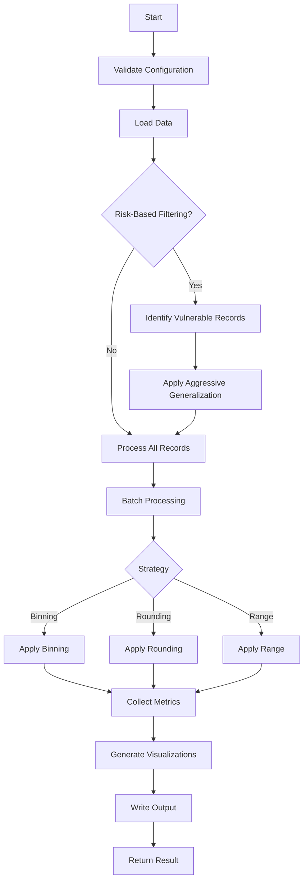

# Numeric Generalization Operation

**Module:** `pamola_core.anonymization.generalization.numeric_op`  
**Version:** 3.0.2  
**Status:** Stable  
**Last Updated:** June 20, 2025

## Table of Contents
1. [Overview](#1-overview)
2. [Architecture](#2-architecture)
3. [Key Features](#3-key-features)
4. [Core Components](#4-core-components)
5. [API Reference](#5-api-reference)
6. [Usage Examples](#6-usage-examples)
7. [Metrics and Outputs](#7-metrics-and-outputs)
8. [Performance Considerations](#8-performance-considerations)
9. [Limitations](#9-limitations)
10. [Best Practices](#10-best-practices)

## 1. Overview

The `NumericGeneralizationOperation` is a privacy-preserving data transformation module within the PAMOLA.CORE framework that reduces the precision of numeric values to enhance privacy while maintaining analytical utility. It implements three core generalization strategies:

- **Binning**: Groups numeric values into discrete intervals
- **Rounding**: Reduces precision to specified decimal places
- **Range**: Maps values to predefined ranges with outlier handling

This operation is designed for scenarios where exact numeric values pose privacy risks but aggregated or approximate values retain sufficient utility for analysis.

## 2. Architecture

### 2.1 Architectural Principles

The module follows several key architectural principles:

1. **Separation of Concerns**: The operation focuses solely on numeric transformation logic, delegating I/O, metrics, and visualization to specialized framework components.

2. **Framework Integration**: Fully integrated with PAMOLA.CORE utilities:
   - Uses `DataWriter` for all file operations
   - Leverages `ProgressTracker` for operation monitoring
   - Returns standardized `OperationResult` objects
   - Delegates metrics to commons utilities

3. **Atomic Operation Design**: Each instance is self-contained with no side effects or state persistence between executions.

4. **Privacy-First Processing**: Supports risk-based processing using k-anonymity scores and vulnerable record identification.

5. **Batch Processing Architecture**: Processes data in configurable chunks with adaptive sizing based on available memory.

### 2.2 Component Integration

```
┌─────────────────────────────────────────────────┐
│          NumericGeneralizationOperation         │
├─────────────────────────────────────────────────┤
│ Inherits from: AnonymizationOperation          │
│                                                 │
│ Core Dependencies:                              │
│ ├── commons.data_utils                         │
│ │   └── process_nulls()                        │
│ ├── commons.metric_utils                       │
│ │   ├── calculate_anonymization_effectiveness()│
│ │   ├── calculate_generalization_metrics()     │
│ │   └── collect_operation_metrics()            │
│ ├── commons.privacy_metric_utils               │
│ │   ├── calculate_batch_metrics()              │
│ │   └── calculate_simple_disclosure_risk()     │
│ ├── commons.validation_utils                   │
│ │   └── validate_numeric_field()               │
│ └── commons.visualization_utils                │
│     └── create_comparison_visualization()      │
│                                                 │
│ Framework Integration:                          │
│ ├── DataWriter (file operations)               │
│ ├── ProgressTracker (progress reporting)       │
│ ├── OperationResult (result packaging)         │
│ ├── OperationConfig (configuration)            │
│ └── Field Utilities (naming, conditions)       │
└─────────────────────────────────────────────────┘
```

### 2.3 Processing Flow



## 3. Key Features

### 3.1 Core Capabilities

- **Multiple Generalization Strategies**
  - Binning with equal-width, equal-frequency, and quantile methods
  - Rounding with positive and negative precision support
  - Range-based with multiple range support and outlier handling

- **Advanced Processing Options**
  - Risk-based processing using k-anonymity scores
  - Conditional processing based on field values
  - Aggressive generalization for vulnerable records
  - Batch-level error recovery with partial success

- **Memory Management**
  - Adaptive batch sizing based on available system memory
  - Explicit garbage collection for large datasets
  - DataFrame type optimization before output
  - Chunked processing with progress tracking

- **Privacy Integration**
  - K-anonymity metric calculation
  - Disclosure risk assessment
  - Suppression rate tracking
  - Privacy-aware metrics collection

### 3.2 Data Handling Features

- **Flexible Modes**
  - REPLACE: Modifies field in-place
  - ENRICH: Creates new field with original preserved

- **Null Value Strategies**
  - PRESERVE: Keep null values unchanged
  - EXCLUDE: Remove nulls before processing
  - ERROR: Raise error on null detection
  - ANONYMIZE: Replace nulls with anonymization marker

- **Output Formats**
  - CSV (default)
  - Parquet (optimized for large datasets)
  - Arrow (for high-performance analytics)

### 3.3 Monitoring and Reporting

- **Progress Tracking**
  - Hierarchical progress with phase information
  - Batch-level progress updates
  - Memory usage reporting
  - Error batch tracking

- **Comprehensive Metrics**
  - Effectiveness metrics (information loss, reduction ratio)
  - Privacy metrics (k-anonymity, disclosure risk)
  - Performance metrics (throughput, memory usage)
  - Strategy-specific metrics

- **Visualizations**
  - Before/after distribution comparisons
  - Group size distributions
  - Metric visualizations

## 4. Core Components

### 4.1 Configuration Class

```python
class NumericGeneralizationConfig(OperationConfig):
    """
    Configuration for NumericGeneralizationOperation.
    
    Validates all parameters against JSON schema including:
    - Strategy-specific requirements
    - Conditional processing parameters
    - Risk-based processing settings
    - Output format specifications
    """
```

### 4.2 Main Operation Class

```python
class NumericGeneralizationOperation(AnonymizationOperation):
    """
    Operation for generalizing numeric data.
    
    Key Methods:
    - execute(): Main execution with framework integration
    - process_batch(): Core transformation logic
    - _apply_binning(): Binning strategy implementation
    - _apply_rounding(): Rounding strategy implementation
    - _apply_range(): Range strategy implementation
    - _collect_comprehensive_metrics(): Metrics aggregation
    """
```

## 5. API Reference

### 5.1 Constructor

```python
def __init__(self,
             field_name: str,
             strategy: str = "binning",
             bin_count: int = 10,
             binning_method: str = "equal_width",
             precision: int = 0,
             range_limits: Optional[List[Tuple[float, float]]] = None,
             mode: str = "REPLACE",
             output_field_name: Optional[str] = None,
             column_prefix: str = "_",
             null_strategy: str = "PRESERVE",
             batch_size: int = 10000,
             adaptive_batch_size: bool = True,
             use_cache: bool = True,
             use_encryption: bool = False,
             encryption_key: Optional[Union[str, Path]] = None,
             condition_field: Optional[str] = None,
             condition_values: Optional[List] = None,
             condition_operator: str = "in",
             ka_risk_field: Optional[str] = None,
             risk_threshold: float = 5.0,
             vulnerable_record_strategy: str = "suppress",
             output_format: str = "csv",
             quasi_identifiers: Optional[List[str]] = None,
             continue_on_error: bool = False,
             error_batch_handling: str = "log",
             description: str = "")
```

### 5.2 Parameter Details

| Parameter | Type | Default | Description |
|-----------|------|---------|-------------|
| `field_name` | str | Required | The numeric field to generalize |
| `strategy` | str | "binning" | Generalization strategy: "binning", "rounding", or "range" |
| `bin_count` | int | 10 | Number of bins for binning strategy (min: 2) |
| `binning_method` | str | "equal_width" | Method for creating bins: "equal_width", "equal_frequency", "quantile" |
| `precision` | int | 0 | Decimal places for rounding (negative for powers of 10) |
| `range_limits` | List[Tuple[float, float]] | None | List of (min, max) ranges for range strategy |
| `mode` | str | "REPLACE" | Processing mode: "REPLACE" or "ENRICH" |
| `output_field_name` | str | None | Custom name for output field in ENRICH mode |
| `column_prefix` | str | "_" | Prefix for auto-generated field names |
| `null_strategy` | str | "PRESERVE" | Null handling: "PRESERVE", "EXCLUDE", "ERROR", "ANONYMIZE" |
| `batch_size` | int | 10000 | Records per processing batch |
| `adaptive_batch_size` | bool | True | Automatically adjust batch size based on memory |
| `use_cache` | bool | True | Enable result caching |
| `use_encryption` | bool | False | Encrypt output files |
| `encryption_key` | Union[str, Path] | None | Encryption key path or string |
| `condition_field` | str | None | Field for conditional processing |
| `condition_values` | List | None | Values for condition matching |
| `condition_operator` | str | "in" | Condition operator: "in", "not_in", "gt", "lt", "eq", "range" |
| `ka_risk_field` | str | None | Field containing k-anonymity risk scores |
| `risk_threshold` | float | 5.0 | K-anonymity threshold for vulnerability |
| `vulnerable_record_strategy` | str | "suppress" | Strategy for vulnerable records: "suppress", "generalize" |
| `output_format` | str | "csv" | Output format: "csv", "parquet", "arrow" |
| `quasi_identifiers` | List[str] | None | Fields for k-anonymity calculation |
| `continue_on_error` | bool | False | Continue processing on batch errors |
| `error_batch_handling` | str | "log" | Error handling: "skip", "fail", "log" |
| `description` | str | "" | Operation description |

### 5.3 Key Methods

#### execute()
```python
def execute(self, 
            data_source: DataSource, 
            task_dir: Path, 
            reporter: Any = None, 
            progress_tracker: Optional[ProgressTracker] = None, 
            **kwargs) -> OperationResult
```

Main execution method with full framework integration.

**Parameters:**
- `data_source`: Source of data to process
- `task_dir`: Directory for output artifacts
- `reporter`: Optional reporter for tracking
- `progress_tracker`: Optional progress tracker
- `**kwargs`: Additional options:
  - `write_output`: Whether to write output file (default: True)
  - `output_name`: Custom output filename
  - `timestamp_output`: Add timestamp to output

**Returns:** `OperationResult` with status, metrics, and artifacts

#### process_batch()
```python
def process_batch(self, batch: pd.DataFrame) -> pd.DataFrame
```

Process a batch of data applying the configured generalization strategy.

**Parameters:**
- `batch`: DataFrame batch to process

**Returns:** Processed DataFrame with generalized values

## 6. Usage Examples

### 6.1 Basic Binning

```python
from pamola_core.anonymization.generalization.numeric_op import NumericGeneralizationOperation
from pamola_core.utils.ops.op_data_source import DataSource
from pathlib import Path

# Create operation for salary binning
operation = NumericGeneralizationOperation(
    field_name="salary",
    strategy="binning",
    bin_count=5,
    binning_method="equal_width"
)

# Execute operation
data_source = DataSource.from_dataframe(df, name="main")
result = operation.execute(
    data_source=data_source,
    task_dir=Path("output/task_001")
)

# Check results
if result.status == OperationStatus.SUCCESS:
    print(f"Generalization ratio: {result.metrics['effectiveness']['reduction_ratio']}")
    print(f"Unique values reduced from {result.metrics['effectiveness']['original_unique']} "
          f"to {result.metrics['effectiveness']['anonymized_unique']}")
```

### 6.2 Risk-Based Processing

```python
# Process only vulnerable records (k < 5)
operation = NumericGeneralizationOperation(
    field_name="age",
    strategy="rounding",
    precision=-1,  # Round to nearest 10
    ka_risk_field="k_anonymity_score",
    risk_threshold=5.0,
    vulnerable_record_strategy="generalize",
    quasi_identifiers=["zip_code", "gender", "age"]
)

# Execute with risk-based processing
result = operation.execute(
    data_source=data_source,
    task_dir=task_dir,
    profiling_results={"k_anonymity": k_scores}
)

print(f"Vulnerable records processed: {result.metrics['vulnerable_records']}")
print(f"Privacy risk: {result.metrics['privacy']['disclosure_risk']}")
```

### 6.3 Multiple Range Strategy

```python
# Define income ranges
income_ranges = [
    (0, 30000),      # Low income
    (30000, 75000),  # Middle income
    (75000, 150000), # Upper middle
    (150000, 500000) # High income
]

operation = NumericGeneralizationOperation(
    field_name="annual_income",
    strategy="range",
    range_limits=income_ranges,
    mode="ENRICH",
    output_field_name="income_bracket",
    null_strategy="ANONYMIZE"
)

result = operation.execute(data_source, task_dir)
```

### 6.4 Conditional Processing

```python
# Only generalize records from specific departments
operation = NumericGeneralizationOperation(
    field_name="bonus",
    strategy="binning",
    bin_count=3,
    condition_field="department",
    condition_values=["Sales", "Marketing"],
    condition_operator="in"
)

# Or process based on numeric conditions
operation = NumericGeneralizationOperation(
    field_name="salary",
    strategy="rounding",
    precision=-3,  # Round to nearest 1000
    condition_field="years_employed",
    condition_values=[5],
    condition_operator="gt"  # Only employees > 5 years
)
```

### 6.5 Advanced Configuration

```python
# Configure for large dataset with encryption
operation = NumericGeneralizationOperation(
    field_name="transaction_amount",
    strategy="binning",
    bin_count=20,
    binning_method="quantile",
    batch_size=50000,
    adaptive_batch_size=True,
    use_encryption=True,
    encryption_key=Path("keys/data_key.pem"),
    output_format="parquet",
    continue_on_error=True,
    error_batch_handling="skip"
)

# Execute with custom output settings
result = operation.execute(
    data_source=data_source,
    task_dir=task_dir,
    write_output=True,
    output_name="transactions_generalized",
    timestamp_output=True
)
```

## 7. Metrics and Outputs

### 7.1 Generated Metrics

The operation generates comprehensive metrics organized by category:

**Effectiveness Metrics:**
- `total_records`: Total records processed
- `original_unique`: Unique values before generalization
- `anonymized_unique`: Unique values after generalization
- `reduction_ratio`: Proportion of uniqueness reduction
- `null_increase`: Increase in null values

**Privacy Metrics (when quasi-identifiers provided):**
- `min_k`: Minimum k-anonymity value
- `mean_group_size`: Average equivalence class size
- `vulnerable_ratio`: Proportion of records with k < threshold
- `disclosure_risk`: Simple disclosure risk score
- `suppression_rate`: Proportion of suppressed values

**Performance Metrics:**
- `duration_seconds`: Total execution time
- `records_per_second`: Processing throughput
- `batch_count`: Number of batches processed
- `successful_batches`: Successfully processed batches
- `error_batches`: Failed batch count

**Strategy-Specific Metrics:**

*Binning:*
- `bin_count`: Number of bins used
- `avg_bin_size`: Average records per bin
- `bin_utilization`: Proportion of bins with data

*Rounding:*
- `precision_factor`: Rounding magnitude
- `privacy_level`: Estimated privacy level (0-1)

*Range:*
- `range_coverage`: Percentage within specified ranges
- `outlier_count`: Records outside all ranges

### 7.2 Output Artifacts

```
{task_dir}/
├── {field}_numeric_{strategy}_metrics_{timestamp}.json
├── {field}_numeric_{strategy}_comparison_{timestamp}.png
├── {field}_numeric_{strategy}_distribution_{timestamp}.png
├── output/
│   └── generalized_data_{timestamp}.{format}
└── errors/
    └── {field}_error_report_{timestamp}.json
```

## 8. Performance Considerations

### 8.1 Memory Usage

- Base memory: ~2-3x the size of the numeric field
- Adaptive batch sizing uses 20% of available system memory
- Explicit garbage collection after processing >100K records
- DataFrame type optimization before output

### 8.2 Processing Speed

Typical throughput on standard hardware:
- Binning: 100K-200K records/second
- Rounding: 200K-300K records/second
- Range: 150K-250K records/second

Factors affecting performance:
- Number of unique values
- Batch size configuration
- Null value proportion
- Visualization generation
- Output format (Parquet faster than CSV)

### 8.3 Optimization Tips

1. **For Large Datasets:**
   ```python
   operation = NumericGeneralizationOperation(
       field_name="value",
       strategy="binning",
       batch_size=100000,
       adaptive_batch_size=True,
       output_format="parquet"
   )
   ```

2. **For Memory-Constrained Systems:**
   ```python
   operation = NumericGeneralizationOperation(
       field_name="value",
       strategy="rounding",
       batch_size=5000,
       adaptive_batch_size=False
   )
   ```

## 9. Limitations

### 9.1 Technical Limitations

1. **Single Field Processing**: Operates on one numeric field at a time
2. **Memory Requirements**: Entire DataFrame must fit in memory (chunking helps but base data required)
3. **Numeric Types Only**: Does not handle date/time or categorical data (use specific operations)
4. **Fixed Strategies**: Cannot combine multiple strategies in single pass
5. **No Streaming**: Requires complete dataset; no streaming support

### 9.2 Privacy Limitations

1. **Statistical Attacks**: Generalization alone may not prevent all statistical inference attacks
2. **Outlier Vulnerability**: Extreme outliers may remain identifiable even after generalization
3. **Correlation Preservation**: Correlations between fields largely preserved
4. **No Differential Privacy**: Does not provide formal differential privacy guarantees

### 9.3 Operational Limitations

1. **Cache Key Limitations**: Cache invalidation based on parameters only, not data distribution
2. **Visualization Scaling**: Visualizations may be slow for >1M unique values
3. **Error Recovery**: Batch-level recovery only; no record-level error handling
4. **Range Strategy**: All ranges must be non-overlapping

## 10. Best Practices

### 10.1 Strategy Selection

**Use Binning When:**
- You need fixed-size groups
- Statistical properties within bins don't matter
- Visual analysis of distributions is important

**Use Rounding When:**
- Relative magnitudes must be preserved
- Simple to understand and explain
- Dealing with continuous measurements

**Use Range When:**
- Business-defined categories exist
- Outliers need special handling
- Creating categorical variables from numeric

### 10.2 Privacy Configuration

```python
# High Privacy (Maximum Anonymization)
high_privacy = NumericGeneralizationOperation(
    field_name="income",
    strategy="binning",
    bin_count=3,  # Few bins
    ka_risk_field="k_score",
    risk_threshold=10,  # Strict threshold
    vulnerable_record_strategy="suppress"
)

# Balanced Privacy-Utility
balanced = NumericGeneralizationOperation(
    field_name="income",
    strategy="rounding",
    precision=-3,  # Round to thousands
    ka_risk_field="k_score",
    risk_threshold=5
)

# High Utility (Minimal Anonymization)
high_utility = NumericGeneralizationOperation(
    field_name="income",
    strategy="binning",
    bin_count=20,  # Many bins
    binning_method="quantile"  # Preserve distribution
)
```

### 10.3 Error Handling

```python
# Robust configuration for production
operation = NumericGeneralizationOperation(
    field_name="amount",
    strategy="binning",
    null_strategy="PRESERVE",  # Don't fail on nulls
    continue_on_error=True,     # Continue on batch errors
    error_batch_handling="log", # Log errors but continue
    adaptive_batch_size=True    # Handle memory pressure
)

# Strict configuration for testing
operation = NumericGeneralizationOperation(
    field_name="amount",
    strategy="binning",
    null_strategy="ERROR",       # Fail on nulls
    continue_on_error=False,     # Stop on first error
    error_batch_handling="fail"  # Fail immediately
)
```

### 10.4 Integration Patterns

```python
# Chain with profiling
profiling_result = profiler.run(data_source, task_dir)
k_scores = profiling_result.metrics.get("k_anonymity_scores")

generalization = NumericGeneralizationOperation(
    field_name="salary",
    strategy="binning",
    ka_risk_field="k_score"
)

result = generalization.execute(
    data_source,
    task_dir,
    profiling_results={"k_anonymity": k_scores}
)

# Combine multiple generalizations
for field in ["age", "income", "score"]:
    operation = NumericGeneralizationOperation(
        field_name=field,
        strategy="binning" if field != "age" else "rounding",
        bin_count=5 if field != "age" else None,
        precision=-1 if field == "age" else None
    )
    result = operation.execute(data_source, task_dir)
    
    if result.status != OperationStatus.SUCCESS:
        logger.error(f"Failed to generalize {field}: {result.error_message}")
        break
```

---

This operation provides a robust, privacy-preserving approach to numeric data generalization within the PAMOLA.CORE framework, balancing privacy protection with analytical utility through configurable strategies and comprehensive monitoring.