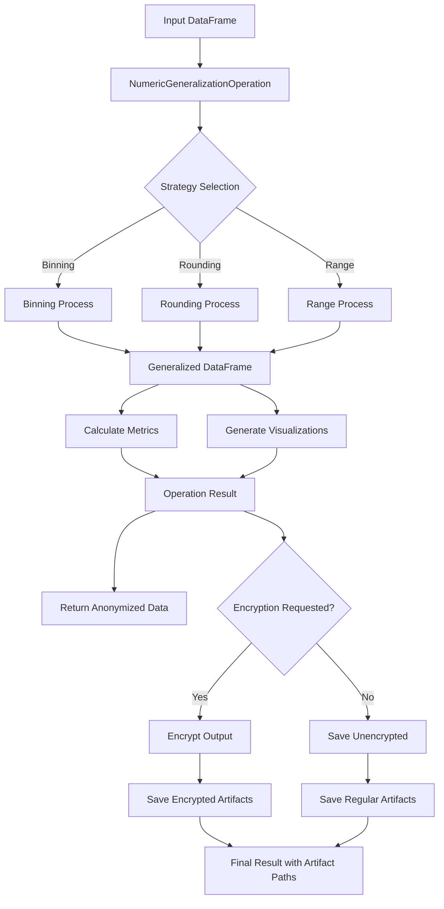
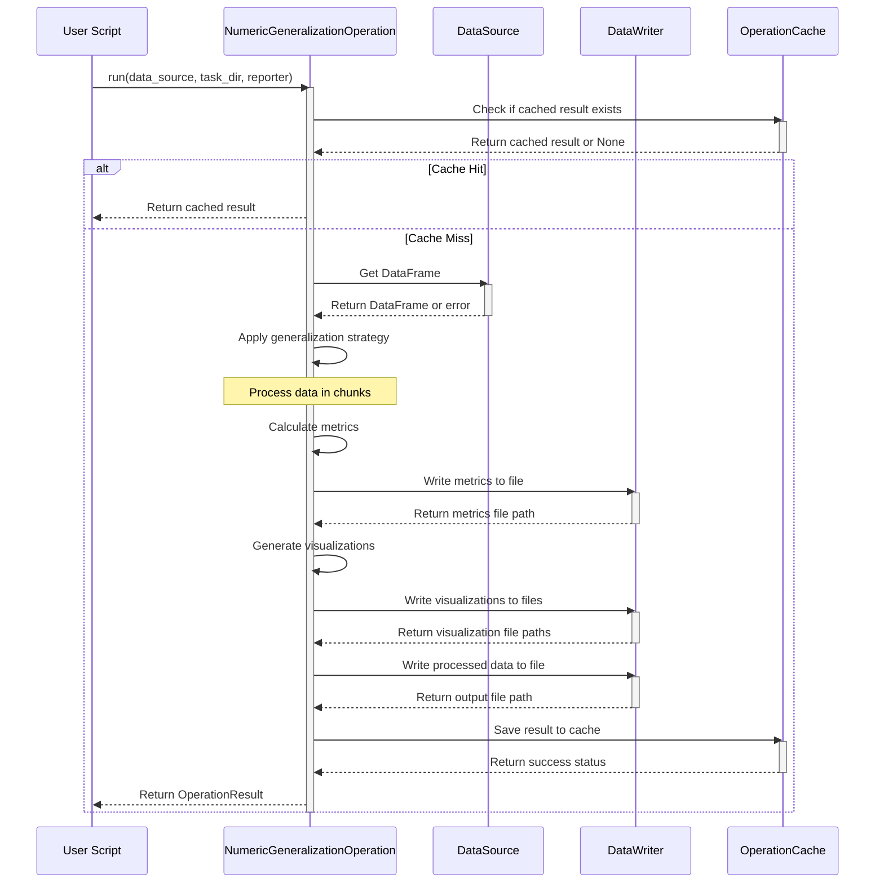

I'll create a fully updated specification for the NumericGeneralizationOperation documentation with all the sections we discussed.

# Numeric Generalization Operation

## 1. Overview

The `NumericGeneralizationOperation` provides functionality for anonymizing numeric data fields while preserving their analytical utility. It implements various generalization strategies that reduce the precision of numeric values, making it harder to identify individuals while maintaining the overall statistical properties of the dataset.

This module is part of the PAMOLA.CORE (Privacy And Management Of Large Anonymization) library, specifically within the anonymization package, which provides comprehensive privacy-enhancing technologies for data processing and anonymization.

## 2. Key Features

- **Multiple Generalization Strategies**:
  - **Binning**: Groups numeric values into equal-width intervals (bins)
  - **Rounding**: Reduces precision by rounding to a specified decimal place
  - **Range**: Maps values to predefined ranges with special handling for outliers

- **Data Utility Preservation**: Maintains statistical properties essential for analysis while reducing identification risks

- **Configurable Privacy Level**: Adjustable parameters for fine-tuning the privacy-utility trade-off

- **Flexible Data Handling**: 
  - Options for handling null values (PRESERVE, EXCLUDE, ERROR)
  - Support for both in-place modification (REPLACE) and new field creation (ENRICH)
  - Batch processing for large datasets

- **Comprehensive Metrics**: Generates detailed metrics about the generalization process and its effects on data

- **Visualization Support**: Creates visualizations comparing original and generalized data distributions

- **Caching Support**: Efficient caching mechanism for result reuse

- **Progress Tracking**: Reports progress during long-running operations

- **Encryption Support**: Optional encryption of output files

## 3. Architecture and Dependencies

```
                    +--------------------------+
                    |     BaseOperation        |
                    | (pamola_core.utils.ops.op_base) |
                    +--------------------------+
                                 ^
                                 |
                                 | inherits
                    +------------------------+
                    | AnonymizationOperation |
                    | (base_anonymization_op)|
                    +------------------------+
                                 ^
                                 |
                                 | inherits
                    +------------------------+
                    |NumericGeneralizationOp |
                    |(numeric_op.py)         |
                    +------------------------+
                           |              ^
                           v              |
  +-------------------+    |    +---------------------+
  | Commons Utilities |<---+--->| Pamola Core Utils          |
  +-------------------+         +---------------------+
  | - validation_utils|         | - visualization     |
  | - processing_utils|         | - io                |
  | - metric_utils    |         | - progress          |
  | - visualization_  |         | - op_base           |
  |   utils           |         | - op_data_source    |
  +-------------------+         | - op_data_writer    |
                                | - op_result         |
                                | - op_cache          |<----- Caching Support
                                | - op_config         |
                                +---------------------+
                                           ^
                                           |
                                 +---------------------+
                                 | External Libraries  |
                                 +---------------------+
                                 | - pandas            |
                                 | - numpy             |
                                 | - pathlib           |
                                 +---------------------+
```

### Data Flow



### Execution Workflow



## 4. Class Definition

```python
class NumericGeneralizationOperation(AnonymizationOperation):
    """
    Operation for generalizing numeric data.

    This operation generalizes numeric fields using strategies like binning,
    rounding, or range-based generalization to reduce precision and improve
    anonymity while preserving analytical utility.
    """

    def __init__(self,
                 field_name: str,
                 strategy: str = "binning",
                 bin_count: int = 10,
                 precision: int = 0,
                 range_limits: Optional[Tuple[float, float]] = None,
                 mode: str = "REPLACE",
                 output_field_name: Optional[str] = None,
                 column_prefix: str = "_",
                 null_strategy: str = "PRESERVE",
                 batch_size: int = 10000,
                 use_cache: bool = True,
                 use_encryption: bool = False,
                 encryption_key: Optional[Union[str, Path]] = None,
                 description: str = ""):
        """
        Initialize numeric generalization operation.

        Parameters:
        -----------
        field_name : str
            Field to generalize
        strategy : str, optional
            Generalization strategy: "binning", "rounding", or "range" (default: "binning")
        bin_count : int, optional
            Number of bins for binning strategy (default: 10)
        precision : int, optional
            Decimal places to retain for rounding strategy (default: 0)
        range_limits : Tuple[float, float], optional
            (min, max) limits for range strategy (default: None)
        mode : str, optional
            "REPLACE" to modify the field in-place, or "ENRICH" to create a new field (default: "REPLACE")
        output_field_name : str, optional
            Name for the output field if mode is "ENRICH" (default: None)
        column_prefix : str, optional
            Prefix for new column if mode is "ENRICH" (default: "_")
        null_strategy : str, optional
            How to handle NULL values: "PRESERVE", "EXCLUDE", or "ERROR" (default: "PRESERVE")
        batch_size : int, optional
            Batch size for processing large datasets (default: 10000)
        use_cache : bool, optional
            Whether to use operation caching (default: True)
        use_encryption : bool, optional
            Whether to encrypt output files (default: False)
        encryption_key : Optional[Union[str, Path]], optional
            Encryption key for securing outputs (default: None)
        description : str, optional
            Operation description (default: "")
        """
```

## 5. Key Methods and Return Values

| Method | Description | Parameters | Returns |
|--------|-------------|------------|---------|
| `execute()` | Main execution method | `data_source`: DataSource<br>`task_dir`: Path<br>`reporter`: Any<br>`progress_tracker`: ProgressTracker<br>`**kwargs`: Additional parameters | `OperationResult`: Contains status, metrics, artifacts |
| `process_batch()` | Process a batch of data | `batch`: DataFrame | `DataFrame`: Processed batch |
| `process_value()` | Process a single value | `value`: Any<br>`**params`: Additional parameters | `Any`: Processed value |
| `_collect_metrics()` | Collect all metrics | `original_data`: Series<br>`anonymized_data`: Series | `Dict[str, Any]`: Metrics dictionary |
| `_collect_specific_metrics()` | Collect strategy-specific metrics | `original_data`: Series<br>`anonymized_data`: Series | `Dict[str, Any]`: Strategy-specific metrics |
| `_generate_visualizations()` | Generate visualizations | `original_data`: Series<br>`anonymized_data`: Series<br>`task_dir`: Path<br>`result`: OperationResult<br>`reporter`: Any | `Dict[str, Path]`: Paths to visualization files |
| `_get_cache_parameters()` | Get parameters for cache key | - | `Dict[str, Any]`: Parameters for cache key |
| `_cleanup_memory()` | Clean up temporary data | `processed_df`: DataFrame<br>`original_data`: Series<br>`anonymized_data`: Series | `None` |
| `_generate_data_hash()` | Generate hash of input data | `data`: Series | `str`: Hash string |

## 6. Parameter Details

### 6.1 Constructor Parameters

| Parameter | Type | Default | Description | Constraints |
|-----------|------|---------|-------------|-------------|
| field_name | str | (required) | Field to generalize | Must exist in the DataFrame |
| strategy | str | "binning" | Generalization strategy | Must be one of: "binning", "rounding", "range" |
| bin_count | int | 10 | Number of bins for binning strategy | Must be >= 2 |
| precision | int | 0 | Decimal places to retain for rounding strategy | Any integer |
| range_limits | Tuple[float, float] | None | (min, max) limits for range strategy | min < max |
| mode | str | "REPLACE" | Mode of operation | Must be "REPLACE" or "ENRICH" |
| output_field_name | str | None | Name for output field if mode is "ENRICH" | Optional |
| column_prefix | str | "_" | Prefix for new column if mode is "ENRICH" | Any string |
| null_strategy | str | "PRESERVE" | How to handle NULL values | Must be one of: "PRESERVE", "EXCLUDE", "ERROR" |
| batch_size | int | 10000 | Batch size for processing large datasets | Must be > 0 |
| use_cache | bool | True | Whether to use operation caching | Boolean |
| use_encryption | bool | False | Whether to encrypt output files | Boolean |
| encryption_key | Union[str, Path] | None | Encryption key for securing outputs | Required if use_encryption=True |
| description | str | "" | Operation description | Any string |

### 6.2 Execute Method Parameters

```python
def execute(self,
            data_source: DataSource,
            task_dir: Path,
            reporter: Any,
            progress_tracker: Optional[ProgressTracker] = None,
            **kwargs) -> OperationResult:
    """
    Execute the operation with timing and error handling.

    Parameters:
    -----------
    data_source : DataSource
        Source of data for the operation
    task_dir : Path
        Directory where task artifacts should be saved
    reporter : Any
        Reporter object for tracking progress and artifacts
    progress_tracker : Optional[ProgressTracker]
        Progress tracker for the operation
    **kwargs : dict
        Additional parameters for the operation including:
        - force_recalculation: bool - Skip cache check
        - parallel_processes: int - Number of parallel processes
        - encrypt_output: bool - Override encryption setting

    Returns:
    --------
    OperationResult
        Results of the operation
    """
```

## 7. Strategy Details

### 7.1 Binning Strategy

Divides the range of values into a specified number of equal-width bins. Each value is replaced with its bin identifier.

**Parameters:**
- `bin_count`: Number of bins to create (default: 10)

**Example:**
```
Original values: [23.7, 45.2, 67.9, 12.5]
Binned (5 bins): ["0.0-20.0", "40.0-60.0", "60.0-80.0", "0.0-20.0"]
```

**Specific Metrics:**
- `average_records_per_bin`: Average number of records per bin
- `min_bin_count`: Minimum number of records in any bin
- `max_bin_count`: Maximum number of records in any bin
- `avg_bin_count`: Average number of records per bin
- `bin_count_std`: Standard deviation of record counts across bins

### 7.2 Rounding Strategy

Rounds values to a specified precision level, reducing granularity.

**Parameters:**
- `precision`: Number of decimal places to retain (default: 0)
  - Positive values: Round to decimal places (e.g., 1 → round to tenths)
  - Zero: Round to integers
  - Negative values: Round to powers of 10 (e.g., -1 → round to tens)

**Example:**
```
Original values: [23.7651, 45.2348, 67.9124, 12.5492]
Rounded (precision=1): [23.8, 45.2, 67.9, 12.5]
Rounded (precision=0): [24, 45, 68, 13]
Rounded (precision=-1): [20, 50, 70, 10]
```

**Specific Metrics:**
- `precision_factor`: Factor representing magnitude of rounding
- `privacy_level`: Estimated privacy level based on precision (0-1 scale)

### 7.3 Range Strategy

Maps values to categorical ranges, with special handling for outliers.

**Parameters:**
- `range_limits`: Tuple of (min, max) for the main range

**Example:**
```
Original values: [23.7, 45.2, 67.9, 12.5]
Range (20-60): ["20.0-60.0", "20.0-60.0", ">60.0", "<20.0"]
```

**Specific Metrics:**
- `range_size`: Size of the specified range
- `range_coverage`: Percentage of values falling within the specified range

## 8. Generated Metrics

### 8.1 Base Metrics (All Strategies)

| Metric | Description |
|--------|-------------|
| field_name | Name of the field processed |
| operation | Type of operation ("numeric_generalization") |
| strategy | Strategy used (binning, rounding, range) |
| total_records | Total number of records processed |
| null_count | Number of null values in the field |
| unique_values_before | Number of unique values before generalization |
| unique_values_after | Number of unique values after generalization |
| generalization_ratio | Reduction in unique values (1 - unique_after/unique_before) |
| mode | Mode used (REPLACE or ENRICH) |
| execution_time | Total execution time in seconds |
| records_per_second | Processing throughput rate |

### 8.2 Statistical Metrics (For Numeric Fields)

| Metric | Description |
|--------|-------------|
| mean_original | Mean of original values |
| mean_anonymized | Mean of anonymized values |
| std_original | Standard deviation of original values |
| std_anonymized | Standard deviation of anonymized values |
| min_original | Minimum of original values |
| min_anonymized | Minimum of anonymized values |
| max_original | Maximum of original values |
| max_anonymized | Maximum of anonymized values |
| median_original | Median of original values |
| median_anonymized | Median of anonymized values |
| mean_absolute_difference | Mean absolute difference between original and anonymized values |

### 8.3 Strategy-Specific Metrics

Each strategy generates additional metrics as described in the Strategy Details section.

## 9. Generated Visualizations

The operation generates visualizations to compare the original and anonymized data:

1. **For Numeric Data**:
   - Histograms comparing distribution before and after generalization
   - Box plots showing statistical changes

2. **For Categorical Results** (e.g., from binning):
   - Bar charts comparing category distributions
   - Pie charts showing unique value reduction

These visualizations are saved in the task directory and registered as artifacts in the operation result.

## 10. Artifact Output

The operation writes several artifacts to the task directory:

```
{task_dir}/
├── config.json                         # Operation configuration
├── {field}_numeric_generalization_{strategy}_metrics_{timestamp}.json  # Metrics
├── {field}_numeric_generalization_{strategy}_histogram_{timestamp}.png # Distribution visualization
├── {field}_numeric_generalization_{strategy}_categories_{timestamp}.png # Categories visualization (if applicable)
│     
├── output/                            
│   └── {field}_generalized_{timestamp}.csv  # Anonymized data (could be encrypted)
```

## 11. Caching

The operation supports caching of results for improved performance:

- **Cache Key Generation**: Based on operation parameters and a hash of the input data
- **Cache Invalidation**: Automatic when the operation version changes
- **Cache Control**: Through the `use_cache` and `force_recalculation` parameters

## 12. Large Data Processing

For large datasets, the operation supports:

- **Chunked Processing**: Processes data in batches defined by `batch_size`
- **Parallel Processing**: Uses multiple processes when `parallel_processes > 1`
- **Progress Tracking**: Reports progress during long-running operations
- **Memory Management**: Explicitly cleans up temporary data structures

## 13. Error Handling

The operation implements robust error handling:

- **Parameter Validation**: Validates all parameters before processing
- **Null Value Handling**: According to the specified `null_strategy`
- **Non-Numeric Field Handling**: Gracefully handles already processed or non-numeric fields
- **Error Reporting**: Returns detailed error messages in the operation result

## 14. Usage Examples

### 14.1 Basic Usage - Binning Strategy

```python
from pamola_core.anonymization.generalization.numeric import NumericGeneralizationOperation
from pamola_core.utils.ops.op_data_source import DataSource
from pathlib import Path

# Create the operation
operation = NumericGeneralizationOperation(
    field_name="salary",
    strategy="binning",
    bin_count=5
)

# Set up data source
data_source = DataSource(dataframes={"main": df})

# Set up task directory for artifacts
task_dir = Path("/path/to/task_directory")

# Execute operation
result = operation.run(data_source, task_dir, reporter)

# Access results
if result.status == OperationStatus.SUCCESS:
    # Get metrics
    generalization_ratio = result.metrics.get("generalization_ratio")
    print(f"Generalization ratio: {generalization_ratio}")
    
    # Access artifacts
    for artifact in result.artifacts:
        print(f"Artifact: {artifact.description} at {artifact.path}")
```

### 14.2 Rounding Strategy with Enrichment Mode

```python
operation = NumericGeneralizationOperation(
    field_name="age",
    strategy="rounding",
    precision=-1,  # Round to nearest 10
    mode="ENRICH",
    output_field_name="age_anonymized"
)

result = operation.run(data_source, task_dir, reporter)
```

### 14.3 Range Strategy with Encryption

```python
operation = NumericGeneralizationOperation(
    field_name="income",
    strategy="range",
    range_limits=(30000, 100000),
    null_strategy="EXCLUDE",
    use_encryption=True,
    encryption_key="secure_key_path"
)

result = operation.run(data_source, task_dir, reporter)
```

### 14.4 Using the Factory Function

```python
from pamola_core.anonymization.generalization.numeric import create_numeric_generalization_operation

operation = create_numeric_generalization_operation(
    field_name="salary",
    strategy="binning",
    bin_count=10,
    mode="ENRICH",
    output_field_name="salary_binned"
)

result = operation.run(data_source, task_dir, reporter)
```

## 15. Best Practices

### 15.1 Strategy Selection

- **Binning**:
  - Best for exploratory data analysis where approximate distributions are sufficient
  - Useful when you need to maintain statistical properties but not exact values
  - Provides good privacy protection by creating equivalence classes

- **Rounding**:
  - Best when relative magnitudes and trends are important
  - Good for data where precise values aren't necessary
  - Simpler to understand than binning for non-technical users

- **Range**:
  - Best for creating categorical variables from continuous data
  - Useful when specific thresholds are meaningful (e.g., income brackets)
  - Good for data where outliers need special handling

### 15.2 Privacy-Utility Trade-off

- **Higher Privacy (Lower Utility)**:
  - More bins (binning)
  - Lower precision (rounding)
  - Narrower ranges (range)

- **Lower Privacy (Higher Utility)**:
  - Fewer bins (binning)
  - Higher precision (rounding)
  - Wider ranges (range)

### 15.3 Large Dataset Handling

- Adjust `batch_size` based on available memory
- Use parallel processing for larger datasets
- Monitor progress with the progress tracker
- Consider using Dask for very large datasets

### 15.4 Null Value Strategies

- **PRESERVE**: Best for maintaining data completeness
- **EXCLUDE**: Best when nulls might distort generalization
- **ERROR**: Best for strict validation requirements

### 15.5 Analysis Best Practices

- Always examine metrics to understand information loss
- Review visualizations to ensure distributions remain analytically useful
- Consider running multiple strategies and comparing results
- Test with sample data before processing large datasets

## 16. Performance Considerations

- **Processing Time**: Primarily linear with the number of records
- **Memory Usage**: Scales with batch size and DataFrame size
- **Bottlenecks**:
  - File I/O for large datasets
  - Visualization generation for very large datasets
  - Metric calculation for highly diverse data

- **Optimization Strategies**:
  - Increase batch size for better throughput
  - Use parallel processing when available
  - Enable caching for repeated operations
  - Sample data for visualization with very large datasets

## 17. Requirements Compliance

This implementation complies with the following SRS requirements:

- **REQ-ANON-001** to **REQ-ANON-008**: Follows operation-based architecture, uses standardized I/O, organizes outputs consistently, generates metrics and visualizations, supports chunked processing, implements caching, follows error handling practices, and provides consistent reporting.

- **REQ-GEN-005** to **REQ-GEN-012**: Implements the numeric generalization operation with the required strategies, parameters, visualizations, metrics, processing logic, null value handling, and output formatting.

## 18. Security Considerations

- **Encryption**: Supports encryption of output files
- **Sensitive Data Handling**: Clears sensitive data from memory after use
- **Secure Configuration**: Validates all parameters before processing
- **Privacy Protection**: Implements generalization techniques that reduce re-identification risk

## 19. Future Enhancements

Potential future enhancements include:

- Integration with differential privacy techniques
- Support for adaptive binning strategies
- Automatic parameter tuning based on privacy requirements
- Enhanced visualization options
- Integration with privacy models (k-anonymity, l-diversity)
- Distributed processing support for very large datasets