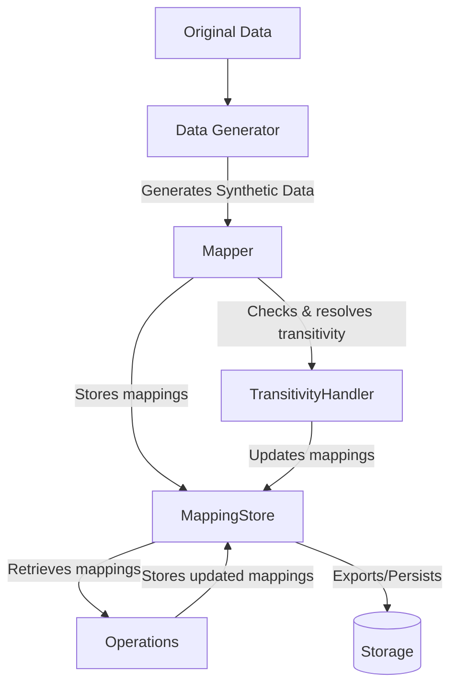

# MappingStore Module Documentation

## Overview

The `MappingStore` class provides a comprehensive solution for storing, managing, and persisting mappings between original and synthetic values in the data anonymization process. It is a fundamental component of the `fake_data` package, designed to maintain consistent value transformations across datasets.

## Purpose

The primary purpose of `MappingStore` is to serve as a persistent and consistent repository of value mappings to ensure:

1. **Consistency**: The same original value always maps to the same synthetic value across multiple operations
2. **Bidirectionality**: Support for both forward (original → synthetic) and reverse (synthetic → original) lookups
3. **Persistence**: Ability to save mappings to disk and reload them for future runs
4. **Incremental Updates**: Support for updating existing mappings with new data

### MappingStore vs. PRGN

The `MappingStore` approach is an alternative to the PRGN (Pseudo-Random Generation) method:

|Feature|MappingStore|PRGN|
|---|---|---|
|**Storage**|Explicit storage of all mappings|Algorithmic generation (no storage)|
|**Memory Usage**|Higher (proportional to dataset size)|Lower (constant)|
|**Flexibility**|High (mappings can be manually adjusted)|Limited (algorithm-driven)|
|**Performance**|Fast lookups via dictionaries|Computational overhead for each generation|
|**Traceability**|Complete visibility of all mappings|No visibility (black box)|
|**Persistence**|Built-in serialization to different formats|Requires only seed preservation|
|**Transitivity Handling**|Explicit handling with `TransitivityHandler`|Not applicable|

Choose `MappingStore` when:

- You need visibility and traceability of mapping transformations
- You want to manually review or adjust mappings
- You need to export mappings for compliance or documentation
- You need to merge mappings from different sources
- Complex transitivity relationships need to be managed

## Class Architecture

The `MappingStore` class maintains several internal data structures:

```
┌───────────────────┐     ┌───────────────────┐     ┌────────────────────┐
│   NameGenerator   │     │   OneToOneMapper  │     │  FieldOperation    │
│   (generators)    ├────►│   (mappers)       ├────►│  (operations)      │
└───────────────────┘     └─────────┬─────────┘     └──────────┬─────────┘
                                    │                          │
                                    │ uses                     │ uses
                                    │                          │
                                    ▼                          ▼
                          ┌──────────────────────────────────────────────┐
                          │             MappingStore                     │
                          │ ┌─────────────────────┐ ┌──────────────────┐ │
                          │ │       mappings      │ │     metadata     │ │
                          │ │ {                   │ │ {                │ │
                          │ │   "field1": {       │ │   "version":     │ │
                          │ │     "orig1": "syn1",│ │   "fields": {    │ │
                          │ │     "orig2": "syn2" │ │     "field1": {  │ │
                          │ │   },                │ │       "count":   │ │
                          │ │   "field2": {...}   │ │       "type":    │ │
                          │ │ }                   │ │     }            │ │
                          │ └─────────────────────┘ │   },             │ │
                          │                         │   "created_at":  │ │
                          │ ┌─────────────────────┐ │   "updated_at":  │ │
                          │ │   reverse_mappings  │ └──────────────────┘ │
                          │ │ {                   │                      │
                          │ │   "field1": {       │ ┌─────────────────┐  │
                          │ │     "syn1": "orig1",│ │ transitivity    │  │
                          │ │     "syn2": "orig2" │ │ {               │  │
                          │ │   },                │ │   "field1": {   │  │
                          │ │   "field2": {...}   │ │     "orig1": F, │  │
                          │ │ }                   │ │     "orig2": T  │  │
                          │ └─────────────────────┘ │   }             │  │
                          │                         └─────────────────┘  │
                          └────────────────┬─────────────────────────────┘
                                           │
                                           │ uses
                                           ▼
                          ┌─────────────────────────────────────────────┐
                          │          TransitivityHandler                │
                          │                                             │
                          │  * find_mapping_chain()                     │
                          │  * find_cycles()                            │
                          │  * resolve_cycle()                          │
                          │  * analyze_mapping_relationships()          │
                          │  * fix_transitive_mappings()                │
                          │                                             │
                          └─────────────────────────────────────────────┘
```

- **mappings**: Dictionary of field-based original → synthetic mappings
- **reverse_mappings**: Dictionary of field-based synthetic → original mappings
- **transitivity_markers**: Dictionary tracking which mappings are transitive
- **metadata**: Information about the mappings (creation date, version, field statistics)

## Data Flow



## Method Reference

### Initialization and Management

|Method|Parameters|Return Type|Description|
|---|---|---|---|
|`__init__`|None|None|Initializes an empty mapping store|
|`_update_timestamps`|None|None|Updates the creation and modification timestamps in metadata|
|`clear_field`|`field_name: str`|None|Removes all mappings for a specific field|
|`clear_all`|None|None|Removes all mappings from the store|

### Basic Mapping Operations

|Method|Parameters|Return Type|Description|
|---|---|---|---|
|`add_mapping`|`field_name: str, original: Any, synthetic: Any, is_transitive: bool = False`|None|Adds a new mapping|
|`update_mapping`|`field_name: str, original: Any, new_synthetic: Any, update_transitivity: bool = True`|bool|Updates an existing mapping with a new synthetic value|
|`get_mapping`|`field_name: str, original: Any`|Optional[Any]|Retrieves the synthetic value for an original value|
|`restore_original`|`field_name: str, synthetic: Any`|Optional[Any]|Retrieves the original value for a synthetic value|
|`remove_mapping`|`field_name: str, original: Any`|bool|Removes a mapping|
|`get_field_mappings`|`field_name: str`|Dict[Any, Any]|Gets all mappings for a specific field|

### Transitivity Management

|Method|Parameters|Return Type|Description|
|---|---|---|---|
|`is_transitive`|`field_name: str, original: Any`|bool|Checks if a mapping is marked as transitive|
|`mark_as_transitive`|`field_name: str, original: Any`|bool|Explicitly marks a mapping as transitive|

### Statistics and Analytics

|Method|Parameters|Return Type|Description|
|---|---|---|---|
|`get_field_stats`|`field_name: str`|Dict[str, Any]|Gets statistics for a specific field|
|`get_all_stats`|None|Dict[str, Any]|Gets statistics for all fields|

### Serialization and Persistence

|Method|Parameters|Return Type|Description|
|---|---|---|---|
|`save_json`|`path: Union[str, Path], io_module=None`|None|Saves mappings to a JSON file|
|`load_json`|`path: Union[str, Path], io_module=None`|None|Loads mappings from a JSON file|
|`update_from_json`|`path: Union[str, Path], overwrite_existing: bool = True, fields_to_update: Optional[List[str]] = None, io_module=None`|Dict[str, int]|Incrementally updates mappings from a JSON file|
|`save_pickle`|`path: Union[str, Path]`|None|Saves mappings to a pickle file|
|`load_pickle`|`path: Union[str, Path]`|None|Loads mappings from a pickle file|
|`save_csv`|`path: Union[str, Path]`|None|Saves mappings to a CSV file|
|`load_csv`|`path: Union[str, Path], overwrite_existing: bool = True, fields_to_load: Optional[List[str]] = None`|Dict[str, int]|Loads mappings from a CSV file|
|`save`|`path: Union[str, Path], format: str = "json"`|None|Generic method to save mappings in a specified format|
|`load`|`path: Union[str, Path], format: str = None, overwrite_existing: bool = True, fields_to_load: Optional[List[str]] = None`|Dict[str, int]|Generic method to load mappings from a specified format|

### DataFrame Conversion

|Method|Parameters|Return Type|Description|
|---|---|---|---|
|`to_dataframe`|`field_name: str`|pd.DataFrame|Converts field mappings to a pandas DataFrame|
|`from_dataframe`|`df: pd.DataFrame, field_name: str, original_col: str = "original", synthetic_col: str = "synthetic", transitive_col: str = "is_transitive", overwrite_existing: bool = True`|int|Loads mappings from a pandas DataFrame|

### Store Merging

|Method|Parameters|Return Type|Description|
|---|---|---|---|
|`merge_with_store`|`other_store: 'MappingStore', overwrite_existing: bool = True, fields_to_merge: Optional[List[str]] = None`|Dict[str, int]|Merges mappings from another MappingStore|

## Serialization Formats

The `MappingStore` supports multiple serialization formats:

### JSON Structure

```json
{
  "metadata": {
    "version": "1.0",
    "fields": {
      "first_name": {
        "count": 1000,
        "type": "str"
      },
      "last_name": {
        "count": 800,
        "type": "str"
      }
    },
    "created_at": "2023-05-01T10:30:45",
    "updated_at": "2023-05-02T15:20:10"
  },
  "mappings": {
    "first_name": [
      {
        "original": "John",
        "synthetic": "Robert",
        "is_transitive": false
      },
      {
        "original": "Jane",
        "synthetic": "Mary", 
        "is_transitive": false
      }
    ],
    "last_name": [
      {
        "original": "Smith",
        "synthetic": "Johnson",
        "is_transitive": false
      }
    ]
  }
}
```

### CSV Format

The CSV format contains the following columns:

- `field_name`: The field identifier
- `original`: The original value
- `synthetic`: The corresponding synthetic value
- `is_transitive`: Boolean flag indicating transitivity
- `original_type`: The data type of the original value

## Usage Examples

### Basic Usage

```python
from pamola_core.fake_data.commons.mapping_store import MappingStore

# Create a new mapping store
store = MappingStore()

# Add mappings for first names
store.add_mapping("first_name", "John", "Robert")
store.add_mapping("first_name", "Jane", "Mary")

# Add mappings for last names
store.add_mapping("last_name", "Smith", "Johnson")
store.add_mapping("last_name", "Doe", "Williams")

# Look up mappings
john_fake = store.get_mapping("first_name", "John")  # Returns "Robert"
smith_fake = store.get_mapping("last_name", "Smith")  # Returns "Johnson"

# Reverse lookup
original_first = store.restore_original("first_name", "Robert")  # Returns "John"
```

### Saving and Loading

```python
# Save to JSON
store.save_json("mappings.json")

# Load from JSON
new_store = MappingStore()
new_store.load_json("mappings.json")

# Save to CSV
store.save_csv("mappings.csv")

# Update from CSV incrementally
update_stats = store.load_csv("new_mappings.csv", overwrite_existing=False)
print(f"Added {sum(update_stats.values())} new mappings")
```

### Merging Stores

```python
# Create two mapping stores
store1 = MappingStore()
store1.add_mapping("first_name", "John", "Robert")

store2 = MappingStore()
store2.add_mapping("first_name", "Jane", "Mary")
store2.add_mapping("last_name", "Smith", "Johnson")

# Merge store2 into store1
merge_stats = store1.merge_with_store(store2)
print(f"Merged {sum(merge_stats.values())} mappings")
```

### Working with DataFrames

```python
import pandas as pd

# Convert mappings to DataFrame
df = store.to_dataframe("first_name")

# Manipulate the DataFrame (e.g., filter, transform)
filtered_df = df[df["original"].str.startswith("J")]

# Create a new mapping store from DataFrame
new_store = MappingStore()
new_store.from_dataframe(filtered_df, "first_name")
```

## Performance Considerations

The `MappingStore` is optimized for:

- Fast lookups (O(1) for both get_mapping and restore_original)
- Efficient batch operations
- Memory-efficient storage

For large datasets:

1. Consider using CSV or pickle formats for storage efficiency
2. Use incremental updates (`update_from_json`, `load_csv` with `overwrite_existing=False`)
3. Clear unused fields with `clear_field` when no longer needed
4. Use batch operations when possible

## Integration with TransitivityHandler

The `MappingStore` is designed to work seamlessly with the `TransitivityHandler` class to:

- Mark mappings as transitive
- Detect and resolve mapping cycles
- Maintain consistent mapping chains

See the `TransitivityHandler` documentation for details on how these components interact.

## Error Handling

The `MappingStore` includes robust error handling:

- Consistent return values (None for not found, etc.)
- Boolean return flags for success/failure
- Diagnostic logging using the `pamola_core_logging` module
- Graceful handling of missing or corrupted files