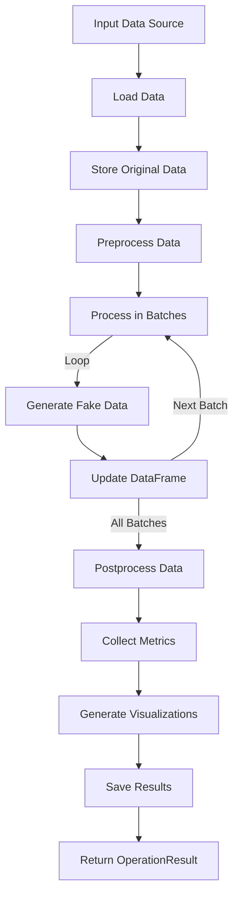
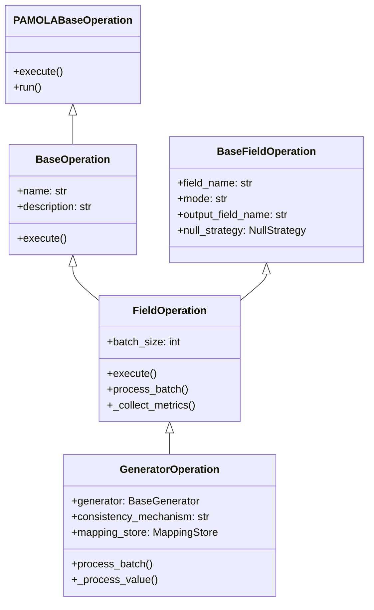

# `operations.py` Module Documentation

## Overview

The `operations.py` module is a pamola core component of the fake data generation system, providing standardized operation classes that integrate with PAMOLA.CORE's operation system to generate synthetic data while maintaining statistical properties of the original data.

This module implements the operational logic for field-level data processing, allowing for replacing or enriching data with synthetic values. It integrates with metrics collection, visualization, and progress reporting systems.

## Key Features

- Batch processing of large datasets
- Multiple operation modes (REPLACE, ENRICH)
- NULL value handling strategies
- Consistent data generation with mapping or pseudo-random mechanisms
- Comprehensive metrics collection and visualization
- Progress tracking and reporting

## Architecture

### Module Position in Package Structure

```
pamola_core/
├── utils/
│   ├── io.py
│   ├── progress.py 
│   ├── visualization.py
│   └── ops/
│       ├── op_base.py
│       ├── op_registry.py
│       └── op_result.py
└── fake_data/
    ├── commons/
    │   ├── base.py
    │   ├── metrics.py          # Metrics collection logic
    │   └── operations.py       # This module
    ├── generators/             # Field-specific generators
    └── dictionaries/           # Data dictionaries
```

### Data Flow



### Class Inheritance



## Pamola Core Classes

### BaseOperation

Base class for fake data operations that integrates with PAMOLA.CORE's operation system.

### FieldOperation

Base class for operations on specific fields, inherited from both `BaseFieldOperation` and `BaseOperation`. Handles field-level data processing with batch support.

### GeneratorOperation

Operation that uses a generator to create fake data for specific fields. Supports different consistency mechanisms to maintain relationships between original and synthetic data.

## Key Functions

| Class | Method | Description | Parameters | Return |
|-------|--------|-------------|------------|--------|
| BaseOperation | __init__ | Initializes the base operation | None | None |
| BaseOperation | execute | Executes the operation | data_source, task_dir, reporter, **kwargs | OperationResult |
| FieldOperation | __init__ | Initializes a field operation | field_name, mode, output_field_name, batch_size, null_strategy | None |
| FieldOperation | execute | Executes the field operation | data_source, task_dir, reporter, **kwargs | OperationResult |
| FieldOperation | _load_data | Loads data from source | data_source | pd.DataFrame |
| FieldOperation | _save_result | Saves result to a file | df, output_dir | Path |
| FieldOperation | _save_metrics | Saves metrics to a file | metrics, task_dir | Path |
| FieldOperation | _collect_metrics | Collects operation metrics | df | Dict[str, Any] |
| FieldOperation | process_batch | Processes a batch of data | batch | pd.DataFrame |
| GeneratorOperation | __init__ | Initializes generator operation | field_name, generator, mode, ... | None |
| GeneratorOperation | process_batch | Processes batch with generator | batch | pd.DataFrame |
| GeneratorOperation | _process_value | Processes single value | value | Any |
| GeneratorOperation | _collect_metrics | Collects generator-specific metrics | df | Dict[str, Any] |

## Operation Modes

| Mode | Description |
|------|-------------|
| REPLACE | Replaces original values with synthetic ones in the same field |
| ENRICH | Adds synthetic values in a new field, preserving the original data |

## NULL Handling Strategies

| Strategy | Description |
|----------|-------------|
| PRESERVE | Keep NULL values as NULL in the output |
| REPLACE | Replace NULL values with synthetic data |
| EXCLUDE | Filter out records with NULL values |
| ERROR | Raise an error if NULL values are encountered |

## Consistency Mechanisms

| Mechanism | Description |
|-----------|-------------|
| prgn | Uses pseudo-random number generators to create consistent mappings |
| mapping | Explicitly stores and reuses mappings between original and synthetic values |

## Examples

### Basic Field Operation

```python
# Creating a field operation for a name field
from pamola_core.fake_data.commons.base import NullStrategy
from pamola_core.fake_data.base_generator_op import GeneratorOperation

class FakeNameOperation(GeneratorOperation):
    def __init__(self, field_name="name"):
        super().__init__(
            field_name=field_name,
            mode="REPLACE",
            batch_size=5000,
            null_strategy=NullStrategy.PRESERVE
        )
    
    def process_batch(self, batch):
        # Implementation of batch processing
        return batch

# Using the operation
operation = FakeNameOperation("full_name")
result = operation.execute(df, Path("./task"), reporter)
```

### Using Generator Operation

```python
# Creating and using a generator operation
from pamola_core.fake_data.base_generator_op import GeneratorOperation
from pamola_core.fake_data.generators.name_generator import NameGenerator

# Create a generator
name_generator = NameGenerator(locale="en_US")

# Create operation
operation = GeneratorOperation(
    field_name="full_name",
    generator=name_generator,
    mode="ENRICH",
    output_field_name="synthetic_name",
    consistency_mechanism="mapping"
)

# Execute operation
result = operation.execute(df, Path("./task"), reporter)
```

### Registering Operations

```python
# Registering an operation with the registry
from pamola_core.utils.ops.op_registry import register
from pamola_core.fake_data.base_generator_op import GeneratorOperation
from pamola_core.fake_data.generators.email_generator import EmailGenerator

@register()
class EmailGeneratorOperation(GeneratorOperation):
    name = "email_generator"
    description = "Operation for generating fake email addresses"
    category = "fake_data"
    
    def __init__(self, field_name="email"):
        generator = EmailGenerator()
        super().__init__(
            field_name=field_name,
            generator=generator,
            mode="REPLACE"
        )
```

## Integration with Other Modules

- **metrics.py**: Collects detailed metrics on original and generated data
- **visualization.py**: Creates visual representations of metrics
- **io.py**: Handles data loading and saving
- **progress.py**: Tracks and displays operation progress
- **op_registry.py**: Registers operations for discovery and use

## Best Practices

1. Process large datasets in batches to manage memory usage
2. Store original data for comparison and metrics calculation
3. Use appropriate NULL handling strategy based on data requirements
4. Select consistency mechanism based on need for deterministic mapping
5. Collect comprehensive metrics for quality assurance
6. Use visualizations to verify data distributions

## Error Handling

The module provides comprehensive error handling with:
- Validation of input parameters
- Checking field existence in data sources
- Proper handling of NULL values based on selected strategy
- Exception handling with detailed logging
- Appropriate error reporting through OperationResult