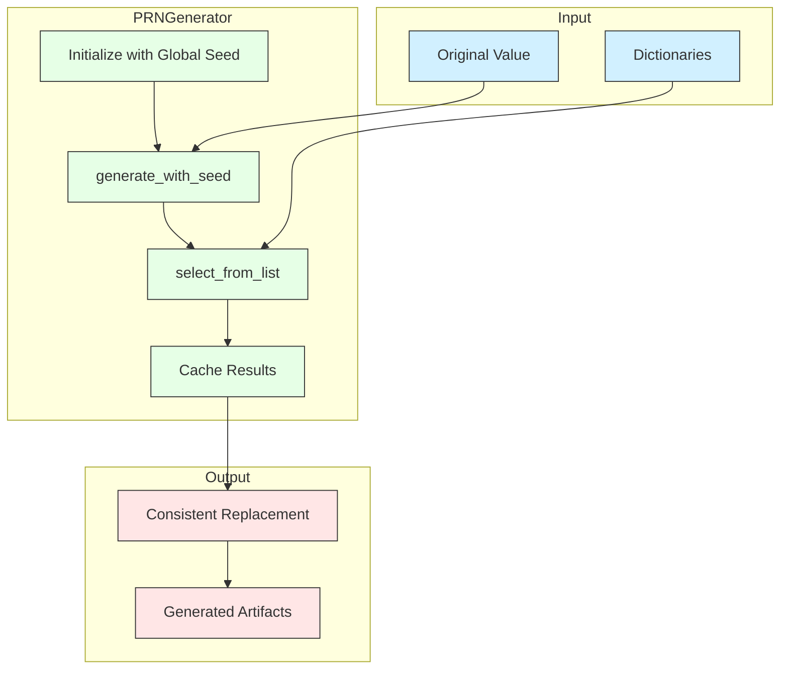

# PRGN Module Documentation

## 1. Overview

The `prgn` (Pseudo-Random Generation) module is a specialized component for deterministic fake data generation. It ensures that data transformation is both consistent and reproducible across multiple runs while maintaining the appearance of randomness.

### 1.1 Purpose

The primary purpose of this module is to provide a foundation for deterministic transformations, particularly for PII (Personally Identifiable Information) anonymization. By using deterministic methods, the module ensures that:

1. The same input value always produces the same output value 
2. The transformation appears random to observers
3. The process is reproducible given the same seed/salt parameters
4. Data relationships can be preserved during anonymization

### 1.2 Advantages Over Direct Mapping

The PRGN approach offers several advantages over traditional mapping tables:

1. **Memory Efficiency**: Does not require storing full mapping tables for large datasets
2. **Scalability**: Can handle unlimited datasets with minimal resources
3. **Consistency**: The same input always generates the same output, even across different processing batches
4. **Security**: Using cryptographic methods makes it difficult to reverse-engineer original values
5. **Configurability**: Different contexts (using salts) can generate different mappings for the same data

## 2. Architecture

The module is built around the `PRNGenerator` class, which encapsulates the logic for deterministic value generation. It uses cryptographic hashing functions (primarily HMAC-SHA256) to generate deterministic values based on input values and configured seeds.

### 2.1 System Architecture

```
┌─────────────────────────────────────────────────────────────────┐
│                       fake_data Package                         │
└─────────────────────────────────────────────────────────────────┘
              ┌──────────┐                        ┌──────────┐
              │ commons  │                        │generators│
              └─────┬────┘                        └────┬─────┘
       ┌────────────┼────────────┐                     │
┌──────┴────────┐ ┌─┴────────┐ ┌─┴─────────┐    ┌──────┴─────────┐
│  dict_helpers │ │  prgn    │ │name_utils │    │NameGenerator   │
└───────────────┘ └──────────┘ └───────────┘    └────────────────┘
     │                │            │                 │
     │                │            │                 │
     ▼                ▼            ▼                 ▼
┌─────────────────────────────────────────────────────────────────┐
│                         operations                              │
└─────────────────────────────────────────────────────────────────┘
```

The `prgn` module serves as the deterministic "engine" powering the entire fake data generation pipeline:
- It relies on minimal external dependencies
- It provides the pamola core randomization services used by higher-level modules
- It works closely with `dict_helpers` for dictionary selection and `name_utils` for name processing

### 2.2 Data Flow



## 3. Key Components

### 3.1 PRNGenerator Class

The main class responsible for deterministic value generation.

#### Pamola Core Methods

| Method | Parameters | Return Type | Description |
|--------|------------|-------------|-------------|
| `__init__` | `global_seed`: Optional[Union[str, bytes, int]] | None | Initializes generator with global seed |
| `generate_with_seed` | `base_value`: Any<br>`salt`: Union[str, bytes, None]<br>`algorithm`: str | int | Generates a deterministic integer value |
| `get_random_by_value` | `base_value`: Any<br>`salt`: Optional[Union[str, bytes]] | random.Random | Gets a seeded random number generator |
| `select_from_list` | `items`: List[Any]<br>`base_value`: Any<br>`salt`: Optional[Union[str, bytes]] | Any | Deterministically selects an item from a list |
| `select_with_mapping` | `mapping`: Dict[Any, Any]<br>`base_value`: Any<br>`fallback_generator`: Optional[Callable[[Any], Any]]<br>`salt`: Optional[Union[str, bytes]] | Any | Uses existing mappings or generates new ones |
| `shuffle_list` | `items`: List[Any]<br>`base_value`: Any<br>`salt`: Optional[Union[str, bytes]] | List[Any] | Deterministically shuffles a list |
| `select_name_by_gender_region` | `names_dict`: Dict[str, Dict[str, List[str]]]<br>`original_name`: str<br>`gender`: str<br>`region`: str<br>`salt`: Optional[str] | str | Specialized method for name selection |

### 3.2 Standalone Functions

| Function                             | Parameters                                                                                                                                       | Return Type | Description                                            |
| ------------------------------------ | ------------------------------------------------------------------------------------------------------------------------------------------------ | ----------- | ------------------------------------------------------ |
| `generate_deterministic_replacement` | `original_value`: Any<br>`replacement_list`: List[Any]<br>`global_seed`: Optional[Union[str, bytes, int]]<br>`salt`: Optional[Union[str, bytes]] | Any         | Utility function for simple replacements               |
| `generate_seed_from_key`             | `key`: Union[str, bytes]<br>`context`: str                                                                                                       | int         | Generates a seed value from a key and optional context |

## 4. Algorithm Options

The module supports multiple algorithm options for different requirements:

| Algorithm       | Identifier | Characteristics                               | Use Case                                  |
| --------------- | ---------- | --------------------------------------------- | ----------------------------------------- |
| **HMAC-SHA256** | `"hmac"`   | Most secure, cryptographically strong, slower | When security is paramount, for PII data  |
| **Simple Hash** | `"simple"` | Medium security, faster processing            | General purpose anonymization             |
| **Fast Hash**   | `"fast"`   | Optimized for speed, less secure              | Large datasets, non-sensitive information |

### 4.1 Algorithm Details

1. **HMAC** - Uses cryptographic HMAC with SHA-256 to generate values
   - Resistant to brute-force attacks
   - Provides strong guarantee of determinism
   - Higher computational cost

2. **Simple** - Uses XOR bitwise operations with seed values
   - Medium security level
   - Good balance between performance and security
   - Simple implementation reduces bugs

3. **Fast** - Based on djb2 hash algorithm
   - Extremely fast computation
   - Lower security threshold
   - Suitable for datasets where performance is critical

## 5. Usage Examples

### 5.1 Basic Replacement

```python
from pamola_core.fake_data.commons import prgn

# Create a generator with a project-specific seed
generator = prgn.PRNGenerator(global_seed="project-alpha-2023")

# Replace a name from a dictionary of possible replacements
new_name = generator.select_from_list(
    ["Alice", "Bob", "Charlie", "David"],
    "John",  # Original value
    salt="names-v1"  # Versioning/contextualization salt
)
```

### 5.2 With Mapping Cache

```python
# Using the mapping features for performance
existing_mappings = {}  # Could be loaded from a cache

# Function that generates a value if not in mapping
def get_replacement(original):
    new_value = generator.select_from_list(replacement_list, original, salt="names")
    # Save to our mapping for future use
    existing_mappings[original] = new_value
    return new_value

# Get consistent replacement (from cache or generate new)
replacement = generator.select_with_mapping(
    existing_mappings,
    original_name,
    fallback_generator=get_replacement
)
```

### 5.3 For Russian Name Generation

```python
# For specialized name generation by gender and language
names_by_region_gender = {
    "ru": {
        "M": ["Александр", "Иван", "Сергей", "Михаил"],
        "F": ["Екатерина", "Анна", "Мария", "Ольга"]
    },
    "en": {
        "M": ["John", "Michael", "Robert", "William"],
        "F": ["Mary", "Jennifer", "Linda", "Elizabeth"]
    }
}

# Select a name appropriate to gender and region
new_russian_name = generator.select_name_by_gender_region(
    names_by_region_gender,
    "John",  # Original name
    gender="M",
    region="ru",  # Target language/region
    salt="translate-en-to-ru"
)
```

### 5.4 For Vietnamese Name Generation

```python
# Vietnamese names are structured differently (Last Middle First)
vietnamese_names = {
    "vn": {
        "M": [
            "Nguyễn Văn An", "Trần Minh Duy", "Lê Quốc Việt", 
            "Phạm Đức Duy", "Hoàng Văn Minh", "Vũ Quang Hà"
        ],
        "F": [
            "Nguyễn Thị Lan", "Trần Thị Mai", "Lê Thị Hương", 
            "Phạm Thị Hoa", "Hoàng Thị Nhung", "Vũ Thị Thủy"
        ]
    }
}

# Transform an English name to Vietnamese
vietnamese_name = generator.select_name_by_gender_region(
    vietnamese_names,
    "Jennifer Smith",  # Original name
    gender="F",
    region="vn",
    salt="translate-en-to-vn"
)
# Example output: "Nguyễn Thị Hương"

# You can also process Vietnamese names within Vietnamese
new_vn_name = generator.select_from_list(
    vietnamese_names["vn"]["M"],
    "Nguyễn Văn Anh",
    salt="anonymize-vietnamese"
)
# Example output: "Trần Minh Duy"
```

### 5.5 Complex Vietnamese Name Processing

```python
# Process Vietnamese name parts separately
vn_last_names = ["Nguyễn", "Trần", "Lê", "Phạm", "Hoàng", "Vũ", "Đặng", "Bùi"]
vn_male_middle = ["Văn", "Minh", "Quốc", "Đức", "Hoàng", "Quang", "Thanh"]
vn_female_middle = ["Thị", "Minh", "Thanh", "Ngọc", "Thu", "Phương"]
vn_male_first = ["An", "Duy", "Việt", "Hà", "Minh", "Khang", "Tuấn"]
vn_female_first = ["Lan", "Mai", "Hương", "Hoa", "Nhung", "Thủy", "Linh"]

# Generate a new full Vietnamese name by components
def generate_vn_name(original_name, gender):
    parts = original_name.split()
    # Get a deterministic generator based on the original name
    rng = generator.get_random_by_value(original_name, salt="vn-names")
    
    # Select components deterministically
    if gender == "M":
        last = generator.select_from_list(vn_last_names, parts[0], salt="vn-last")
        middle = generator.select_from_list(vn_male_middle, 
                   parts[1] if len(parts) > 1 else parts[0], salt="vn-middle")
        first = generator.select_from_list(vn_male_first, 
                   parts[-1], salt="vn-first")
    else:
        last = generator.select_from_list(vn_last_names, parts[0], salt="vn-last")
        middle = generator.select_from_list(vn_female_middle, 
                    parts[1] if len(parts) > 1 else parts[0], salt="vn-middle")
        first = generator.select_from_list(vn_female_first, 
                    parts[-1], salt="vn-first")
                    
    return f"{last} {middle} {first}"

# Example usage
vn_female = generate_vn_name("Nguyễn Thị Lan", "F")
# Example output: "Hoàng Ngọc Hương"
```

## 6. Additional Viewpoints
### 6.1 Best Practices

1. **Use Consistent Seeds**: Always use the same global seed within a project
2. **Version Salts**: Include version information in salts to allow controlled updates
3. **Algorithm Selection**: Use HMAC for security, fast for performance
4. **Cache Results**: For large datasets, cache results to avoid recomputation
5. **Salt Contextualization**: Use different salts for different domains (names, addresses, etc.)
6. **Input Normalization**: Normalize inputs (case, formatting) for consistent results

### 6.2 Integration Points

The PRGN module is designed to integrate with:

- `dict_helpers.py`: For loading and managing dictionaries of replacement values
- `name_utils.py`: For specialized name processing
- `NameGenerator`: For generating realistic fake names
- Field operations: For processing entire datasets with anonymization

This module serves as the deterministic "engine" underlying consistent data transformations throughout the fake data generation pipeline.

### 6.3. Performance Considerations

| Algorithm | Items/sec (approx) | Memory Usage | Security Level |
|-----------|-------------------|--------------|----------------|
| HMAC      | 100,000           | Low          | High           |
| Simple    | 500,000           | Low          | Medium         |
| Fast      | 1,000,000         | Low          | Lower          |

For most anonymization tasks, the performance is more than adequate. For extremely large datasets (millions of records), consider:

1. Using the "fast" algorithm
2. Implementing caching of results
3. Processing in batches
4. Pre-generating common replacements

### 6.4 Error Handling

The module includes robust error handling:

- Empty list checks
- Type validation
- Fallback strategies
- Diagnostic logging

In production environments, all methods will return fallback values rather than raising exceptions to prevent pipeline failures.