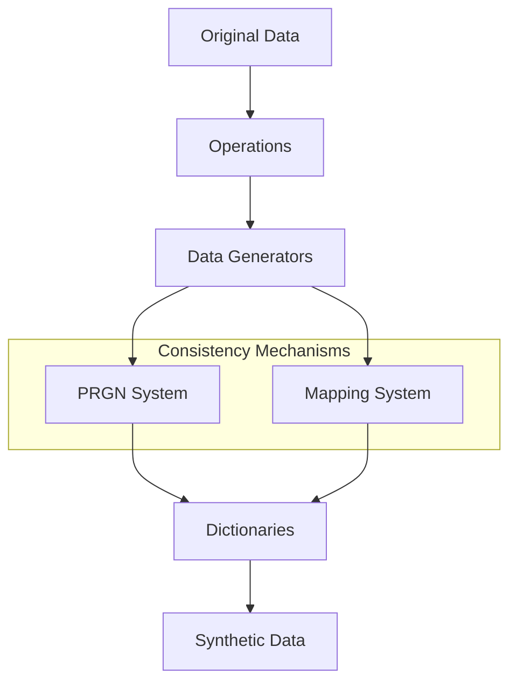

# PAMOLA.CORE Fake Data Generation System

## 1 Introduction

The `fake_data` package is a comprehensive framework for generating synthetic data while preserving statistical properties and relationships of the original dataset. It provides tools for anonymization, data transformation, and validation to ensure privacy protection while maintaining data utility.

The package addresses several key challenges in data anonymization:

1. **Privacy Protection**: Replacing personally identifiable information (PII) with synthetic alternatives
2. **Statistical Fidelity**: Maintaining statistical properties and relationships in the data
3. **Consistency**: Ensuring consistent transformations across multiple datasets
4. **Performance**: Efficiently processing large datasets with minimal memory overhead
5. **Compliance**: Supporting privacy regulations like GDPR, CCPA, and HIPAA

### 1.1 Architecture Overview

The `fake_data` package consists of several interconnected components:

```
pamola_core/fake_data/
├── operations.py        # Integration with PAMOLA operation system
├── generators/          # Data generators for different types
├── commons/             # Common utilities and helpers
│   ├── dict_helpers.py  # Dictionary management
│   ├── prgn.py          # Pseudo-Random Generation mechanism
│   └── validators.py    # Data validation
├── mapping_store.py     # Storage for value mappings
├── mappers/             # Mapping implementations
└── dictionaries/        # Embedded dictionaries
```

These components work together in a hierarchical structure to provide a flexible and powerful system for data anonymization.

### 1.2 Component Interaction

The interaction between components follows a clear hierarchical flow:



Key points of this architecture:

1. **Operations** orchestrate the overall process, handling data loading, saving, progress tracking, and metrics collection
2. **Generators** specialize in creating synthetic data for specific types (names, emails, etc.)
3. **Consistency Mechanisms** (PRGN, Mapping) ensure deterministic and repeatable transformations
4. **Dictionaries** provide the actual replacement values for synthetic data generation

## 2 Pamola Core Components

### 2.1 Data Generators

The package includes specialized generators for different types of data:

- **NameGenerator**: For personal names with gender and language awareness
- **EmailGenerator**: For email addresses with domain preservation
- **PhoneGenerator**: For phone numbers with regional formats
- **AddressGenerator**: For addresses with geographic consistency
- **OrganizationGenerator**: For organization names

Generators are responsible for:

- Creating statistically plausible synthetic data
- Ensuring proper formatting
- Maintaining linguistic and cultural characteristics
- Leveraging consistency mechanisms (PRGN or Mapping)

```python
# Example of using a name generator
from pamola_core.fake_data.generators.name import NameGenerator

name_generator = NameGenerator(
    language="en",
    gender_aware=True,
    use_deterministic=True,
    seed="project-seed-2023"
)

# Generate a single name
fake_name = name_generator.generate_like("John", gender="M")

# Generate a batch of names
fake_names = name_generator.generate(count=100, gender="F")
```

### 2.2 Dictionary Subsystem

The dictionary subsystem provides infrastructure for managing, loading, and manipulating reference data used in fake data generation:

- **External dictionaries**: Loaded from files in various formats (TXT, CSV, JSON)
- **Embedded dictionaries**: Built-in fallback dictionaries for various data types
- **Dictionary management**: Caching, validation, and transformation of dictionary data

```python
# Loading a dictionary
from pamola_core.fake_data.commons import dict_helpers

names = dict_helpers.load_dictionary_from_text("path/to/names.txt")

# Using embedded dictionaries
from pamola_core.fake_data.dictionaries import names as name_dicts
russian_male_names = name_dicts.get_names(language="ru", gender="M", name_type="first_name")
```

### 2.3 Operations and PAMOLA Integration

The package integrates with the PAMOLA operation system through specialized operation classes:

- **BaseOperation**: Pamola Core integration with the PAMOLA operation framework
- **FieldOperation**: Operations for processing specific fields
- **GeneratorOperation**: Operations using generators for data transformation

Operations handle:

- Data loading and saving
- Progress tracking
- Batch processing
- Metrics collection
- Artifact generation

```python
# Using operations
from pamola_core.fake_data.operations import GeneratorOperation
from pamola_core.fake_data.generators.name import NameGenerator

name_generator = NameGenerator(language="en", gender_aware=True)
operation = GeneratorOperation(
    field_name="first_name",
    generator=name_generator,
    mode="ENRICH",
    output_field_name="anonymized_first_name"
)

result = operation.execute(
    data_source=df,
    task_dir=Path("./task_dir"),
    reporter=progress_reporter
)
```

## 3 Consistency Mechanisms

The `fake_data` package provides two complementary mechanisms to ensure consistent and deterministic transformations:

### 3.1 Pseudo-Random Generation (PRGN) System

The PRGN system provides algorithmic determinism without explicitly storing mappings. It uses cryptographic techniques to generate consistent outputs for the same inputs.

#### Key Features

- **Memory Efficiency**: Uses minimal memory regardless of dataset size
- **Deterministic Output**: Same input always produces the same output given the same seed
- **Contextual Control**: Supports "salting" for domain-specific transformations
- **Algorithm Options**: Multiple algorithms for different security/performance needs

```python
# Using the PRGN system
from pamola_core.fake_data.commons.prgn import PRNGenerator
from pamola_core.fake_data.commons import dict_helpers

# Create a generator with a seed for reproducibility
generator = PRNGenerator(global_seed="project-seed-2023")

# Load a dictionary of replacement values
name_list = dict_helpers.load_dictionary("names_en_male.txt")

# Generate a deterministic replacement
fake_name = generator.select_from_list(name_list, "John", salt="names-v1")
```

#### When to Use PRGN

- For very large datasets where memory is a concern
- When simplicity and performance are priorities
- When only determinism is needed without storage of mappings
- For stateless operation where only the algorithm and seed need to be preserved

### 3.2 Mapping System

The Mapping system provides explicit storage of correspondence between original and synthetic values, with management of complex relationships.

#### Key Features

- **Explicit Storage**: Complete visibility of all transformations
- **Bidirectional Lookups**: Both forward and reverse mapping capabilities
- **Transitivity Handling**: Management of complex mapping chains and relationships
- **Persistence Options**: Save and load mappings in various formats (JSON, CSV, pickle)

```python
# Using the Mapping system
from pamola_core.fake_data.mappers import OneToOneMapper
from pamola_core.fake_data.commons.mapping_store import MappingStore

# Create a storage for mappings
mapping_store = MappingStore()

# Create a mapper for a specific field
mapper = OneToOneMapper(
    field_name="first_name",
    mapping_store=mapping_store
)

# Generate and store a mapping
fake_name = mapper.map("John", gender="M")

# Retrieve the original value
original_name = mapper.restore(fake_name)  # Returns "John"

# Save mappings for future use
mapping_store.save_json("mappings.json")
```

#### When to Use Mapping

- When auditability and transparency are required
- For complex relationships between data elements
- When mappings need to be manually reviewed or adjusted
- When mappings need to be persisted across sessions
- For regulatory compliance requiring documentation of transformations

### 3.3 Integration of Consistency Mechanisms with Generators

Data generators can leverage either consistency mechanism based on requirements:

```python
# Generator using PRGN
from pamola_core.fake_data.generators.name import NameGenerator
from pamola_core.fake_data.commons.prgn import PRNGenerator

prgn_generator = PRNGenerator(global_seed="project-seed-2023")
name_generator = NameGenerator(
    prgn_generator=prgn_generator,
    use_deterministic=True
)

# Generator using Mapping
from pamola_core.fake_data.commons.mapping_store import MappingStore
from pamola_core.fake_data.generators.name import NameGenerator

mapping_store = MappingStore()
name_generator = NameGenerator(
    mapping_store=mapping_store,
    use_mapping=True
)
```

### 3.4 Choosing the Right Consistency Mechanism

|Requirement|Recommended Mechanism|Rationale|
|---|---|---|
|Memory efficiency for large datasets|PRGN|Uses algorithmic generation instead of storing all mappings|
|Transparency and auditability|Mapping|Provides full visibility of all transformations|
|Complex relationship handling|Mapping|TransitivityHandler manages complex relationships|
|Simple, consistent replacements|PRGN|Provides straightforward deterministic generation|
|Manual adjustment of mappings|Mapping|Allows direct editing of mapping relationships|
|Portability (minimal dependencies)|PRGN|Requires only the algorithm and seed|
|Integration with existing mappings|Hybrid|Use both mechanisms in complementary ways|

## 4 Supporting Utilities

### 4.1 Faker Integration

The package provides optional integration with the external Faker library for additional data generation capabilities:

```python
# Using Faker integration (if available)
from pamola_core.fake_data.generators.faker_adapter import FakerGenerator

faker_gen = FakerGenerator(locale="en_US")
fake_address = faker_gen.generate_address()
```

### 4.2 Integration with Pamola Core Utilities

The `fake_data` package leverages several pamola core utilities from the `pamola_core.utils` package:

#### 4.2.1 IO Utilities (pamola_core.utils.io)

Used for:

- Loading and saving datasets
- Reading and writing dictionaries
- Managing file paths and directories
- Handling different file formats

```python
from pamola_core.utils import io

# Save data frame with IO utilities
io.write_dataframe_to_csv(df, output_path)
```

#### 4.2.2 Progress Tracking (pamola_core.utils.progress)

Used for:

- Reporting operation progress
- Providing estimated completion time
- Visualization of long-running processes

```python
from pamola_core.utils import progress

# Create and update progress bar
progress_bar = progress.ProgressBar(total=1000, description="Processing")
progress_bar.update(current=500, message="Halfway done")
```

#### 4.2.3 Logging (pamola_core.utils.logging)

Used for:

- Consistent log formatting
- Error reporting
- Debug information

```python
from pamola_core.utils import logging

logger = logging.get_logger("pamola_core.fake_data")
logger.info("Processing started")
```

#### 4.2.4 Visualization (pamola_core.utils.visualization)

Used for:

- Creating metrics visualizations
- Generating distribution plots
- Producing quality reports

```python
from pamola_core.utils import visualization

# Create a distribution plot
visualization.create_distribution_plot(
    original_values, 
    synthetic_values,
    title="Value Distribution Comparison"
)
```

## 5 General Requirements

### 5.1 Operation Requirements

All operations in the `fake_data` package must:

1. **Inherit from BaseOperation**: Extend the appropriate base operation class
2. **Register with op_registry**: Use the registration decorator for discovery
3. **Implement execute method**: Provide the main entry point
4. **Return OperationResult**: Return a properly structured result
5. **Collect metrics**: Gather and report quality metrics
6. **Support batch processing**: Process data in manageable chunks
7. **Track progress**: Update progress information
8. **Handle errors gracefully**: Proper error handling and reporting

### 5.2 Metrics and Quality Assessment

The package collects various metrics to assess the quality of synthetic data:

#### 5.2.1 Statistical Metrics

```json
{
    "original_data": {
        "total_records": 10000,
        "unique_values": 500,
        "value_distribution": {"A": 0.3, "B": 0.4, "C": 0.3}
    },
    "generated_data": {
        "total_records": 10000,
        "unique_values": 550,
        "value_distribution": {"X": 0.32, "Y": 0.38, "Z": 0.3}
    }
}
```

#### 5.2.2 Quality Metrics

```json
{
    "quality_metrics": {
        "distribution_similarity_score": 0.92,
        "format_compliance": 0.99,
        "linguistic_similarity": 0.87
    }
}
```

#### 5.2.3 Performance Metrics

```json
{
    "performance": {
        "generation_time": 0.5,
        "records_per_second": 20000,
        "memory_usage_mb": 45
    }
}
```

## 6 Usage Examples

### 6.1 Basic Anonymization Example

```python
from pathlib import Path
from pamola_core.fake_data.operations import GeneratorOperation
from pamola_core.fake_data.generators.name import NameGenerator

# Create a name generator
name_generator = NameGenerator(
    language="en",
    use_deterministic=True,
    seed="my-project-2023"
)

# Create and configure the operation
operation = GeneratorOperation(
    field_name="full_name",
    generator=name_generator,
    mode="REPLACE"
)

# Execute the operation
result = operation.execute(
    data_source=my_dataframe,
    task_dir=Path("./task_output"),
    reporter=my_progress_reporter
)

# Access the results
anonymized_df = result.output
print(f"Operation completed in {result.execution_time} seconds")
print(f"Quality score: {result.metrics['quality_metrics']['distribution_similarity_score']}")
```

### 6.2 Using Multiple Generators with Mapping Store

```python
from pathlib import Path
from pamola_core.fake_data.operations import GeneratorOperation
from pamola_core.fake_data.generators.name import NameGenerator
from pamola_core.fake_data.generators.email import EmailGenerator
from pamola_core.fake_data.commons.mapping_store import MappingStore

# Create a mapping store for consistency across fields
mapping_store = MappingStore()

# Create generators
name_generator = NameGenerator(mapping_store=mapping_store)
email_generator = EmailGenerator(mapping_store=mapping_store)

# Create operations
name_operation = GeneratorOperation(
    field_name="name",
    generator=name_generator,
    mode="REPLACE"
)

email_operation = GeneratorOperation(
    field_name="email",
    generator=email_generator,
    mode="REPLACE"
)

# Execute operations
name_result = name_operation.execute(
    data_source=my_dataframe,
    task_dir=Path("./task_output"),
    reporter=my_progress_reporter
)

email_result = email_operation.execute(
    data_source=name_result.output,
    task_dir=Path("./task_output"),
    reporter=my_progress_reporter
)

# Save mapping store for future use
mapping_store.save_json("./task_output/mappings.json")
```

## Conclusion

The `fake_data` package provides a comprehensive solution for generating synthetic data while preserving statistical properties and relationships. By leveraging specialized data generators, consistency mechanisms, and integration with PAMOLA.CORE infrastructure, it enables efficient and effective data anonymization for a wide range of use cases.

For detailed documentation on specific components, please refer to:

- `prgn.md`: Documentation on the Pseudo-Random Generation system
- `mapping_store.md`: Documentation on the mapping storage system
- `dictionaries.md`: Documentation on the dictionary subsystem