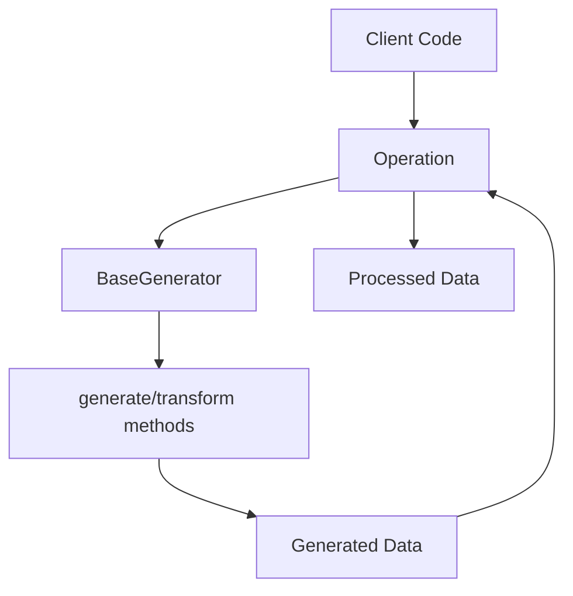

# BaseGenerator Module Documentation

## Overview

The `base_generator.py` module defines the abstract base class for all data generators in the fake_data system, providing a unified interface for synthetic data generation while preserving statistical properties of the original data.

## Module Location

```
pamola_core/fake_data/
├── generators/
│   ├── __init__.py
│   ├── base_generator.py    <- This module
│   ├── name.py
│   ├── email.py
│   ├── phone.py
│   └── ...
```

## Data Flow



## BaseGenerator Class

`BaseGenerator` is an abstract base class that defines a common interface for all data generators in the system. It establishes the contract that specific generators must follow, ensuring consistent behavior across different data types.

### Key Features

- Abstract interface for all generators
- Defines pamola core generation methods
- Consistent parameter handling
- Validation capabilities
- Transformation methods

## API Reference

### Constructor

| Method | Parameters | Description |
|--------|------------|-------------|
| `__init__(self, config=None)` | `config` (dict, optional): Configuration parameters | Initializes the generator with optional configuration |

### Pamola Core Methods

| Method | Parameters | Description |
|--------|------------|-------------|
| `generate(self, count, **params)` | `count` (int): Number of values to generate<br>`**params`: Additional parameters | Generates specified number of synthetic values |
| `generate_like(self, original_value, **params)` | `original_value` (str): Original value<br>`**params`: Additional parameters | Generates a synthetic value similar to the original one |
| `transform(self, values, **params)` | `values` (list): List of values<br>`**params`: Additional parameters | Transforms a list of original values into synthetic ones |
| `validate(self, value)` | `value` (str): Value to validate | Checks if a value is valid according to this generator's rules |

### Common Parameters

These parameters are used consistently across all generators derived from `BaseGenerator`:

| Parameter | Type | Description |
|-----------|------|-------------|
| `seed` | int | Seed for deterministic generation |
| `context_salt` | str | Salt for deterministic generation |
| `avoid_collision` | bool | Whether to avoid values already used for other originals |
| `preserve_format` | bool | Whether to preserve format of original value |
| `language` | str | Language for generation (e.g., "en", "ru", "vn") |

## Usage Examples

Since `BaseGenerator` is an abstract class, it can't be used directly. However, here's how to implement a concrete generator:

```python
from pamola_core.fake_data.generators.base_generator import BaseGenerator

class MyCustomGenerator(BaseGenerator):
    def __init__(self, config=None):
        super().__init__(config)
        # Initialize specific resources
        
    def generate(self, count, **params):
        # Implementation for generating multiple values
        results = []
        for _ in range(count):
            # Generate a value
            results.append(generated_value)
        return results
        
    def generate_like(self, original_value, **params):
        # Implementation to generate a value similar to original
        return generated_value
        
    def validate(self, value):
        # Implement validation logic
        return is_valid
```

## Extending BaseGenerator

When creating a new generator:

1. Inherit from `BaseGenerator`
2. Implement all abstract methods
3. Use the provided configuration mechanism
4. Maintain consistent parameter naming
5. Document generator-specific parameters

## Limitations

- `BaseGenerator` is not thread-safe by default
- Implementations should handle their own resource management
- Performance considerations should be addressed in concrete implementations

## Related Components

- **FieldOperation**: Operation class that uses generators to process data
- **MappingStore**: Stores mappings between original and synthetic values
- **PRNGenerator**: Used for deterministic generation

## Best Practices

1. Cache resource-intensive operations
2. Handle edge cases like empty values or invalid input
3. Provide meaningful error messages
4. Design for extensibility
5. Maintain consistent behavior across all generator implementations