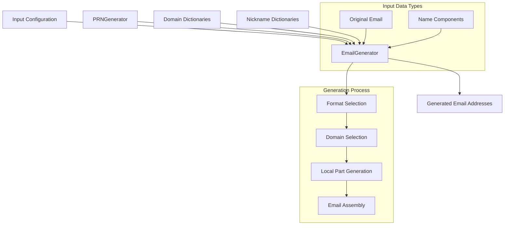

# EmailGenerator Documentation

## Purpose

The `EmailGenerator` is a component of the fake data generation system designed to create synthetic email addresses that preserve the statistical properties of original data. It generates realistic email addresses with customizable formats while supporting consistent mapping between original and synthetic values.

## Features

- Generation of email addresses in various formats (name-based, nickname-based)
- Domain categorization (common, business, educational)
- Customizable separators and number suffixes
- Preservation of domain distribution
- Deterministic generation using pseudo-random number generation
- Support for consistent mapping between original and synthetic emails
- Validation of email addresses against RFC standards
- Handling of name components to generate realistic name-based emails

## Architecture

### Module Position

The `EmailGenerator` is part of the `pamola_core.fake_data.generators` package in the PAMOLA CORE framework:

```
pamola_core/fake_data/
├── __init__.py
├── operations/
│   └── email_op.py        # Operation using EmailGenerator
├── commons/               # Common utilities
├── mapping_store.py       # Mapping storage used by generator
├── generators/
│   ├── __init__.py
│   ├── base_generator.py  # Parent class
│   └── email.py           # EmailGenerator implementation
└── dictionaries/
    └── domains.py         # Domain data used by generator
```

### Dependencies

- `BaseGenerator` - Parent class defining the generator interface
- `PRNGenerator` - Pseudo-random number generator for deterministic generation
- `dict_helpers` - Utilities for loading dictionaries
- Domains from the dictionary module

### Data Flow



## Key Methods and Parameters

### Constructor Parameters

| Parameter | Type | Description | Default |
|-----------|------|-------------|---------|
| `domains` | List[str] or str | List of domains or path to domain dictionary | `[]` |
| `format` | str | Format for email generation (name_surname, surname_name, nickname, existing_domain) | `None` |
| `format_ratio` | Dict[str, float] | Distribution of format usage | `{}` |
| `validate_source` | bool | Whether to validate source email addresses | `True` |
| `handle_invalid_email` | str | How to handle invalid emails (generate_new, keep_empty, generate_with_default_domain) | `'generate_new'` |
| `nicknames_dict` | str | Path to nickname dictionary | `None` |
| `max_length` | int | Maximum length for email address | `254` |
| `max_local_part_length` | int | Maximum length for local part | `64` |
| `max_domain_length` | int | Maximum length for domain part | `255` |
| `separator_options` | List[str] | List of separators to use | `['.', '_', '-', '']` |
| `number_suffix_probability` | float | Probability of adding number suffix | `0.4` |
| `preserve_domain_ratio` | float | Probability of preserving original domain | `0.5` |
| `business_domain_ratio` | float | Probability of using business domains | `0.2` |
| `key` | str | Key for PRGN | `None` |
| `context_salt` | str | Salt for PRGN | `None` |

### Main Methods

| Method | Description | Parameters | Returns |
|--------|-------------|------------|---------|
| `generate` | Generate specified number of synthetic emails | `count: int`, `**params` | `List[str]` |
| `generate_like` | Generate a synthetic email similar to original | `original_value: str`, `**params` | `str` |
| `transform` | Transform list of emails to synthetic ones | `values: List[str]`, `**params` | `List[str]` |
| `validate` | Check if a value is a valid email address | `value: str` | `bool` |
| `validate_email` | Validate an email address | `email: str` | `bool` |
| `extract_domain` | Extract domain from an email address | `email: str` | `Optional[str]` |
| `parse_email_format` | Determine the format of an email address | `email: str` | `str` |

### Helper Methods

| Method | Description |
|--------|-------------|
| `_load_domains` | Load domain list from configuration or default sources |
| `_load_nicknames` | Load nicknames from dictionary or generate default ones |
| `_categorize_domains` | Categorize domains into common, business, and educational |
| `_select_random_domain` | Select a random domain from available lists |
| `_generate_random_nickname` | Generate a random nickname |
| `_generate_random_separator` | Generate a random separator |
| `_generate_random_number` | Generate a random number suffix |
| `_sanitize_local_part` | Sanitize the local part of an email address |
| `_generate_from_name_components` | Generate email local part from name components |
| `_generate_nickname_format` | Generate local part using nickname format |
| `_select_format` | Select a format based on configured ratios |
| `_generate_email` | Generate a single email address based on parameters |
| `_parse_full_name` | Parse a full name into components based on format |

## Return Values

- `generate` - Returns a list of generated email addresses as strings
- `generate_like` - Returns a single generated email address as a string
- `transform` - Returns a list of transformed email addresses corresponding to input values
- `validate` - Returns True if the email is valid, False otherwise

## Usage Examples

### Basic Usage

```python
from pamola_core.fake_data.generators.email import EmailGenerator

# Create a basic email generator
generator = EmailGenerator()

# Generate a single email
email = generator.generate(1)[0]
print(f"Generated email: {email}")

# Generate an email similar to an original one
original_email = "john.doe@example.com"
new_email = generator.generate_like(original_email)
print(f"Original: {original_email} -> New: {new_email}")
```

### Advanced Configuration

```python
from pamola_core.fake_data.generators.email import EmailGenerator

# Create a configured email generator
config = {
    "domains": ["company.com", "corporate.org", "enterprise.net"],
    "format": "name_surname",
    "separator_options": [".", "_"],
    "number_suffix_probability": 0.3,
    "business_domain_ratio": 0.8,
    "key": "deterministic-key-123"
}
generator = EmailGenerator(config=config)

# Generate an email with name components
email = generator.generate_like(
    "original@example.com",
    first_name="Jane",
    last_name="Smith"
)
print(f"Generated email with name components: {email}")
```

### Batch Transformation

```python
from pamola_core.fake_data.generators.email import EmailGenerator

# Create a generator
generator = EmailGenerator()

# Transform a batch of emails
original_emails = [
    "user1@gmail.com",
    "johndoe@company.com",
    "jane.smith@university.edu"
]
transformed_emails = generator.transform(original_emails)

for orig, new in zip(original_emails, transformed_emails):
    print(f"{orig} -> {new}")
```

## Limitations

1. **Domain Availability**: The quality of generated emails depends on the available domain dictionaries. Limited dictionaries may result in less diverse email domains.

2. **Name Component Dependency**: Name-based email formats require first and last name components. Without these, it falls back to nickname-based generation.

3. **Validation Constraints**: Email validation follows RFC standards but may not catch all edge cases or non-standard but technically valid emails.

4. **Performance**: Deterministic generation using PRGN may be slower than non-deterministic methods.

5. **Memory Usage**: Loading large domain and nickname dictionaries can increase memory consumption.

6. **Quality Metrics**: The generator does not provide built-in quality assessment of the generated emails; this is handled by the operation class.

7. **No External API Integration**: The generator cannot verify domain existence or email deliverability through external services.

8. **Character Set Limitations**: Primarily designed for ASCII email addresses; may not fully support internationalized email addresses (IDNs).

9. **Separator Options**: Limited to common separators ('.', '_', '-'); does not support custom separators beyond the configured options.

10. **Language Constraints**: May not adequately handle transliteration when generating emails from non-Latin name components.