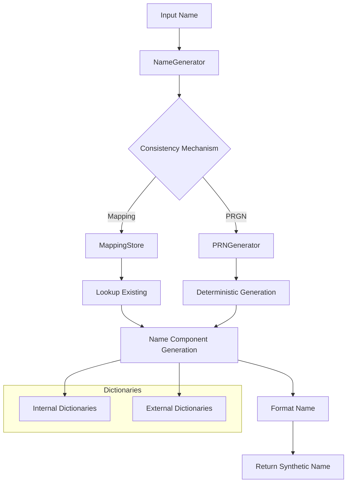

# NameGenerator Module Documentation

## Overview

The `names.py` module provides the `NameGenerator` class for generating synthetic personal names with support for different languages, gender awareness, and formatting options. It is designed to create realistic, culturally appropriate names while maintaining consistent mappings between original and synthetic data.

## Module Location

```
pamola_core/fake_data/
├── generators/
│   ├── __init__.py
│   ├── base_generator.py
│   ├── name.py            <- This module
│   ├── email.py
│   ├── phone.py
│   └── ...
```

## Data Flow



## NameGenerator Class

`NameGenerator` inherits from `BaseGenerator` and implements specialized functionality for personal name generation across different languages and cultures.

### Key Features

- Multi-language support (English, Russian, Vietnamese)
- Gender-aware name generation
- Multiple name formats (first-middle-last, etc.)
- Format and case control
- Dictionary-based generation with fallback
- Optional Faker integration
- Deterministic generation via PRGN
- Consistent replacements through mapping

## Configuration Parameters

| Parameter | Type | Default | Description |
|-----------|------|---------|-------------|
| `language` | str | "en" | Language code (e.g., "ru", "en", "vn") |
| `gender` | str | None | Gender code ("M", "F", None for neutral) |
| `format` | str | "FL" | Format for full names (e.g., "FML", "FL", "LF") |
| `use_faker` | bool | False | Whether to use Faker library if available |
| `case` | str | "title" | Case formatting (upper, lower, title) |
| `gender_from_name` | bool | False | Whether to infer gender from name |
| `f_m_ratio` | float | 0.5 | Ratio of female/male names for random generation |
| `dictionaries` | dict | {} | Paths to custom dictionaries |
| `key` | str | None | Key for PRGN generation |
| `context_salt` | str | None | Salt for PRGN generation |

## Format Options

| Format | Description | Example |
|--------|-------------|---------|
| `"FL"` | FirstName LastName | John Smith |
| `"FML"` | FirstName MiddleName LastName | John Robert Smith |
| `"LF"` | LastName FirstName | Smith John |
| `"LFM"` | LastName FirstName MiddleName | Smith John Robert |
| `"F_L"` | FirstName_LastName | John_Smith |
| `"L_F"` | LastName_FirstName | Smith_John |

Case modifiers can be applied:
- `"FML"` - Title Case (default)
- `"fml"` - lowercase
- `"FML_"` - UPPERCASE

## API Reference

### Main Methods

| Method | Parameters | Description |
|--------|------------|-------------|
| `generate(count, **params)` | `count` (int): Number of names to generate<br>`**params`: Additional parameters | Generates specified number of name values |
| `generate_like(original_value, **params)` | `original_value` (str): Original name<br>`**params`: Additional parameters | Generates a name similar to the original |
| `generate_first_name(gender=None, language=None)` | `gender` (str): Optional gender code<br>`language` (str): Optional language code | Generates a first name |
| `generate_last_name(gender=None, language=None)` | `gender` (str): Optional gender code<br>`language` (str): Optional language code | Generates a last name |
| `generate_middle_name(gender=None, language=None)` | `gender` (str): Optional gender code<br>`language` (str): Optional language code | Generates a middle name |
| `generate_full_name(gender=None, language=None, format_str=None)` | `gender` (str): Optional gender code<br>`language` (str): Optional language code<br>`format_str` (str): Optional format string | Generates a full name with components |

### Utility Methods

| Method | Parameters | Description |
|--------|------------|-------------|
| `detect_gender(name, language=None)` | `name` (str): Name to analyze<br>`language` (str): Optional language code | Detects gender from a name |
| `parse_full_name(full_name, language=None)` | `full_name` (str): Full name to parse<br>`language` (str): Optional language code | Parses a full name into components |

## Dictionary Management

The `NameGenerator` class looks for dictionaries in the following order:

1. Dictionaries specified in the `dictionaries` configuration parameter
2. Dictionaries in standard locations based on language/gender/name type
3. Built-in dictionaries from `pamola_core.fake_data.dictionaries.names`

Dictionary structure for each language:
- Male first names: `_first_names_male[language]`
- Female first names: `_first_names_female[language]`
- Last names: `_last_names[language]`
- Male middle names: `_middle_names_male[language]`
- Female middle names: `_middle_names_female[language]`

## Usage Examples

### Basic Usage

```python
from pamola_core.fake_data.generators.name import NameGenerator

# Create a generator with default settings (English names)
generator = NameGenerator()

# Generate a single random name
name = generator.generate_full_name()
print(name)  # Output: "John Smith"

# Generate multiple names
names = generator.generate(5)
print(names)  # Output: ["John Smith", "Mary Johnson", "James Brown", ...]
```

### Custom Configuration

```python
# Configure for Russian female names in LF format
config = {
    "language": "ru",
    "gender": "F",
    "format": "LF",
    "case": "title"
}

generator = NameGenerator(config)

# Generate a Russian female name
name = generator.generate_full_name()
print(name)  # Output: "Иванова Мария"
```

### Deterministic Generation

```python
# Configure for deterministic generation
config = {
    "key": "my-secret-key",
    "context_salt": "names-project"
}

generator = NameGenerator(config)

# Generate replacement consistently
original_name = "John Smith"
replacement = generator.generate_like(original_name)
print(replacement)  # Will always be the same for same input
```

## Performance Considerations

- Dictionary loading is cached for better performance
- PRGN generation is optimized with LRU cache
- Consider using batch generation for large datasets

## Limitations

- Limited language support (primarily English, Russian, Vietnamese)
- Relies on dictionary quality for realistic names
- Gender detection is based on dictionaries and may not work for all names
- Faker integration is optional and requires the library to be installed

## Related Components

- **NameOperation**: Operation class that uses NameGenerator to process data
- **MappingStore**: Stores mappings between original and synthetic names
- **PRNGenerator**: Used for deterministic name generation