# Organization Generator Module Documentation

## Overview

The `organization.py` module is a key component of the PAMOLA.CORE's fake data generation system, providing functionality to generate synthetic organization names while preserving their statistical properties and regional characteristics. It offers a flexible way to create realistic organization names across different types (educational, government, business, etc.) and language regions (English, Russian, Vietnamese).

## Purpose

This module allows the PAMOLA.CORE system to anonymize organization names in datasets while:
- Maintaining the same statistical distribution as original data
- Preserving organization type characteristics (e.g., educational vs. business)
- Supporting regional naming conventions
- Ensuring consistency in replacements
- Allowing customization through external dictionaries

## Architecture

### Relationship to Other Modules

The `OrganizationGenerator` class inherits from the `BaseGenerator` abstract class and integrates with several other components of the system:

```
BaseGenerator (Abstract)
      ↑
      │
OrganizationGenerator
      │
      ├───── dict_helpers (Dictionary loading)
      │
      ├───── PRNGenerator (Deterministic value generation)
      │
      └───── organizations module (Built-in dictionaries)
```

### Integration with Core System

```
                 ┌─────────────────┐
                 │  Mapping Store  │◄────┐
                 └─────────────────┘     │
                         ▲               │
                         │               │
┌──────────┐    ┌────────┴───────┐    ┌─┴───────────────┐
│ External │    │ Organization   │    │ Organization    │
│ Dictionary├───►│ Generator     │◄───┤ Operation       │
└──────────┘    └────────────────┘    └─────────────────┘
                         │                     ▲
                         ▼                     │
                 ┌─────────────────┐           │
                 │ Built-in        │           │
                 │ Dictionaries    │           │
                 └─────────────────┘           │
                                               │
                                        ┌──────┴──────┐
                                        │ Data Source │
                                        └─────────────┘
```

## Data Flow

```mermaid
flowchart LR
    user[User Script] --> op[OrganizationOperation]
    op --> gen[OrganizationGenerator]
    gen --> check{Dictionary\nSpecified?}
    check -->|Yes| external[Load External Dictionary]
    check -->|No| builtin[Use Built-in Dictionary]
    external --> detect[Detect Organization Type/Region]
    builtin --> detect
    detect --> generate[Generate Organization Name]
    generate --> prefix{Add Prefix?}
    prefix -->|Yes| addPrefix[Add Prefix]
    prefix -->|No| suffix{Add Suffix?}
    addPrefix --> suffix
    suffix -->|Yes| addSuffix[Add Suffix]
    suffix -->|No| finish[Return Name]
    addSuffix --> finish
    finish --> map{Mapping Store\nEnabled?}
    map -->|Yes| store[Store Mapping]
    map -->|No| return[Return to Operation]
    store --> return
    return --> df[Update DataFrame]
```



## Key Features

1. **Multiple Organization Types**:
   - General businesses
   - Educational institutions
   - Manufacturing companies
   - Government agencies
   - Industry-specific organizations

2. **Regional Specificity**:
   - English (en)
   - Russian (ru)
   - Vietnamese (vn)

3. **Customization Options**:
   - External dictionaries for all types
   - Configurable prefix/suffix probabilities
   - Type preservation from original names
   - Region detection

4. **Consistency Mechanisms**:
   - Mapping store for consistent replacements
   - Pseudo-random deterministic generation

## Parameters and Configuration Options

| Parameter | Type | Description | Default |
|-----------|------|-------------|---------|
| `organization_type` | str | Type of organization to generate | "general" |
| `dictionaries` | Dict[str, str] | Paths to dictionaries for organization names | `{}` |
| `prefixes` | Dict[str, str] | Paths to dictionaries for prefixes | `{}` |
| `suffixes` | Dict[str, str] | Paths to dictionaries for suffixes | `{}` |
| `add_prefix_probability` | float | Probability of adding a prefix | 0.3 |
| `add_suffix_probability` | float | Probability of adding a suffix | 0.5 |
| `region` | str | Default region code for naming conventions | "en" |
| `preserve_type` | bool | Whether to preserve organization type from original | True |
| `industry` | str | Specific industry for 'industry' type | None |
| `key` | str | Key for deterministic generation | None |
| `context_salt` | str | Salt for deterministic generation | None |

## Main Methods

| Method | Description | Parameters | Returns |
|--------|-------------|------------|---------|
| `generate_organization_name()` | Generate a random organization name | `org_type`, `region` | Organization name (str) |
| `add_prefix()` | Add a prefix to an organization name | `name`, `org_type`, `region` | Name with prefix (str) |
| `add_suffix()` | Add a suffix to an organization name | `name`, `org_type`, `region` | Name with suffix (str) |
| `detect_organization_type()` | Detect organization type from name | `org_name` | Organization type (str) |
| `validate_organization_name()` | Validate format of organization name | `name` | Boolean |
| `generate()` | Generate multiple organization names | `count`, various parameters | List of names |
| `generate_like()` | Generate name similar to original | `original_value`, various parameters | Generated name (str) |

## Usage Examples

### Basic Usage

```python
from pamola_core.fake_data.generators.organization import OrganizationGenerator

# Create a generator with default settings
generator = OrganizationGenerator()

# Generate a single organization name
org_name = generator.generate_organization_name()
print(org_name)  # e.g., "Apex Computing"

# Generate organization name of specific type and region
edu_name = generator.generate_organization_name(org_type="educational", region="ru")
print(edu_name)  # e.g., "Московский государственный университет"
```

### Advanced Usage

```python
# Configure generator with custom settings
config = {
    "organization_type": "educational",
    "region": "ru",
    "add_prefix_probability": 0.5,
    "add_suffix_probability": 0.7,
    "preserve_type": True,
    "key": "my-seed-key"  # For deterministic generation
}

generator = OrganizationGenerator(config)

# Generate a name similar to an original
original = "Harvard University"
synthetic = generator.generate_like(original)
print(synthetic)  # e.g., "Princeton University"

# Generate multiple names
names = generator.generate(5, organization_type="government")
print(names)
```

## Limitations

1. **Dictionary Dependence**:
   - Quality of generation depends on dictionary quality
   - Limited built-in dictionaries for some languages/regions

2. **Type Detection**:
   - Limited to pattern matching on keywords
   - May not correctly identify specialized organizations

3. **Regional Support**:
   - Primary support for English and Russian
   - Limited support for other languages

4. **Name Structure**:
   - Maintains simple organization name structures
   - May not fully capture complex naming patterns

5. **Performance**:
   - Loading large external dictionaries may impact performance
   - Extensive use of regexes for type detection

## Extension Points

- Adding more specialized organization types
- Expanding regional support
- Implementing more sophisticated naming patterns
- Adding more advanced type detection algorithms