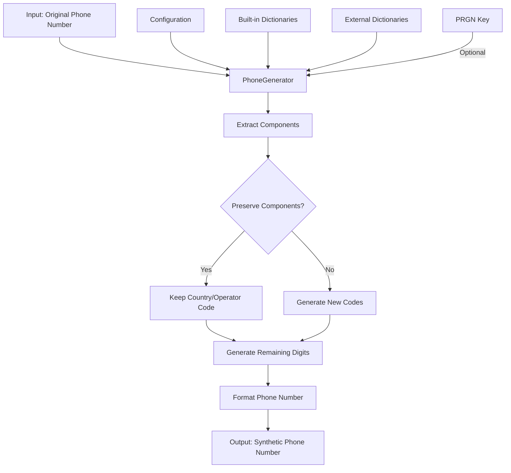

# PhoneGenerator Module (phone.py)

## Overview

The `PhoneGenerator` module provides functionality for generating synthetic phone numbers while preserving statistical properties of the original data and supporting consistent mapping. It's designed to create realistic phone numbers with proper country and operator codes, formatted according to regional standards.

## Purpose

This module is used for data anonymization and synthetic data generation tasks where realistic phone numbers are required. The generator can create phone numbers that maintain characteristics of real numbers (such as country code, operator code, and formatting) while ensuring that the generated numbers are not real phone numbers that could be associated with actual people.

## Features

- Generation of synthetic phone numbers with configurable formats and regional specificity
- Support for preserving country and operator codes from original numbers
- Multiple phone number validation and parsing capabilities
- Deterministic generation using pseudo-random number generators (PRGN)
- International phone number formatting according to country standards
- Advanced error handling and retry mechanisms
- Configurable validation and error handling strategies

## Architecture

### Module Dependencies

```
pamola_core.fake_data.generators.base_generator
    └── BaseGenerator
        └── PhoneGenerator

pamola_core.fake_data.commons
    ├── dict_helpers (Dictionary loading utilities)
    └── prgn (Pseudo-random number generation)

pamola_core.fake_data.dictionaries
    └── phones (Built-in phone dictionaries)
```

### Data Flow



## Key Methods

| Method | Description |
|--------|-------------|
| `__init__(config)` | Initializes the generator with configuration parameters |
| `validate_phone(phone)` | Validates if a phone number has a correct format |
| `extract_country_code(phone)` | Extracts the country code from a phone number |
| `extract_operator_code(phone, country_code)` | Extracts the operator/area code |
| `generate_country_code(original_country_code)` | Generates a country code |
| `generate_operator_code(country_code, original_operator_code)` | Generates an operator code |
| `generate_phone_number(country_code, operator_code, original_number)` | Generates a complete phone number |
| `format_phone(country_code, operator_code, number, format_template)` | Formats components into a phone number |
| `generate(count, **params)` | Generates multiple phone numbers |
| `generate_like(original_value, **params)` | Generates a phone similar to the original |
| `transform(values, **params)` | Transforms a list of original values to synthetic ones |

## Configuration Parameters

| Parameter | Type | Description | Default |
|-----------|------|-------------|---------|
| `country_codes` | Dict/List | Country codes to use with optional weights | `{"1": 0.4, "44": 0.2, ...}` |
| `operator_codes_dict` | str | Path to dictionary file with operator codes | `None` |
| `format` | str | Output format template | `None` (country-specific) |
| `validate_source` | bool | Whether to validate source phone numbers | `True` |
| `handle_invalid_phone` | str | Strategy for handling invalid numbers | `"generate_new"` |
| `default_country` | str | Default country for generation | `"us"` |
| `preserve_country_code` | bool | Preserve country code from original | `True` |
| `preserve_operator_code` | bool | Preserve operator code from original | `False` |
| `region` | str | Region/country for formatting | Same as `default_country` |
| `key` | str | Key for deterministic generation | `None` |
| `context_salt` | str | Salt for deterministic generation | `None` |

## Output Examples

| Input | Configuration | Output |
|-------|--------------|--------|
| `+1 (555) 123-4567` | Default | `+1 (478) 902-6543` |
| `+1 (555) 123-4567` | `preserve_country_code=True` | `+1 (623) 456-7890` |
| `+1 (555) 123-4567` | `preserve_country_code=True, preserve_operator_code=True` | `+1 (555) 987-6543` |
| `+1 (555) 123-4567` | `format="+CC-AAA-XXX-XXXX"` | `+1-623-456-7890` |
| `Invalid number` | `validate_source=True, handle_invalid_phone="generate_new"` | `+1 (623) 456-7890` |
| `Invalid number` | `validate_source=True, handle_invalid_phone="keep_empty"` | `""` (empty string) |

## Usage Examples

```python
from pamola_core.fake_data.generators.phone import PhoneGenerator

# Basic initialization
generator = PhoneGenerator()

# With configuration
config = {
    "country_codes": {"7": 0.7, "1": 0.3},
    "format": "+CC (AAA) XXX-XX-XX",
    "preserve_country_code": True,
    "default_country": "ru"
}
generator = PhoneGenerator(config=config)

# Generate a single phone number
phone = generator.generate_phone_number()

# Generate a phone similar to original
similar_phone = generator.generate_like("+1 (555) 123-4567")

# Generate multiple phones
phones = generator.generate(count=10)

# Transform a list of phones
original_phones = ["+1 (555) 123-4567", "+44 20 1234 5678"]
synthetic_phones = generator.transform(original_phones)
```

## Limitations

- The generator cannot guarantee that synthetic numbers are not actual assigned phone numbers
- Performance may be affected when processing very large datasets
- Some rare or specialized phone number formats may not be properly recognized
- Regional specificity depends on the completeness of the built-in dictionaries
- For proper international number validation, it relies on pattern matching rather than comprehensive telecommunication databases
- PRGN-based generation requires consistent keys across sessions for reproducibility