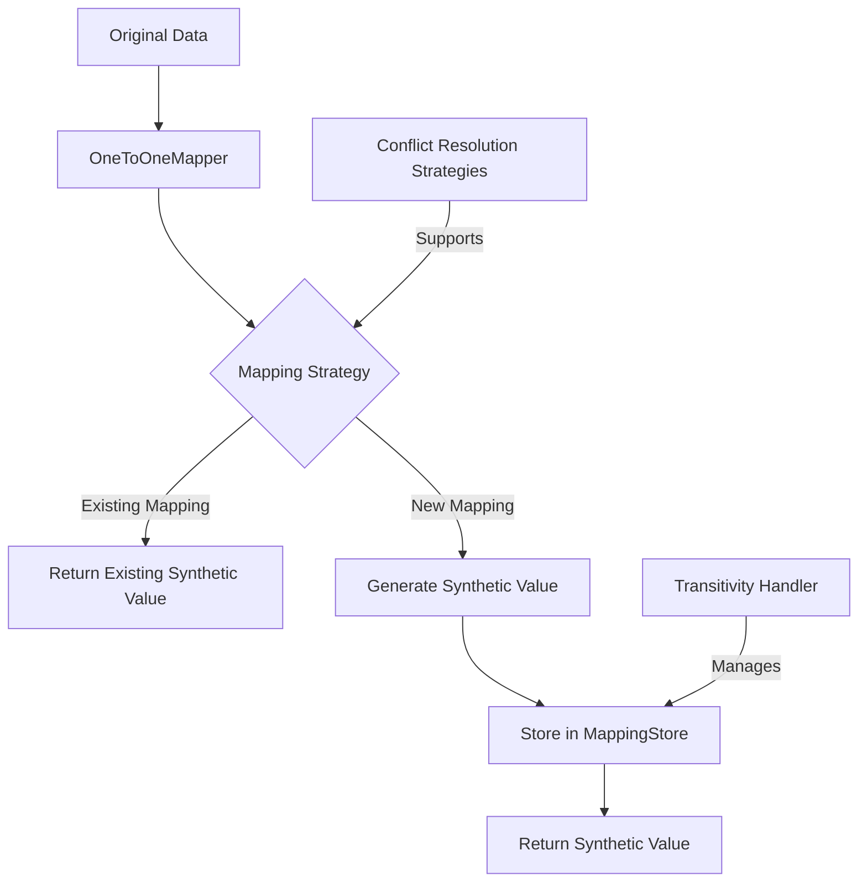

# OneToOneMapper: Deterministic Synthetic Data Generation

## Overview

The `OneToOneMapper` is a sophisticated mapping utility designed for generating synthetic data with strict one-to-one relationships, ensuring consistent and reproducible transformations across various data types.

## Purpose and Use Cases

### Pamola Core Objectives
- Provide deterministic mapping of original values to synthetic values
- Maintain unique one-to-one relationships
- Support complex data anonymization scenarios
- Ensure reproducibility and statistical similarity

### Typical Use Scenarios
- Personal data anonymization
- Machine learning dataset preparation
- Privacy-preserving data sharing
- Testing and development with realistic data

## System Architecture

```
┌──────────────────────────────────────────────────────────┐
│ Pamola Core Anonymization Infrastructure                        │
│                                                          │
│ ┌───────────────────┐    ┌────────────────────────────┐  │
│ │ Operations Layer  │    │ Mapping Components         │  │
│ │                   │    │ ┌────────────────────────┐ │  │
│ │ - Field Operations│ ──▶│ │ OneToOneMapper         │ │  │
│ │ - Batch Processing│    │ │ - Deterministic Mapper │ │  │
│ │ - Metrics         │    │ │ - Conflict Resolution  │ │  │
│ └───────────────────┘    │ └────────────────────────┘ │  │
│                          │            │               │  │
│                          │            ▼               │  │
│                          │ ┌────────────────────────┐ │  │
│                          │ │ MappingStore           │ │  │
│                          │ │ - Persistent Storage   │ │  │
│                          │ │ - Mapping Tracking     │ │  │
│                          │ └────────────────────────┘ │  │
│                          └─────────────┬──────────────┘  │
│                                        │                 │
│ ┌──────────────────────────────────────────────────────┐ │
│ │ Supporting Components                                │ │
│ │ ┌───────────────────┐    ┌────────────────────────┐  │ │
│ │ │ Conflict          │    │ Transitivity           │  │ │
│ │ │ Resolution        │ ──▶│ Handler                │  │ │
│ │ │ Strategies        │    │ - Cycle Detection      │  │ │
│ │ └───────────────────┘    └────────────────────────┘  │ │
│ └──────────────────────────────────────────────────────┘ │
└──────────────────────────────────────────────────────────┘

┌─────────────────────────────────────────────────────────┐
│ Data Flow                                               │
│                                                         │
│ ┌───────────────┐    ┌───────────────────┐              │
│ │ Original      │ ──▶│ OneToOneMapper    │ ──▶ Synthetic│
│ │ Data          │    │ - Map Generation  │    Data      │
│ └───────────────┘    └───────────────────┘              │
└─────────────────────────────────────────────────────────┘
```



## Key Features

1. **Deterministic Mapping**
   - Consistent transformation of values
   - Seed-based generation
   - Reproducible results

2. **Advanced Conflict Resolution**
   - Multiple built-in strategies
   - Custom conflict resolution support
   - Handling of complex mapping scenarios

3. **Transitive Mapping Support**
   - Detect and resolve mapping cycles
   - Maintain complex mapping relationships

## Function Reference

| Function | Parameters | Description | Return Value |
|----------|------------|-------------|--------------|
| `__init__` | - `field_name`: Unique identifier <br/> - `fallback_generator`: Value generation function <br/> - `mapping_store`: Persistence layer <br/> - `allow_identity`: Allows self-mapping <br/> - `transitive_handling`: Cycle management | Initialize mapper configuration | Mapper instance |
| `map` | - `original_value`: Source value <br/> - `**params`: Generation options | Transform original to synthetic value | Synthetic value |
| `batch_map` | - `values`: List of original values <br/> - `**params`: Batch generation options | Batch transform multiple values | List of synthetic values |
| `restore` | - `synthetic_value`: Generated value | Retrieve original value | Original value or None |
| `add_mapping` | - `original`: Source value <br/> - `synthetic`: Target value <br/> - `is_transitive`: Mapping type | Manually add mapping | None |
| `check_conflicts` | - `original`: Source value <br/> - `synthetic`: Target value | Detect potential mapping conflicts | Conflict information dict |
| `get_mapping_stats` | None | Retrieve mapping statistics | Statistics dictionary |

## Usage Examples

### Basic Usage
```python
# Initialize mapper for names
name_mapper = OneToOneMapper(
    field_name='employee_names', 
    fallback_generator=name_generator,
    allow_identity=False
)

# Map single value
synthetic_name = name_mapper.map('John Doe')

# Batch mapping
synthetic_names = name_mapper.batch_map(['John', 'Jane', 'Alice'])
```

### Advanced Mapping
```python
# Custom conflict resolution
name_mapper = OneToOneMapper(
    field_name='employees',
    fallback_generator=name_generator,
    conflict_strategies={
        'default': lambda x: f'{x}_alt',
        'gender_region_repick': custom_repick_strategy
    }
)

# Map with additional context
synthetic_name = name_mapper.map(
    'John Doe', 
    gender='male', 
    region='US',
    force_new=True
)
```

## Performance Considerations

- Optimized for large datasets
- Caching mechanism for repeated mappings
- Minimal memory overhead
- Supports batch processing

## Limitations

- Requires deterministic fallback generator
- Performance depends on conflict resolution strategy
- May require tuning for specific use cases

## Best Practices

1. Use consistent seed for reproducibility
2. Choose appropriate conflict resolution strategies
3. Monitor mapping statistics
4. Handle edge cases explicitly

## Extensions and Customization

- Implement custom fallback generators
- Create domain-specific conflict resolution
- Integrate with various data anonymization workflows

## Error Handling

- Detailed conflict detection
- Configurable error strategies
- Logging of mapping challenges

## Future Roadmap

- Machine learning-based conflict resolution
- Enhanced statistical similarity metrics
- Expanded language and domain support