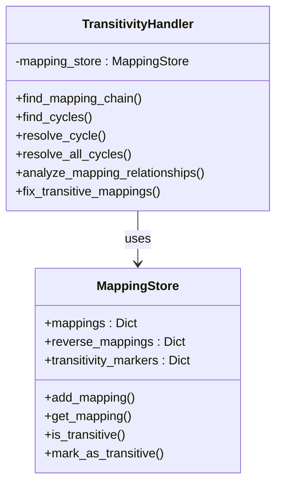
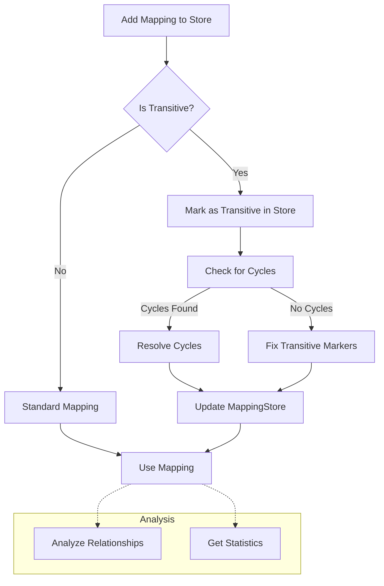

# TransitivityHandler Module Documentation

## Overview

The `TransitivityHandler` class provides a specialized solution for managing complex mapping relationships in data anonymization scenarios. It is designed to detect, analyze, and resolve transitive relationships and cycles within mappings, ensuring data consistency and integrity.

## Purpose

When anonymizing data with one-to-one mappings, complex relationships can emerge that require special handling:

1. **Transitivity**: When value A maps to B, and B maps to C, creating a chain (A→B→C)
2. **Cycles**: When mappings create a circular dependency (A→B→C→A)
3. **Indirect Relationships**: When values are connected through intermediate mappings

Left unmanaged, these relationships can cause:
- Inconsistent data transformations
- Mapping conflicts
- Loss of referential integrity
- Potential re-identification vulnerabilities

The `TransitivityHandler` addresses these challenges by providing tools to detect, analyze, and resolve complex mapping relationships.

## Class Architecture

The `TransitivityHandler` works in tandem with the `MappingStore` class:

```
                                                  ┌───────────────────────┐
                                                  │   MappingStore        │
                                                  │   ───────────         │
                                                  │ +mappings             │
                                                  │ +reverse_mappings     │
┌─────────────────────────────────┐               │ +transitivity_markers │
│ TransitivityHandler             │               │                       │
│ ──────────────────              │               │ +add_mapping()        │
│ -mapping_store                  ┼──────────────►  +get_mapping()        │
│                                 │    uses       │ +is_transitive()      │
│ +find_mapping_chain()           │               │ +mark_as_transitive() │
│ +find_cycles()                  │               │                       │
│ +resolve_cycle()                │               └───────────────────────┘
│ +resolve_all_cycles()           │
│ +analyze_mapping_relationships()│
│ +fix_transitive_mappings()      │
│                                 │
└─────────────────────────────────┘
```



## Data Flow

The typical data flow when using `TransitivityHandler` involves:



## Method Reference

### Cycle and Chain Analysis

| Method | Parameters | Return Type | Description |
|--------|------------|-------------|-------------|
| `__init__` | `mapping_store: MappingStore` | None | Initializes the transitivity handler with a mapping store |
| `find_mapping_chain` | `field_name: str, original_value: Any` | List[Any] | Finds the sequence of values in a mapping chain starting from an original value |
| `find_cycles` | `field_name: str` | List[List[Any]] | Detects all cycles in mappings for a given field |
| `_dfs_find_cycles` | `field_name: str, current: Any, mappings: Dict[Any, Any], path: List[Any], path_set: Set[Any], visited: Set[Any], cycles: List[List[Any]]` | None | Helper method for cycle detection using depth-first search |

### Cycle Resolution

| Method | Parameters | Return Type | Description |
|--------|------------|-------------|-------------|
| `resolve_cycle` | `field_name: str, cycle: List[Any], strategy: str = "break_at_start"` | None | Resolves a single cycle using the specified strategy |
| `resolve_all_cycles` | `field_name: str, strategy: str = "break_at_start"` | int | Detects and resolves all cycles, returning the count of cycles resolved |

### Relationship Analysis

| Method | Parameters | Return Type | Description |
|--------|------------|-------------|-------------|
| `analyze_mapping_relationships` | `field_name: str` | Dict[str, Any] | Analyzes mapping relationships, providing metrics and detecting issues |
| `fix_transitive_mappings` | `field_name: str` | int | Identifies and fixes inconsistencies in transitive mapping markers |
| `get_statistics` | `field_name: str` | Dict[str, Any] | Calculates comprehensive statistics about mapping relationships |

## Cycle Resolution Strategies

When resolving cycles, the `TransitivityHandler` offers multiple strategies:

| Strategy | Description | Use Case |
|----------|-------------|----------|
| `break_at_start` | Breaks the cycle by removing the mapping from the last to the first element | Default strategy, preserves most of the cycle |
| `break_at_end` | Breaks the cycle by removing the mapping from the second-to-last to the last element | Useful when the start of the cycle is important to preserve |
| `break_longest` | Finds the link that, if broken, leaves the longest chain intact | Optimizes for maintaining the maximum number of mappings |

## Statistics and Analysis

The `analyze_mapping_relationships` and `get_statistics` methods provide detailed information about mapping relationships:

### Analysis Results

```json
{
  "chains_count": 15,
  "max_chain_length": 4,
  "cycles_count": 2,
  "transitive_mappings": 18,
  "marked_transitive_mappings": 15,
  "transitivity_marking_issues": true,
  "problematic_mappings": [
    {
      "original": "John",
      "synthetic": "Robert",
      "issue": "should_be_transitive"
    },
    {
      "original": "Jane",
      "synthetic": "Mary",
      "issue": "should_be_transitive"
    }
  ]
}
```

### Statistics Output

```json
{
  "total_mappings": 1000,
  "transitive_mappings": 18,
  "transitive_percentage": 1.8,
  "chains": {
    "count": 15,
    "max_length": 4,
    "avg_length": 2.6
  },
  "cycles": {
    "count": 2
  }
}
```

## Types of Mapping Relationships

The `TransitivityHandler` deals with several types of mapping relationships:

### 1. Direct Mapping

The simplest case: A → B

```
Original "John" → Synthetic "Robert"
```

### 2. Transitive Chain

A chain of mappings: A → B → C → D

```
"John" → "Robert" → "William" → "Thomas"
```

In this case, "Robert" and "William" are both original and synthetic values in different mappings.

### 3. Cycle

A circular chain: A → B → C → A

```
"John" → "Robert" → "William" → "John"
```

Cycles are problematic because they create inconsistencies and require resolution.

## Usage Examples

### Basic Usage

```python
from pamola_core.fake_data.commons.mapping_store import MappingStore
from pamola_core.fake_data.mappers.transitivity_handler import TransitivityHandler

# Create a mapping store and add some mappings
store = MappingStore()
store.add_mapping("name", "John", "Robert")
store.add_mapping("name", "Robert", "William")
store.add_mapping("name", "William", "Thomas")

# Create a transitivity handler
handler = TransitivityHandler(store)

# Find the mapping chain starting from "John"
chain = handler.find_mapping_chain("name", "John")
print(f"Mapping chain: {' → '.join(chain)}")
# Output: Mapping chain: John → Robert → William → Thomas

# Mark mappings as transitive
store.mark_as_transitive("name", "Robert")
store.mark_as_transitive("name", "William")

# Fix any inconsistencies in transitive markings
fixed_count = handler.fix_transitive_mappings("name")
print(f"Fixed {fixed_count} transitive mapping issues")
```

### Detecting and Resolving Cycles

```python
# Create a cycle
store.add_mapping("name", "Thomas", "John")  # Creates cycle: John → Robert → William → Thomas → John

# Find cycles
cycles = handler.find_cycles("name")
print(f"Found {len(cycles)} cycles")

for i, cycle in enumerate(cycles):
    print(f"Cycle {i+1}: {' → '.join(cycle)}")

# Resolve all cycles
resolved_count = handler.resolve_all_cycles("name", strategy="break_at_end")
print(f"Resolved {resolved_count} cycles")
```

### Analyzing Relationships

```python
# Get comprehensive analysis
analysis = handler.analyze_mapping_relationships("name")
print(f"Chain count: {analysis['chains_count']}")
print(f"Max chain length: {analysis['max_chain_length']}")
print(f"Cycle count: {analysis['cycles_count']}")
print(f"Transitive mappings: {analysis['transitive_mappings']}")

# Get detailed statistics
stats = handler.get_statistics("name")
print(f"Total mappings: {stats['total_mappings']}")
print(f"Transitive percentage: {stats['transitive_percentage']}%")
```

## Integration with MappingStore

The `TransitivityHandler` is designed to work seamlessly with the `MappingStore` class:

```python
# After adding mappings to the store
store.add_mapping("name", "John", "Robert")
store.add_mapping("name", "Robert", "William")

# Create a transitivity handler
handler = TransitivityHandler(store)

# Fix transitive markings
handler.fix_transitive_mappings("name")

# Now the mappings in the store are correctly marked
is_transitive = store.is_transitive("name", "John")  # Should be False
is_transitive = store.is_transitive("name", "Robert")  # Should be True
```

## Performance Considerations

The `TransitivityHandler` includes optimizations for large datasets:

1. For large mappings (>10,000 entries), it performs limited sampling analysis
2. It uses optimized graph traversal algorithms to detect cycles efficiently
3. It uses sets for O(1) lookups during cycle detection

For improved performance with large datasets:

- Run cycle detection and resolution before starting bulk anonymization
- Use `fix_transitive_mappings` periodically during bulk operations
- Consider breaking exceptionally large fields into smaller logical units

## Common Workflow

A typical workflow integrating `TransitivityHandler` and `MappingStore`:

1. Initialize a `MappingStore` instance
2. Add initial mappings
3. Create a `TransitivityHandler` with the store
4. Fix any transitive markings with `fix_transitive_mappings`
5. Detect and resolve cycles with `resolve_all_cycles`
6. Add new mappings as needed
7. Periodically run step 5 to maintain consistency
8. Use `analyze_mapping_relationships` to monitor mapping quality

## Error Handling

The `TransitivityHandler` includes error handling mechanisms:

- Warning logs for detected cycles
- Information logs for resolution actions
- Graceful handling of empty or invalid data

## Conclusion

The `TransitivityHandler` module provides crucial functionality for managing complex mapping relationships in data anonymization:

- Detects and resolves mapping cycles
- Identifies and marks transitive mappings
- Provides detailed analysis and statistics
- Ensures consistency in mapping relationships

By handling these complex relationships properly, it helps maintain data consistency and integrity throughout the anonymization process.