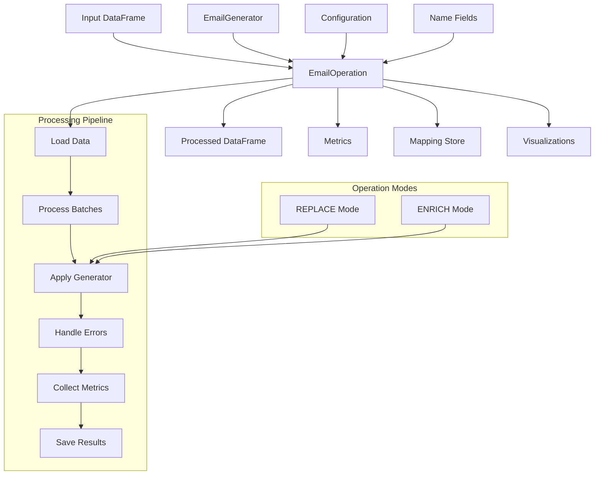

# EmailOperation Documentation

## Purpose

The `EmailOperation` is a specialized operation class in the fake data generation system designed to process email addresses in datasets. It replaces original email addresses with synthetic alternatives while preserving statistical properties, domain characteristics, and maintaining consistency across the dataset.

## Features

- Batch processing of email fields in datasets
- Support for both enrichment (adding new columns) and replacement modes
- Utilization of name fields to generate more realistic email addresses
- Configurable strategies for handling null values
- Consistent mapping between original and synthetic emails
- Retry mechanism for error handling
- Detailed metrics collection and visualization
- Domain distribution and format analytics
- Quality assessment of generated emails

## Architecture

### Module Position

The `EmailOperation` is part of the `pamola_core.fake_data.operations` package in the PAMOLA CORE framework:

```
pamola_core/fake_data/
├── __init__.py
├── operations/
│   ├── __init__.py
│   └── email_op.py        # EmailOperation implementation
├── commons/
│   ├── metrics.py         # Metrics utilities used by operation
│   └── operations.py      # Base operation classes
├── generators/
│   └── email.py           # EmailGenerator used by operation
└── mapping_store.py       # Mapping storage used by operation
```

### Dependencies

- `GeneratorOperation` - Parent class providing base operation functionality
- `EmailGenerator` - Pamola Core generator for email addresses
- `PRNGenerator` - For deterministic generation
- `MappingStore` - For storing mappings between original and synthetic data
- `metrics` - For collecting and analyzing operation results

### Data Flow



## Key Methods and Parameters

### Constructor Parameters

| Parameter | Type | Description | Default |
|-----------|------|-------------|---------|
| `field_name` | str | Field to process (containing email addresses) | Required |
| `mode` | str | Operation mode (REPLACE or ENRICH) | `"ENRICH"` |
| `output_field_name` | Optional[str] | Name for the output field (if mode=ENRICH) | `None` |
| `domains` | Optional[Union[List[str], str]] | List of domains or path to domain dictionary | `None` |
| `format` | Optional[str] | Format for email generation | `None` |
| `format_ratio` | Optional[Dict[str, float]] | Distribution of format usage | `None` |
| `first_name_field` | Optional[str] | Field containing first names | `None` |
| `last_name_field` | Optional[str] | Field containing last names | `None` |
| `full_name_field` | Optional[str] | Field containing full names | `None` |
| `name_format` | Optional[str] | Format of full names (FL, FML, LF, etc.) | `None` |
| `validate_source` | bool | Whether to validate source email addresses | `True` |
| `handle_invalid_email` | str | How to handle invalid emails | `"generate_new"` |
| `batch_size` | int | Number of records to process in one batch | `10000` |
| `null_strategy` | str | Strategy for handling NULL values | `"PRESERVE"` |
| `consistency_mechanism` | str | Method for ensuring consistency | `"prgn"` |
| `mapping_store_path` | Optional[str] | Path to store mappings | `None` |
| `key` | Optional[str] | Key for encryption/PRGN | `None` |
| `save_mapping` | bool | Whether to save mapping to file | `False` |
| `separator_options` | Optional[List[str]] | List of separators to use | `None` |
| `number_suffix_probability` | float | Probability of adding number suffix | `0.4` |
| `preserve_domain_ratio` | float | Probability of preserving original domain | `0.5` |
| `business_domain_ratio` | float | Probability of using business domains | `0.2` |
| `detailed_metrics` | bool | Whether to collect detailed metrics | `False` |
| `error_logging_level` | str | Level for error logging | `"WARNING"` |
| `max_retries` | int | Maximum number of retries for generation on error | `3` |

### Main Methods

| Method | Description | Parameters | Returns |
|--------|-------------|------------|---------|
| `execute` | Execute the email generation operation | `data_source`, `task_dir`, `reporter`, `**kwargs` | `OperationResult` |
| `process_batch` | Process a batch of data | `batch: pd.DataFrame` | `pd.DataFrame` |
| `process_value` | Process a single value with retry logic | `value`, `**params` | Generated value |
| `_collect_metrics` | Collect metrics for the operation | `df: pd.DataFrame` | `Dict[str, Any]` |
| `_save_metrics` | Save metrics to a file and generate visualizations | `metrics_data: Dict[str, Any]`, `task_dir: Path` | `Path` |

### Helper Methods

| Method | Description |
|--------|-------------|
| `_configure_logging` | Configure logging based on error_logging_level |
| `_initialize_mapping_store` | Initialize the mapping store if needed |
| `_analyze_domain_distribution` | Analyze the distribution of domains in generated emails |
| `_categorize_domains_distribution` | Categorize domains into business, personal, educational, etc. |
| `_get_popular_domains` | Get a list of the most popular domains from the generator's dictionary |
| `_calculate_quality_metrics` | Calculate quality metrics comparing original and generated email addresses |

## Return Values

- `execute` - Returns an `OperationResult` object containing:
  - Processed DataFrame
  - Success status
  - Error messages (if any)
  - Execution time
  - Path to metrics data
  - Path to visualization files

## Usage Examples

### Basic Usage

```python
from pamola_core.fake_data.operations.email_op import EmailOperation
from pathlib import Path
from pamola_core.utils.task_reporting import Reporter

# Create an email operation for enrichment mode
email_op = EmailOperation(
    field_name="email",
    mode="ENRICH"
)

# Execute operation
reporter = Reporter()
result = email_op.execute(
    data_source="path/to/data.csv",
    task_dir=Path("./task_directory"),
    reporter=reporter
)

# Check result
if result.success:
    print(f"Processing completed. Results saved to {result.output_path}")
else:
    print(f"Processing failed: {result.error_message}")
```

### Advanced Configuration with Name Fields

```python
from pamola_core.fake_data.operations.email_op import EmailOperation
import pandas as pd
from pathlib import Path
from pamola_core.utils.task_reporting import Reporter

# Create a DataFrame with name fields
df = pd.DataFrame({
    'first_name': ['John', 'Jane', 'Robert'],
    'last_name': ['Smith', 'Doe', 'Johnson'],
    'email': ['john.smith@example.com', 'jane.doe@company.org', 'robert.johnson@gmail.com']
})

# Create a configured email operation
email_op = EmailOperation(
    field_name="email",
    mode="REPLACE",
    first_name_field="first_name",
    last_name_field="last_name",
    format="name_surname",
    domains=["newdomain.com", "synthetic.org"],
    consistency_mechanism="mapping",
    mapping_store_path="./mappings/email_mappings.json",
    save_mapping=True,
    detailed_metrics=True
)

# Execute operation
reporter = Reporter()
result = email_op.execute(
    data_source=df,
    task_dir=Path("./task_directory"),
    reporter=reporter
)

# Display processed data
print(result.data.head())
```

### Batch Processing with Metrics

```python
from pamola_core.fake_data.operations.email_op import EmailOperation
import pandas as pd
from pathlib import Path
import json
from pamola_core.utils.task_reporting import Reporter

# Create operation with detailed metrics
email_op = EmailOperation(
    field_name="contact_email",
    mode="ENRICH",
    output_field_name="synthetic_email",
    batch_size=5000,
    null_strategy="REPLACE",
    detailed_metrics=True,
    error_logging_level="INFO",
    max_retries=5
)

# Execute operation
reporter = Reporter()
result = email_op.execute(
    data_source="path/to/large_dataset.csv",
    task_dir=Path("./output_directory"),
    reporter=reporter
)

# Analyze metrics
with open(result.metrics_path, 'r') as f:
    metrics = json.load(f)

print(f"Total emails processed: {metrics['original_data']['total_records']}")
print(f"Domain preservation ratio: {metrics['quality_metrics'].get('domain_preservation_ratio', 'N/A')}")
print(f"Emails generated per second: {metrics['performance']['records_per_second']}")
```

## Limitations

1. **Performance with Large Datasets**: Processing large datasets may be memory-intensive, especially with detailed metrics collection enabled.

2. **Dependency on Name Fields**: The quality of name-based email generation depends on the availability and quality of name fields in the dataset.

3. **Mapping Storage Size**: When using the mapping mechanism with large datasets, the mapping store can grow quite large and consume significant memory.

4. **Retry Mechanism Overhead**: The retry mechanism improves robustness but may increase processing time for problematic records.

5. **Quality Metrics Assumptions**: Quality metrics assume certain patterns in original emails that may not always hold true for all datasets.

6. **Error Handling Trade-offs**: Configurable error handling improves flexibility but may mask underlying issues in extreme cases.

7. **Visualization Limitations**: Generated visualizations are limited to supported chart types and may not be suitable for all analytical needs.

8. **Domain Categorization Heuristics**: Domain categorization uses heuristics that may not correctly categorize all domains, especially uncommon ones.

9. **Lack of External Validation**: The operation cannot validate the deliverability or legitimacy of generated email addresses against external services.

10. **Configuration Complexity**: The large number of configuration options can make it challenging to find optimal settings for specific use cases.