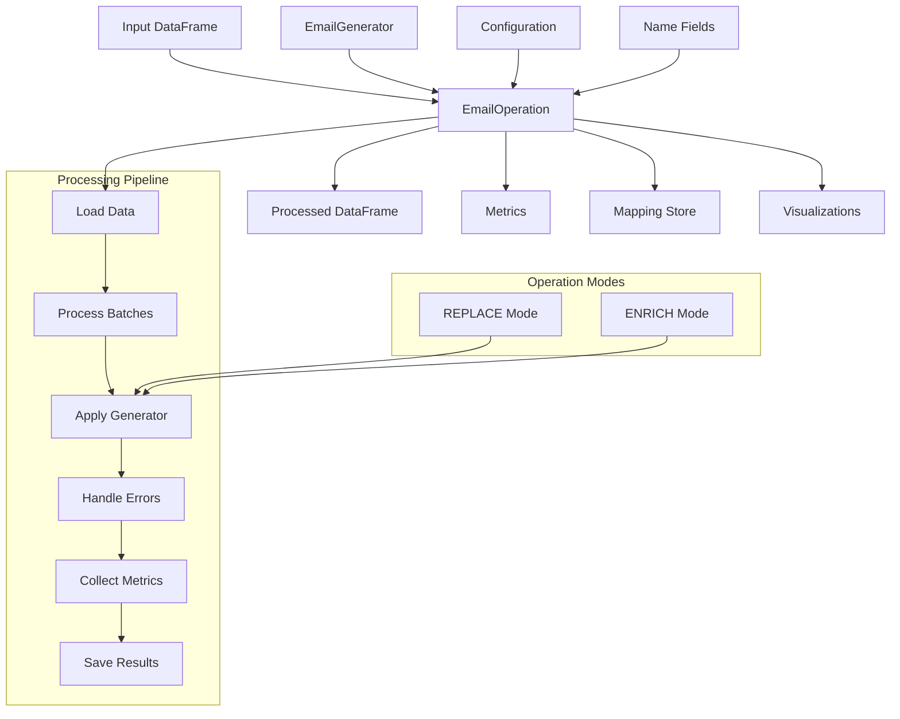

# FakeEmailOperation Documentation

## Purpose

The `FakeEmailOperation` is a specialized operation class in the fake data generation system designed to process email addresses in datasets. It replaces original email addresses with synthetic alternatives while preserving statistical properties, domain characteristics, and maintaining consistency across the dataset.

## Features

- Batch processing of email fields in datasets
- Support for format control (name_surname, surname_name, nickname, existing_domain)
- Utilization of name fields to generate realistic email addresses
- Domain preservation and business domain controls
- Configurable strategies for invalid email handling
- Numeric suffix probability control
- Retry mechanism for generation failures
- Detailed metrics collection and visualization
- Domain distribution and format analytics
- PRGN-based consistency mechanism

## Architecture

### Module Position

The `FakeEmailOperation` is part of the `pamola_core.fake_data.operations` package in the PAMOLA CORE framework:

```
pamola_core/fake_data/
├── __init__.py
├── operations/
│   ├── __init__.py
│   └── email_op.py        # FakeEmailOperation implementation
├── generators/
│   └── email.py           # EmailGenerator used by operation
├── schemas/
│   └── email_op_core_schema.py  # FakeEmailOperationConfig
└── base_generator_op.py   # GeneratorOperation base class
```

### Dependencies

- `GeneratorOperation` - Parent class providing base operation functionality
- `EmailGenerator` - Generator for synthetic email addresses
- PRGN (Pseudo-Random Number Generator) - For deterministic generation with context_salt
- Configuration schema: `FakeEmailOperationConfig` - For validation
- `io` utilities - For data reading/writing

### Data Flow


```mermaid
graph TD
    A[Input DataFrame] --> B[EmailOperation]
    C[EmailGenerator] --> B
    D[Configuration] --> B
    E[Name Fields] --> B
    B --> F[Processed DataFrame]
    B --> G[Metrics]
    B --> H[Mapping Store]
    B --> I[Visualizations]
    
    subgraph "Processing Pipeline"
        J[Load Data] --> K[Process Batches]
        K --> L[Apply Generator]
        L --> M[Handle Errors]
        M --> N[Collect Metrics]
        N --> O[Save Results]
    end
    
    B --> J
    
    subgraph "Operation Modes"
        P[REPLACE Mode] --> L
        Q[ENRICH Mode] --> L
    end
```

## Key Methods and Parameters

### Constructor Parameters

| Parameter | Type | Description | Default |
|-----------|------|-------------|---------|
| `field_name` | str | Field to process (containing email addresses) | Required |
| `domains` | Optional[Union[List[str], str]] | List of domains or path to domain dictionary | `None` |
| `format` | Optional[str] | Email format (name_surname, surname_name, nickname, existing_domain) | `None` |
| `format_ratio` | Optional[Dict[str, float]] | Distribution of format usage | `None` |
| `first_name_field` | Optional[str] | Field containing first names | `None` |
| `last_name_field` | Optional[str] | Field containing last names | `None` |
| `full_name_field` | Optional[str] | Field containing full names | `None` |
| `name_format` | Optional[str] | Format of full names (FL, FML, LF, etc.) | `None` |
| `validate_source` | bool | Whether to validate source email addresses | `True` |
| `handle_invalid_email` | str | How to handle invalid emails (generate_new, keep_empty, etc.) | `"generate_new"` |
| `nicknames_dict` | Optional[str] | Path to nickname mapping file | `None` |
| `max_length` | int | Maximum email length | `254` |
| `separator_options` | Optional[List[str]] | List of separators to use | `['.', '_', '']` |
| `number_suffix_probability` | float | Probability of adding number suffix | `0.4` |
| `preserve_domain_ratio` | float | Probability of preserving original domain | `0.5` |
| `business_domain_ratio` | float | Probability of using business domains | `0.2` |
| `detailed_metrics` | bool | Whether to collect detailed metrics | `False` |
| `max_retries` | int | Maximum number of retries for generation on error | `3` |
| `key` | Optional[str] | Key for PRGN consistency | `None` |
| `context_salt` | Optional[str] | Additional context salt for PRGN to enhance uniqueness | `None` |
| `**kwargs` | dict | Additional BaseOperation parameters (chunk_size, etc.) | - |

### Main Methods

| Method | Description | Parameters | Returns |
|--------|-------------|------------|---------|
| `execute` | Execute the email generation operation | `data_source`, `task_dir`, `reporter`, `**kwargs` | `OperationResult` |
| `process_batch` | Process a batch of data | `batch: pd.DataFrame` | `pd.DataFrame` |
| `process_value` | Process a single value with retry logic | `value`, `**params` | Generated value |
| `_collect_metrics` | Collect metrics for the operation | `df: pd.DataFrame` | `Dict[str, Any]` |
| `_save_metrics` | Save metrics to a file and generate visualizations | `metrics_data: Dict[str, Any]`, `task_dir: Path` | `Path` |

### Helper Methods

| Method | Description |
|--------|-------------|
| `_configure_logging` | Configure logging based on error_logging_level |
| `_initialize_mapping_store` | Initialize the mapping store if needed |
| `_analyze_domain_distribution` | Analyze the distribution of domains in generated emails |
| `_categorize_domains_distribution` | Categorize domains into business, personal, educational, etc. |
| `_get_popular_domains` | Get a list of the most popular domains from the generator's dictionary |
| `_calculate_quality_metrics` | Calculate quality metrics comparing original and generated email addresses |

## Return Values

- `execute` - Returns an `OperationResult` object containing:
  - Processed DataFrame
  - Success status
  - Error messages (if any)
  - Execution time
  - Path to metrics data
  - Path to visualization files

## Usage Examples

### Basic Usage

```python
from pamola_core.fake_data.operations.email_op import FakeEmailOperation
from pamola_core.utils.ops.op_data_source import DataSource
from pathlib import Path

# Create a data source
data_source = DataSource.from_file_path("data.csv", load=True)

# Create an email operation
email_op = FakeEmailOperation(
    field_name="email",
    format="name_surname"
)

# Execute operation
result = email_op.execute(
    data_source=data_source,
    task_dir=Path("./output"),
    reporter=None
)

# Check result
if result.status == "success":
    print(f"Processing completed")
    print(f"Output shape: {result.data.shape}")
else:
    print(f"Processing failed: {result.error}")
```

### Advanced Configuration with Name Fields

```python
from pamola_core.fake_data.operations.email_op import FakeEmailOperation
from pamola_core.utils.ops.op_data_source import DataSource
from pathlib import Path

# Create a data source with name fields
data_source = DataSource.from_file_path("data.csv", load=True)

# Create a configured email operation with name-based generation
email_op = FakeEmailOperation(
    field_name="email",
    first_name_field="first_name",
    last_name_field="last_name",
    format="name_surname",
    format_ratio={"name_surname": 0.6, "surname_name": 0.4},
    domains=["newdomain.com", "synthetic.org"],
    preserve_domain_ratio=0.3,
    business_domain_ratio=0.2,
    separator_options=[".", "_"],
    number_suffix_probability=0.5,
    detailed_metrics=True,
    key="consistent_key",
    context_salt="salt123"
)

# Execute operation
result = email_op.execute(
    data_source=data_source,
    task_dir=Path("./output"),
    reporter=None
)

# Display processed data
print(result.data.head())
print(f"Metrics: {result.metrics}")
```

### Configuration with Detailed Metrics

```python
from pamola_core.fake_data.operations.email_op import FakeEmailOperation
from pamola_core.utils.ops.op_data_source import DataSource
from pathlib import Path

# Create data source
data_source = DataSource.from_file_path("large_dataset.csv", load=True)

# Create operation with detailed metrics and error handling
email_op = FakeEmailOperation(
    field_name="contact_email",
    format="name_surname",
    validate_source=True,
    handle_invalid_email="generate_new",
    detailed_metrics=True,
    max_retries=5,
    number_suffix_probability=0.3,
    preserve_domain_ratio=0.4,
    business_domain_ratio=0.3,
    chunk_size=5000  # BaseOperation parameter for large dataset handling
)

# Execute operation
result = email_op.execute(
    data_source=data_source,
    task_dir=Path("./output"),
    reporter=None
)

# Analyze metrics
if result.metrics:
    print(f"Total emails processed: {result.metrics.get('total_records', 'N/A')}")
    print(f"Success rate: {result.metrics.get('success_rate', 'N/A')}")
    print(f"Generation time: {result.metrics.get('execution_time', 'N/A')}")
```

## Limitations

1. **Performance with Large Datasets**: Processing large datasets may be memory-intensive, especially with detailed metrics collection enabled.

2. **Dependency on Name Fields**: The quality of name-based email generation depends on the availability and quality of name fields in the dataset.

3. **Mapping Storage Size**: When using the mapping mechanism with large datasets, the mapping store can grow quite large and consume significant memory.

4. **Retry Mechanism Overhead**: The retry mechanism improves robustness but may increase processing time for problematic records.

5. **Quality Metrics Assumptions**: Quality metrics assume certain patterns in original emails that may not always hold true for all datasets.

6. **Error Handling Trade-offs**: Configurable error handling improves flexibility but may mask underlying issues in extreme cases.

7. **Visualization Limitations**: Generated visualizations are limited to supported chart types and may not be suitable for all analytical needs.

8. **Domain Categorization Heuristics**: Domain categorization uses heuristics that may not correctly categorize all domains, especially uncommon ones.

9. **Lack of External Validation**: The operation cannot validate the deliverability or legitimacy of generated email addresses against external services.

10. **Configuration Complexity**: The large number of configuration options can make it challenging to find optimal settings for specific use cases.