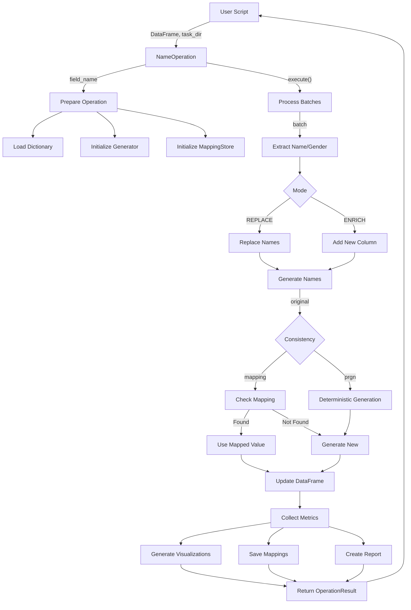

# NameOperation Module Documentation

## Overview

The `name_op.py` module provides the `NameOperation` class, which integrates the name generation functionality into the PAMOLA.CORE operations framework. It processes DataFrame fields containing personal names, replacing them with synthetic alternatives while preserving gender, language, and format characteristics. The operation supports both replacement and enrichment modes, batch processing, progress reporting, and comprehensive metrics collection.

## Module Location

```
pamola_core/fake_data/
├── operations/
│   ├── __init__.py
│   ├── name_op.py           <- This module
│   ├── email_op.py
│   ├── phone_op.py
│   └── ...
```

## Inheritance Hierarchy

```
pamola_core.utils.ops.op_base.BaseOperation
    └── pamola_core.utils.ops.op_base.FieldOperation
            └── pamola_core.fake_data.base_generator_op.GeneratorOperation
                └── pamola_core.fake_data.operations.name_op.NameOperation
```

## Data Flow



## NameOperation Class

The `NameOperation` class is registered in the operations registry and provides functionality for processing and replacing personal names in datasets.

### Key Features

- Integrated with PAMOLA operation framework
- Batch processing for large datasets
- Two modes: REPLACE and ENRICH
- Support for consistent mappings (1-to-1)
- Deterministic generation through PRGN
- Gender-aware name generation
- Multi-language support
- Comprehensive metrics and visualizations
- Progress reporting

## Configuration Parameters

| Parameter | Type | Default | Description |
|-----------|------|---------|-------------|
| `field_name` | str | Required | Name of the field to process |
| `mode` | str | "ENRICH" | Operation mode: "REPLACE" or "ENRICH" |
| `output_field_name` | str | None | Name for output field (if mode="ENRICH") |
| `language` | str | "en" | Language for name generation |
| `gender_field` | str | None | Field containing gender information |
| `gender_from_name` | bool | False | Whether to infer gender from name |
| `format` | str | None | Format for name generation (e.g., "FML", "FL") |
| `f_m_ratio` | float | 0.5 | Ratio of female/male names for random generation |
| `use_faker` | bool | False | Whether to use Faker library if available |
| `case` | str | "title" | Case formatting (upper, lower, title) |
| `dictionaries` | dict | None | Paths to custom dictionaries |
| `batch_size` | int | 10000 | Number of records to process in one batch |
| `null_strategy` | str | "PRESERVE" | Strategy for handling NULL values |
| `consistency_mechanism` | str | "prgn" | Method for ensuring consistency ("mapping" or "prgn") |
| `mapping_store_path` | str | None | Path to store mappings |
| `id_field` | str | None | Field for record identification |
| `key` | str | None | Key for encryption/PRGN |
| `context_salt` | str | None | Salt for PRGN |
| `save_mapping` | bool | False | Whether to save mapping to file |
| `column_prefix` | str | "_" | Prefix for new column (if mode="ENRICH") |

## API Reference

### Main Methods

| Method | Parameters | Description |
|--------|------------|-------------|
| `__init__(self, field_name, ...)` | `field_name` (str): Field to process<br>(...): Additional parameters | Initializes the name operation with configuration |
| `execute(self, data_source, task_dir, reporter, **kwargs)` | `data_source`: DataFrame or file path<br>`task_dir` (Path): Directory for artifacts<br>`reporter`: Progress reporter<br>`**kwargs`: Additional parameters | Executes the name generation operation |
| `process_batch(self, batch)` | `batch` (DataFrame): Batch of data to process | Processes a batch of data to generate synthetic names |
| `process_value(self, value, **params)` | `value`: Original value<br>`**params`: Additional parameters | Processes a single value using the appropriate generation method |

### Helper Methods

| Method | Parameters | Description |
|--------|------------|-------------|
| `_initialize_mapping_store(self, path)` | `path` (Union[str, Path]): Path to mapping store | Initializes the mapping store if needed |
| `_collect_metrics(self, df)` | `df` (DataFrame): Processed DataFrame | Collects metrics for the name generation operation |
| `_calculate_length_stats(self, series)` | `series` (Series): Series of strings | Calculates length statistics for a series of strings |
| `_save_metrics(self, metrics_data, task_dir)` | `metrics_data` (Dict): Metrics data<br>`task_dir` (Path): Directory for artifacts | Saves metrics to a file and generates visualizations |

## Usage Examples

### Basic Usage

```python
from pamola_core.fake_data.operations.name_op import NameOperation
from pathlib import Path

# Create name operation for field "full_name"
name_op = NameOperation(
    field_name="full_name",
    mode="ENRICH",      # Create new column
    language="en"       # Use English names
)

# Execute the operation
result = name_op.execute(
    data_frame,                # pandas DataFrame
    Path("./task_directory"),  # Directory for artifacts
    reporter                   # Progress reporter
)

# Access the processed DataFrame
processed_df = result.data
```

### Advanced Configuration

```python
# Configure with more options
name_op = NameOperation(
    field_name="customer_name",
    mode="REPLACE",
    language="ru",
    gender_field="gender",
    format="LFM",
    consistency_mechanism="mapping",
    save_mapping=True,
    mapping_store_path="./mappings/names.json",
    batch_size=5000,
    null_strategy="PRESERVE"
)

# Execute with additional parameters
result = name_op.execute(
    data_source="./data/customers.csv",  # File path
    task_dir=Path("./output"),
    reporter=progress_reporter,
    save_data=True                       # Save output to CSV
)

# Access artifacts
for artifact in result.artifacts:
    print(f"Artifact: {artifact.path}, Type: {artifact.artifact_type}")
```

## Output Artifacts

The operation produces several artifacts in the task directory:

```
task_dir/
├── output/
│   └── name_generator_full_name_2023-08-15_123045.csv   # Processed data
├── metrics/
│   └── name_generator_full_name_metrics.json            # Metrics in JSON
├── maps/
│   └── name_generator_full_name_mapping.json            # Mapping store
├── reports/
│   └── name_generator_full_name_report.md               # Metrics report
└── visualizations/
    ├── name_generator_full_name_value_distribution.png  # Value distribution
    ├── name_generator_full_name_length_stats.png        # Length statistics
    └── name_generator_full_name_replacements.png        # Replacement rate
```

## Metrics Collection

The operation collects comprehensive metrics:

- **Basic metrics**: Record counts, processing time
- **Name-specific metrics**: Language, format, dictionary statistics
- **Value distribution**: Distribution of original vs. generated values
- **Length statistics**: Min, max, mean, median string lengths
- **Performance metrics**: Processing speed, memory usage
- **Transformation metrics**: Replacement rates, collision counts

## Integration with PAMOLA.CORE Infrastructure

The `NameOperation` class integrates with several pamola core components:

- **Operation Registry**: Registers via `@register()` decorator
- **OperationResult**: Returns structured result with data, artifacts, metrics
- **Progress Reporting**: Updates progress via provided reporter
- **IO Utilities**: Uses `pamola_core.utils.io` for file operations
- **Visualization**: Creates charts via `pamola_core.utils.visualization`

## Limitations and Considerations

- Large dictionaries may impact memory usage
- Performance scales with batch size
- Mapping storage can grow large with extensive datasets
- Deterministic generation (PRGN) is more memory-efficient than mapping
- Gender detection accuracy depends on dictionary coverage

## Best Practices

1. Use "ENRICH" mode for initial testing to preserve original data
2. Adjust batch size based on available memory
3. Use PRGN for large datasets to avoid memory issues
4. Save mappings for data that requires consistent replacement
5. Provide gender field when available for more accurate generation