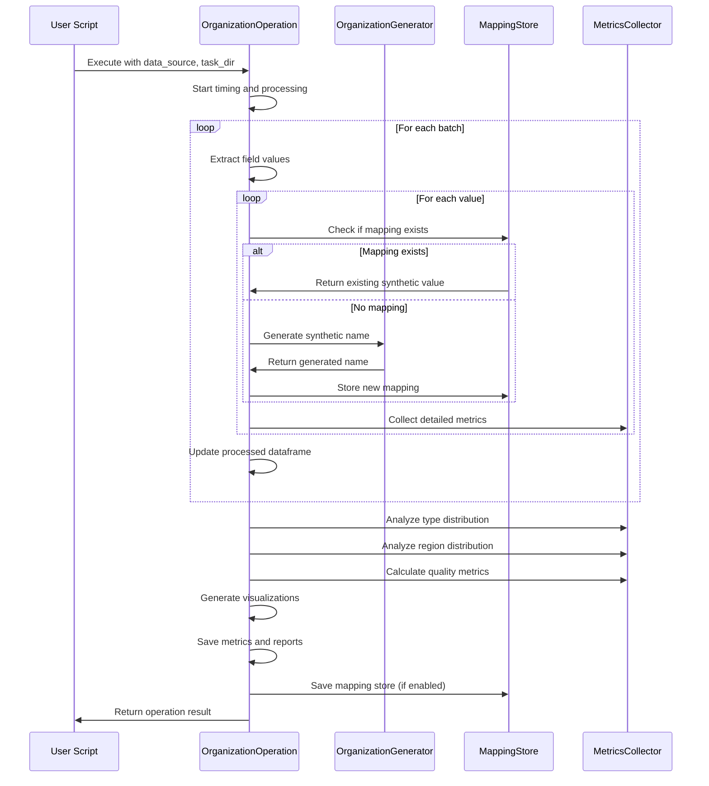

# Organization Operation Module Documentation

## Overview

The `organization_op.py` module provides the `OrganizationOperation` class, which implements a data processing operation for generating synthetic organization names within the PAMOLA CORE framework. This operation can be used in data anonymization workflows to replace real organization names with realistic synthetic alternatives while preserving statistical properties and organizational characteristics.

## Purpose

This module serves as the operational bridge between the PAMOLA.CORE data processing pipeline and the underlying organization name generation functionality. It handles:

- Processing data in batches for efficiency
- Maintaining consistency across replacements
- Applying null value strategies
- Collecting detailed metrics for quality analysis
- Managing mapping storage for future reference
- Generating comprehensive reports and visualizations

## Architecture

### Inheritance Hierarchy

The `OrganizationOperation` class follows the PAMOLA.CORE operations framework inheritance hierarchy:

```
pamola_core.utils.ops.op_base.BaseOperation
      ↑
      │
pamola_core.utils.ops.op_base.FieldOperation
      ↑
      │
pamola_core.fake_data.base_generator_op.GeneratorOperation
      ↑
      │
pamola_core.fake_data.operations.organization_op.OrganizationOperation
```

### Component Relationships

```
┌─────────────────────┐
│ Task/User Script    │
└──────────┬──────────┘
           │
           ▼
┌──────────────────────┐    ┌─────────────────────┐
│ OrganizationOperation ├───► OrganizationGenerator│
└──────────┬──────────┬─┘    └─────────────────────┘
           │          │
           │          │     ┌─────────────────────┐
           │          └────►│ MappingStore        │
           │                └─────────────────────┘
           │
           │                ┌─────────────────────┐
           └───────────────►│ MetricsCollector    │
                            └─────────────────────┘
```

## Data Flow



## Key Features

1. **Operation Integration**:
   - Registered with PAMOLA operation registry
   - Compatible with PAMOLA.CORE task system
   - Follows PAMOLA operation lifecycle

2. **Data Processing Modes**:
   - REPLACE: Replace original values in-place
   - ENRICH: Add synthetic values as new columns

3. **Null Value Strategies**:
   - PRESERVE: Keep null values as null
   - REPLACE: Generate values for nulls
   - EXCLUDE: Skip null values
   - ERROR: Raise error on null values

4. **Consistency Mechanisms**:
   - mapping: Store explicit mappings between original and synthetic values
   - prgn: Use deterministic pseudo-random generation

5. **Metrics Collection**:
   - Organization type distribution
   - Region distribution
   - Prefix/suffix usage statistics
   - Quality metrics

## Parameters and Configuration Options

| Parameter | Type | Description | Default |
|-----------|------|-------------|---------|
| `field_name` | str | Field to process (containing org names) | *required* |
| `mode` | str | Operation mode ("REPLACE" or "ENRICH") | "ENRICH" |
| `output_field_name` | str | Name for output field (if mode="ENRICH") | None (auto-generated) |
| `organization_type` | str | Type of organization to generate | "general" |
| `dictionaries` | Dict[str, str] | Paths to dictionaries | None |
| `prefixes` | Dict[str, str] | Paths to prefix dictionaries | None |
| `suffixes` | Dict[str, str] | Paths to suffix dictionaries | None |
| `add_prefix_probability` | float | Probability of adding prefix | 0.3 |
| `add_suffix_probability` | float | Probability of adding suffix | 0.5 |
| `region` | str | Default region for generation | "en" |
| `preserve_type` | bool | Whether to preserve org type | True |
| `industry` | str | Specific industry for 'industry' type | None |
| `batch_size` | int | Size of processing batches | 10000 |
| `null_strategy` | str | Strategy for NULL values | "PRESERVE" |
| `consistency_mechanism` | str | Method for ensuring consistency | "prgn" |
| `mapping_store_path` | str | Path to store mappings | None |
| `id_field` | str | Field for record identification | None |
| `key` | str | Key for encryption/PRGN | None |
| `context_salt` | str | Salt for PRGN | None |
| `save_mapping` | bool | Whether to save mapping to file | False |
| `column_prefix` | str | Prefix for new column | "_" |
| `collect_type_distribution` | bool | Whether to collect type distribution | True |
| `type_field` | str | Field containing organization types | None |
| `region_field` | str | Field containing region codes | None |
| `detailed_metrics` | bool | Whether to collect detailed metrics | False |
| `error_logging_level` | str | Level for error logging | "WARNING" |
| `max_retries` | int | Maximum retries for generation on error | 3 |

## Main Methods

| Method | Description | Parameters | Returns |
|--------|-------------|------------|---------|
| `execute()` | Execute the operation | `data_source`, `task_dir`, `reporter`, `**kwargs` | `OperationResult` |
| `process_batch()` | Process a batch of data | `batch` | Processed DataFrame |
| `process_value()` | Process a single value | `value`, `**params` | Processed value |
| `_analyze_type_distribution()` | Analyze org type distribution | `df` | Dictionary with metrics |
| `_analyze_region_distribution()` | Analyze region distribution | `df` | Dictionary with metrics |
| `_analyze_prefix_suffix_distribution()` | Analyze prefix/suffix usage | `df` | Dictionary with metrics |
| `_collect_metrics()` | Collect comprehensive metrics | `df` | Dictionary with metrics |
| `_calculate_quality_metrics()` | Calculate quality metrics | `original_series`, `generated_series` | Dictionary with metrics |
| `_save_metrics()` | Save metrics and visualizations | `metrics_data`, `task_dir` | Path to metrics file |

## Usage Examples

### Basic Usage in a Task Script

```python
from pamola_core.fake_data.operations.organization_op import OrganizationOperation
from pamola_core.utils.ops.op_data_source import DataSource
from pathlib import Path

# Create data source from a CSV file
data_source = DataSource.from_file_path("companies.csv")

# Create the operation
org_op = OrganizationOperation(
    field_name="company_name",
    mode="REPLACE",
    organization_type="general"
)

# Execute the operation
result = org_op.execute(
    data_source=data_source,
    task_dir=Path("./task_output"),
    reporter=None
)

# Check result and access processed data
if result.status.name == "SUCCESS":
    processed_df = result.data
    print(f"Processed {len(processed_df)} records")
else:
    print(f"Operation failed: {result.error_message}")
```

### Advanced Configuration

```python
# Create operation with advanced settings
org_op = OrganizationOperation(
    field_name="institution_name",
    mode="ENRICH",
    output_field_name="synthetic_institution",
    organization_type="educational",
    dictionaries={
        "educational": "path/to/custom_educational_institutions.txt"
    },
    prefixes={
        "educational": "path/to/custom_prefixes.txt"
    },
    region="ru",
    preserve_type=True,
    null_strategy="REPLACE",
    consistency_mechanism="mapping",
    mapping_store_path="./mappings/institutions.json",
    save_mapping=True,
    detailed_metrics=True,
    type_field="institution_type",
    region_field="country_code"
)

# Execute with reporter
from pamola_core.utils.task_reporting import Reporter
reporter = Reporter()
result = org_op.execute(data_source, Path("./output"), reporter)
```

## Operation Metrics

The operation collects and reports the following metrics categories:

| Metric Category | Description | Contents |
|-----------------|-------------|----------|
| `organization_generator` | Generator configuration | Type, region, probabilities, dictionary info |
| `performance` | Performance stats | Generation time, records/second, retries, errors |
| `type_distribution` | Organization type distribution | Unique types, diversity ratio, top types |
| `region_distribution` | Region distribution | Unique regions, region distribution |
| `prefix_suffix_distribution` | Prefix/suffix usage | Statistics on prefix/suffix combinations |
| `quality_metrics` | Quality assessment | Length similarity, type preservation, word count similarity |

## Artifacts

The operation produces the following artifacts:

| Artifact | Description | Location |
|----------|-------------|----------|
| Processed data | DataFrame with synthetic organization names | `{task_dir}/output/{operation_name}_{field_name}_{timestamp}.csv` |
| Metrics JSON | Comprehensive metrics in JSON format | `{task_dir}/metrics/{operation_name}_{field_name}_metrics.json` |
| Mapping store | Mappings between original and synthetic values | `{task_dir}/maps/{operation_name}_{field_name}_mapping.json` |
| Visualizations | Charts of distributions and quality metrics | `{task_dir}/visualizations/` |
| Report | Markdown report summarizing the operation | `{task_dir}/reports/{operation_name}_{field_name}_report.md` |

## Limitations

1. **Performance Considerations**:
   - Processing large datasets may be time-consuming
   - Detailed metrics collection increases memory usage

2. **Mapping Storage**:
   - Large datasets may create large mapping files
   - In-memory mapping may cause issues with very large datasets

3. **Integration Constraints**:
   - Requires PAMOLA CORE framework components
   - Reporter and task_dir structure must follow PAMOLA.CORE conventions

4. **Metric Limitations**:
   - Quality metrics are heuristic-based
   - Type detection has limited accuracy for specialized organizations

5. **Retry Logic**:
   - May slow down processing when errors occur frequently
   - Default max retries (3) might be insufficient for problematic data

## Extension Points

- Adding new organization types
- Implementing custom metrics collectors
- Extending visualization capabilities
- Adding support for more sophisticated mapping mechanisms
- Implementing parallelized batch processing