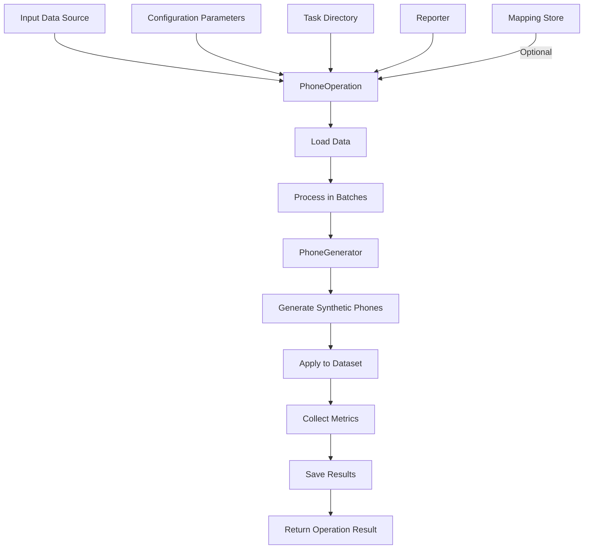

# PhoneOperation Module (phone_op.py)

## Overview

The `PhoneOperation` module provides a high-level operation for generating synthetic phone numbers in datasets. It processes phone numbers in input data sources, replacing them with synthetic alternatives while preserving country and operator characteristics, collecting metrics, and ensuring consistency across transformations.

## Purpose

This module serves as an integral part of the data anonymization framework, specifically focusing on processing and replacing phone number fields in structured datasets. It bridges the gap between the low-level phone number generation (handled by `PhoneGenerator`) and the data processing workflow, providing a comprehensive operation that can be registered and executed within the operation framework.

## Features

- Integration with the operation registry and workflow
- Batch processing of large datasets
- Configurable replacement or enrichment modes
- Comprehensive metrics collection and visualization
- Support for mapping stores to ensure consistent replacements
- Error handling with retry mechanisms
- Detailed quality assessment
- Country code and formatting preservation options
- Performance measurement and optimization

## Architecture

### Module Dependencies

```
pamola_core.utils.ops.op_registry
    └── register (Decorator for operation registration)

pamola_core.utils.ops.op_base.BaseOperation
    └── pamola_core.fake_data.commons.operations.GeneratorOperation
        └── PhoneOperation

pamola_core.fake_data.generators
    └── PhoneGenerator (Generator for phone numbers)

pamola_core.fake_data.commons
    ├── metrics (Metrics collection utilities)
    ├── mapping_store (Consistent mapping storage)
    └── operations (Base operation classes)
    
pamola_core.utils
    ├── io (Input/output utilities)
    └── ops (Operations framework)
```

### Data Flow



## Key Methods

| Method | Description |
|--------|-------------|
| `__init__(field_name, **kwargs)` | Initializes the operation with configuration parameters |
| `execute(data_source, task_dir, reporter, **kwargs)` | Executes the operation on the data source |
| `process_batch(batch)` | Processes a batch of data |
| `process_value(value, **params)` | Processes a single value using the generator |
| `_analyze_country_distribution(df)` | Analyzes distribution of country codes |
| `_analyze_formats(df)` | Analyzes distribution of phone number formats |
| `_collect_metrics(df)` | Collects operation metrics |
| `_calculate_quality_metrics(original_series, generated_series)` | Calculates quality comparison metrics |
| `_determine_format_type(phone)` | Determines the format type of a phone number |
| `_save_metrics(metrics_data, task_dir)` | Saves metrics to files and generates visualizations |

## Configuration Parameters

| Parameter | Type | Description | Default |
|-----------|------|-------------|---------|
| `field_name` | str | Field to process (containing phone numbers) | Required |
| `mode` | str | Operation mode (REPLACE or ENRICH) | `"ENRICH"` |
| `output_field_name` | str | Name for the output field (if mode=ENRICH) | `None` |
| `country_codes` | List/Dict | Country codes to use | `None` |
| `operator_codes_dict` | str | Path to dictionary of operator codes | `None` |
| `format` | str | Format for phone number generation | `None` |
| `validate_source` | bool | Whether to validate source phone numbers | `True` |
| `handle_invalid_phone` | str | How to handle invalid numbers | `"generate_new"` |
| `default_country` | str | Default country for generation | `"us"` |
| `preserve_country_code` | bool | Whether to preserve country code from original | `True` |
| `preserve_operator_code` | bool | Whether to preserve operator code from original | `False` |
| `region` | str | Region/country for formatting | `None` |
| `batch_size` | int | Number of records to process in one batch | `10000` |
| `null_strategy` | str | Strategy for handling NULL values | `"PRESERVE"` |
| `consistency_mechanism` | str | Method for ensuring consistency | `"prgn"` |
| `mapping_store_path` | str | Path to store mappings | `None` |
| `id_field` | str | Field for record identification | `None` |
| `key` | str | Key for encryption/PRGN | `None` |
| `context_salt` | str | Salt for PRGN | `None` |
| `save_mapping` | bool | Whether to save mapping to file | `False` |
| `column_prefix` | str | Prefix for new column (if mode=ENRICH) | `"_"` |
| `international_format` | bool | Whether to use international format | `True` |
| `local_formatting` | bool | Whether to apply local country formatting | `False` |
| `country_code_field` | str | Field containing country codes | `None` |
| `detailed_metrics` | bool | Whether to collect detailed metrics | `False` |
| `error_logging_level` | str | Level for error logging | `"WARNING"` |
| `max_retries` | int | Maximum number of retries for generation on error | `3` |

## Operation Results

| Field | Description |
|-------|-------------|
| `success` | Boolean indicating if operation completed successfully |
| `message` | Status message or error description |
| `data` | Processed DataFrame (if returning data) |
| `metrics` | Collected metrics from operation |
| `artifacts` | Paths to generated files/visualizations |
| `execution_time` | Time taken to execute the operation |

## Metrics Collected

| Metric Category | Metrics | Description |
|----------------|---------|-------------|
| `phone_generator` | Format, default country, region, etc. | Generator configuration details |
| `performance` | Generation time, records per second, error count | Performance statistics |
| `country_distribution` | Total phones, unique codes, distribution | Country code statistics |
| `format_distribution` | Format type frequencies | Phone format statistics |
| `quality_metrics` | Length similarity, country code preservation | Quality comparison |

## Usage Examples

```python
from pamola_core.fake_data.operations.phone_op import PhoneOperation
from pathlib import Path
import pandas as pd

# Create a reporter (implementation dependent on your framework)
reporter = Reporter()

# Create the operation
phone_op = PhoneOperation(
    field_name="contact_phone",
    mode="ENRICH",
    output_field_name="synthetic_phone",
    country_codes={"1": 0.6, "44": 0.2, "7": 0.2},
    format="+CC (AAA) XXX-XXXX",
    preserve_country_code=True,
    batch_size=5000,
    consistency_mechanism="mapping",
    mapping_store_path="./mappings/phone_mappings.json",
    save_mapping=True,
    detailed_metrics=True
)

# Execute on DataFrame
df = pd.read_csv("contacts.csv")
result = phone_op.execute(df, Path("./task_dir"), reporter)

# Or execute on file
result = phone_op.execute("path/to/contacts.csv", Path("./task_dir"), reporter)

# Access results
if result.success:
    processed_df = result.data
    print(f"Processed {len(processed_df)} records in {result.execution_time} seconds")
    print(f"Metrics saved to: {result.artifacts['metrics']}")
    print(f"Visualizations saved to: {result.artifacts['visualizations']}")
else:
    print(f"Operation failed: {result.message}")
```

## Artifacts Generated

| Artifact Type | Path Pattern | Description |
|--------------|--------------|-------------|
| Processed Data | `{task_dir}/output/{output_name}.csv` | Output dataset if saving enabled |
| Metrics | `{task_dir}/metrics/{operation_name}_{field_name}_metrics.json` | Operation metrics in JSON format |
| Report | `{task_dir}/reports/{operation_name}_{field_name}_report.md` | Metrics report in markdown format |
| Visualizations | `{task_dir}/visualizations/{metric_name}.png` | Metric visualizations |
| Mapping | `{task_dir}/maps/{operation_name}_{field_name}_mapping.json` | Mapping of original to synthetic values |

## Limitations

- The operation requires pandas DataFrame for batch processing
- Complex operations on very large datasets may require significant memory
- Visualization generation requires matplotlib to be installed
- Mapping store requires serializable data for storage
- Quality metrics are heuristics and may not fully represent semantic equivalence
- Country code detection is pattern-based and may not work for all international formats
- The maximum number of retries is fixed and may not be sufficient for all error scenarios
- Parallelization is not directly supported within a single operation instance