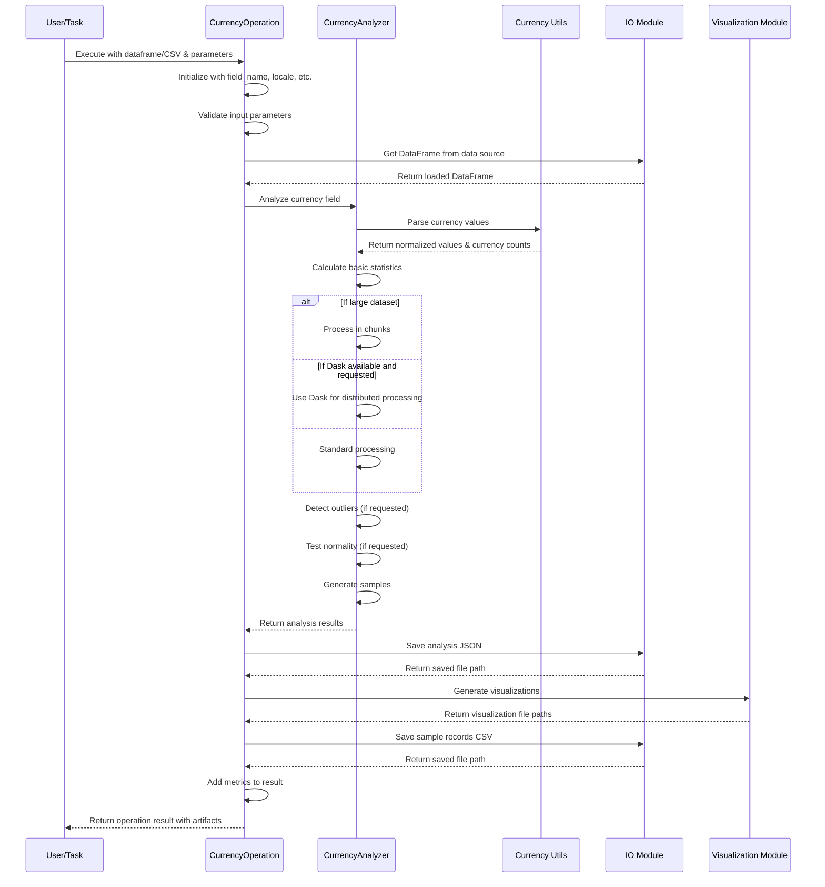

# Currency Field Profiler

## Module Purpose

The Currency Field Profiler (`pamola_core.profiling.analyzers.currency`) is a specialized analysis module within the PAMOLA/PAMOLA CORE framework designed to perform comprehensive profiling of currency-related fields in tabular datasets. It extracts statistical summaries from currency fields while handling the specific challenges of currency data, such as varied symbols, locale-dependent formatting, and semantic significance.

This module enables privacy risk analysis and data quality evaluation by providing detailed insights into the distribution, outliers, and patterns within currency values. The profiling results support subsequent anonymization, transformation, and privacy-preserving operations on financial data.

## Key Features

- **Locale-Aware Parsing**: Automatically detects and correctly interprets currency values formatted according to different regional standards (e.g., `$1,234.56`, `1.234,56 €`).

- **Multi-Currency Detection**: Identifies and categorizes different currency types within a single field, providing distribution statistics for each currency.

- **Semantic Analysis**: Provides specialized interpretation of currency-specific patterns such as negative values (potential debits) and zero values (free items or placeholder values).

- **Robust Error Handling**: Gracefully processes missing values, inconsistent formats, and common data entry errors in financial data.

- **Comprehensive Statistical Output**: Calculates standard statistical measures (min, max, mean, median) along with specialized metrics relevant to currency data.

- **Memory-Efficient Processing**: Supports chunked processing and optional Dask integration for analyzing large datasets with millions of rows.

- **Visualization Generation**: Creates specialized visualizations appropriate for financial data, including distributions and outlier identification.

## Position in Architecture

The Currency Field Profiler is positioned within the PAMOLA architecture as an analyzer operation within the profiling subsystem. It extends the base field operation capabilities with currency-specific functionality.

```
PAMOLA Architecture
│
├── Pamola_Core
│   ├── Utils ────────────────────────┐
│   │   ├── IO                        │
│   │   ├── Visualization             │ Shared utilities
│   │   ├── Operations Framework      │ used by operations
│   │   └── Progress Tracking         │
│   │                                 │
│   └── Profiling ─────────────┐      │
│       ├── Commons            │      │
│       │   ├── Base Utils     │      │
│       │   ├── Numeric Utils  │      │
│       │   └── Currency Utils ├──────┘
│       │                      │
│       └── Analyzers ─────────┤
│           ├── Numeric        │
│           ├── Categorical    │
│           ├── Text           │
│           ├── Email          │
│           ├── Phone          │
│           └── Currency ──────┘ ← Current module
│
├── Anonymization
│   └── ...
│
└── Privacy Models
    └── ...
```

## Data Flow Diagram



## Function Overview

### Classes and Methods

| Class/Function | Parameters | Description |
|---------------|------------|-------------|
| `CurrencyOperation` | `field_name`, `locale='en_US'`, `bins=10`, `detect_outliers=True`, `test_normality=True`, `description=''` | Main operation class for currency field profiling. Extends `FieldOperation`. |
| `CurrencyOperation.execute` | `data_source`, `task_dir`, `reporter`, `progress_tracker=None`, `**kwargs` | Executes the currency profiling operation, processes data, and generates artifacts. |
| `CurrencyAnalyzer` | None | Utility class that implements the pamola core currency analysis logic. |
| `CurrencyAnalyzer.analyze` | `df`, `field_name`, `locale='en_US'`, `bins=10`, `detect_outliers=True`, `test_normality=True`, `chunk_size=10000`, `use_dask=False`, `progress_tracker=None`, `**kwargs` | Analyzes a currency field in a DataFrame and returns detailed statistics. |
| `CurrencyAnalyzer._analyze_with_dask` | `df`, `field_name`, `locale`, `bins`, `detect_outliers`, `test_normality`, `progress_tracker=None`, `**kwargs` | Performs analysis using Dask for large datasets (internal method). |
| `CurrencyAnalyzer._analyze_in_chunks` | `df`, `field_name`, `locale`, `bins`, `detect_outliers`, `test_normality`, `chunk_size`, `progress_tracker=None`, `**kwargs` | Processes large datasets in chunks (internal method). |

### Utility Functions (from currency_utils.py)

| Function | Parameters | Description |
|----------|------------|-------------|
| `analyze_currency_stats` | `values`, `currency_counts=None` | Analyzes currency values and computes statistics. |
| `normalize_currency_value` | `value`, `locale='en_US'` | Normalizes a currency value to a float and extracts its currency code. |
| `parse_currency_field` | `df`, `field_name`, `locale='en_US'` | Parses a currency field and extracts normalized values and currency codes. |
| `is_currency_field` | `field_name` | Checks if a field name matches common currency field patterns. |
| `extract_currency_symbol` | `value` | Extracts currency symbol from a string value. |
| `detect_currency_from_sample` | `df`, `field_name`, `sample_size=100` | Detects the most likely currency from a sample of data. |
| `generate_currency_samples` | `stats`, `count=10` | Generates sample currency values based on statistics for dictionary output. |

## Output Artifacts

The Currency Field Profiler generates several types of output artifacts to provide comprehensive insights into currency data:

### JSON Statistics File

**Format**: `{field_name}_stats.json`

**Location**: `{task_dir}/output/`

**Content Structure**:
```json
{
  "field_name": "price",
  "total_rows": 1000,
  "valid_count": 950,
  "null_count": 30,
  "invalid_count": 20,
  "null_percentage": 3.0,
  "invalid_percentage": 2.0,
  "is_detected_currency": true,
  "locale_used": "en_US",
  "currency_counts": {
    "USD": 800,
    "EUR": 150
  },
  "multi_currency": true,
  "stats": {
    "min": 0.0,
    "max": 9999.99,
    "mean": 512.75,
    "median": 499.99,
    "std": 320.45,
    "skewness": 1.2,
    "kurtosis": 3.8,
    "valid_count": 950,
    "zero_count": 5,
    "zero_percentage": 0.5,
    "negative_count": 10,
    "negative_percentage": 1.0,
    "outliers": {
      "count": 15,
      "percentage": 1.5,
      "lower_bound": 10.0,
      "upper_bound": 1500.0
    },
    "normality": {
      "is_normal": false,
      "shapiro": {
        "statistic": 0.85,
        "p_value": 0.001
      }
    },
    "percentiles": {
      "25": 250.0,
      "50": 499.99,
      "75": 750.0,
      "90": 900.0,
      "95": 1100.0,
      "99": 2500.0
    },
    "histogram": {
      "bins": [0, 500, 1000, 1500, 2000, 10000],
      "counts": [400, 350, 150, 30, 20]
    },
    "samples": {
      "normal": [512.75, 600.25, 450.80],
      "boundary": [0.0, 9999.99],
      "special": [0.0, -10.50]
    },
    "semantic_notes": [
      "Field contains 10 negative values, possibly representing debits or expenses.",
      "Field contains 5 zero values, possibly representing unpaid/free items or placeholder values."
    ]
  }
}
```

### Visualization Files

**Types**:
1. **Distribution Histogram**: `{field_name}_distribution.png`
2. **Boxplot**: `{field_name}_boxplot.png`
3. **Q-Q Plot** (if normality testing enabled): `{field_name}_qq_plot.png`

**Location**: `{task_dir}/visualizations/`

**Description**: These visualizations provide graphical representations of the currency data distribution, including outliers and distribution shape. The histogram shows the frequency of values across different ranges, the boxplot highlights median, quartiles, and outliers, and the Q-Q plot tests for normality.

### Sample Records CSV

**Format**: `{field_name}_sample.csv`

**Location**: `{task_dir}/dictionaries/`

**Content**: Contains a representative sample of records from the original dataset, including the original currency values. The sample is designed to include examples of:
- Different currency types if multiple currencies exist
- Outlier values
- Missing or invalid values
- High/low values

This sample helps in understanding the raw format of the currency data being analyzed.

## Examples

### Basic Usage in a Task

```python
from pamola_core.utils.ops.op_data_source import DataSource
from pamola_core.utils.task_reporting import TaskReporter
from pamola_core.profiling.analyzers.currency import CurrencyOperation
from pathlib import Path

def profile_financial_data(csv_path, output_dir):
    """
    Task to profile financial data including currency fields.
    """
    # Initialize directories and reporter
    task_dir = Path(output_dir)
    task_dir.mkdir(parents=True, exist_ok=True)
    reporter = TaskReporter(task_name="financial_profiling", output_dir=task_dir)
    
    # Create data source from CSV
    data_source = DataSource.from_file_path(csv_path, name="financial_data")
    
    # Create and execute the currency profiling operation
    price_profiler = CurrencyOperation(
        field_name="price",
        locale="en_US",
        bins=15,
        detect_outliers=True,
        test_normality=True,
        description="Profiling product prices"
    )
    
    # Execute the operation
    price_result = price_profiler.execute(
        data_source=data_source,
        task_dir=task_dir,
        reporter=reporter
    )
    
    # Log the result
    if price_result.status.name == "SUCCESS":
        print(f"Successfully profiled price field. Found {price_result.metrics.get('valid_count', 0)} valid values.")
        print(f"Min price: {price_result.metrics.get('statistics', {}).get('min')}")
        print(f"Max price: {price_result.metrics.get('statistics', {}).get('max')}")
    else:
        print(f"Error profiling price field: {price_result.error_message}")
    
    # Profile salary field with different locale
    salary_profiler = CurrencyOperation(
        field_name="salary",
        locale="fr_FR",  # European format (comma as decimal)
        description="Profiling employee salaries"
    )
    
    salary_result = salary_profiler.execute(
        data_source=data_source,
        task_dir=task_dir,
        reporter=reporter
    )
    
    # Complete the report
    reporter.complete_task_report()
    
    return task_dir

# Usage
result_dir = profile_financial_data(
    csv_path="data/financial_data_2025.csv",
    output_dir="output/profiles/financial"
)
print(f"Profiling results saved to: {result_dir}")
```

### Standalone Usage with DataFrame

```python
import pandas as pd
from pamola_core.profiling.analyzers.currency import CurrencyAnalyzer
import matplotlib.pyplot as plt

# Load data
df = pd.read_csv("sales_data.csv")

# Create analyzer
analyzer = CurrencyAnalyzer()

# Analyze price field
results = analyzer.analyze(
    df=df,
    field_name="price",
    locale="en_US",
    bins=10
)

# Access and use the statistics
print(f"Analyzed {results['total_rows']} records")
print(f"Valid currency values: {results['valid_count']}")

if results.get('multi_currency', False):
    print("Multiple currencies detected:")
    for currency, count in results.get('currency_counts', {}).items():
        print(f"  {currency}: {count} values")

# Access detailed stats
stats = results.get('stats', {})
print(f"Price statistics:")
print(f"  Min: {stats.get('min')}")
print(f"  Max: {stats.get('max')}")
print(f"  Mean: {stats.get('mean')}")
print(f"  Median: {stats.get('median')}")

# Check for outliers
outliers = stats.get('outliers', {})
if outliers.get('count', 0) > 0:
    print(f"Found {outliers.get('count')} outliers ({outliers.get('percentage')}%)")
    print(f"  Values below {outliers.get('lower_bound')} or above {outliers.get('upper_bound')}")

# Manual visualization of the data
if 'histogram' in stats:
    hist_data = stats['histogram']
    plt.figure(figsize=(10, 6))
    plt.bar(
        x=range(len(hist_data['counts'])),
        height=hist_data['counts'],
        width=0.8
    )
    plt.xticks(
        range(len(hist_data['counts'])),
        [f"{hist_data['bins'][i]}-{hist_data['bins'][i+1]}" for i in range(len(hist_data['bins'])-1)]
    )
    plt.title(f"Distribution of Price Values")
    plt.xlabel("Price Range")
    plt.ylabel("Frequency")
    plt.savefig("price_distribution.png")
    plt.close()

# Check for semantic notes
if 'semantic_notes' in stats:
    print("Semantic analysis:")
    for note in stats['semantic_notes']:
        print(f"  * {note}")
```

### Advanced Usage with Large Dataset and Dask

```python
import pandas as pd
from pamola_core.utils.ops.op_data_source import DataSource
from pamola_core.utils.task_reporting import TaskReporter
from pamola_core.profiling.analyzers.currency import CurrencyOperation
from pamola_core.utils.progress import ProgressTracker
from pathlib import Path

def profile_large_financial_dataset(csv_path, output_dir):
    """
    Profile a large financial dataset using Dask for distributed processing.
    """
    # Initialize progress tracking
    progress = ProgressTracker(
        total=5,
        description="Profiling large financial dataset",
        unit="steps",
        track_memory=True
    )
    
    progress.update(1, {"step": "Initialization"})
    
    # Initialize directories and reporter
    task_dir = Path(output_dir)
    task_dir.mkdir(parents=True, exist_ok=True)
    reporter = TaskReporter(task_name="large_financial_profiling", output_dir=task_dir)
    
    # Create data source from CSV without loading (will be processed in chunks)
    data_source = DataSource.from_file_path(csv_path, name="financial_data", load=False)
    
    progress.update(1, {"step": "Data source created"})
    
    # Create and execute the currency profiling operation with Dask
    amount_profiler = CurrencyOperation(
        field_name="transaction_amount",
        locale="en_US",
        bins=20,
        detect_outliers=True,
        test_normality=True,
        description="Profiling transaction amounts"
    )
    
    progress.update(1, {"step": "Running currency profiler"})
    
    # Execute with Dask
    amount_result = amount_profiler.execute(
        data_source=data_source,
        task_dir=task_dir,
        reporter=reporter,
        progress_tracker=progress.create_subtask(10, "Analyzing transaction_amount"),
        use_dask=True,             # Enable Dask for distributed processing
        chunk_size=100000,         # Process in 100K row chunks
        generate_plots=True        # Generate visualizations
    )
    
    progress.update(1, {"step": "Finalizing"})
    
    # Complete the report
    reporter.complete_task_report()
    
    progress.update(1, {"step": "Completed"})
    progress.close()
    
    return amount_result

# Usage
result = profile_large_financial_dataset(
    csv_path="data/transactions_2025_large.csv",
    output_dir="output/profiles/transactions"
)

if result.status.name == "SUCCESS":
    print("Successfully profiled large dataset")
    print(f"Generated {len(result.artifacts)} artifacts")
    
    # List artifacts by type
    artifact_types = {}
    for artifact in result.artifacts:
        t = artifact.artifact_type
        if t not in artifact_types:
            artifact_types[t] = []
        artifact_types[t].append(str(artifact.path))
    
    for atype, paths in artifact_types.items():
        print(f"{atype.upper()} artifacts ({len(paths)}):")
        for path in paths:
            print(f"  - {path}")
else:
    print(f"Error: {result.error_message}")
```