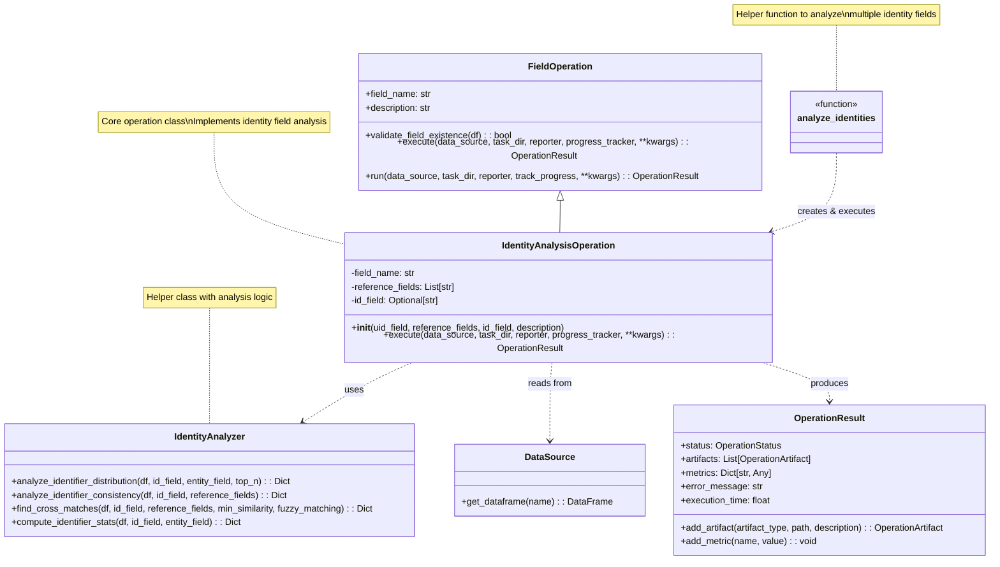
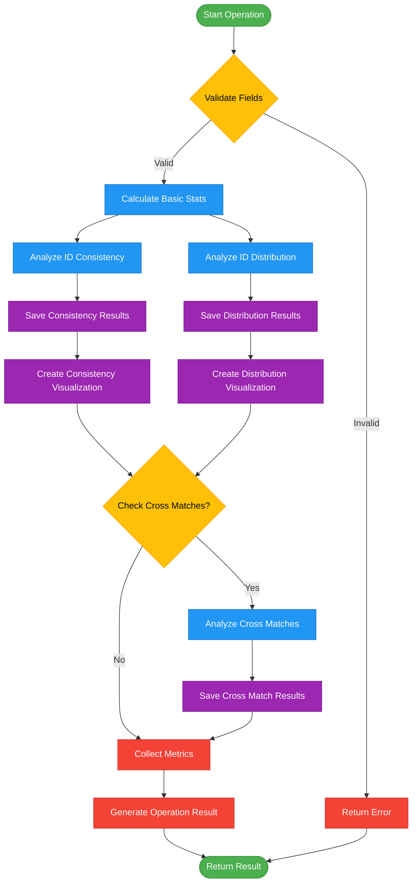
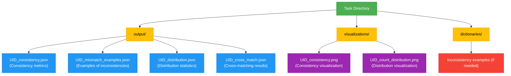

# Identity Analysis Module Documentation

## 1. Overview

The `identity.py` module provides a framework for analyzing identifier fields in datasets, focusing on three key areas:

1. **Identifier Consistency** - Analyzing how well identifiers align with their reference fields
2. **Record Distribution** - Examining the distribution of records across unique identifiers
3. **Cross-Matching Analysis** - Finding cases where reference fields match but identifiers differ

This module is designed as part of the PAMOLA.CORE profiling system and follows the operation architecture pattern, implementing a `FieldOperation` subclass.

## 2. Pamola Core Components

### 2.1 `IdentityAnalysisOperation` Class

A specialized operation for analyzing identity fields. The operation analyzes a primary identifier field (like a UID) and its relationships to other fields in the dataset.

```python
class IdentityAnalysisOperation(FieldOperation):
    """
    Operation for analyzing identity fields and their consistency.
    
    This operation analyzes:
    1. Distribution of records per identifier
    2. Consistency between identifiers and reference fields
    3. Cross-matching of identifiers
    """
    
    def __init__(self, 
                uid_field: str, 
                reference_fields: List[str],
                id_field: Optional[str] = None, 
                description: str = ""):
        # ...
```

#### Key Parameters

- **uid_field**: Primary identifier field to analyze (e.g., 'UID')
- **reference_fields**: List of fields that define an entity's identity (e.g., ['first_name', 'last_name', 'birth_day'])
- **id_field**: Optional entity identifier field (e.g., 'resume_id'), used to analyze entities per identifier
- **description**: Optional description of the operation

#### Output Metrics

| Metric | Description |
|--------|-------------|
| `total_records` | Total number of records in the dataset |
| `unique_identifiers` | Number of unique identifiers found |
| `identifier_coverage` | Percentage of records with non-null identifiers |
| `consistent_percentage` | Percentage of identifier-reference field combinations that are consistent |
| `inconsistent_count` | Number of inconsistent combinations |
| `max_records_per_identifier` | Maximum number of records associated with a single identifier |
| `avg_records_per_identifier` | Average number of records associated with each identifier |
| `cross_match_count` | Number of cases where reference fields match but identifiers differ |

#### Output Artifacts

| Artifact                            | Type | Description                                               |
| ----------------------------------- | ---- | --------------------------------------------------------- |
| `{id_field}_consistency.json`       | JSON | Consistency analysis results                              |
| `{id_field}_mismatch_examples.json` | JSON | Examples of inconsistent identifiers                      |
| `{id_field}_distribution.json`      | JSON | Distribution of records per identifier                    |
| `{id_field}_cross_match.json`       | JSON | Cases where reference fields match but identifiers differ |
| `{id_field}_consistency.png`        | PNG  | Visualization of consistency percentages                  |
| `{id_field}_count_distribution.png` | PNG  | Visualization of record distribution                      |

### 2.2`analyze_identities` Function

A helper function to analyze multiple identity fields in a dataset.

```python
def analyze_identities(
        data_source: DataSource,
        task_dir: Path,
        reporter: Any,
        identity_fields: Dict[str, Dict[str, Any]] = None,
        **kwargs) -> Dict[str, OperationResult]:
    # ...
```

#### Key Parameters

- **data_source**: Source of data for the operations
- **task_dir**: Directory where task artifacts should be saved
- **reporter**: Reporter object for tracking progress and artifacts
- **identity_fields**: Dictionary mapping field names to their configuration (reference_fields, id_field)
- **kwargs**: Additional parameters for the operations:
  - `top_n`: Number of top entries to include (default: 15)
  - `check_cross_matches`: Whether to analyze cross matches (default: True)
  - `include_timestamps`: Whether to include timestamps (default: True)
  - `track_progress`: Whether to track progress (default: True)

## 3. Key Features

### 3.1. Flexible Reference Field Handling

The module gracefully handles missing reference fields, allowing analysis to continue with available fields. This makes it robust when dealing with incomplete datasets.

```python
# Validate reference fields
valid_reference_fields = [field for field in reference_fields if field in df.columns]
if valid_reference_fields:
    # Use only the fields that actually exist in the dataframe
    # ...
```

### 3.2. Comprehensive Consistency Analysis

The operation performs a detailed analysis of how consistent identifiers are with their reference fields, providing both statistics and concrete examples of inconsistencies.

### 3.3. Entity Distribution Analysis

When provided with an entity field (like resume_id), the operation analyzes how many entities correspond to each identifier, revealing patterns like one-to-many relationships.

### 3.4. Cross-Matching Detection

The operation can identify potential duplicate entities where reference fields match but identifiers differ, which is crucial for data quality assessment.

### 3.5. Visualization Support

The operation generates visualizations for key metrics, making it easier to understand the analysis results at a glance.

### 3.6. Performance Considerations

The module includes provisions for handling larger datasets, with features like valid field filtering to optimize processing.

## 4. Module Structure  & Data Flow
### 4.1 Class Diagram




### 4.2 Identity Analysis Workflow



### 4.3 Identity Analysis Artifacts Hierarchy





## 5. Usage Examples

### 5.1 Example 1: Basic Identity Analysis

```python
from pamola_core.profiling.analyzers.identity import IdentityAnalysisOperation
from pamola_core.utils.ops.op_data_source import DataSource
from pathlib import Path

# Create a data source
data_source = DataSource.from_file_path("customer_data.csv")

# Create the operation
operation = IdentityAnalysisOperation(
    uid_field="customer_id",
    reference_fields=["first_name", "last_name", "email"],
    id_field="account_id"
)

# Execute the operation
result = operation.run(
    data_source=data_source,
    task_dir=Path("./output"),
    reporter=reporter,
    track_progress=True
)

# Check the metrics
print(f"Consistency: {result.metrics['consistent_percentage']}%")
print(f"Records per ID: {result.metrics['avg_records_per_identifier']}")
```

### 5.2 Example 2: Analyzing Multiple Identity Fields

```python
from pamola_core.profiling.analyzers.identity import analyze_identities
from pamola_core.utils.ops.op_data_source import DataSource
from pathlib import Path

# Create a data source
data_source = DataSource.from_file_path("users.csv")

# Define multiple identity fields to analyze
identity_fields = {
    "user_id": {
        "reference_fields": ["username", "email"],
        "id_field": "session_id"
    },
    "ssn": {
        "reference_fields": ["first_name", "last_name", "dob"],
        "id_field": "household_id"
    }
}

# Analyze all identity fields
results = analyze_identities(
    data_source=data_source,
    task_dir=Path("./output"),
    reporter=reporter,
    identity_fields=identity_fields,
    top_n=20,
    check_cross_matches=True
)

# Process results
for field_name, result in results.items():
    if result.status == OperationStatus.SUCCESS:
        print(f"{field_name}: {result.metrics['consistent_percentage']}% consistent")
```

### 5.3 Example 3: Task Integration

```python
# In a task module:
def configure_operations(self):
    # Add identity analysis operations
    self.add_operation(
        "IdentityAnalysisOperation",
        uid_field="UID",
        reference_fields=["first_name", "last_name", "birth_day"],
        id_field="resume_id"
    )
```

## 6. Conclusions
### 6.1 Best Practices

1. **Select reference fields carefully**: Choose fields that genuinely define an entity's identity.

2. **Analyze patterns, not just metrics**: Look at the distributions and examples provided, not just the summary metrics.

3. **Consider entity relationships**: When possible, provide an id_field to analyze relationships between identifiers and entities.

4. **Start with data quality analysis**: Use this module early in profiling workflows to establish data quality.

5. **Combine with other profile operations**: For a complete profile, combine identity analysis with categorical, numerical, and date analysis operations.

### 6.2 Future Extensions

The module is designed to accommodate these future extensions:

1. **Fuzzy matching**: Implementation of similarity-based matching for reference fields.

2. **Identity resolution**: Capabilities to suggest merging or splitting entities based on analysis.

3. **Time-based analysis**: Tracking how identifiers and their reference fields change over time.

4. **Rule-based validation**: Custom rules for validating identifier consistency.

5. **Machine learning integration**: Models for predicting identifier assignment or entity matching.