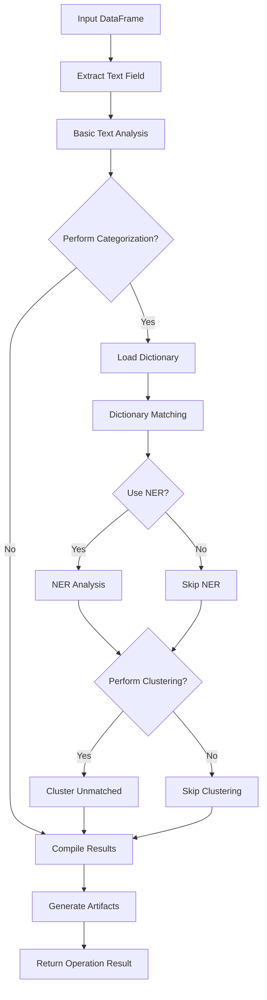

# TextSemanticCategorizerOperation Documentation

## Overview

`TextSemanticCategorizerOperation` is a text analysis and categorization module designed for profiling short text fields (typically under 255 characters) that contain meaningful semantic content such as job positions, organizations, skills, or transaction descriptions. This module is part of the data profiling and anonymization pipeline in the PAMOLA.CORE project.

The operation performs three main functions:
1. **Basic text analysis**: Statistics on null values, text length, and language detection
2. **Semantic categorization**: Classification of text using dictionaries, NER, and clustering
3. **Artifact generation**: Creation of visual and data artifacts for downstream analysis and anonymization

## Features

- **Multi-strategy categorization**: Dictionary-based matching, Named Entity Recognition (NER), and clustering for unmatched items
- **Multi-language support**: Primary support for English and Russian with extensibility to other languages
- **Hierarchical category dictionaries**: Support for complex category structures with domains, levels, and aliases
- **Conflict resolution**: Smart resolution of category conflicts using configurable strategies
- **Performance optimization**: Chunk-based processing for large datasets and comprehensive caching
- **Visualization**: Automatic generation of category distribution charts and statistics
- **Customization**: Multiple configuration options for tailoring the analysis process

## Architecture

```
┌──────────────────────────────────┐
│ TextSemanticCategorizerOperation │
│ (inherits from FieldOperation)   │
└─────────────────┬────────────────┘
                  │
     ┌────────────┴─────────────┐
     │                          │
┌────▼───────┐          ┌───────▼───────┐
│  Basic     │          │  Semantic     │
│  Analysis  │          │  Categorizer  │
└────┬───────┘          └───────┬───────┘
     │                          │
┌────▼──────────────────────────▼─────┐
│        Results Compilation          │
│  - Category distribution            │
│  - Length statistics                │
│  - Language analysis                │
│  - Visualization generation         │
└─────────────────┬───────────────────┘
                  │
┌─────────────────▼───────────────────┐
│           Artifacts                 │
│  - JSON analysis results            │
│  - CSV category mappings            │
│  - Unresolved terms list            │
│  - Visualization charts             │
└─────────────────────────────────────┘
```

## Data Flow



## Key Parameters

| Parameter                | Type  | Default          | Description                                                             |
| ------------------------ | ----- | ---------------- | ----------------------------------------------------------------------- |
| `field_name`             | str   | (required)       | Name of the field to analyze                                            |
| `entity_type`            | str   | "generic"        | Type of entities to extract ("job", "organization", "skill", "generic") |
| `dictionary_path`        | Path  | None             | Path to the semantic categories dictionary file                         |
| `min_word_length`        | int   | 3                | Minimum length for words to include in token analysis                   |
| `clustering_threshold`   | float | 0.7              | Similarity threshold for clustering (0-1)                               |
| `use_ner`                | bool  | True             | Whether to use Named Entity Recognition for uncategorized texts         |
| `perform_categorization` | bool  | True             | Whether to perform semantic categorization                              |
| `perform_clustering`     | bool  | True             | Whether to perform clustering for unmatched items                       |
| `match_strategy`         | str   | "specific_first" | Strategy for resolving category conflicts                               |
| `chunk_size`             | int   | 10000            | Size of data chunks for processing large datasets                       |
| `use_cache`              | bool  | True             | Whether to use caching for intermediate results                         |
| `cache_dir`              | Path  | None             | Directory to store cache files                                          |

## Dictionary Format

The operation uses a JSON dictionary with a hierarchical structure of categories:

```json
{
  "categories_hierarchy": {
    "IT": {
      "alias": "it",
      "domain": "General",
      "level": 0,
      "children": ["Development", "Engineering", "Data"]
    },
    "Development": {
      "alias": "разработка",
      "domain": "IT",
      "level": 1,
      "parent_category": "IT",
      "children": ["Frontend", "Backend", "Mobile"],
      "keywords": ["разработка", "development", "программирование"],
      "language": ["en", "ru"]
    },
    "Python Ecosystem Specialist": {
      "alias": "python_ecosystem",
      "domain": "Backend",
      "level": 2,
      "parent_category": "Backend",
      "seniority": "Any",
      "keywords": ["python", "django", "flask", "numpy", "pandas"],
      "language": ["en"]
    }
  }
}
```

## Generated Artifacts

The operation produces several artifacts in the specified task directory:

1. **`<field_name>_text_semantic_analysis.json`**: Complete analysis results with statistics
2. **`<field_name>_semantic_roles.json`**: Categorized field entries with match information
3. **`<field_name>_category_mappings.csv`**: Mapping of original text to categories (for anonymization)
4. **`<field_name>_unresolved_terms.csv`**: Entries not matched by any method
5. **Visualization charts**:
   - `<field_name>_category_distribution.png`: Pie chart of top categories
   - `<field_name>_alias_distribution.png`: Bar chart of alias replacements
   - `<field_name>_length_distribution.png`: Histogram of text lengths

## Category Matching Strategy

The operation uses a multi-tier approach for category matching:

1. **Dictionary-based matching** (highest priority):
   - Matches text against keywords in the dictionary
   - Uses "longest specific match first" strategy
   - Considers level in hierarchy (more specific categories first)

2. **NER-based matching** (medium priority):
   - Uses spaCy models to extract named entities
   - Maps recognized entities to dictionary categories when possible
   - Supports English and Russian models (extensible to other languages)

3. **Clustering** (lowest priority):
   - Groups unmatched texts by similarity
   - Assigns temporary cluster categories
   - Configurable similarity threshold

## Usage Examples

### Basic Usage

```python
from pamola_core.utils.ops.op_data_source import DataFrameSource
from pamola_core.profiling.analyzers.text import TextSemanticCategorizerOperation
from pamola_core.utils.ops.op_task import BaseTask
import pandas as pd
from pathlib import Path

# Create a DataFrame with text data
df = pd.DataFrame({
    "job_title": ["Python Developer", "Senior Data Scientist", "Project Manager", 
                 "Разработчик Java", "Backend Engineer", "ML Engineer"]
})

# Create a data source from the DataFrame
data_source = DataFrameSource(df)

# Create the operation
operation = TextSemanticCategorizerOperation(
    field_name="job_title",
    entity_type="job",
    dictionary_path="dictionaries/jobs.json",
    use_ner=True,
    perform_clustering=True
)

# Define task directory
task_dir = Path("tasks/job_title_analysis")

# Create reporter and progress tracker
reporter = SimpleReporter()
progress_tracker = ProgressTracker(total_steps=5)

# Execute the operation
result = operation.execute(
    data_source=data_source,
    task_dir=task_dir,
    reporter=reporter,
    progress_tracker=progress_tracker
)

# Check results
print(f"Operation status: {result.status}")
print(f"Metrics: {result.metrics}")
print(f"Artifacts: {result.artifacts}")
```

### Integration with Task Framework

```python
from pamola_core.utils.ops.op_task import BaseTask
from pamola_core.profiling.analyzers.text import TextSemanticCategorizerOperation
from pamola_core.utils.ops.op_registry import register_operation

# Register the operation
register_operation("text_semantic", TextSemanticCategorizerOperation)

# Create a task class
class TextProfilingTask(BaseTask):
    def __init__(self, config):
        super().__init__(config)
        self.operations = []
        
    def configure(self):
        # Configure operations based on config
        text_fields = self.config.get("text_fields", [])
        for field in text_fields:
            self.operations.append(
                TextSemanticCategorizerOperation(
                    field_name=field,
                    entity_type=self.config.get("entity_type", "generic"),
                    dictionary_path=self.config.get("dictionary_path"),
                    use_ner=self.config.get("use_ner", True)
                )
            )
    
    def execute(self):
        # Execute all operations
        results = []
        for op in self.operations:
            result = op.execute(
                data_source=self.data_source,
                task_dir=self.task_dir,
                reporter=self.reporter,
                progress_tracker=self.progress_tracker
            )
            results.append(result)
        return results

# Usage
config = {
    "text_fields": ["job_title", "skills", "education"],
    "entity_type": "job",
    "dictionary_path": "dictionaries/jobs.json",
    "use_ner": True
}

task = TextProfilingTask(config)
task.configure()
results = task.execute()
```

## Best Practices

1. **Prepare dictionaries carefully**:
   - Ensure keywords cover common variations of terms
   - Use multi-language keywords when necessary
   - Organize hierarchical categories logically

2. **Performance optimization**:
   - Set appropriate `chunk_size` for your dataset
   - Enable caching for repeated operations
   - Consider disabling NER for very large datasets if performance is an issue

3. **Post-processing**:
   - Review `category_mappings.csv` to refine category assignments
   - Analyze unresolved terms to identify potential dictionary additions
   - Use visualizations to identify imbalanced categories

## Future Improvements

1. **Enhanced security**:
   - Add encryption for sensitive mapping files
   - Implement access controls for artifact access

2. **Extended language support**:
   - Add support for additional languages
   - Improve multilingual entity recognition

3. **Advanced clustering**:
   - Implement semantic similarity for clustering (word embeddings)
   - Add auto-naming of clusters based on common terms

4. **Feedback loop**:
   - Implement a mechanism to incorporate user feedback on categorization
   - Add a learning component to improve categorization over time

5. **Integration with anonymization**:
   - Direct integration with anonymization operations
   - Support for differential privacy in replacements

6. **Enhanced visualization**:
   - Interactive visualizations for category exploration
   - Hierarchical visualizations of category structures

## Troubleshooting

### Common Issues

1. **Missing dictionary file**: Ensure the dictionary path is correct or provide a default dictionary
2. **Performance with large datasets**: Increase chunk size or disable NER for very large datasets
3. **Low categorization rate**: Review and expand dictionary keywords to cover more variations
4. **Conflict between categories**: Adjust match strategy or review hierarchical structure

### Logging

The operation uses the logger configured in `pamola_core.utils.logging.get_logger` and provides detailed log messages at different levels:

- `INFO`: General operation status and progress
- `WARNING`: Non-critical issues (e.g., missing dictionary, fallback to defaults)
- `ERROR`: Critical errors that prevent successful operation
- `DEBUG`: Detailed information useful for troubleshooting

## Dependencies

- `pamola_core.utils.io`: File operations for loading/saving artifacts
- `pamola_core.utils.visualization`: Chart generation
- `pamola_core.utils.progress`: Progress tracking
- `pamola_core.utils.logging`: Logging utilities
- `pamola_core.utils.nlp`: NLP functionality (tokenization, language detection, etc.)
- `pamola_core.utils.ops`: Operation framework

## References

- [PAMOLA.CORE Project Documentation](https://example.com/pamola_core-docs)
- [Text Categorization Best Practices](https://example.com/text-categorization)
- [spaCy Named Entity Recognition](https://spacy.io/usage/linguistic-features#named-entities)