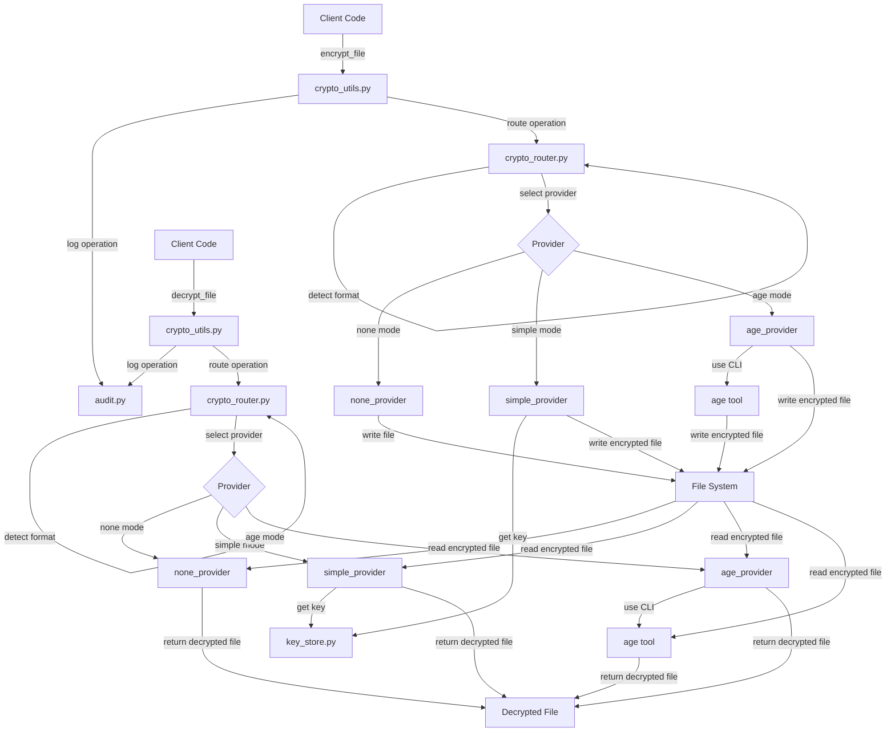

# PAMOLA CORE Cryptographic Subsystem 

## Introduction

The PAMOLA PAMOLA.CORE Cryptographic Subsystem provides a flexible, modular, and secure infrastructure for encrypting sensitive data throughout the application's workflow. It handles encryption of files, in-memory data, and supports multiple operational modes to accommodate various security and usability requirements.

**Main Purpose:**
- Protect sensitive data during processing and at rest
- Ensure minimal friction for developers in trusted environments
- Provide upgrade paths to advanced security practices
- Support multiple encryption modes with different security/usability tradeoffs

**Key Features:**
- Three operational modes (none, simple, age)
- Automatic format detection
- Secure key management
- Audit logging of cryptographic operations
- Legacy format support and migration

## System Architecture

The cryptographic subsystem follows a modular, provider-based architecture that separates concerns and enables easy extension.

### Integration with PAMOLA PAMOLA.CORE

The cryptographic subsystem integrates with the rest of the PAMOLA PAMOLA.CORE system primarily through the I/O operations layer:

- **Task Execution Integration**: The `encrypt_file()` and `decrypt_file()` functions are called from task execution workflows, particularly during I/O operations handled via `io.py`. The encryption system is transparent to the calling task logic, provided the encryption mode and key (or reference) are passed correctly.

- **Pipeline Integration**: Data pipelines automatically handle encryption/decryption of intermediate files based on task configuration. Each task can specify its encryption requirements, and the pipeline manager ensures data is properly secured throughout the workflow.

- **Task-Specific Keys**: By default, each task receives its own encryption key, stored in the key store. This ensures isolation between tasks and limits the impact of key compromise.

- **Transparent Operation**: For most task implementers, the encryption is transparent - they simply use the standard I/O functions, and the system handles encryption based on configuration.

### Package Structure

```
pamola_core/
├── utils/
│   ├── io_helpers/
│   │   ├── crypto_utils.py         # Public API (imports register_all_providers)
│   │   ├── crypto_router.py        # Router to select provider
│   │   └── provider_interface.py   # Base interface for providers
│   │
│   └── crypto_helpers/
│       ├── register_providers.py   # Module to register all providers
│       ├── errors.py               # Exception hierarchy
│       ├── audit.py                # Audit logging module
│       ├── key_store.py            # Key management module
│       ├── legacy_migration.py     # Migration from legacy formats
│       │
│       └── providers/
│           ├── __init__.py         # Exports AVAILABLE_PROVIDERS list
│           ├── none_provider.py    # Provider: no encryption
│           ├── simple_provider.py  # Provider: AES-GCM
│           └── age_provider.py     # Provider: age CLI integration
```

### Component Overview

The architecture consists of several key components that work together:

```
┌────────────────────┐
│     Client Code    │  ← Uses the crypto_utils.py API
└─────────┬──────────┘
          │
┌─────────▼──────────┐
│  crypto_utils.py   │  ← Public API layer
└─────────┬──────────┘
          │
┌─────────▼──────────┐
│  crypto_router.py  │  ← Selects appropriate provider
└─────────┬──────────┘
          │
   ┌──────┴───────┐
   ▼              ▼
┌──────────┐  ┌─────────────┐
│ Provider │  │  key_store  │  ← Manages encryption keys
└────┬─────┘  └──────┬──────┘
     │               │
     │         ┌─────▼────┐
     │         │ Master   │
     │         │   Key    │
     │         └──────────┘
     │
┌────▼───┬────────┬────────┐
│  none  │ simple │  age   │  ← Encryption providers
└────────┴────────┴────────┘
```

Each component has a distinct responsibility:

1. **Public API** (`crypto_utils.py`): Entry point for client code, handles operation logging and provides a simplified interface.

2. **Router** (`crypto_router.py`): Detects formats, selects appropriate providers, and routes operations.

3. **Provider Interface** (`provider_interface.py`): Defines the common interface that all encryption providers must implement.

4. **Providers**: Implement specific encryption algorithms and file formats:
   - `none_provider.py`: No encryption, useful for debugging and testing
   - `simple_provider.py`: AES-GCM encryption with JSON metadata
   - `age_provider.py`: XChaCha20-Poly1305 via the `age` tool

5. **Key Store** (`key_store.py`): Manages task-specific encryption keys, protecting them with a master key.

6. **Audit Logging** (`audit.py`): Records all cryptographic operations for compliance and security monitoring.

7. **Error Handling** (`errors.py`): Provides a structured hierarchy of exceptions for better error reporting.

8. **Legacy Migration** (`legacy_migration.py`): Handles detection and migration of legacy encrypted formats.

### Data Flow

The following diagram illustrates the flow of data during encryption and decryption operations:



## Encryption Modes

The subsystem supports three operational modes:

1. **None Mode**
   - No encryption, direct file operations
   - Used for development, testing, and debugging
   - Fastest performance, no security

2. **Simple Mode**
   - AES-GCM encryption (256-bit key)
   - Uses JSON metadata format
   - Built-in key management
   - Good balance of security and ease of use

3. **Age Mode**
   - XChaCha20-Poly1305 encryption via the `age` CLI tool
   - Stream-based for large files
   - Supports both passphrase and public/private key modes
   - Highest security, relies on external tool

### Mode Comparison

| Feature | None Mode | Simple Mode | Age Mode |
|---------|-----------|-------------|----------|
| **Encryption Algorithm** | None | AES-GCM | XChaCha20-Poly1305 |
| **Key Length** | N/A | 256-bit | 256-bit |
| **File Format** | Original | JSON | Binary stream |
| **Large File Support** | Yes | Limited (in-memory) | Yes (streaming) |
| **Metadata Support** | No | Yes (integrated) | Yes (separate file) |
| **Key Management** | None | Built-in | External or built-in |
| **Performance** | Fastest | Medium | Medium-Fast |
| **Use Case** | Development, Testing | Standard usage | High security, Large files |
| **External Dependencies** | None | Cryptography library | Age CLI tool |

### Fallback Behavior

When the encryption format cannot be determined:

- If no known format is detected, the system will assume `none` mode and emit a warning, unless a legacy format pattern is found
- This default behavior can be overridden via the configuration flag `ENCRYPTION_FALLBACK_MODE`
- For critical operations, always specify the expected encryption mode explicitly to avoid fallback to insecure modes

### File Format Example (Simple Mode)

The `simple` mode encryption produces a JSON structure with the following format:

```json
{
  "version": "1.0",
  "mode": "simple",
  "algorithm": "AES-GCM",
  "timestamp": "2025-05-01T12:30:45Z",
  "key_derivation": "PBKDF2-SHA256",
  "iterations": 100000,
  "file_info": {
    "original_filename": "client_data.csv",
    "original_size": 2425,
    "original_modified": "2025-05-01T10:15:30Z",
    "description": "Client transaction data"
  },
  "iv": "base64-encoded-initialization-vector",
  "salt": "base64-encoded-salt",
  "data": "base64-encoded-encrypted-data",
  "format": "json"
}

## API Reference

### Pamola Core Functions

These functions form the primary public API in `crypto_utils.py`:

#### `encrypt_file(source_path, destination_path, key=None, mode="simple", task_id=None, description=None, **kwargs) -> Path`

Encrypts a file and saves it to a new location.

**Parameters:**
- `source_path`: Path to the file to encrypt
- `destination_path`: Path where to save the encrypted file
- `key`: Encryption key (optional, if None uses task key)
- `mode`: Encryption mode: "none", "simple", or "age"
- `task_id`: Identifier for the task (for key management and audit)
- `description`: Human-readable description of the file
- `**kwargs`: Additional mode-specific parameters

**Returns:**
- Path to the encrypted file

#### `decrypt_file(source_path, destination_path, key=None, mode=None, task_id=None, **kwargs) -> Path`

Decrypts a file and saves it to a new location.

**Parameters:**
- `source_path`: Path to the encrypted file
- `destination_path`: Path where to save the decrypted file
- `key`: Decryption key (optional, if None uses task key)
- `mode`: Encryption mode (optional, auto-detected if not specified)
- `task_id`: Identifier for the task (for key management and audit)
- `**kwargs`: Additional mode-specific parameters

**Returns:**
- Path to the decrypted file

#### `encrypt_data(data, key=None, mode="simple", task_id=None, description=None, **kwargs) -> Union[str, bytes, Dict]`

Encrypts data in memory.

**Parameters:**
- `data`: Data to encrypt (string or bytes)
- `key`: Encryption key (optional, if None uses task key)
- `mode`: Encryption mode: "none", "simple", or "age"
- `task_id`: Identifier for the task (for key management and audit)
- `description`: Human-readable description of the data
- `**kwargs`: Additional mode-specific parameters

**Returns:**
- Encrypted data (format depends on mode)

#### `decrypt_data(data, key=None, mode=None, task_id=None, **kwargs) -> Union[str, bytes]`

Decrypts data in memory.

**Parameters:**
- `data`: Data to decrypt (string, bytes, or Dict)
- `key`: Decryption key (optional, if None uses task key)
- `mode`: Encryption mode (optional, auto-detected if not specified)
- `task_id`: Identifier for the task (for key management and audit)
- `**kwargs`: Additional mode-specific parameters

**Returns:**
- Decrypted data

### Key Management

The key management functions are available through the `key_store` module:

#### `get_key_for_task(task_id) -> str`

Gets an encryption key for a specific task, generating a new one if it doesn't exist.

**Parameters:**
- `task_id`: Identifier for the task

**Returns:**
- The encryption key

#### `EncryptedKeyStore` Class

For more advanced key management needs, the `EncryptedKeyStore` class provides:

- `store_task_key(task_id, key, metadata=None)`
- `load_task_key(task_id)`
- `delete_task_key(task_id)`
- `list_task_keys()`
- `generate_task_key(task_id, metadata=None)`
- `is_master_key_exposed()`

### Utility Functions

Additional utility functions help with encryption management:

#### `is_encrypted(data_or_path) -> bool`

Checks if data or a file appears to be encrypted.

**Parameters:**
- `data_or_path`: Data or file path to check

**Returns:**
- True if the data or file appears to be encrypted

#### `get_encryption_info(data_or_path) -> Dict`

Gets information about encrypted data or file.

**Parameters:**
- `data_or_path`: Data or file path to check

**Returns:**
- Dictionary with encryption metadata

## Installation Guide

### Prerequisites

- Python 3.7+ 
- Required Python packages:
  - `cryptography`
  - Any dependencies of your application

### Age Provider Configuration

The `age_provider.py` module reads configuration from environment variables or can be configured programmatically. The following configuration options are available:

| Environment Variable | Default | Description |
|---------------------|---------|-------------|
| `PAMOLA_AGE_BINARY` | `"age"` | Path to the age binary executable |
| `PAMOLA_AGE_IDENTITY_FILE` | `""` | Path to the identity key file for decryption |
| `PAMOLA_AGE_RECIPIENTS_FILE` | `""` | Path to file containing recipient public keys |
| `PAMOLA_AGE_RECIPIENTS` | `""` | Comma-separated list of recipient public keys |

#### Configuration Modes

The Age provider supports two primary operational modes:

1. **Passphrase Mode**
   - A passphrase is provided directly to the `encrypt_file`/`decrypt_file` functions via the `key` parameter
   - No environment variables are needed
   - Less secure but simpler to use

2. **Public/Private Key Mode**
   - Uses identity files (containing private keys) for decryption
   - Uses recipient public keys for encryption
   - More secure and suitable for automated workflows
   - Requires proper configuration of environment variables

#### Sample Configuration in Code

```python
import os

# Configure age provider to use public/private key mode
os.environ["PAMOLA_AGE_BINARY"] = "/usr/local/bin/age"
os.environ["PAMOLA_AGE_IDENTITY_FILE"] = "/path/to/identities.txt"
os.environ["PAMOLA_AGE_RECIPIENTS"] = "age1xt4alok0zk9kx45quc3xx488u722q2lrj5ujtqhstx0vh6pmelqnhklyd"
```

### Key Generation and Validation

The key management system follows these principles:

- **Key Generation**: Key generation is delegated to task logic or initialization code. Each task should use a unique 256-bit key, optionally derived from a password using PBKDF2. 

- **Key Validation**: Keys are validated based on format (base64-encoded, proper length) when loaded from the key store.

- **Key Rotation**: The `EncryptedKeyStore` provides storage and retrieval functionality but does not automatically generate or rotate keys. Task implementations should handle key rotation based on security requirements.

- **Master Key**: The master key is used only to encrypt individual task keys. It should be properly secured and backed up according to organizational security policies.

### Installing Age (for 'age' mode)

The 'age' mode requires the `age` encryption tool to be installed on your system.

#### Windows

1. **Using Scoop**:
   ```powershell
   scoop install age
   ```

2. **Using Chocolatey**:
   ```powershell
   choco install age.portable
   ```

3. **Manual installation**:
   - Download the latest Windows release from [age-encryption.org/releases](https://age-encryption.org/releases)
   - Extract the ZIP file
   - Add the extracted folder to your PATH

4. **Set environment variable**:
   ```powershell
   $env:PAMOLA_AGE_BINARY = "C:\path\to\age.exe"
   ```

#### Linux/WSL

1. **Using package manager**:

   **Ubuntu/Debian**:
   ```bash
   sudo apt update
   sudo apt install age
   ```

   **Fedora**:
   ```bash
   sudo dnf install age
   ```

   **Arch Linux**:
   ```bash
   sudo pacman -S age
   ```

2. **Using Go**:
   ```bash
   go install filippo.io/age/cmd/...@latest
   ```

3. **Set environment variable** (optional):
   ```bash
   export PAMOLA_AGE_BINARY=/usr/bin/age
   ```

## Usage Examples

### Basic File Encryption

The simplest way to encrypt a file is using the default settings:

```python
from pamola_core.utils.io_helpers.crypto_utils import encrypt_file, decrypt_file

# Encrypt a file using the default 'simple' mode
encrypted_path = encrypt_file(
    source_path="sensitive_data.csv",
    destination_path="encrypted_data.enc",
    task_id="data_processing_task"
)

# Decrypt the file (mode will be auto-detected)
decrypted_path = decrypt_file(
    source_path="encrypted_data.enc",
    destination_path="recovered_data.csv",
    task_id="data_processing_task"
)
```

### In-Memory Data Encryption

For encrypting data in memory:

```python
from pamola_core.utils.io_helpers.crypto_utils import encrypt_data, decrypt_data

# Original sensitive data
sensitive_data = "This is sensitive information that needs encryption"

# Encrypt the data
encrypted_data = encrypt_data(
    data=sensitive_data,
    task_id="memory_encryption_task"
)

# Decrypt the data
decrypted_data = decrypt_data(
    data=encrypted_data,
    task_id="memory_encryption_task"
)

assert decrypted_data.decode('utf-8') == sensitive_data
```

### Custom Key Management

For more control over key management:

```python
from pamola_core.utils.crypto_helpers.key_store import EncryptedKeyStore

# Create a key store
key_store = EncryptedKeyStore()

# Generate a new key for a task
task_key = key_store.generate_task_key(
    task_id="custom_key_task",
    metadata={"purpose": "API authentication", "owner": "security_team"}
)

# List all task keys
task_keys = key_store.list_task_keys()
for task in task_keys:
    print(f"Task: {task['task_id']}, Created: {task['created']}")

# Delete a task key when no longer needed
key_store.delete_task_key("completed_task")
```

### Using Age Mode with Public/Private Keys

For the highest security level using `age` mode with public/private keys:

```python
import os
from pamola_core.utils.io_helpers.crypto_utils import encrypt_file, decrypt_file

# Set environment variables for age
os.environ["PAMOLA_AGE_RECIPIENTS"] = "age1xt4alok0zk9kx45quc3xx488u722q2lrj5ujtqhstx0vh6pmelqnhklyd"
os.environ["PAMOLA_AGE_IDENTITY_FILE"] = "~/.config/age/keys.txt"

# Encrypt a file using 'age' mode
encrypted_path = encrypt_file(
    source_path="highly_sensitive.dat",
    destination_path="highly_sensitive.age",
    mode="age", 
    description="Contains sensitive financial data"
)

# Decrypt the file
decrypted_path = decrypt_file(
    source_path="highly_sensitive.age",
    destination_path="recovered_sensitive.dat"
)
```

### Handling Legacy Formats

When dealing with files that might be in a legacy format:

```python
from pamola_core.utils.crypto_helpers.legacy_migration import auto_migrate_if_needed
from pamola_core.utils.io_helpers.crypto_utils import decrypt_file

# Check if the file is in a legacy format and migrate if needed
source_path, was_migrated = auto_migrate_if_needed(
    source_path="possibly_legacy_file.enc",
    destination_path="migrated_file.enc",
    key="legacy_encryption_key"
)

if was_migrated:
    print("File was in a legacy format and has been migrated")

# Now decrypt the file (either original or migrated)
decrypted_path = decrypt_file(
    source_path=source_path,
    destination_path="decrypted_file.dat",
    key="legacy_encryption_key"
)
```

## Security Considerations

1. **Master Key Protection**
   - The master key is stored in `configs/master.key` 
   - For production, consider using a system keyring or HSM
   - Monitor `is_master_key_exposed()` for insecure permissions

2. **Key Rotation**
   - Regularly rotate task keys for sensitive operations
   - Consider implementing a key rotation schedule

3. **Age Mode Security**
   - Always prefer public/private key mode over passphrase mode
   - Store identity keys securely, ideally on separate devices
   - Consider hardware-based key storage for critical deployments

4. **Audit Logging**
   - Ensure audit logs are monitored and reviewed regularly
   - Configure log storage according to retention policies
   - Protect audit logs from tampering

5. **Temporary Files**
   - The system ensures temporary files are cleaned up
   - For additional security, consider using encrypted storage for temp directories

## Integration Guidelines

When integrating the cryptographic subsystem into your application:

1. **Configuration**
   - Set appropriate environment variables for paths and modes
   - Consider creating a configuration wrapper for your application

2. **Task IDs**
   - Use consistent, meaningful task IDs across your application
   - Consider a structured naming scheme, e.g., `domain:action:identifier`

3. **Error Handling**
   - Catch specific exceptions from the exception hierarchy in `errors.py`
   - Design appropriate fallback behaviors for encryption failures

4. **Performance Considerations**
   - Use 'age' mode for large files to benefit from streaming
   - For batch operations, reuse the same task key to reduce key store access

5. **Testing**
   - Use 'none' mode for testing that doesn't require security
   - Create test fixtures with known keys for reproducible tests

## Troubleshooting

### Common Issues

1. **KeyStoreError: Error loading keys database**
   - Ensure the master key file exists and has correct permissions
   - Check that the keys database file is not corrupted

2. **AgeToolError: age encryption failed**
   - Verify that the `age` tool is installed and in PATH
   - Check the specified identity or recipient files exist
   - Review the error message for specific age tool errors

3. **EncryptionError: Error encrypting file**
   - Ensure source file exists and is readable
   - Check that the destination directory is writable
   - Verify that the key is valid

4. **DecryptionError: Invalid JSON format**
   - The file may not be encrypted with 'simple' mode
   - Try specifying the mode explicitly if it's known

### Diagnostic Tools

1. **Checking encryption type**:
   ```python
   from pamola_core.utils.io_helpers.crypto_router import detect_encryption_mode
   
   mode = detect_encryption_mode("encrypted_file.enc")
   print(f"File is encrypted using {mode} mode")
   ```

2. **Inspecting encryption metadata**:
   ```python
   from pamola_core.utils.io_helpers.crypto_utils import get_encryption_info
   
   info = get_encryption_info("encrypted_file.enc")
   print(f"Encryption info: {info}")
   ```

3. **Verifying key store access**:
   ```python
   from pamola_core.utils.crypto_helpers.key_store import EncryptedKeyStore
   
   key_store = EncryptedKeyStore()
   exposed = key_store.is_master_key_exposed()
   
   if exposed:
       print("WARNING: Master key has insecure permissions!")
   else:
       print("Master key permissions are secure")
   ```