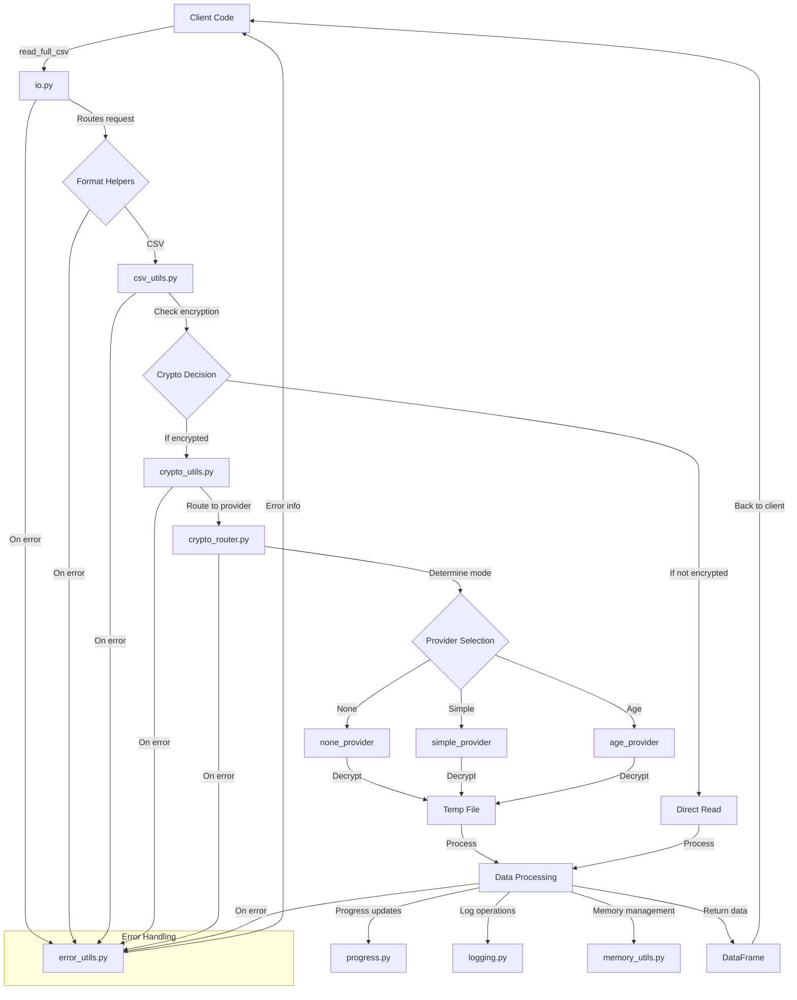

# PAMOLA.CORE I/O Subsystem Documentation

## 1. Package Overview

The PAMOLA.CORE I/O subsystem provides a comprehensive and unified interface for data input/output operations, with a strong focus on privacy-preserving data processing. It serves as the central hub for all file operations within the PAMOLA (Privacy-Preserving AI Data Processors) framework, ensuring consistent handling of datasets while protecting sensitive information through robust encryption capabilities.

The subsystem is designed as a facade pattern that orchestrates specialized helper modules, providing a clean and consistent API while delegating complex implementation details to appropriate helpers. This architecture enables the system to handle both small and extremely large datasets efficiently, with built-in support for memory optimization, progress tracking, and error handling.

Core architectural decisions include:
- Clear separation between public API (`io.py`) and implementation details (helper modules)
- Pluggable provider-based encryption subsystem with multiple security modes
- Memory-efficient processing through chunking and optional Dask integration
- Comprehensive error handling with standardized error information
- Secure temporary file management for cryptographic operations

## 2. Key Features

### General Features
- **Format Support**: Unified handling of CSV, JSON, Parquet, Excel, Pickle, and image files
- **Selective Loading**: Column and row filtering to minimize memory usage
- **Memory Optimization**: Automatic type conversion and memory estimation
- **Progress Tracking**: Detailed progress bars for long-running operations
- **Error Handling**: Standardized error information with context and resolution suggestions
- **Multi-file Processing**: Vertical stacking of multiple files with memory-aware batching

### Encryption Capabilities
The cryptographic subsystem supports three operational modes:

1. **None Mode**
   - No encryption, direct file operations
   - Used for development, testing, and non-sensitive data
   - Maximum performance with no security overhead

2. **Simple Mode**
   - AES-GCM encryption with 256-bit keys
   - JSON-based metadata format with comprehensive file information
   - Built-in key management with audit logging
   - Good balance of security and ease of use

3. **Age Mode**
   - XChaCha20-Poly1305 encryption via the `age` tool
   - Stream-based processing for very large files
   - Support for both passphrase and public/private key modes
   - Highest security level with external tool integration

## 3. Architecture

### Package Structure

```
pamola_core/
├── utils/
│   ├── io.py                 # Main facade module providing public API
│   ├── logging.py            # Centralized logging system
│   ├── progress.py           # Progress tracking system
│   │
│   ├── io_helpers/
│   │   ├── __init__.py       # Package exports
│   │   ├── csv_utils.py      # CSV-specific operations
│   │   ├── directory_utils.py # Path and directory management
│   │   ├── dask_utils.py     # Large dataset handling with Dask
│   │   ├── format_utils.py   # Format detection and validation
│   │   ├── json_utils.py     # JSON data transformation
│   │   ├── image_utils.py    # Image and plot handling
│   │   ├── error_utils.py    # Standardized error handling
│   │   ├── memory_utils.py   # Memory estimation and optimization
│   │   ├── multi_file_utils.py # Multi-file dataset processing
│   │   ├── crypto_utils.py   # Public API for encryption
│   │   ├── crypto_router.py  # Router for encryption providers
│   │   └── provider_interface.py # Base interface for providers
│   │
│   └── crypto_helpers/
│       ├── register_providers.py  # Provider registration
│       ├── errors.py         # Crypto-specific exceptions
│       ├── audit.py          # Audit logging for crypto operations
│       ├── key_store.py      # Encryption key management
│       ├── legacy_migration.py # Legacy format support
│       │
│       └── providers/
│           ├── __init__.py   # Provider exports
│           ├── none_provider.py # No-encryption provider
│           ├── simple_provider.py # AES-GCM provider
│           └── age_provider.py # Age tool integration
```

### Integration Architecture

```
┌─────────────────┐     ┌────────────────┐     ┌───────────────────┐
│                 │     │                │     │                   │
│  Client Code    │     │  Data Pipeline │     │ Analysis Modules  │
│                 │     │                │     │                   │
└────────┬────────┘     └───────┬────────┘     └─────────┬─────────┘
         │                      │                        │
         │                      │                        │
         │                      │                        │
         ▼                      ▼                        ▼
┌─────────────────────────────────────────────────────────────────┐
│                                                                 │
│                          io.py (Facade)                         │
│                                                                 │
└───────────┬───────────────────┬───────────────────┬─────────────┘
            │                   │                   │
            │                   │                   │
            ▼                   ▼                   ▼
┌──────────────────┐   ┌────────────────┐   ┌─────────────────┐
│                  │   │                │   │                 │
│ Format Handlers  │   │ Crypto System  │   │ Memory & Error  │
│                  │   │                │   │     Handlers    │
└───────┬──────────┘   └───────┬────────┘   └────────┬────────┘
        │                     │                      │
        │                     │                      │
        ▼                     ▼                      ▼
┌──────────────────┐   ┌────────────────┐   ┌──────────────────┐
│  csv_utils.py    │   │ crypto_utils.py│   │  error_utils.py  │
│  json_utils.py   │   │ crypto_router  │   │  memory_utils.py │
│  format_utils.py │   │   providers    │   │ multi_file_utils │
│  dask_utils.py   │   │   key_store    │   │ directory_utils  │
└──────────────────┘   └────────────────┘   └──────────────────┘

              ┌───────────────────────────────┐
              │                               │
              │  progress.py & logging.py     │
              │                               │
              └───────────────────────────────┘
```

### Data Flow



## 4. Pamola Core API Reference

### File Reading Functions

| Function | Description | Key Parameters | Returns |
|----------|-------------|----------------|---------|
| `read_full_csv()` | Reads an entire CSV file into a DataFrame | `file_path`, `encoding`, `delimiter`, `quotechar`, `show_progress`, `use_dask`, `encryption_key`, `columns`, `nrows`, `skiprows` | `pd.DataFrame` |
| `read_csv_in_chunks()` | Reads a CSV file in chunks | Same as `read_full_csv()` plus `chunk_size` | `Iterator[pd.DataFrame]` |
| `read_text()` | Reads a text file (e.g., TSV) | `file_path`, `encoding`, `sep`, `show_progress`, `encryption_key`, `columns`, `nrows`, `skiprows` | `pd.DataFrame` |
| `read_excel()` | Reads an Excel file | `file_path`, `sheet_name`, `show_progress`, `encryption_key`, `columns`, `nrows`, `skiprows` | `pd.DataFrame` or `Dict[str, pd.DataFrame]` |
| `read_json()` | Reads a JSON file | `file_path`, `encoding`, `encryption_key` | `Dict[str, Any]` |
| `read_parquet()` | Reads a Parquet file | `file_path`, `columns`, `encryption_key` | `pd.DataFrame` |
| `read_dataframe()` | Universal reader for any supported format | `file_path`, `file_format`, `encryption_key`, `columns`, `nrows`, `skiprows` | `pd.DataFrame` |
| `read_multi_csv()` | Reads and combines multiple CSV files | `file_paths`, `encoding`, `delimiter`, `quotechar`, `columns`, `nrows`, `skiprows`, `ignore_errors`, `show_progress`, `memory_efficient`, `encryption_key` | `pd.DataFrame` |
| `read_similar_files()` | Reads multiple files with the same format | `directory`, `pattern`, `recursive`, `columns`, `ignore_errors`, `show_progress` | `pd.DataFrame` |

### File Writing Functions

| Function | Description | Key Parameters | Returns |
|----------|-------------|----------------|---------|
| `write_dataframe_to_csv()` | Writes a DataFrame to a CSV file | `df`, `file_path`, `encoding`, `delimiter`, `quotechar`, `index`, `show_progress`, `use_dask`, `encryption_key` | `Path` |
| `write_chunks_to_csv()` | Writes DataFrame chunks to a CSV file | `chunks`, `file_path`, `encoding`, `delimiter`, `quotechar`, `index`, `encryption_key` | `Path` |
| `write_json()` | Writes a dictionary to a JSON file | `data`, `file_path`, `encoding`, `indent`, `ensure_ascii`, `convert_numpy`, `encryption_key` | `Path` |
| `append_to_json_array()` | Appends an item to a JSON array file | `item`, `file_path`, `encoding`, `indent`, `convert_numpy`, `create_if_missing`, `encryption_key` | `Path` |
| `merge_json_objects()` | Merges a dictionary with a JSON object file | `item`, `file_path`, `encoding`, `indent`, `convert_numpy`, `create_if_missing`, `overwrite_existing`, `recursive_merge`, `encryption_key` | `Path` |
| `write_parquet()` | Writes a DataFrame to a Parquet file | `df`, `file_path`, `compression`, `index`, `encryption_key` | `Path` |
| `save_visualization()` | Saves figures and plots | `figure`, `file_path`, `format`, `encryption_key` | `Path` |
| `save_plot()` | Saves matplotlib/plotly figures | `plot_fig`, `file_path`, `dpi`, `encryption_key` | `Path` |
| `save_dataframe()` | Universal writer for any supported format | `df`, `file_path`, `format`, `encryption_key` | `Path` |

### Directory Management Functions

| Function | Description | Key Parameters | Returns |
|----------|-------------|----------------|---------|
| `ensure_directory()` | Creates a directory if it doesn't exist | `directory` | `Path` |
| `get_timestamped_filename()` | Creates a filename with timestamp | `base_name`, `extension`, `include_timestamp` | `str` |
| `get_file_stats()` | Gets statistics about a file | `file_path` | `Dict[str, Any]` |
| `list_directory_contents()` | Lists files in a directory | `directory`, `pattern`, `recursive` | `List[Path]` |
| `clear_directory()` | Removes files from a directory | `directory`, `ignore_patterns`, `confirm` | `int` |
| `create_secure_temp_directory()` | Creates a secure temporary directory | `prefix`, `parent_dir`, `register_for_cleanup` | `Path` |
| `get_temp_file_for_decryption()` | Creates a temporary file for decryption | `original_file`, `suffix`, `create` | `Path` |
| `safe_remove_temp_file()` | Securely removes a temporary file | `file_path` | `bool` |

### Utility and Analysis Functions

| Function | Description | Key Parameters | Returns |
|----------|-------------|----------------|---------|
| `estimate_file_memory()` | Estimates memory needed to load a file | `file_path` | `Dict[str, Any]` |
| `get_file_metadata()` | Gets comprehensive file metadata | `file_path` | `Dict[str, Any]` |
| `optimize_dataframe_memory()` | Optimizes DataFrame memory usage | `df`, `categorical_threshold`, `inplace` | `Tuple[pd.DataFrame, Dict[str, Any]]` |
| `detect_csv_dialect()` | Detects CSV delimiter, encoding, etc. | `file_path`, `sample_size`, `encoding` | `Dict[str, Any]` |
| `validate_file_format()` | Validates a file's format | `file_path`, `expected_format` | `Dict[str, Any]` |
| `is_encrypted_file()` | Checks if a file is encrypted | `file_path` | `bool` |
| `get_system_memory()` | Gets system memory information | None | `Dict[str, float]` |
| `get_process_memory_usage()` | Gets process memory usage | None | `Dict[str, float]` |

## 5. Usage Examples

### Basic File Reading and Writing

```python
from pamola_core.utils.io import read_full_csv, write_dataframe_to_csv

# Read a CSV file with custom encoding and delimiter
df = read_full_csv(
    "data.csv",
    encoding="utf-8",
    delimiter=";",
    columns=["id", "name", "value"],  # Select only needed columns
    nrows=1000                        # Read only first 1000 rows
)

# Process the data
processed_df = process_data(df)

# Write the processed data
write_dataframe_to_csv(
    processed_df,
    "processed_data.csv",
    encoding="utf-8",
    show_progress=True
)
```

### Working with Encrypted Data

```python
from pamola_core.utils.io import read_full_csv, write_dataframe_to_csv, is_encrypted_file

# Check if a file is encrypted
if is_encrypted_file("sensitive_data.csv"):
    print("File is encrypted")

# Define an encryption key (in production, retrieve securely)
encryption_key = "YourSecureEncryptionKey123"

# Read an encrypted file
df = read_full_csv(
    "sensitive_data.csv",
    encryption_key=encryption_key
)

# Process the data in memory
processed_df = transform_sensitive_data(df)

# Write with encryption
write_dataframe_to_csv(
    processed_df,
    "processed_sensitive_data.csv",
    encryption_key=encryption_key  # Will be encrypted
)
```

### Memory-Efficient Processing of Large Files

```python
from pamola_core.utils.io import read_csv_in_chunks, write_chunks_to_csv

# Process a very large file in chunks
processed_chunks = []
for chunk in read_csv_in_chunks(
    "huge_file.csv",
    chunk_size=100000,
    show_progress=True
):
    # Process each chunk separately
    processed_chunk = process_large_data_chunk(chunk)
    processed_chunks.append(processed_chunk)

# Write processed chunks to a single file
write_chunks_to_csv(
    processed_chunks,
    "processed_huge_file.csv"
)
```

### Using Dask for Larger-than-Memory Processing

```python
from pamola_core.utils.io import read_full_csv

# Read a very large file with Dask
df = read_full_csv(
    "enormous_file.csv",
    use_dask=True,
    show_progress=True
)

# Dask operations are lazy until computed
result = df.groupby('category').mean().compute()
```

### Working with Multiple Files

```python
from pamola_core.utils.io import read_multi_csv, read_similar_files

# Combine multiple CSV files
combined_df = read_multi_csv(
    file_paths=["data1.csv", "data2.csv", "data3.csv"],
    columns=["id", "value"],  # Use same columns from all files
    memory_efficient=True,    # Process in batches to save memory
    show_progress=True
)

# Find and combine all CSV files in a directory
all_reports = read_similar_files(
    directory="reports_directory",
    pattern="*.csv",
    recursive=True,  # Include subdirectories
    ignore_errors=True  # Skip files with errors
)
```

### Format Detection and Conversion

```python
from pamola_core.utils.io import read_dataframe, save_dataframe, detect_csv_dialect

# Detect CSV dialect (delimiter, encoding, etc.)
dialect = detect_csv_dialect("unknown_format.csv")
print(f"Detected delimiter: {dialect['delimiter']}")
print(f"Encoding: {dialect['encoding']}")

# Read using detected dialect
df = read_dataframe(
    "unknown_format.csv",
    encoding=dialect["encoding"],
    delimiter=dialect["delimiter"]
)

# Convert to a different format
save_dataframe(df, "converted_data.parquet", format="parquet")
```

### Memory Optimization

```python
from pamola_core.utils.io import read_full_csv, optimize_dataframe_memory, estimate_file_memory

# Estimate memory requirements before loading
memory_estimate = estimate_file_memory("large_data.csv")
print(f"Estimated memory usage: {memory_estimate['estimated_memory_mb']:.2f} MB")

# Load the data
df = read_full_csv("large_data.csv")

# Optimize memory usage
optimized_df, optimization_info = optimize_dataframe_memory(df)

# Print optimization results
print(f"Memory before: {optimization_info['before_mb']:.2f} MB")
print(f"Memory after: {optimization_info['after_mb']:.2f} MB")
print(f"Savings: {optimization_info['savings_percent']:.1f}%")
```

### Secure Directory Operations

```python
from pamola_core.utils.io import ensure_directory, create_secure_temp_directory, safe_remove_temp_file

# Create a secure directory for sensitive data
secure_dir = create_secure_temp_directory(prefix="sensitive_")

# Create a temporary file
temp_file = secure_dir / "temp_decrypted.csv"
with open(temp_file, 'w') as f:
    f.write("sensitive,data,here")

# Process the data
# ...

# Securely remove when done
safe_remove_temp_file(temp_file)
```

## 6. Limitations and Future Enhancements

### Current Limitations

1. **Streaming I/O**: The current implementation loads data into memory (though chunking mitigates this). True streaming I/O for massive files is planned for Phase 2.

2. **Advanced Schema Validation**: Basic validation is supported, but comprehensive schema validation with type enforcement is planned for future releases.

3. **Cloud Storage**: Direct integration with cloud storage providers (S3, Azure Blob, GCS) is not yet implemented.

4. **Key Rotation**: Automatic key rotation for encrypted files is not currently supported.

5. **Parallel Processing**: Multi-file operations are currently sequential. Parallel processing is planned for Phase 2.

### Phase 2 Enhancements (Planned)

1. **Streaming I/O**: Implementing true streaming for processing extremely large files without intermediate storage.

2. **Schema Management**: Advanced schema validation, enforcement, and evolution tracking.

3. **Parallel/Async Operations**: Multi-threaded and asynchronous processing for improved performance.

4. **Cloud Storage Integration**: Direct reading/writing to cloud storage providers.

5. **Key Rotation**: Automated key rotation and management for encrypted data.

6. **Advanced Caching**: Intelligent caching of frequently accessed data.

7. **Format Conversion**: Automated format detection and conversion between formats.

## 7. Special Considerations and Recommendations

### Security Best Practices

1. **Key Management**: Never hardcode encryption keys in source code. Use a secure key management system or environment variables.

2. **Temporary Files**: Encrypted data may be temporarily decrypted during processing. The system automatically removes these files, but ensure temp directories have proper access controls.

3. **Audit Logs**: The crypto subsystem logs all encryption/decryption operations. Monitor these logs for security compliance.

4. **Mode Selection**: Choose the appropriate encryption mode:
   - **None**: Only for non-sensitive data or testing
   - **Simple**: For general-purpose security needs
   - **Age**: For highest security requirements or regulatory compliance

### Performance Recommendations

1. **Column Selection**: Always specify the `columns` parameter when you don't need all columns. This significantly reduces memory usage.

2. **Chunking for Large Files**: Use `read_csv_in_chunks()` rather than `read_full_csv()` for files larger than 500MB.

3. **Format Selection**:
   - CSV: Good for interoperability but slower and larger
   - Parquet: Much faster and smaller for large datasets
   - Pickle: Fastest but Python-specific

4. **Memory Monitoring**: Use `estimate_file_memory()` before loading large files to avoid memory issues.

5. **Dask Integration**: Enable `use_dask=True` for larger-than-memory datasets, which enables distributed processing.

### Extensibility

The modular architecture makes it easy to extend the system:

1. **Custom Crypto Providers**: Implement the `CryptoProvider` interface to add new encryption methods.

2. **Format Support**: Add new format handlers in dedicated helper modules.

3. **Error Handling**: Use the standardized error information dictionaries for consistent error reporting.

4. **Progress Tracking**: Integrate with the progress module for long-running operations.