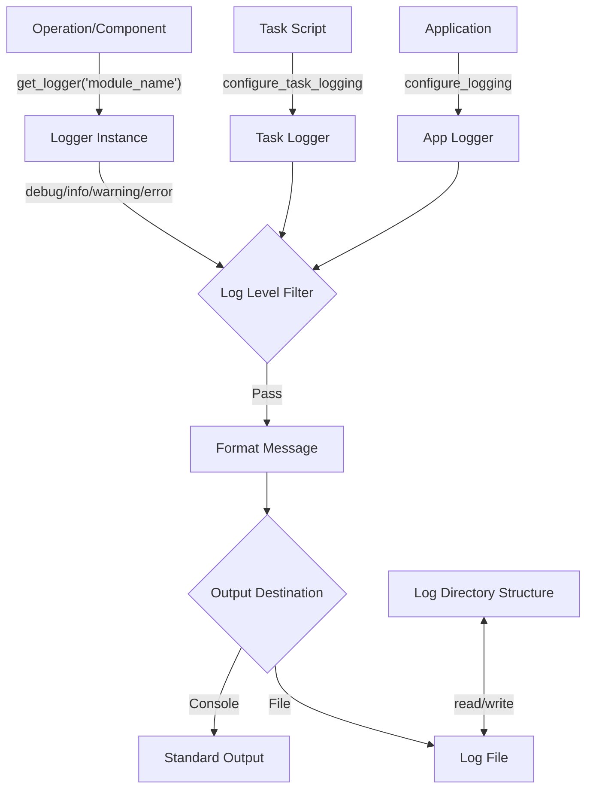

# PAMOLA.CORE Logging Module Documentation

## Overview

The `logging.py` module provides a standardized logging configuration for PAMOLA.CORE projects. It ensures consistent log formatting, output handling, and management across all components of the privacy-preserving data processing ecosystem.

This module is designed to simplify logging configuration while providing flexibility for different contexts, such as general application logging or task-specific logging with automatic directory organization.

## Architecture

The logging module serves as a foundational utility within the PAMOLA.CORE architecture:

```
┌────────────────────────────────────────────────────────────┐
│                    PAMOLA.CORE Architecture                │
└────────────────────────────────────────────────────────────┘
                             │
                             ▼
┌────────────────────────────────────────────────────────────┐
│                   Core Utility Modules                     │
├───────────┬──────────┬─────────────┬───────────────────────┤
│           │          │             │                       │
│  logging  │    io    │  progress   │  Other utilities      │
│    .py    │   .py    │    .py      │                       │
│           │          │             │                       │
└───────────┴──────────┴─────────────┴───────────────────────┘
       ▲
       │
       ▼
┌────────────────────────────────────────────────────────────┐
│                    Operation Framework                     │
├───────────┬──────────┬─────────────┬───────────────────────┤
│ op_base   │op_result │op_registry  │      op_cache         │
│    .py    │   .py    │    .py      │        .py            │
└───────────┴──────────┴─────────────┴───────────────────────┘
       ▲
       │
       ▼
┌────────────────────────────────────────────────────────────┐
│                  Core Operations                           │
├────────────────┬────────────────┬────────────────┬─────────┤
│ Anonymization  │   Profiling    │   Metrics      │ Attack  │
│  Operations    │  Operations    │  Operations    │   Sim   │
└────────────────┴────────────────┴────────────────┴─────────┘
```

## Data Flow

The following diagram illustrates how log messages flow through the logging system:



## Key Functions

| Function | Description | Parameters | Returns |
|----------|-------------|------------|---------|
| `configure_logging()` | Configures a logger with console and optional file output | `log_file`: Path to log file (optional)<br>`level`: Logging level (default: INFO)<br>`name`: Logger name (default: "pamola_core")<br>`log_dir`: Directory for logs (optional) | `logging.Logger`: Configured logger |
| `configure_task_logging()` | Configures logging for a specific task | `task_dir`: Task directory<br>`level`: Logging level (default: INFO) | `logging.Logger`: Configured task logger |
| `get_logger()` | Gets a logger for a specific module | `name`: Module/component name | `logging.Logger`: Logger for the module |
| `getLogger()` | Alias for `get_logger()` for compatibility with standard logging | `name`: Module/component name | `logging.Logger`: Logger for the module |

## Usage Examples

### Basic Logging Setup

```python
from pamola_core.utils import logging as custom_logging

# Configure basic logging with console output only
logger = custom_logging.configure_logging(level=custom_logging.logging.DEBUG)

# Log messages at different levels
logger.debug("Detailed debugging information")
logger.info("General operational information")
logger.warning("Warning about potential issues")
logger.error("Error information")
```

### Task-Specific Logging

```python
from pathlib import Path
from pamola_core.utils import logging as custom_logging

# Create task directory
task_dir = Path("/path/to/tasks/task_001")
task_dir.mkdir(parents=True, exist_ok=True)

# Configure task-specific logging (creates logs in task_dir.parent/logs/task_001.log)
logger = custom_logging.configure_task_logging(task_dir)

# Log task-specific information
logger.info("Task 001 started")
logger.info("Processing data...")
```

### Module-Specific Logging

```python
from pamola_core.utils import logging as custom_logging

# Get a logger for a specific module
logger = custom_logging.get_logger("pamola_core.anonymization.numeric_op")

# Log module-specific information
logger.debug("Initializing numeric generalization operation")
logger.info("Processing field 'salary' with binning strategy")
```

## Log File Structure

When file logging is enabled, log files are organized as follows:

```
project_root/
├── scripts/
│   ├── task_001/
│   │   └── ...
│   └── task_002/
│       └── ...
└── logs/
    ├── task_001.log
    └── task_002.log
```

Each log entry follows the format:
```
YYYY-MM-DD HH:MM:SS,SSS - LEVEL - logger_name - message
```

Example:
```
2024-01-15 14:23:45,123 - INFO - pamola_core.task.task_001 - Task started
```

## Limitations and Considerations

1. **Thread Safety**: The logging system is thread-safe for writing logs, but configuration changes should be made with care in multi-threaded applications.

2. **Performance**: Extensive debug logging may impact performance in high-throughput operations. Consider using appropriate log levels in production environments.

3. **Log Rotation**: The current implementation does not provide log rotation. For long-running applications or processes generating large volumes of logs, consider implementing log rotation through external tools or future enhancements.

4. **Structured Logging**: The implementation uses text-based logging format. For machine parsing or integration with log analysis tools, future enhancements could include structured logging formats such as JSON.

5. **Security**: Be cautious about logging sensitive data, especially in privacy-focused applications. Consider implementing log sanitization for sensitive fields.

## Best Practices

1. **Use Module-Specific Loggers**: Always use `get_logger(__name__)` to create module-specific loggers for better log organization.

2. **Appropriate Log Levels**: 
   - DEBUG: Detailed debugging information
   - INFO: General operational information
   - WARNING: Potential issues that don't prevent operation
   - ERROR: Errors that prevent specific operations

3. **Contextual Information**: Include relevant contextual information in log messages (e.g., field names, record counts, file paths).

4. **Standardize Log Messages**: Use consistent terminology and formats for log messages to facilitate searching and filtering.

5. **Configure Once**: Configure logging at the application or task entry point rather than in multiple places.