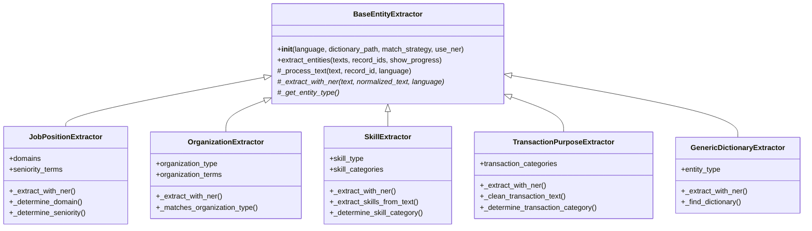
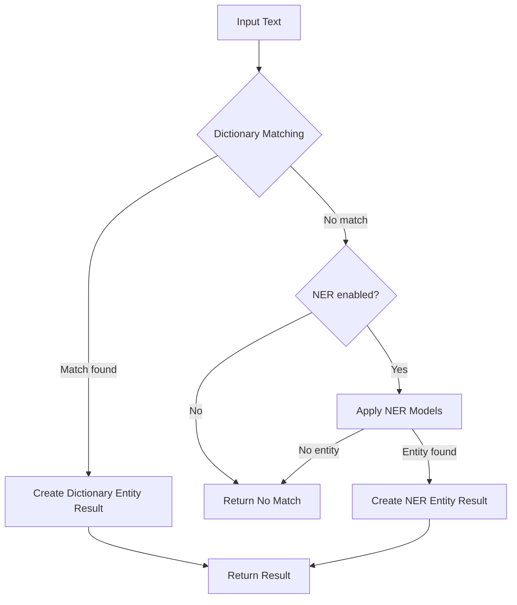

# NLP Entity Extraction Package Documentation

## Overview

The NLP Entity Extraction package is a specialized module for extracting various types of entities from text data. It provides a modular, extensible framework for identifying and categorizing entities such as job positions, organizations, skills, and transaction purposes using both dictionary-based matching and Named Entity Recognition (NER).

## Package Structure

```
pamola_core/utils/nlp/
  ├── entity/                   # Entity extraction subpackage
  │   ├── __init__.py           # Package initialization and factory functions
  │   ├── base.py               # Base classes and common utilities
  │   ├── job.py                # Job position extraction
  │   ├── organization.py       # Organization name extraction
  │   ├── skill.py              # Skill extraction
  │   ├── transaction.py        # Transaction purpose extraction
  │   └── dictionary.py         # Generic dictionary-based extraction
  ├── entity_extraction.py      # Top-level API for entity extraction
  ├── category_matching.py      # Category matching functionality
  ├── clustering.py             # Text clustering utilities
  ├── language.py               # Language detection
  ├── tokenization.py           # Text tokenization
  ├── stopwords.py              # Stopwords handling
  ├── model_manager.py          # NLP model management
  ├── cache.py                  # Caching system
  └── base.py                   # Pamola Core utilities and base classes
```

## Pamola Core Components

### 1. Entity Extraction Architecture

The entity extraction system follows a modular design with:

- **BaseEntityExtractor**: Abstract base class defining the common interface
- **Specialized Extractors**: Implementations for specific entity types
- **Factory Function**: Creates appropriate extractors based on entity type
- **High-Level API**: Simplified functions for common extraction tasks



### 2. Extraction Process Flow

The entity extraction follows a multi-stage process:



## Key Interfaces and Functions

### Entity Extraction API

The `entity_extraction.py` module provides the main API functions:

| Function | Description |
|----------|-------------|
| `extract_entities()` | Generic function to extract any type of entity |
| `extract_job_positions()` | Specialized function for job positions |
| `extract_organizations()` | Specialized function for organizations |
| `extract_universities()` | Specialized function for educational institutions |
| `extract_skills()` | Specialized function for skills and competencies |
| `extract_transaction_purposes()` | Specialized function for transaction descriptions |
| `create_custom_entity_extractor()` | Factory function to create custom extractors |

### Key Parameters for Extract Functions

- `texts`: List of text strings to process
- `entity_type`: Type of entities to extract
- `language`: Language code or "auto" for detection
- `dictionary_path`: Path to the dictionary file (optional)
- `match_strategy`: Strategy for resolving matches
- `use_ner`: Whether to use NER models if dictionary match fails
- `record_ids`: Optional IDs for each text input
- `show_progress`: Whether to display a progress bar

### Match Strategies

The package supports different strategies for resolving matches:

- `specific_first`: Prioritize more specific categories (higher level in hierarchy)
- `domain_prefer`: Prioritize by domain specificity
- `alias_only`: Match only by direct aliases
- `user_override`: Allow external mapping to override matches

## Dictionary Format

The extractors use dictionaries in a standardized JSON format:

```json
{
  "categories_hierarchy": {
    "CategoryName": {
      "alias": "category_alias",
      "domain": "DomainName",
      "level": 1,
      "parent_category": "ParentCategoryName",
      "keywords": ["keyword1", "keyword2", "keyword3"],
      "language": ["en", "ru"]
    },
    // Additional categories...
  },
  "Unclassified": {
    "alias": "unclassified",
    "domain": "General",
    "level": 0,
    "fallback_strategy": "uniform_distribution"
  }
}
```

### Dictionary Location

Dictionaries are searched in the following order:
1. Explicitly provided path via `dictionary_path`
2. Environment variable `PAMOLA_ENTITIES_DIR`
3. Data repository from PAMOLA.CORE config: `data_repository/external_dictionaries/entities/`
4. Default package resources: `pamola_core/resources/entities/`

## Usage Examples

### Basic Entity Extraction

```python
from pamola_core.utils.nlp.entity_extraction import extract_entities

texts = ["Python Developer", "Project Manager", "Database Administrator"]
results = extract_entities(texts, entity_type="job")

# Access the extracted entities
for entity in results["entities"]:
    print(f"Text: {entity['original_text']}")
    print(f"Category: {entity['matched_category']}")
    print(f"Alias: {entity['matched_alias']}")
    print(f"Method: {entity['match_method']}")
    print("---")
```

### Job Position Extraction

```python
from pamola_core.utils.nlp.entity_extraction import extract_job_positions

texts = ["Senior Java Developer", "Marketing Manager", "Data Scientist"]
results = extract_job_positions(
    texts,
    language="en",
    seniority_detection=True
)

# Get category distribution
print("Job Categories:")
for category, count in results["category_distribution"].items():
    print(f"{category}: {count}")
```

### Custom Entity Extractor

```python
from pamola_core.utils.nlp.entity_extraction import create_custom_entity_extractor

# Create a custom extractor
extractor = create_custom_entity_extractor(
    entity_type="custom",
    dictionary_path="/path/to/custom_dictionary.json",
    match_strategy="specific_first",
    fallback_to_ner=True
)

# Use the extractor
results = extractor.extract_entities(
    texts=["Custom entity 1", "Custom entity 2"],
    show_progress=True
)
```

## Integration with Other NLP Components

The entity extraction package integrates with other NLP components:

- **Caching**: Results are cached for improved performance
- **Language Detection**: Automatic language detection if not specified
- **Tokenization**: Used for processing text in certain extractors
- **Model Manager**: Centralized management of NER models
- **Category Matching**: Dictionary-based matching with hierarchy support

## Best Practices

1. **Dictionary Organization**:
   - Organize entities hierarchically for better classification
   - Use specific keywords for better precision
   - Include multilingual variants for each category

2. **Extraction Strategy**:
   - Start with dictionary matching for highest precision
   - Fall back to NER for unknown entities
   - Use clustering only for analysis, not for critical entity extraction

3. **Performance Optimization**:
   - Enable caching for repeated extractions
   - Use batch processing for large datasets
   - Show progress bars for long-running extractions

4. **Customization**:
   - Extend with custom extractors for domain-specific entities
   - Create specialized dictionaries for different use cases
   - Use match strategies appropriate for your application

## Troubleshooting

Common issues and solutions:

| Issue | Solution |
|-------|----------|
| Low match rate | Check dictionary coverage, add more keywords |
| Incorrect matching | Review match strategy, prioritize specific terms |
| Missing NER results | Ensure appropriate models are installed |
| Slow performance | Enable caching, increase chunk size |
| Dictionary not found | Check dictionary path and location hierarchy |

## Future Extensions

The package is designed to be extended with:

- Additional entity types (e.g., products, locations, events)
- More sophisticated NER models
- Contextual entity extraction
- Multi-word entity recognition
- Active learning for entity dictionary improvement

## Conclusion

The NLP Entity Extraction package provides a flexible, extensible framework for extracting and categorizing entities from text. Its modular design allows for easy customization and extension, while the unified API simplifies integration with other components of the system.