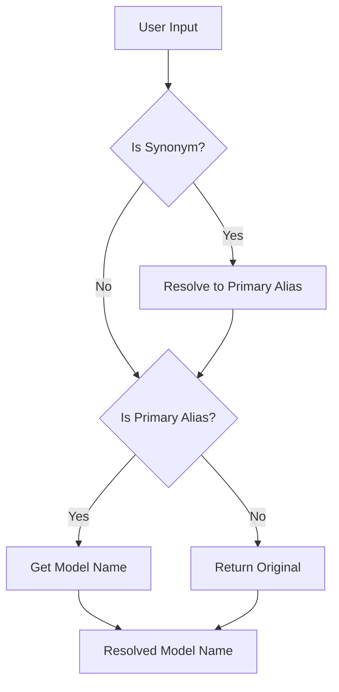

# PAMOLA.CORE LLM Configuration Module Documentation

**Module:** `pamola_core.utils.nlp.llm.config`  
**Version:** 2.2.0  
**Status:** Stable  
**Author:** PAMOLA Core Team  
**Created:** 2025  
**License:** BSD 3-Clause

## 1. Purpose and Overview

The LLM Configuration module provides comprehensive configuration management for the PAMOLA.CORE LLM subsystem. It defines configuration dataclasses, model presets, provider-specific parameter mappings, and model alias management. This module serves as the central configuration hub for all LLM operations, ensuring consistent parameter handling across different providers and models.

The module is designed to support multiple use cases:
- Standardized configuration structures for LLM operations
- Model-specific presets for optimal performance
- Provider-agnostic parameter definition with provider-specific conversion
- Convenient model aliases for simplified model selection
- Configuration validation and debugging utilities

## 2. Key Features

### Core Capabilities
- **Comprehensive Configuration Dataclasses**: Structured configuration for all aspects of LLM operations
- **Model Presets**: Pre-configured parameters for specific models based on empirical testing
- **Model Aliases**: Human-friendly names (QUALITY, FAST, etc.) mapped to actual model identifiers
- **Provider Adaptation**: Automatic conversion of parameters to provider-specific formats
- **Configuration Validation**: Parameter validation with detailed error messages
- **Environment Variable Support**: Default values from environment variables

### Advanced Features
- **Alias Resolution**: Multi-level alias system with synonyms for backward compatibility
- **Model Availability Checking**: Cached verification of model availability in LM Studio
- **Debug Utilities**: Comprehensive debugging information for configuration troubleshooting
- **JSON Serialization**: Automatic Path-to-string conversion for configuration persistence
- **Performance Optimization**: Per-model caching with TTL for availability checks

## 3. Architecture

### Module Structure

```
pamola_core/utils/nlp/llm/config.py
├── Imports and Logger Setup
├── Global Cache
├── Enumerations
│   ├── Provider
│   ├── CacheType
│   ├── TokenEstimationMethod
│   ├── TruncationStrategy
│   └── ValidationResult
├── Model Presets
│   └── MODEL_PRESETS
├── Model Aliases
│   ├── MODEL_ALIASES
│   └── MODEL_ALIAS_SYNONYMS
├── Configuration Dataclasses
│   ├── LLMConfig
│   ├── ProcessingConfig
│   ├── GenerationConfig
│   ├── CacheConfig
│   └── MonitoringConfig
├── Model Management Functions
│   ├── resolve_model_name()
│   ├── validate_model_name()
│   ├── check_model_availability()
│   └── get_model_info()
└── Configuration Utilities
    ├── create_default_config()
    └── _validate_aliases()
```

### Configuration Hierarchy

```
Complete Configuration
    ├── LLMConfig (Connection & API)
    │   ├── Provider settings
    │   ├── API endpoints
    │   └── Connection parameters
    ├── ProcessingConfig (Text Processing)
    │   ├── Batch settings
    │   ├── Token limits
    │   └── Truncation strategies
    ├── GenerationConfig (Generation Parameters)
    │   ├── Temperature, top_p, top_k
    │   ├── Max tokens
    │   └── Provider-specific conversion
    ├── CacheConfig (Caching)
    │   ├── Cache backend
    │   └── TTL and eviction
    └── MonitoringConfig (Debug & Monitoring)
        ├── Logging settings
        └── Performance tracking
```

### Model Alias Resolution Flow



## 4. Dependencies

### Required Dependencies
- **Standard Library**:
  - `dataclasses`: Configuration structure definitions
  - `enum`: Enumeration types
  - `typing`: Type annotations
  - `time`: Cache TTL management
  - `logging`: Debug logging
  - `os`: Environment variable support
  - `warnings`: Configuration warnings
  - `pathlib`: Path handling

### Optional Dependencies
- **requests**: For model availability checking (gracefully handled if missing)

## 5. Core API Reference

### Enumerations

#### Provider
```python
class Provider(str, Enum):
    """Supported LLM providers."""
    LMSTUDIO = "lmstudio"
    OPENAI = "openai"
    ANTHROPIC = "anthropic"
    HUGGINGFACE = "huggingface"
    CUSTOM = "custom"
```

#### CacheType
```python
class CacheType(str, Enum):
    """Cache backend types."""
    MEMORY = "memory"
    FILE = "file"
    REDIS = "redis"
    NONE = "none"
```

#### TokenEstimationMethod
```python
class TokenEstimationMethod(str, Enum):
    """Token estimation methods."""
    SIMPLE = "simple"      # Character-based estimation
    TIKTOKEN = "tiktoken"  # OpenAI tiktoken library
    CUSTOM = "custom"      # Custom tokenizer
```

#### TruncationStrategy
```python
class TruncationStrategy(str, Enum):
    """Text truncation strategies."""
    END = "end"        # Keep beginning, truncate end
    MIDDLE = "middle"  # Keep beginning and end, truncate middle
    SMART = "smart"    # Try to preserve sentence boundaries
```

### Configuration Dataclasses

#### LLMConfig
```python
@dataclass
class LLMConfig:
    """LLM connection and API configuration."""
    provider: Union[str, Provider] = Provider.LMSTUDIO
    api_url: str = "http://localhost:1234/v1"
    model_name: str = "gemma-2-9b-it-russian-function-calling"
    api_key: Optional[str] = None
    ttl: int = 3600
    timeout: int = 30
    max_retries: int = 3
    retry_delay: float = 1.0
    max_workers: int = 1
    thread_safe_model: bool = False
```

**Key Features:**
- Automatic model alias resolution in `__post_init__`
- Provider-specific default API URLs
- Connection management parameters

#### ProcessingConfig
```python
@dataclass
class ProcessingConfig:
    """Text processing configuration."""
    batch_size: int = 1
    max_input_tokens: int = 1000
    token_estimation_method: Union[str, TokenEstimationMethod] = TokenEstimationMethod.SIMPLE
    truncation_strategy: Union[str, TruncationStrategy] = TruncationStrategy.SMART
    use_processing_marker: bool = True
    processing_marker: str = "~"
    skip_processed: bool = True
    max_records: Optional[int] = None
    adaptive_batch_size: bool = False
    min_batch_size: int = 1
    max_batch_size: int = 32
    memory_cleanup_interval: int = 1000
```

**Key Features:**
- Adaptive batch sizing support
- Processing marker for tracking
- Memory management settings

#### GenerationConfig
```python
@dataclass
class GenerationConfig:
    """Text generation parameters."""
    temperature: float = 0.7
    top_p: float = 0.95
    top_k: int = 40
    max_tokens: int = 512
    stop_sequences: List[str] = field(default_factory=lambda: ["</text>", "\n\n", "<end_of_turn>"])
    repeat_penalty: Optional[float] = None
    presence_penalty: Optional[float] = None
    frequency_penalty: Optional[float] = None
    stream: bool = False
    seed: Optional[int] = None
```

**Key Methods:**
- `to_api_params(provider)`: Convert to provider-specific format
- `merge_with_model_defaults(model_name)`: Apply model presets

#### CacheConfig
```python
@dataclass
class CacheConfig:
    """Cache configuration."""
    enabled: bool = True
    cache_type: Union[str, CacheType] = CacheType.MEMORY
    ttl: int = 86400  # 24 hours
    max_size: Optional[int] = None
    eviction_policy: str = "lru"
```

#### MonitoringConfig
```python
@dataclass
class MonitoringConfig:
    """Monitoring and debugging configuration."""
    debug_mode: bool = False
    debug_log_file: Optional[Path] = None
    log_requests: bool = False
    log_responses: bool = False
    monitor_performance: bool = True
    profile_memory: bool = False
    slow_request_threshold: float = 10.0
```

### Model Management Functions

#### resolve_model_name
```python
def resolve_model_name(model_input: str) -> str:
    """
    Resolve model alias to actual model name.
    
    Parameters:
    -----------
    model_input : str
        Model alias or actual model name
        
    Returns:
    --------
    str
        Actual model name
    """
```

#### validate_model_name
```python
def validate_model_name(
    model_name: str,
    available_models: Optional[List[str]] = None
) -> Tuple[bool, str, ValidationResult]:
    """
    Validate if model name or alias is valid.
    
    Returns:
    --------
    Tuple[bool, str, ValidationResult]
        (is_valid, resolved_name, reason)
    """
```

#### check_model_availability
```python
def check_model_availability(
    model_name: str,
    lm_studio_url: str = "http://localhost:1234/v1"
) -> bool:
    """
    Check if model is available in LM Studio with caching.
    
    Returns:
    --------
    bool
        True if model is available or check failed
    """
```

### Configuration Utilities

#### create_default_config
```python
def create_default_config(
    provider: Union[str, Provider] = Provider.LMSTUDIO,
    model_name: str = "QUALITY"
) -> Dict[str, Any]:
    """
    Create default configuration for a provider and model.
    
    Returns:
    --------
    Dict[str, Any]
        Complete configuration dictionary
    """
```

## 6. Model Presets and Aliases

### Available Aliases

| Alias | Model | Description |
|-------|-------|-------------|
| QUALITY | gemma-2-9b-it-russian-function-calling | High-quality, consistent output |
| BALANCED | google/gemma-3-4b | Balance of quality and speed |
| FAST | phi-3-mini-128k-it-russian-q4-k-m | Fast processing |
| ULTRA_FAST | gemma-3-1b-it-qat | Minimal latency |
| ALT | llama-3.1-8b-lexi-uncensored | Alternative model |
| ANON | deid-anonymization-llama3 | Specialized for anonymization |

### Legacy Aliases (Synonyms)

| Legacy | Maps To | Notes |
|--------|---------|-------|
| LLM1 | QUALITY | Backward compatibility |
| LLM2 | BALANCED | Backward compatibility |
| LLM3 | FAST | Backward compatibility |

## 7. Usage Examples

### Basic Configuration

```python
from pamola_core.utils.nlp.llm.config import LLMConfig, GenerationConfig

# Create basic LLM configuration
llm_config = LLMConfig(
    provider="lmstudio",
    model_name="QUALITY"  # Will resolve to actual model name
)

print(f"Using model: {llm_config.model_name}")
# Output: Using model: gemma-2-9b-it-russian-function-calling

# Create generation config with model defaults
gen_config = GenerationConfig()
merged_config = gen_config.merge_with_model_defaults("QUALITY")

print(f"Temperature: {merged_config.temperature}")
# Output: Temperature: 0.3
```

### Provider-Specific Parameter Conversion

```python
from pamola_core.utils.nlp.llm.config import GenerationConfig, Provider

# Create generation config
gen_config = GenerationConfig(
    temperature=0.5,
    top_p=0.9,
    max_tokens=256
)

# Convert for different providers
lmstudio_params = gen_config.to_api_params(Provider.LMSTUDIO)
print("LM Studio params:", lmstudio_params)
# Output: {'args': {'temperature': 0.5, ...}, 'stream': False}

openai_params = gen_config.to_api_params(Provider.OPENAI)
print("OpenAI params:", openai_params)
# Output: {'temperature': 0.5, 'max_tokens': 256, ...}
```

### Model Validation and Information

```python
from pamola_core.utils.nlp.llm.config import (
    validate_model_name,
    get_model_info,
    check_model_availability
)

# Validate model name
is_valid, resolved, reason = validate_model_name("LLM1")
print(f"Valid: {is_valid}, Resolved to: {resolved}")
# Output: Valid: True, Resolved to: gemma-2-9b-it-russian-function-calling

# Get model information
info = get_model_info("QUALITY")
print(f"Aliases: {info['aliases']}")
print(f"Has preset: {info['has_preset']}")

# Check availability (with caching)
available = check_model_availability(
    "gemma-2-9b-it-russian-function-calling",
    "http://localhost:1234/v1"
)
print(f"Model available: {available}")
```

### Complete Configuration Creation

```python
from pamola_core.utils.nlp.llm.config import create_default_config, Provider

# Create complete configuration
config = create_default_config(
    provider=Provider.LMSTUDIO,
    model_name="FAST"
)

print("LLM Config:", config['llm'])
print("Generation Config:", config['generation'])
print("Cache Config:", config['cache'])
```

### Processing Configuration with Adaptive Batching

```python
from pamola_core.utils.nlp.llm.config import ProcessingConfig

# Create processing config with adaptive batching
proc_config = ProcessingConfig(
    batch_size=16,
    adaptive_batch_size=True,
    min_batch_size=1,
    max_batch_size=32,
    max_input_tokens=1000,
    truncation_strategy="smart"
)

# Validation happens automatically
print(f"Batch size: {proc_config.batch_size}")
print(f"Adaptive: {proc_config.adaptive_batch_size}")
```

### Environment Variable Support

```python
import os
from pamola_core.utils.nlp.llm.config import GenerationConfig

# Set environment variables
os.environ['PAMOLA_DEFAULT_TEMPERATURE'] = '0.2'
os.environ['PAMOLA_DEFAULT_MAX_TOKENS'] = '1024'

# Create config - will use environment defaults
gen_config = GenerationConfig()
print(f"Temperature: {gen_config.temperature}")  # 0.2
print(f"Max tokens: {gen_config.max_tokens}")   # 1024
```

### Debug Information

```python
from pamola_core.utils.nlp.llm.config import get_model_debug_info, Provider

# Get complete debug information
debug_info = get_model_debug_info("QUALITY", Provider.LMSTUDIO)

print("Model Resolution:")
print(f"  Input: {debug_info['input']}")
print(f"  Resolved: {debug_info['resolved']}")
print(f"  Is alias: {debug_info['is_alias']}")

print("\nGeneration Parameters:")
print(f"  Defaults: {debug_info['generation']['defaults']}")
print(f"  Preset: {debug_info['generation']['preset']}")
print(f"  Merged: {debug_info['generation']['merged']}")

print("\nAPI Parameters:")
for provider, params in debug_info['generation']['api_params'].items():
    print(f"  {provider}: {params}")
```

### Configuration Validation

```python
from pamola_core.utils.nlp.llm.config import (
    GenerationConfig,
    validate_generation_config,
    Provider
)

# Create config with potentially problematic values
gen_config = GenerationConfig(
    temperature=1.8,
    top_k=100,
    repeat_penalty=0.05
)

# Validate for specific provider
issues = validate_generation_config(gen_config, Provider.LMSTUDIO)
if issues:
    print("Configuration warnings:")
    for issue in issues:
        print(f"  - {issue}")
```

## 8. Best Practices

### Model Selection
1. **Use aliases for clarity**: Prefer `"QUALITY"` over full model names
2. **Validate availability**: Check model availability before processing
3. **Consider performance**: Choose appropriate model for task requirements

### Configuration Management
1. **Use model presets**: Let `merge_with_model_defaults()` apply optimal settings
2. **Override selectively**: Only override specific parameters you need to change
3. **Environment variables**: Use for deployment-specific defaults

### Provider Compatibility
1. **Use to_api_params()**: Always convert parameters for target provider
2. **Validate configurations**: Check for provider-specific issues
3. **Handle unsupported parameters**: Be aware of provider limitations

### Performance Optimization
1. **Cache configurations**: Reuse configuration objects
2. **Batch processing**: Use appropriate batch sizes for your hardware
3. **Monitor performance**: Enable monitoring for production use

## 9. Error Handling

### Common Issues

1. **Invalid Model Names**
   ```python
   # Always validate before use
   is_valid, resolved, reason = validate_model_name(model_name)
   if not is_valid:
       print(f"Invalid model: {reason}")
   ```

2. **Parameter Validation Errors**
   ```python
   try:
       config = GenerationConfig(temperature=3.0)  # Too high
   except ValueError as e:
       print(f"Configuration error: {e}")
   ```

3. **Provider Mismatch**
   ```python
   # Check for provider-specific issues
   issues = validate_generation_config(config, provider)
   if issues:
       logger.warning(f"Configuration issues: {issues}")
   ```

## 10. Summary

The LLM Configuration module provides a comprehensive, flexible, and user-friendly configuration system for the PAMOLA.CORE LLM subsystem. Its model alias system, provider-specific parameter conversion, and validation utilities ensure that LLM operations can be configured correctly and efficiently across different providers and use cases. The module's design emphasizes ease of use while maintaining the flexibility needed for advanced configurations.