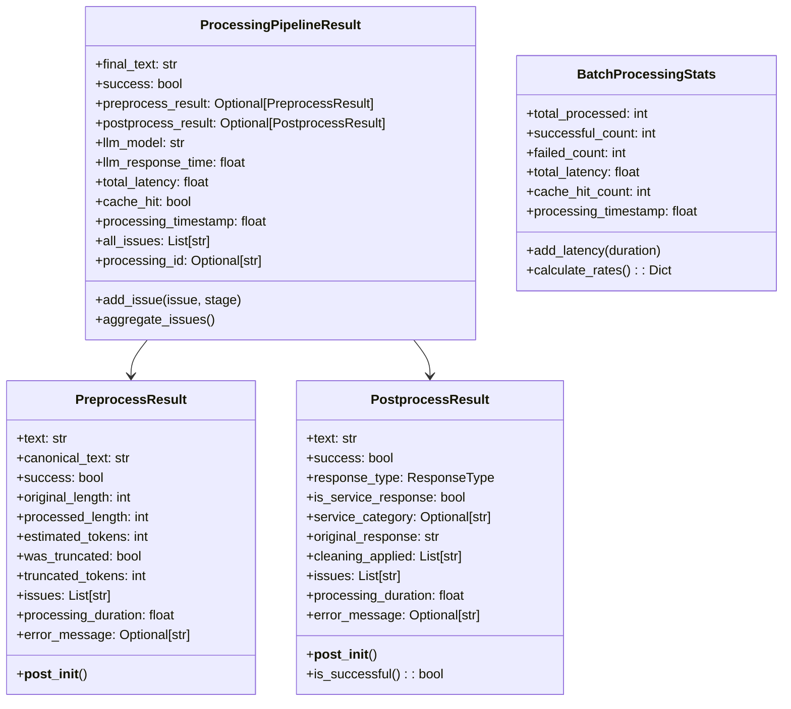

# PAMOLA.CORE LLM Data Contracts Module Documentation

**Module:** `pamola_core.utils.nlp.llm.data_contracts`  
**Version:** 1.2.0  
**Status:** Stable  
**Author:** PAMOLA Core Team  
**Created:** 2025  
**License:** BSD 3-Clause

## 1. Purpose and Overview

The LLM Data Contracts module defines minimal, type-safe data structures for communication between preprocessing, LLM processing, and postprocessing stages in the PAMOLA.CORE LLM pipeline. It provides standardized data contracts that ensure consistent data flow, clear interfaces, and proper validation throughout the text processing pipeline.

This module follows a minimalist design philosophy, including only fields that are actively used in the current implementation phase. It avoids placeholder fields and unnecessary complexity while maintaining extensibility for future enhancements through mixin patterns.

## 2. Key Features

### Core Capabilities
- **Minimal Data Structures**: Focused on essential fields only, avoiding memory bloat
- **Type Safety**: Strong typing with dataclasses and type annotations
- **Memory Efficiency**: Slots enabled for all dataclasses to reduce memory footprint
- **Clear Pipeline Stages**: Distinct contracts for each processing stage
- **Automatic Validation**: Built-in validation in `__post_init__` methods
- **Helper Constructors**: Factory functions to avoid post-initialization mutations

### Design Principles
- **Single Source of Truth**: Imports enums from canonical sources to prevent duplicates
- **Clear Semantics**: Distinction between duration (processing time) and timestamp (point in time)
- **Extensibility**: Mixin classes prepared for future enhancements
- **Fail-Safe Defaults**: Sensible defaults with explicit failure states
- **Validation First**: Comprehensive input validation and consistency checks

## 3. Architecture

### Module Structure

```
pamola_core/utils/nlp/llm/data_contracts.py
├── Imports
│   └── Canonical enum imports from enums.py
├── Core Data Structures
│   ├── PreprocessResult
│   ├── PostprocessResult
│   ├── ProcessingPipelineResult
│   └── BatchProcessingStats
├── Helper Constructors
│   ├── create_failed_preprocess_result()
│   ├── create_service_response_result()
│   ├── create_empty_response_result()
│   ├── create_successful_preprocess_result()
│   └── create_successful_postprocess_result()
├── Extension Hooks
│   ├── PreprocessResultExtension
│   └── PostprocessResultExtension
└── Validation Helpers
    ├── validate_processing_result()
    └── ensure_enum_consistency()
```

### Data Flow Through Pipeline


### Class Relationships



## 4. Dependencies

### Required Dependencies
- **Standard Library**:
  - `time`: Timestamp generation
  - `dataclasses`: Data structure definitions
  - `typing`: Type annotations

### Internal Dependencies
- **From PAMOLA.CORE**:
  - `.enums.ResponseType`: Response type enumeration
  - `.enums.ProcessingStage`: Processing stage enumeration

## 5. Core API Reference

### Data Classes

#### PreprocessResult

```python
@dataclass(slots=True)
class PreprocessResult:
    """Minimal result of text preprocessing stage."""
    text: str                          # Processed text ready for LLM
    canonical_text: str = ""           # Canonicalized text for cache keys
    success: bool = True               # Whether preprocessing succeeded
    original_length: int = 0           # Original text length (auto-filled)
    processed_length: int = 0          # Processed text length (auto-filled)
    estimated_tokens: int = 0          # Estimated token count
    was_truncated: bool = False        # Whether text was truncated
    truncated_tokens: int = 0          # Number of tokens removed
    issues: List[str] = field(default_factory=list)
    processing_duration: float = 0.0   # Processing duration in seconds
    error_message: Optional[str] = None
```

**Key Features:**
- Auto-calculates text lengths in `__post_init__`
- Tracks truncation information
- Maintains list of processing issues
- Records processing duration (not timestamp)

#### PostprocessResult

```python
@dataclass(slots=True)
class PostprocessResult:
    """Minimal result of LLM response postprocessing stage."""
    text: str                          # Final processed text
    success: bool = True               # Whether postprocessing succeeded
    response_type: ResponseType = ResponseType.VALID
    is_service_response: bool = False  # Whether response is service message
    service_category: Optional[str] = None
    original_response: str = ""        # Original LLM response
    cleaning_applied: List[str] = field(default_factory=list)
    issues: List[str] = field(default_factory=list)
    processing_duration: float = 0.0   # Processing duration in seconds
    error_message: Optional[str] = None
```

**Key Methods:**
- `is_successful()`: Comprehensive success check
- `__post_init__()`: Enforces business rules for service responses

#### ProcessingPipelineResult

```python
@dataclass(slots=True)
class ProcessingPipelineResult:
    """Complete result from preprocessing → LLM → postprocessing pipeline."""
    final_text: str                    # Final processed text
    success: bool = True               # Overall pipeline success
    preprocess_result: Optional[PreprocessResult] = None
    postprocess_result: Optional[PostprocessResult] = None
    llm_model: str = ""               # Model used for processing
    llm_response_time: float = 0.0    # LLM response time in seconds
    total_latency: float = 0.0        # Total pipeline duration
    cache_hit: bool = False           # Whether result was cached
    processing_timestamp: float       # Unix timestamp when started
    all_issues: List[str] = field(default_factory=list)
    processing_id: Optional[str] = None
```

**Key Methods:**
- `add_issue(issue: str, stage: ProcessingStage)`: Add stage-specific issue
- `aggregate_issues()`: Collect issues from all stages

#### BatchProcessingStats

```python
@dataclass(slots=True)
class BatchProcessingStats:
    """Essential statistics for batch processing."""
    total_processed: int = 0
    successful_count: int = 0
    failed_count: int = 0
    total_latency: float = 0.0        # Total batch duration
    cache_hit_count: int = 0
    processing_timestamp: float       # Unix timestamp
```

**Key Methods:**
- `add_latency(duration: float)`: Safely accumulate processing time
- `calculate_rates() -> Dict[str, float]`: Calculate derived metrics

### Helper Constructors

#### create_failed_preprocess_result

```python
def create_failed_preprocess_result(
    text: str,
    canonical_text: str = "",
    error_message: str = "Processing failed",
    original_length: int = 0,
    processing_duration: float = 0.0
) -> PreprocessResult:
    """Create a PreprocessResult indicating failure."""
```

#### create_service_response_result

```python
def create_service_response_result(
    original_response: str,
    service_category: str,
    processing_duration: float = 0.0
) -> PostprocessResult:
    """Create a PostprocessResult for detected service response."""
```

#### create_successful_preprocess_result

```python
def create_successful_preprocess_result(
    original_text: str,
    processed_text: str,
    canonical_text: str = "",
    estimated_tokens: int = 0,
    was_truncated: bool = False,
    truncated_tokens: int = 0,
    processing_duration: float = 0.0
) -> PreprocessResult:
    """Create a successful PreprocessResult with all required fields."""
```

### Validation Functions

#### validate_processing_result

```python
def validate_processing_result(
    result: ProcessingPipelineResult
) -> List[str]:
    """
    Validate a complete processing result for consistency.
    
    Returns:
    --------
    List[str]
        List of validation issues found
    """
```

## 6. Usage Examples

### Basic Preprocessing Result

```python
from pamola_core.utils.nlp.llm.data_contracts import (
    PreprocessResult, 
    create_successful_preprocess_result
)

# Manual creation (not recommended)
result = PreprocessResult(
    text="Processed text for LLM",
    canonical_text="processed text for llm",
    estimated_tokens=5
)

# Using helper constructor (recommended)
result = create_successful_preprocess_result(
    original_text="Original text for LLM processing!",
    processed_text="Processed text for LLM",
    canonical_text="processed text for llm",
    estimated_tokens=5,
    processing_duration=0.125
)

print(f"Original length: {result.original_length}")  # Auto-calculated
print(f"Processed length: {result.processed_length}")  # Auto-calculated
print(f"Success: {result.success}")
```

### Handling Truncation

```python
from pamola_core.utils.nlp.llm.data_contracts import create_successful_preprocess_result

# Text was truncated during preprocessing
result = create_successful_preprocess_result(
    original_text="A" * 10000,  # Very long text
    processed_text="A" * 1000,   # Truncated to 1000 chars
    estimated_tokens=250,
    was_truncated=True,
    truncated_tokens=2250,  # 2250 tokens were removed
    processing_duration=0.5
)

print(f"Was truncated: {result.was_truncated}")
print(f"Tokens removed: {result.truncated_tokens}")
```

### Service Response Detection

```python
from pamola_core.utils.nlp.llm.data_contracts import create_service_response_result

# LLM returned a service response
result = create_service_response_result(
    original_response="I cannot process this request due to content policy",
    service_category="content_policy",
    processing_duration=0.05
)

print(f"Success: {result.success}")  # False
print(f"Is service response: {result.is_service_response}")  # True
print(f"Response type: {result.response_type}")  # ResponseType.SERVICE
print(f"Issues: {result.issues}")  # ['service_response_detected']
```

### Complete Pipeline Result

```python
from pamola_core.utils.nlp.llm.data_contracts import (
    ProcessingPipelineResult,
    create_successful_preprocess_result,
    create_successful_postprocess_result,
    ProcessingStage
)
from pamola_core.utils.nlp.llm.enums import ProcessingStage
import time

# Create stage results
preprocess = create_successful_preprocess_result(
    original_text="What is the capital of France?",
    processed_text="What is the capital of France?",
    estimated_tokens=8,
    processing_duration=0.01
)

postprocess = create_successful_postprocess_result(
    processed_text="Paris",
    original_response="The capital of France is Paris.",
    cleaning_applied=["remove_explanation"],
    processing_duration=0.02
)

# Create pipeline result
pipeline_result = ProcessingPipelineResult(
    final_text="Paris",
    success=True,
    preprocess_result=preprocess,
    postprocess_result=postprocess,
    llm_model="gemma-2-9b",
    llm_response_time=1.5,
    total_latency=1.53,  # Sum of all processing times
    cache_hit=False,
    processing_timestamp=time.time()
)

# Aggregate issues from all stages
pipeline_result.aggregate_issues()

print(f"Final text: {pipeline_result.final_text}")
print(f"Total latency: {pipeline_result.total_latency:.3f}s")
print(f"Model used: {pipeline_result.llm_model}")
```

### Batch Processing Statistics

```python
from pamola_core.utils.nlp.llm.data_contracts import BatchProcessingStats
import time

# Initialize batch stats
stats = BatchProcessingStats()

# Process multiple texts
for i in range(100):
    start = time.time()
    
    # Simulate processing...
    success = i % 10 != 0  # 90% success rate
    cache_hit = i % 5 == 0  # 20% cache hits
    
    if success:
        stats.successful_count += 1
    else:
        stats.failed_count += 1
    
    if cache_hit:
        stats.cache_hit_count += 1
    
    stats.total_processed += 1
    
    # Add processing time
    duration = 0.1 if not cache_hit else 0.01
    stats.add_latency(duration)

# Calculate rates
rates = stats.calculate_rates()
print(f"Success rate: {rates['success_rate']:.2%}")
print(f"Cache hit rate: {rates['cache_hit_rate']:.2%}")
print(f"Avg processing time: {rates['avg_processing_time']:.3f}s")
```

### Error Handling

```python
from pamola_core.utils.nlp.llm.data_contracts import (
    create_failed_preprocess_result,
    create_empty_response_result
)

# Preprocessing failure
preprocess_fail = create_failed_preprocess_result(
    text="",
    error_message="Text exceeds maximum allowed length",
    processing_duration=0.001
)

print(f"Success: {preprocess_fail.success}")  # False
print(f"Error: {preprocess_fail.error_message}")
print(f"Issues: {preprocess_fail.issues}")  # ['processing_failed']

# Empty LLM response
postprocess_fail = create_empty_response_result(
    original_response="",
    processing_duration=0.001
)

print(f"Success: {postprocess_fail.success}")  # False
print(f"Response type: {postprocess_fail.response_type}")  # ResponseType.EMPTY
```

### Validation

```python
from pamola_core.utils.nlp.llm.data_contracts import (
    ProcessingPipelineResult,
    validate_processing_result
)

# Create a potentially inconsistent result
result = ProcessingPipelineResult(
    final_text="",  # Empty but marked as success
    success=True,
    llm_model="test-model",
    processing_timestamp=time.time() + 7200  # 2 hours in future
)

# Validate
issues = validate_processing_result(result)
if issues:
    print("Validation issues found:")
    for issue in issues:
        print(f"  - {issue}")
# Output:
# - Success=True but final_text is empty
# - Processing timestamp is far in the future (>1 hour)
```

### Using Response Type Checking

```python
from pamola_core.utils.nlp.llm.data_contracts import PostprocessResult
from pamola_core.utils.nlp.llm.enums import ResponseType

# Check response types
result = PostprocessResult(
    text="Valid response",
    response_type=ResponseType.VALID
)

if result.is_successful():
    print("Response is valid and can be used")

# Check for specific response types
if result.response_type == ResponseType.SERVICE:
    print("Service response - handle appropriately")
elif result.response_type == ResponseType.ERROR:
    print("Error response - retry or fail")
```

## 7. Extension Mechanism

The module provides extension hooks for future enhancements:

```python
from dataclasses import dataclass, field
from typing import List
from pamola_core.utils.nlp.llm.data_contracts import (
    PreprocessResult, 
    PreprocessResultExtension
)

# Example: Adding NER support in the future
@dataclass
class DetectedEntity:
    text: str
    entity_type: str
    start_pos: int
    end_pos: int

@dataclass
class EnhancedPreprocessResult(PreprocessResult, PreprocessResultExtension):
    """Extended preprocessing result with NER support."""
    entities_detected: List[DetectedEntity] = field(default_factory=list)
    has_pii: bool = False

# Use the enhanced version
result = EnhancedPreprocessResult(
    text="John Smith lives in New York",
    entities_detected=[
        DetectedEntity("John Smith", "PERSON", 0, 10),
        DetectedEntity("New York", "LOCATION", 20, 28)
    ],
    has_pii=True
)
```

## 8. Best Practices

### Use Helper Constructors
Always use helper constructors instead of direct instantiation:
```python
# Good
result = create_successful_preprocess_result(...)

# Avoid
result = PreprocessResult(...)
```

### Handle All Response Types
Always check response types when processing results:
```python
if result.response_type == ResponseType.SERVICE:
    # Handle service response
elif result.response_type == ResponseType.ERROR:
    # Handle error
elif result.is_successful():
    # Process valid response
```

### Track Processing Times
Use durations, not timestamps, for processing metrics:
```python
start = time.time()
# ... processing ...
duration = time.time() - start
result.processing_duration = duration  # Good

# Avoid storing start/end timestamps in results
```

### Aggregate Issues Properly
Use the built-in aggregation methods:
```python
pipeline_result.aggregate_issues()  # Collects from all stages
```

### Validate Results
Always validate complete pipeline results:
```python
issues = validate_processing_result(result)
if issues:
    logger.warning(f"Validation issues: {issues}")
```

## 9. Memory Efficiency

All dataclasses use `slots=True` for memory efficiency:
- Reduces memory footprint by ~40%
- Prevents dynamic attribute addition
- Improves attribute access speed

## 10. Summary

The LLM Data Contracts module provides a minimal yet comprehensive set of data structures for the LLM processing pipeline. Its focus on essential fields, type safety, and proper validation ensures reliable data flow through all processing stages. The module's extensibility through mixins and helper constructors makes it suitable for both current needs and future enhancements while maintaining backward compatibility.