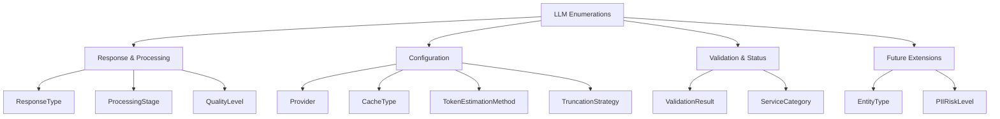

# PAMOLA.CORE LLM Enumerations Module Documentation

**Module:** `pamola_core.utils.nlp.llm.enums`  
**Version:** 1.0.0  
**Status:** Stable  
**Author:** PAMOLA Core Team  
**Created:** 2025  
**License:** BSD 3-Clause

## 1. Purpose and Overview

The LLM Enumerations module serves as the single source of truth for all enumeration types used throughout the PAMOLA.CORE LLM subsystem. It centralizes all enum definitions to prevent duplication, avoid circular imports, and ensure consistent type usage across preprocessing, processing, and postprocessing stages.

This module follows the principle of centralized enum management, where all enumeration types are defined in one location and imported by other modules as needed. This approach eliminates the common problems of enum duplication and circular dependencies that can occur in complex processing pipelines.

## 2. Key Features

### Core Capabilities
- **Centralized Definitions**: All LLM-related enums in one module
- **Type Safety**: Standard Enum inheritance for type checking
- **Consistent Naming**: Lowercase with underscores for all enum values
- **Comprehensive Coverage**: Enums for all pipeline stages and configurations
- **Future-Ready**: Placeholder enums for planned functionality
- **Validation Utilities**: Helper functions for enum validation and access

### Design Benefits
- **No Circular Imports**: Single import source prevents dependency cycles
- **Easy Maintenance**: All enums in one file for easy updates
- **Clear Documentation**: Comprehensive docstrings for each enum and value
- **Extensibility**: Simple to add new enums or values
- **Type Safety**: Strong typing support for IDE and static analysis

## 3. Architecture

### Module Structure

```
pamola_core/utils/nlp/llm/enums.py
├── Imports
├── Response and Processing Enumerations
│   ├── ResponseType
│   ├── ProcessingStage
│   └── QualityLevel
├── Configuration Enumerations
│   ├── Provider
│   ├── CacheType
│   ├── TokenEstimationMethod
│   └── TruncationStrategy
├── Validation and Status Enumerations
│   ├── ValidationResult
│   └── ServiceCategory
├── Future Extension Enumerations
│   ├── EntityType (placeholder)
│   └── PIIRiskLevel (placeholder)
├── Utility Functions
│   ├── get_all_enum_types()
│   ├── validate_enum_values()
│   ├── get_enum_by_value()
│   └── list_enum_values()
└── Import Validation
    └── _validate_critical_enums()
```

### Enum Categories



## 4. Dependencies

### Required Dependencies
- **Standard Library**:
  - `enum`: Core enumeration functionality

### No External Dependencies
This module intentionally has no external dependencies to ensure it can be imported anywhere without circular import issues.

## 5. Core API Reference

### Response and Processing Enumerations

#### ResponseType

```python
class ResponseType(Enum):
    """Types of LLM responses."""
    VALID = "valid"              # Valid processed response
    SERVICE = "service"          # Service/meta response
    ERROR = "error"              # Error response
    EMPTY = "empty"              # Empty or too short
    INVALID = "invalid"          # Invalid format
    PII_DETECTED = "pii_detected"  # PII detected (future)
```

**Usage Context**: Classifying LLM responses for appropriate handling

#### ProcessingStage

```python
class ProcessingStage(Enum):
    """Processing pipeline stages."""
    PREPROCESSING = "preprocessing"
    LLM_PROCESSING = "llm_processing"
    POSTPROCESSING = "postprocessing"
    COMPLETE = "complete"
```

**Usage Context**: Tracking current pipeline stage for logging and metrics

#### QualityLevel

```python
class QualityLevel(Enum):
    """Quality assessment levels."""
    EXCELLENT = "excellent"
    GOOD = "good"
    ACCEPTABLE = "acceptable"
    POOR = "poor"
    FAILED = "failed"
```

**Usage Context**: Assessing processing quality for monitoring

### Configuration Enumerations

#### Provider

```python
class Provider(Enum):
    """Supported LLM providers."""
    LMSTUDIO = "lmstudio"
    OPENAI = "openai"
    ANTHROPIC = "anthropic"
    HUGGINGFACE = "huggingface"
    CUSTOM = "custom"
```

**Usage Context**: Specifying LLM service provider

#### CacheType

```python
class CacheType(Enum):
    """Cache backend types."""
    MEMORY = "memory"    # In-memory cache
    FILE = "file"        # File-based cache
    REDIS = "redis"      # Redis cache
    NONE = "none"        # No caching
```

**Usage Context**: Configuring response caching mechanism

#### TokenEstimationMethod

```python
class TokenEstimationMethod(Enum):
    """Token estimation methods."""
    SIMPLE = "simple"      # Character-based
    TIKTOKEN = "tiktoken"  # OpenAI tiktoken
    CUSTOM = "custom"      # Custom tokenizer
```

**Usage Context**: Choosing token counting strategy

#### TruncationStrategy

```python
class TruncationStrategy(Enum):
    """Text truncation strategies."""
    END = "end"        # Truncate end
    MIDDLE = "middle"  # Truncate middle
    SMART = "smart"    # Preserve boundaries
```

**Usage Context**: Handling text that exceeds token limits

### Validation and Status Enumerations

#### ValidationResult

```python
class ValidationResult(Enum):
    """Model validation results."""
    VALID_ALIAS = "valid_alias"
    VALID_PRESET = "valid_preset"
    VALID_NAME = "valid_name"
    NOT_AVAILABLE = "not_available"
    INVALID = "invalid"
```

**Usage Context**: Model name/alias validation outcomes

#### ServiceCategory

```python
class ServiceCategory(Enum):
    """Service response categories."""
    REQUEST_FOR_INPUT = "request_for_input"
    ACKNOWLEDGMENT = "acknowledgment"
    ERROR_RESPONSE = "error_response"
    META_COMMENTARY = "meta_commentary"
    CLARIFICATION = "clarification"
    REFUSAL = "refusal"
    UNKNOWN = "unknown"
```

**Usage Context**: Classifying non-content LLM responses

### Utility Functions

#### get_all_enum_types

```python
def get_all_enum_types() -> dict:
    """
    Get all enum types defined in this module.
    
    Returns:
    --------
    dict
        Dictionary mapping enum class names to enum classes
    """
```

#### validate_enum_values

```python
def validate_enum_values(enum_class: type, expected_values: set) -> bool:
    """
    Validate that an enum contains exactly the expected values.
    
    Parameters:
    -----------
    enum_class : type
        Enum class to validate
    expected_values : set
        Set of expected string values
        
    Returns:
    --------
    bool
        True if enum values match exactly
    """
```

#### get_enum_by_value

```python
def get_enum_by_value(enum_class: type, value: str):
    """
    Get enum member by its string value.
    
    Returns:
    --------
    Enum member or None
    """
```

#### list_enum_values

```python
def list_enum_values(enum_class: type) -> list:
    """
    Get list of all string values in an enum.
    
    Returns:
    --------
    list
        List of string values
    """
```

## 6. Usage Examples

### Basic Enum Usage

```python
from pamola_core.utils.nlp.llm.enums import ResponseType, ProcessingStage

# Using enum values
response_type = ResponseType.VALID
print(f"Response type: {response_type.value}")  # "valid"

# Comparing enums
if response_type == ResponseType.VALID:
    print("Response is valid")

# Getting enum from string value
stage_value = "preprocessing"
stage = ProcessingStage(stage_value)
print(f"Current stage: {stage}")  # ProcessingStage.PREPROCESSING
```

### Configuration Enums

```python
from pamola_core.utils.nlp.llm.enums import Provider, CacheType, TruncationStrategy

# Provider configuration
provider = Provider.LMSTUDIO
if provider == Provider.LMSTUDIO:
    api_url = "http://localhost:1234/v1"
elif provider == Provider.OPENAI:
    api_url = "https://api.openai.com/v1"

# Cache configuration
cache_type = CacheType.MEMORY
if cache_type != CacheType.NONE:
    print(f"Caching enabled: {cache_type.value}")

# Truncation strategy
strategy = TruncationStrategy.SMART
print(f"Using {strategy.value} truncation")
```

### Service Response Classification

```python
from pamola_core.utils.nlp.llm.enums import ResponseType, ServiceCategory

def classify_response(text: str) -> tuple[ResponseType, ServiceCategory]:
    """Classify an LLM response."""
    
    # Check for service responses
    if "please provide more information" in text.lower():
        return ResponseType.SERVICE, ServiceCategory.REQUEST_FOR_INPUT
    
    if "i understand" in text.lower() and len(text) < 20:
        return ResponseType.SERVICE, ServiceCategory.ACKNOWLEDGMENT
    
    if not text.strip():
        return ResponseType.EMPTY, ServiceCategory.UNKNOWN
    
    return ResponseType.VALID, ServiceCategory.UNKNOWN

# Example usage
response_type, service_cat = classify_response("I need more details")
print(f"Type: {response_type.value}, Category: {service_cat.value}")
```

### Quality Assessment

```python
from pamola_core.utils.nlp.llm.enums import QualityLevel

def assess_quality(metrics: dict) -> QualityLevel:
    """Assess processing quality based on metrics."""
    
    error_rate = metrics.get('error_rate', 0)
    completeness = metrics.get('completeness', 1.0)
    
    if error_rate == 0 and completeness >= 0.95:
        return QualityLevel.EXCELLENT
    elif error_rate < 0.05 and completeness >= 0.90:
        return QualityLevel.GOOD
    elif error_rate < 0.10 and completeness >= 0.80:
        return QualityLevel.ACCEPTABLE
    elif error_rate < 0.20:
        return QualityLevel.POOR
    else:
        return QualityLevel.FAILED

# Example usage
quality = assess_quality({'error_rate': 0.02, 'completeness': 0.93})
print(f"Quality level: {quality.value}")  # "good"
```

### Using Utility Functions

```python
from pamola_core.utils.nlp.llm.enums import (
    ResponseType,
    get_all_enum_types,
    validate_enum_values,
    get_enum_by_value,
    list_enum_values
)

# Get all enum types
all_enums = get_all_enum_types()
print(f"Available enums: {list(all_enums.keys())}")

# Validate enum values
expected = {"valid", "service", "error", "empty", "invalid"}
is_valid = validate_enum_values(ResponseType, expected)
print(f"ResponseType validation: {is_valid}")

# Get enum by value
response = get_enum_by_value(ResponseType, "service")
print(f"Found enum: {response}")  # ResponseType.SERVICE

# List all values
all_values = list_enum_values(ResponseType)
print(f"All ResponseType values: {all_values}")
```

### Iterating Over Enum Values

```python
from pamola_core.utils.nlp.llm.enums import Provider, ResponseType

# Iterate over all providers
print("Available providers:")
for provider in Provider:
    print(f"  - {provider.name}: {provider.value}")

# Create a mapping
response_handlers = {
    ResponseType.VALID: lambda x: process_valid(x),
    ResponseType.SERVICE: lambda x: handle_service(x),
    ResponseType.ERROR: lambda x: handle_error(x),
    ResponseType.EMPTY: lambda x: handle_empty(x),
    ResponseType.INVALID: lambda x: handle_invalid(x),
}

# Use the mapping
response_type = ResponseType.VALID
handler = response_handlers.get(response_type)
if handler:
    handler("test response")
```

### Validation on Import

```python
# The module automatically validates critical enums on import
# This happens automatically, but you can also validate manually:

from pamola_core.utils.nlp.llm.enums import ResponseType, validate_enum_values

# Check if ResponseType has all required values
required = {"valid", "service", "error", "empty", "invalid"}
if not all(hasattr(ResponseType, v.upper()) for v in required):
    print("Warning: ResponseType missing required values")
```

## 7. Future Extensions

The module includes placeholder enums for future functionality:

### EntityType (Future NER Support)

```python
class EntityType(Enum):
    """Types of entities for NER."""
    PERSON = "person"
    ORGANIZATION = "organization"
    LOCATION = "location"
    EMAIL = "email"
    PHONE = "phone"
    DATE = "date"
    MONEY = "money"
    TECHNOLOGY = "technology"
    PROJECT = "project"
    OTHER = "other"
```

### PIIRiskLevel (Future PII Detection)

```python
class PIIRiskLevel(Enum):
    """PII risk levels."""
    NONE = "none"
    LOW = "low"
    MEDIUM = "medium"
    HIGH = "high"
    CRITICAL = "critical"
```

## 8. Best Practices

### Importing Enums
Always import from this module to avoid duplication:
```python
# Good
from pamola_core.utils.nlp.llm.enums import ResponseType

# Avoid defining enums elsewhere
```

### String Comparison
Use enum comparison, not string comparison:
```python
# Good
if response_type == ResponseType.VALID:
    ...

# Avoid
if response_type.value == "valid":
    ...
```

### Enum Creation from Strings
Use the enum constructor for safe conversion:
```python
# Good
try:
    response_type = ResponseType(value)
except ValueError:
    response_type = ResponseType.UNKNOWN

# Or use utility function
response_type = get_enum_by_value(ResponseType, value)
```

### Adding New Enums
When adding new enums:
1. Add to appropriate section
2. Include comprehensive docstring
3. Use lowercase with underscores for values
4. Update validation if critical

## 9. Error Handling

### Invalid Enum Values

```python
from pamola_core.utils.nlp.llm.enums import ResponseType

# Safe enum creation
def safe_response_type(value: str) -> ResponseType:
    """Safely convert string to ResponseType."""
    try:
        return ResponseType(value)
    except ValueError:
        # Log warning
        logger.warning(f"Unknown response type: {value}")
        return ResponseType.INVALID

# Usage
response_type = safe_response_type("unknown_value")
```

### Enum Validation

```python
from pamola_core.utils.nlp.llm.enums import validate_enum_values, ResponseType

# Validate expected values exist
expected = {"valid", "service", "error"}
if not all(hasattr(ResponseType, v.upper()) for v in expected):
    raise ValueError("ResponseType missing required values")
```

## 10. Summary

The LLM Enumerations module provides a centralized, well-organized collection of all enumeration types used in the PAMOLA.CORE LLM subsystem. By serving as the single source of truth for enums, it prevents duplication, avoids circular imports, and ensures consistent type usage throughout the pipeline. The module's utility functions and validation capabilities make it easy to work with enums safely and efficiently.