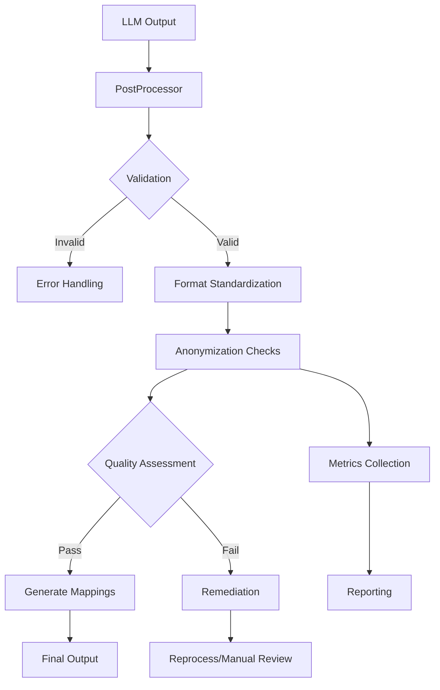

# PAMOLA.CORE LLM Text Postprocessing Module Documentation

**Module:** `pamola_core.utils.nlp.llm.postprocessing`  
**Version:** 0.1.0-dev  
**Status:** In Development  
**Last Updated:** January 2025

## Table of Contents
1. [Overview](#overview)
2. [Development Status](#development-status)
3. [Planned Features](#planned-features)
4. [Typical Tasks](#typical-tasks)
5. [Architecture Design](#architecture-design)
6. [Integration Points](#integration-points)
7. [Roadmap](#roadmap)

## Overview

The `postprocessing.py` module is currently under active development as part of the PAMOLA.CORE LLM processing pipeline. This module will provide comprehensive postprocessing functionality for LLM-generated outputs, with a specific focus on anonymization tasks and privacy-preserving transformations.

### Purpose

This module will serve as the final stage in the LLM processing pipeline, responsible for:
- Validating and cleaning LLM outputs
- Ensuring anonymization quality and consistency
- Handling format conversions and standardization
- Performing safety checks and compliance validation
- Managing reverse transformations and de-anonymization mappings

## Development Status

⚠️ **This module is currently in active development and not yet ready for production use.**

Current implementation status:
- [ ] Core architecture design - **In Progress**
- [ ] Base postprocessing classes - **Planned**
- [ ] Anonymization validators - **Planned**
- [ ] Format converters - **Planned**
- [ ] Quality assurance tools - **Planned**
- [ ] Integration with metrics module - **Planned**

## Planned Features

### 1. **Output Validation**
- Response format verification
- Completeness checks
- Consistency validation
- Schema compliance

### 2. **Anonymization Quality Assurance**
- Privacy level verification
- Consistency across fields
- Referential integrity
- K-anonymity validation

### 3. **Format Standardization**
- Output normalization
- Structure alignment
- Encoding consistency
- Whitespace management

### 4. **Safety Checks**
- PII leak detection
- Sensitive data scanning
- Compliance verification
- Risk assessment

### 5. **Transformation Management**
- Mapping table generation
- Reverse transformation support
- Audit trail creation
- Consistency tracking

## Typical Tasks

### Anonymization-Specific Tasks

The postprocessing module will handle the following typical tasks when performing anonymization with LLM:

#### 1. **Entity Consistency Verification**
```python
# Planned functionality
def verify_entity_consistency(original_text: str, anonymized_text: str) -> ValidationResult:
    """
    Ensure all instances of the same entity are anonymized consistently.
    
    Example:
        Original: "John Smith called John's office"
        Anonymized: "[PERSON_1] called [PERSON_1]'s office"
    """
```

#### 2. **Anonymization Completeness Check**
```python
# Planned functionality
def check_anonymization_completeness(text: str, entity_types: List[str]) -> CompletionReport:
    """
    Verify all sensitive entities have been properly anonymized.
    
    Checks for:
    - Missed PII (names, emails, phones, addresses)
    - Partial anonymization
    - Format inconsistencies
    """
```

#### 3. **Referential Integrity Maintenance**
```python
# Planned functionality
def maintain_referential_integrity(texts: List[str], entity_map: Dict[str, str]) -> List[str]:
    """
    Ensure cross-document consistency in anonymization.
    
    Example:
        Doc1: "Alice works at TechCorp"  → "[PERSON_1] works at [ORG_1]"
        Doc2: "TechCorp hired Alice"     → "[ORG_1] hired [PERSON_1]"
    """
```

#### 4. **Format Preservation and Standardization**
```python
# Planned functionality
def preserve_document_format(original: str, anonymized: str) -> str:
    """
    Maintain original document structure while standardizing anonymization markers.
    
    Tasks:
    - Preserve paragraph structure
    - Maintain list formatting
    - Standardize placeholder format ([TYPE_ID])
    - Handle special formatting (tables, code blocks)
    """
```

#### 5. **Semantic Coherence Validation**
```python
# Planned functionality
def validate_semantic_coherence(anonymized_text: str) -> CoherenceScore:
    """
    Ensure anonymized text maintains logical coherence.
    
    Checks:
    - Pronoun consistency
    - Context preservation
    - Relationship logic
    - Temporal consistency
    """
```

#### 6. **Privacy Level Compliance**
```python
# Planned functionality
def verify_privacy_compliance(
    text: str, 
    privacy_level: PrivacyLevel,
    compliance_rules: ComplianceRules
) -> ComplianceReport:
    """
    Verify output meets specified privacy requirements.
    
    Validates:
    - K-anonymity thresholds
    - L-diversity requirements
    - Differential privacy constraints
    - Regulatory compliance (GDPR, HIPAA)
    """
```

#### 7. **Reversibility Mapping Generation**
```python
# Planned functionality
def generate_reversibility_map(
    original_text: str,
    anonymized_text: str,
    encryption_key: Optional[str] = None
) -> ReversibilityMap:
    """
    Create secure mapping for potential de-anonymization.
    
    Generates:
    - Entity-to-placeholder mappings
    - Position tracking
    - Encrypted storage format
    - Access audit capabilities
    """
```

#### 8. **Quality Metrics Calculation**
```python
# Planned functionality
def calculate_anonymization_metrics(
    original: str,
    anonymized: str,
    ground_truth: Optional[str] = None
) -> AnonymizationMetrics:
    """
    Calculate comprehensive quality metrics.
    
    Metrics:
    - Information loss ratio
    - Utility preservation score
    - Privacy risk assessment
    - Consistency score
    - Completeness percentage
    """
```

#### 9. **Output Sanitization**
```python
# Planned functionality
def sanitize_llm_output(raw_output: str, sanitization_rules: SanitizationRules) -> str:
    """
    Clean and sanitize LLM output for safety.
    
    Operations:
    - Remove potential prompt injections
    - Clean markup artifacts
    - Normalize special characters
    - Remove system messages
    - Handle edge cases
    """
```

#### 10. **Batch Consistency Enforcement**
```python
# Planned functionality
def enforce_batch_consistency(
    results: List[ProcessingResult],
    consistency_rules: ConsistencyRules
) -> List[ProcessingResult]:
    """
    Ensure consistency across batch-processed documents.
    
    Enforces:
    - Uniform anonymization strategies
    - Consistent placeholder formats
    - Cross-document entity alignment
    - Temporal consistency
    """
```

## Architecture Design

### Planned Component Structure

```
postprocessing.py
├── Core Classes
│   ├── PostProcessor          # Main orchestrator
│   ├── AnonymizationValidator # Anonymization-specific validation
│   ├── FormatStandardizer     # Output format management
│   └── QualityAssessor        # Quality metrics and scoring
├── Validators
│   ├── EntityValidator        # Entity-level validation
│   ├── PrivacyValidator       # Privacy compliance checking
│   ├── ConsistencyValidator   # Cross-reference validation
│   └── CompletenessValidator  # Coverage validation
├── Transformers
│   ├── OutputNormalizer       # Text normalization
│   ├── FormatConverter        # Format conversions
│   ├── PlaceholderManager     # Placeholder standardization
│   └── StructurePreserver     # Document structure maintenance
├── Analyzers
│   ├── PIIScanner            # Residual PII detection
│   ├── RiskAssessor          # Privacy risk analysis
│   ├── QualityScorer         # Output quality scoring
│   └── ComplianceChecker     # Regulatory compliance
└── Utilities
    ├── MappingGenerator      # Entity mapping creation
    ├── AuditLogger           # Processing audit trail
    ├── MetricsCollector      # Performance metrics
    └── ReportGenerator       # Detailed reports
```

### Planned Data Flow



## Integration Points

### Dependencies

The postprocessing module will integrate with:

1. **preprocessing.py** - For input/output format consistency
2. **processing.py** - For processing result handling
3. **metrics.py** - For quality metrics and performance tracking
4. **data_contracts.py** - For standardized data structures
5. **config.py** - For configuration management

### External Systems

Planned integrations:
- Anonymization quality benchmarks
- Compliance validation services
- Entity recognition systems
- Privacy risk assessment tools

## Roadmap

### Phase 1: Core Infrastructure (Q1 2025)
- [ ] Basic PostProcessor class
- [ ] Simple validation framework
- [ ] Output normalization
- [ ] Integration with existing pipeline

### Phase 2: Anonymization Features (Q2 2025)
- [ ] Entity consistency validation
- [ ] Privacy compliance checking
- [ ] Mapping generation
- [ ] Quality metrics

### Phase 3: Advanced Features (Q3 2025)
- [ ] Machine learning-based quality assessment
- [ ] Automated remediation
- [ ] Advanced compliance checking
- [ ] Performance optimization

### Phase 4: Production Readiness (Q4 2025)
- [ ] Comprehensive testing
- [ ] Performance benchmarking
- [ ] Documentation completion
- [ ] Production deployment

## Future Considerations

### Extensibility
- Plugin architecture for custom validators
- Support for domain-specific anonymization rules
- Integration with external anonymization services
- Custom metric definitions

### Performance
- Streaming processing for large documents
- Parallel validation pipelines
- Caching for repeated validations
- GPU acceleration for ML-based checks

### Security
- Encrypted mapping storage
- Audit trail with immutable logs
- Access control for de-anonymization
- Compliance with security standards

## Contributing

As this module is under development, we welcome contributions and feedback. Please contact the PAMOLA Core Team for:
- Feature requests
- Architecture suggestions
- Use case examples
- Testing and validation

## Summary

The postprocessing module represents a critical component in the LLM-based anonymization pipeline, ensuring that outputs meet quality, privacy, and compliance requirements. While currently in development, the planned features will provide comprehensive validation, transformation, and quality assurance capabilities essential for production-ready privacy-preserving systems.

The module's design emphasizes:
- **Correctness**: Ensuring anonymization is complete and consistent
- **Quality**: Maintaining output utility while preserving privacy
- **Compliance**: Meeting regulatory and organizational requirements
- **Auditability**: Providing clear trails for verification and debugging
- **Extensibility**: Supporting custom rules and domain-specific needs