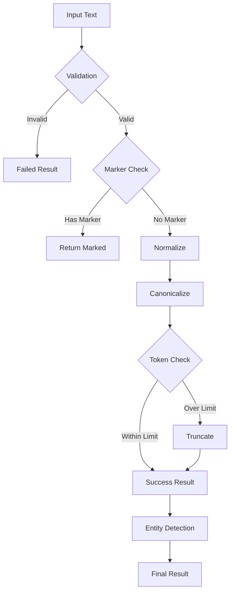

# PAMOLA.CORE LLM Text Preprocessing Module Documentation

**Module:** `pamola_core.utils.nlp.llm.preprocessing`  
**Version:** 1.0.0  
**Status:** Stable  
**Last Updated:** January 2025

## Table of Contents
1. [Overview](#overview)
2. [Key Features](#key-features)
3. [Architecture](#architecture)
4. [Core Components](#core-components)
5. [API Reference](#api-reference)
6. [Usage Examples](#usage-examples)
7. [Best Practices](#best-practices)
8. [Performance Considerations](#performance-considerations)

## Overview

The `preprocessing.py` module provides comprehensive text preprocessing functionality for LLM operations within the PAMOLA.CORE framework. It handles text validation, normalization, canonicalization, token estimation, truncation, and marker management, serving as the first stage in the LLM processing pipeline.

### Purpose

This module ensures that text data is properly prepared for LLM processing by:
- Validating and filtering invalid inputs early to avoid wasting resources
- Normalizing text for consistent processing
- Estimating and managing token counts to fit model constraints
- Supporting resumable operations through marker management
- Providing consistent canonicalization for effective caching

## Key Features

### 1. **Text Validation**
- Early detection of invalid inputs (None, NaN, empty strings)
- Length validation with configurable thresholds
- Content meaningfulness checks
- Null representation detection

### 2. **Text Normalization**
- Encoding issue fixes (UTF-8, common replacements)
- Whitespace normalization
- Special character handling
- Control character removal

### 3. **Token Management**
- Multiple token estimation methods (simple, tiktoken)
- Intelligent truncation strategies
- Safety buffer calculations
- Language-aware token estimation

### 4. **Marker Management**
- Processing marker detection and handling
- Idempotent marker operations
- Resumable processing support
- Integration with canonicalization

### 5. **Text Canonicalization**
- Consistent text representation for caching
- Marker-aware canonicalization
- Line ending normalization
- Whitespace standardization

## Architecture

### Module Structure

```
preprocessing.py
├── Constants & Configuration
│   ├── DEFAULT_MARKER = "~"
│   ├── TOKEN_CHAR_RATIO = 4
│   ├── MIN_VALID_TEXT_LENGTH = 3
│   └── MAX_TEXT_LENGTH = 50000
├── Core Components
│   ├── TextNormalizer         # Text cleaning and normalization
│   ├── TokenEstimator         # Token count estimation
│   ├── TextTruncator          # Intelligent text truncation
│   └── MarkerManager          # Processing marker handling
├── Main Class
│   └── TextPreprocessor       # Orchestrates all preprocessing
├── Utility Functions
│   ├── canonicalize_text()    # Text canonicalization
│   ├── preprocess_text()      # Quick preprocessing
│   ├── normalize_text()       # Simple normalization
│   └── estimate_tokens()      # Token estimation
└── Future Extensions
    └── EntityDetector         # Placeholder for NER
```

### Processing Pipeline



## Core Components

### TextNormalizer

Handles text cleaning and normalization operations.

```python
class TextNormalizer:
    def __init__(self, preserve_special_chars: bool = False):
        """Initialize with special character preservation option."""
    
    @staticmethod
    def normalize(text: Any) -> str:
        """Normalize any input to clean string."""
    
    def clean_whitespace(self, text: str) -> str:
        """Clean up whitespace in text."""
    
    def fix_encoding(self, text: str) -> str:
        """Fix common encoding issues."""
    
    def remove_special_characters(
        self, text: str, 
        keep_chars: Optional[str] = None,
        preserve_structure: bool = True
    ) -> str:
        """Remove special characters from text."""
    
    def normalize_for_llm(self, text: str) -> str:
        """Complete normalization pipeline for LLM."""
```

### TokenEstimator

Provides token count estimation with multiple methods.

```python
class TokenEstimator:
    def __init__(self, method: TokenEstimationMethod = TokenEstimationMethod.SIMPLE):
        """Initialize with estimation method."""
    
    def estimate(self, text: str) -> int:
        """Estimate token count for text."""
    
    def estimate_with_buffer(self, text: str, buffer_percentage: float = 0.1) -> int:
        """Estimate tokens with safety buffer."""
```

### TextTruncator

Handles intelligent text truncation with multiple strategies.

```python
class TextTruncator:
    def __init__(self, estimator: Optional[TokenEstimator] = None):
        """Initialize with token estimator."""
    
    def truncate(
        self, text: str, max_tokens: int,
        strategy: TruncationStrategy = TruncationStrategy.SMART,
        add_ellipsis: bool = True
    ) -> Tuple[str, bool, int]:
        """Truncate text to fit within token limit."""
```

### MarkerManager

Manages processing markers for resumable operations.

```python
class MarkerManager:
    def __init__(self, marker: str = DEFAULT_MARKER):
        """Initialize with marker string."""
    
    def has_marker(self, text: str) -> bool:
        """Check if text has processing marker."""
    
    def add_marker(self, text: str) -> str:
        """Add processing marker (idempotent)."""
    
    def remove_marker(self, text: str) -> str:
        """Remove processing marker."""
    
    def extract_marked_and_clean(self, text: str) -> Tuple[bool, str]:
        """Extract marker status and clean text."""
```

### TextPreprocessor

Main preprocessing orchestrator that coordinates all components.

```python
class TextPreprocessor:
    def __init__(self, config: Optional[Dict[str, Any]] = None):
        """Initialize with configuration."""
    
    def preprocess(
        self, text: str,
        field_name: Optional[str] = None,
        skip_marker_check: bool = False
    ) -> PreprocessResult:
        """Main preprocessing pipeline."""
    
    def batch_preprocess(
        self, texts: List[str],
        field_name: Optional[str] = None
    ) -> List[PreprocessResult]:
        """Preprocess multiple texts."""
```

## API Reference

### Main Functions

| Function | Description | Parameters | Returns |
|----------|-------------|------------|---------|
| `preprocess_text()` | Quick preprocessing | `text: str`<br>`max_tokens: int`<br>`truncation_strategy: str`<br>`processing_marker: str` | `PreprocessResult` |
| `normalize_text()` | Simple normalization | `text: Any` | `str` |
| `estimate_tokens()` | Token estimation | `text: str`<br>`method: str` | `int` |
| `truncate_text()` | Text truncation | `text: str`<br>`max_tokens: int`<br>`strategy: str` | `Tuple[str, bool, int]` |
| `canonicalize_text()` | Text canonicalization | `text: str`<br>`processing_marker: str` | `str` |

### Configuration Options

| Option | Type | Default | Description |
|--------|------|---------|-------------|
| `preserve_special_chars` | bool | False | Preserve special characters |
| `token_estimation_method` | str | "simple" | Token estimation method |
| `processing_marker` | str | "~" | Marker for processed text |
| `min_text_length` | int | 3 | Minimum valid text length |
| `max_text_length` | int | 50000 | Maximum text length |
| `max_input_tokens` | int | 1000 | Maximum input tokens |
| `truncation_strategy` | str | "smart" | Truncation strategy |
| `use_processing_marker` | bool | True | Enable marker management |

### Truncation Strategies

| Strategy | Description |
|----------|-------------|
| `END` | Truncate at the end, preserving word boundaries |
| `MIDDLE` | Remove middle portion, keeping start and end |
| `SMART` | Intelligent truncation preserving semantic units |

## Usage Examples

### Basic Text Preprocessing

```python
from pamola_core.utils.nlp.llm.preprocessing import TextPreprocessor
from pamola_core.utils.nlp.llm.enums import TruncationStrategy

# Create preprocessor with configuration
config = {
    'max_input_tokens': 1000,
    'truncation_strategy': 'smart',
    'token_estimation_method': 'simple'
}
preprocessor = TextPreprocessor(config)

# Preprocess single text
text = "This is a long text that needs preprocessing..."
result = preprocessor.preprocess(text)

if result.success:
    print(f"Processed text: {result.processed_text}")
    print(f"Estimated tokens: {result.estimated_tokens}")
    print(f"Was truncated: {result.was_truncated}")
else:
    print(f"Preprocessing failed: {result.error_message}")
```

### Text Normalization

```python
from pamola_core.utils.nlp.llm.preprocessing import TextNormalizer

# Create normalizer
normalizer = TextNormalizer(preserve_special_chars=False)

# Fix encoding issues
text_with_encoding_issues = "Curly quotes: “Helloâ€""
fixed_text = normalizer.fix_encoding(text_with_encoding_issues)
print(fixed_text)  # "Curly quotes: "Hello"

# Clean whitespace
messy_text = "Too    many     spaces\n\n\n\nand newlines"
clean_text = normalizer.clean_whitespace(messy_text)
print(clean_text)  # "Too many spaces\n\nand newlines"

# Full normalization pipeline
raw_text = "  Messy text with “issues†   \n\n\n  "
normalized = normalizer.normalize_for_llm(raw_text)
print(normalized)  # "Messy text with "issues""
```

### Token Estimation and Truncation

```python
from pamola_core.utils.nlp.llm.preprocessing import TokenEstimator, TextTruncator
from pamola_core.utils.nlp.llm.enums import TokenEstimationMethod, TruncationStrategy

# Create token estimator
estimator = TokenEstimator(TokenEstimationMethod.SIMPLE)

# Estimate tokens
text = "This is a sample text for token estimation."
token_count = estimator.estimate(text)
print(f"Estimated tokens: {token_count}")

# Estimate with buffer
tokens_with_buffer = estimator.estimate_with_buffer(text, buffer_percentage=0.1)
print(f"Tokens with 10% buffer: {tokens_with_buffer}")

# Truncate text
truncator = TextTruncator(estimator)
long_text = "Very long text " * 100

truncated, was_truncated, tokens_removed = truncator.truncate(
    long_text,
    max_tokens=100,
    strategy=TruncationStrategy.SMART,
    add_ellipsis=True
)

if was_truncated:
    print(f"Removed {tokens_removed} tokens")
    print(f"Truncated text: {truncated[:50]}...")
```

### Marker Management

```python
from pamola_core.utils.nlp.llm.preprocessing import MarkerManager

# Create marker manager
marker_mgr = MarkerManager(marker="~")

# Check and add markers
text = "Original text"
if not marker_mgr.has_marker(text):
    marked_text = marker_mgr.add_marker(text)
    print(f"Marked: {marked_text}")  # "~Original text"

# Extract marker status and clean text
has_marker, clean_text = marker_mgr.extract_marked_and_clean(marked_text)
print(f"Has marker: {has_marker}")  # True
print(f"Clean text: {clean_text}")  # "Original text"

# Idempotent operations
double_marked = marker_mgr.add_marker(marked_text)
print(double_marked == marked_text)  # True (no double marking)
```

### Batch Processing

```python
from pamola_core.utils.nlp.llm.preprocessing import TextPreprocessor

# Create preprocessor
preprocessor = TextPreprocessor({
    'max_input_tokens': 500,
    'truncation_strategy': 'end'
})

# Batch preprocess
texts = [
    "First text to process",
    "Second text with more content",
    None,  # Invalid
    "Third valid text",
    ""     # Empty
]

results = preprocessor.batch_preprocess(texts, field_name="comments")

# Process results
for i, result in enumerate(results):
    if result.success:
        print(f"Text {i}: {result.estimated_tokens} tokens")
    else:
        print(f"Text {i} failed: {result.error_message}")
```

### Text Canonicalization

```python
from pamola_core.utils.nlp.llm.preprocessing import canonicalize_text

# Different representations of same text
texts = [
    "~Hello world",           # With marker
    "Hello world",            # Without marker
    "  Hello world  ",        # Extra whitespace
    "Hello\r\nworld",         # Windows line ending
    "Hello\nworld",           # Unix line ending
]

# All canonicalize to same form
canonical_forms = [canonicalize_text(t) for t in texts]
print(all(c == canonical_forms[0] for c in canonical_forms))  # True
print(f"Canonical form: '{canonical_forms[0]}'")  # "Hello\nworld"
```

### Custom Configuration

```python
from pamola_core.utils.nlp.llm.preprocessing import TextPreprocessor

# Create preprocessor with custom settings
config = {
    # Validation settings
    'min_text_length': 10,
    'max_text_length': 10000,
    
    # Token settings
    'max_input_tokens': 2000,
    'token_estimation_method': 'tiktoken',  # If available
    
    # Truncation settings
    'truncation_strategy': 'middle',
    
    # Marker settings
    'processing_marker': '##PROCESSED##',
    'use_processing_marker': True,
    
    # Normalization settings
    'preserve_special_chars': True
}

preprocessor = TextPreprocessor(config)

# Get configuration stats
stats = preprocessor.get_stats()
print(f"Configuration: {stats['config']}")
print(f"Components: {stats['components']}")
```

## Best Practices

### 1. Input Validation

```python
# Always handle various input types
def safe_preprocess(text: Any) -> PreprocessResult:
    """Safely preprocess any input."""
    preprocessor = TextPreprocessor()
    
    # Handle pandas Series
    if hasattr(text, 'iloc'):
        text = text.iloc[0] if len(text) > 0 else None
    
    # Preprocess
    return preprocessor.preprocess(text)
```

### 2. Token Management

```python
# Use appropriate token limits for your model
MODEL_LIMITS = {
    'gpt-3.5': 4096,
    'gpt-4': 8192,
    'claude': 100000,
    'local-llm': 2048
}

def create_preprocessor_for_model(model_name: str) -> TextPreprocessor:
    """Create preprocessor with model-specific limits."""
    max_tokens = MODEL_LIMITS.get(model_name, 1000)
    
    # Reserve tokens for system prompt and response
    input_limit = int(max_tokens * 0.7)
    
    return TextPreprocessor({
        'max_input_tokens': input_limit,
        'truncation_strategy': 'smart'
    })
```

### 3. Marker Usage

```python
# Use markers for resumable processing
def process_with_resume(texts: List[str], preprocessor: TextPreprocessor):
    """Process texts with resume capability."""
    results = []
    
    for text in texts:
        result = preprocessor.preprocess(text)
        
        if result.success and not result.was_processed:
            # Process only unmarked texts
            # ... LLM processing ...
            
            # Mark as processed
            marked = preprocessor.marker_manager.add_marker(result.processed_text)
            results.append(marked)
        else:
            # Skip already processed
            results.append(text)
    
    return results
```

### 4. Error Handling

```python
# Comprehensive error handling
def robust_preprocess(text: Any, field_name: str) -> Optional[str]:
    """Preprocess with comprehensive error handling."""
    try:
        preprocessor = TextPreprocessor()
        result = preprocessor.preprocess(text, field_name)
        
        if not result.success:
            logger.warning(
                f"Preprocessing failed for {field_name}: "
                f"{result.error_message}"
            )
            return None
        
        if result.issues:
            logger.info(
                f"Preprocessing issues for {field_name}: "
                f"{', '.join(result.issues)}"
            )
        
        return result.processed_text
        
    except Exception as e:
        logger.error(f"Unexpected error preprocessing {field_name}: {e}")
        return None
```

## Performance Considerations

### Memory Efficiency

1. **Batch Size**: Process texts in reasonable batches
   ```python
   def process_large_dataset(texts: List[str], batch_size: int = 1000):
       preprocessor = TextPreprocessor()
       
       for i in range(0, len(texts), batch_size):
           batch = texts[i:i + batch_size]
           results = preprocessor.batch_preprocess(batch)
           yield from results
   ```

2. **Text Length Limits**: Set appropriate limits
   ```python
   # For high-volume processing
   config = {
       'max_text_length': 10000,  # Prevent DOS
       'max_input_tokens': 500    # Control costs
   }
   ```

### Performance Optimization

1. **Regex Compilation**: Patterns are pre-compiled
   ```python
   # TextNormalizer compiles patterns once
   self._compiled_patterns = {
       'multiple_spaces': re.compile(r'\s+'),
       'control_chars': re.compile(r'[\x00-\x1F\x7F]')
   }
   ```

2. **Early Validation**: Fail fast on invalid inputs
   ```python
   # Validation happens before expensive operations
   validation_result = self._validate_input(text)
   if not validation_result['valid']:
       return create_failed_preprocess_result(...)
   ```

### Caching Considerations

1. **Canonicalization**: Ensures cache effectiveness
   ```python
   # Different inputs map to same cache key
   canonical = canonicalize_text(text)
   cache_key = generate_cache_key(canonical)
   ```

2. **Marker-Aware Caching**: Prevents double processing
   ```python
   # Check marker before cache lookup
   if marker_manager.has_marker(text):
       return cached_result
   ```

## Summary

The preprocessing module provides a robust foundation for preparing text for LLM processing:

- **Validation**: Early detection of invalid inputs
- **Normalization**: Consistent text representation
- **Token Management**: Estimation and truncation
- **Marker System**: Resumable processing support
- **Canonicalization**: Effective caching support

The modular architecture allows for easy extension and customization while maintaining backward compatibility with existing systems.