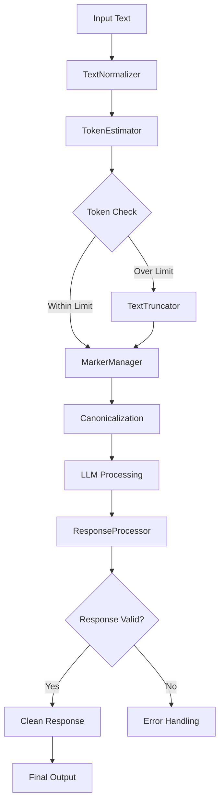

# PAMOLA.CORE LLM Processing Module Documentation

**Module:** `pamola_core.utils.nlp.llm.processing`  
**Version:** 1.2.0  
**Status:** Stable (Deprecated - Transitioning)  
**Last Updated:** January 2025

## Table of Contents
1. [Overview](#overview)
2. [Deprecation Notice](#deprecation-notice)
3. [Key Features](#key-features)
4. [Architecture](#architecture)
5. [Core Components](#core-components)
6. [API Reference](#api-reference)
7. [Usage Examples](#usage-examples)
8. [Migration Guide](#migration-guide)
9. [Performance Considerations](#performance-considerations)

## Overview

The `processing.py` module provides comprehensive text processing utilities for LLM operations within the PAMOLA.CORE framework. It currently serves as a monolithic processing module handling both pre-processing and post-processing tasks, including text normalization, truncation, response extraction, marker management, and batch processing coordination.

### Purpose

This module acts as a bridge between raw text data and LLM-ready formats, handling:
- Text validation and normalization
- Token counting and management
- Response extraction and cleaning
- Processing marker management for resumable operations
- Batch processing optimization
- Text canonicalization for caching

## Deprecation Notice

⚠️ **This module is scheduled for deprecation in future versions.**

The functionality is being split into:
- **preprocessing.py** - Input text preparation, validation, truncation
- **postprocessing.py** - Response cleaning, validation, quality checks

### Migration Timeline
- **Current (v1.2.0)**: Module remains fully functional
- **v2.0.0**: Functionality duplicated in new modules with deprecation warnings
- **v3.0.0**: Module removed, imports redirected to new modules

## Key Features

### 1. **Text Normalization**
- Encoding fixes and special character handling
- Whitespace normalization
- Null value handling (None, NaN, pandas NA)
- Multi-language support (Latin and Cyrillic)

### 2. **Token Management**
- Multiple estimation methods (simple, tiktoken, character-based)
- Smart truncation with multiple strategies
- Buffer calculations for safety margins
- Chunk management for long texts

### 3. **Response Processing**
- Extraction from various LLM response formats
- Service response detection
- Error response identification
- Anonymization-specific cleaning

### 4. **Marker Management**
- Processing markers for resumable operations
- Idempotent marker operations
- Integration with text canonicalization
- Cache-aware processing

### 5. **Batch Processing**
- Optimal batch preparation based on token limits
- Result merging with original order preservation
- Chunk-based processing for long documents

### 6. **Text Canonicalization**
- Consistent text representation for caching
- Line ending normalization
- Marker-aware canonicalization
- Whitespace standardization

## Architecture

### Module Components

```
processing.py
├── Constants
│   ├── TOKEN_CHAR_RATIO = 4
│   ├── DEFAULT_MARKER = "~"
│   ├── MAX_RESPONSE_ATTEMPTS = 3
│   └── MIN_VALID_RESPONSE_LENGTH = 10
├── Pattern Definitions
│   ├── SERVICE_RESPONSE_PATTERNS
│   ├── INTRO_CLEAN_PATTERNS
│   └── TRAILING_CLEAN_PATTERNS
├── Core Classes
│   ├── TextNormalizer         # Text cleaning and normalization
│   ├── TokenEstimator         # Token counting and estimation
│   ├── TextTruncator          # Intelligent text truncation
│   ├── ResponseProcessor      # LLM response handling
│   ├── MarkerManager          # Processing marker management
│   ├── BatchProcessor         # Batch processing utilities
│   └── TextChunker           # Long text chunking
├── Data Classes
│   ├── ProcessedText         # Container for processed text
│   ├── ResponseAnalysis      # Response analysis results
│   └── ResponseType          # Response type enumeration
└── Utility Functions
    ├── canonicalize_text()    # Text canonicalization
    ├── normalize_text()       # Quick normalization
    ├── estimate_tokens()      # Token estimation
    ├── truncate_text()        # Text truncation
    └── extract_response_text()# Response extraction
```

### Processing Flow



## Core Components

### TextNormalizer

Handles comprehensive text normalization operations.

```python
class TextNormalizer:
    @staticmethod
    def normalize(text: Any) -> str:
        """Normalize any input to clean string."""
    
    @staticmethod
    def clean_whitespace(text: str) -> str:
        """Clean up whitespace in text."""
    
    @staticmethod
    def remove_special_characters(text: str, keep_chars: str = "") -> str:
        """Remove special characters from text."""
    
    @staticmethod
    def normalize_encoding(text: str) -> str:
        """Fix common encoding issues."""
```

### TokenEstimator

Provides flexible token estimation methods.

```python
class TokenEstimator:
    def __init__(self, method: str = "simple"):
        """Initialize with estimation method."""
    
    def estimate(self, text: str) -> int:
        """Estimate token count for text."""
    
    def estimate_with_buffer(self, text: str, buffer_percentage: float = 0.1) -> int:
        """Estimate tokens with safety buffer."""
```

### TextTruncator

Advanced text truncation with preservation strategies.

```python
class TextTruncator:
    def truncate(
        self, text: str, max_tokens: int,
        strategy: str = "smart", add_ellipsis: bool = True
    ) -> ProcessedText:
        """Truncate text to fit within token limit."""
```

### ResponseProcessor

Handles LLM response extraction and analysis.

```python
class ResponseProcessor:
    def extract_text(self, response: Any) -> str:
        """Extract text from various response formats."""
    
    def analyze_response(
        self, response_text: str,
        expected_min_length: int = MIN_VALID_RESPONSE_LENGTH
    ) -> ResponseAnalysis:
        """Analyze LLM response for validity and type."""
```

### MarkerManager

Enhanced marker management with cache integration.

```python
class MarkerManager:
    def __init__(self, marker: str = DEFAULT_MARKER):
        """Initialize with marker string."""
    
    def has_marker(self, text: str) -> bool:
        """Check if text has processing marker."""
    
    def add_marker(self, text: str) -> str:
        """Add processing marker (idempotent)."""
    
    def get_canonical_text(self, text: str) -> str:
        """Get canonical form for cache key."""
```

## API Reference

### Main Functions

| Function | Description | Parameters | Returns |
|----------|-------------|------------|---------|
| `canonicalize_text()` | Canonicalize for caching | `text: str`<br>`processing_marker: str` | `str` |
| `normalize_text()` | Quick normalization | `text: Any` | `str` |
| `estimate_tokens()` | Token estimation | `text: str`<br>`method: str` | `int` |
| `truncate_text()` | Truncate to token limit | `text: str`<br>`max_tokens: int`<br>`strategy: str`<br>`add_ellipsis: bool` | `ProcessedText` |
| `extract_response_text()` | Extract from LLM response | `response: Any` | `str` |
| `analyze_response()` | Analyze response validity | `response_text: str` | `ResponseAnalysis` |
| `chunk_long_text()` | Split into chunks | `text: str`<br>`chunk_size: int`<br>`chunk_overlap: int` | `List[str]` |

### Data Classes

#### ProcessedText
```python
@dataclass
class ProcessedText:
    text: str
    original_length: int
    processed_length: int
    was_truncated: bool = False
    truncated_tokens: int = 0
    estimated_tokens: int = 0
    processing_notes: List[str] = None
```

#### ResponseAnalysis
```python
@dataclass
class ResponseAnalysis:
    response_type: ResponseType
    cleaned_text: str
    original_text: str
    issues: List[str]
    confidence: float = 1.0
    service_category: Optional[str] = None
```

#### ResponseType
```python
class ResponseType(Enum):
    VALID = "valid"      # Valid processed response
    SERVICE = "service"  # Service/meta response
    ERROR = "error"      # Error response
    EMPTY = "empty"      # Empty or too short
    INVALID = "invalid"  # Invalid format
```

## Usage Examples

### Basic Text Processing

```python
from pamola_core.utils.nlp.llm.processing import (
    normalize_text, estimate_tokens, truncate_text
)

# Normalize input text
text = "  Messy text with   extra spaces  "
clean_text = normalize_text(text)
print(clean_text)  # "Messy text with extra spaces"

# Estimate tokens
token_count = estimate_tokens(clean_text, method="simple")
print(f"Estimated tokens: {token_count}")

# Truncate if needed
if token_count > 1000:
    result = truncate_text(clean_text, max_tokens=1000, strategy="smart")
    print(f"Truncated: {result.was_truncated}")
    print(f"New text: {result.text}")
```

### Response Processing

```python
from pamola_core.utils.nlp.llm.processing import (
    extract_response_text, analyze_response
)

# Extract text from various response formats
# Dictionary response
response_dict = {
    "choices": [{
        "text": "This is the generated text",
        "finish_reason": "stop"
    }]
}
text = extract_response_text(response_dict)
print(text)  # "This is the generated text"

# Analyze response
analysis = analyze_response(text)
if analysis.response_type == ResponseType.VALID:
    print(f"Valid response: {analysis.cleaned_text}")
else:
    print(f"Invalid response: {analysis.issues}")
```

### Marker Management

```python
from pamola_core.utils.nlp.llm.processing import MarkerManager

# Create marker manager
marker = MarkerManager("~")

# Process new text
text = "Original text content"
if not marker.has_marker(text):
    marked = marker.add_marker(text)
    print(marked)  # "~Original text content"
    
    # Process with LLM...
    
    # Get canonical form for caching
    canonical = marker.get_canonical_text(marked)
    print(canonical)  # "Original text content"
```

### Batch Processing

```python
from pamola_core.utils.nlp.llm.processing import BatchProcessor, TokenEstimator

# Prepare batches
texts = ["Text 1", "Text 2", "Text 3", "Long text 4" * 100]
estimator = TokenEstimator("simple")
processor = BatchProcessor()

# Create optimal batches
batch_indices = processor.prepare_batch(
    texts, 
    max_batch_tokens=1000,
    estimator=estimator
)

# Process batches
results = []
for batch_idx in batch_indices:
    batch_texts = [texts[i] for i in batch_idx]
    # Process batch with LLM...
    batch_results = ["Result " + str(i) for i in batch_idx]
    results.extend(batch_results)

# Merge results back
final_results = processor.merge_results(
    results, 
    [i for batch in batch_indices for i in batch],
    len(texts)
)
```

### Text Chunking

```python
from pamola_core.utils.nlp.llm.processing import TextChunker

# Create chunker
chunker = TextChunker(
    chunk_size=1000,      # tokens per chunk
    chunk_overlap=100     # overlap tokens
)

# Chunk long document
long_text = """Very long document with multiple paragraphs...

Second paragraph with more content...

Third paragraph...""" * 10

chunks = chunker.chunk_text(long_text)
print(f"Split into {len(chunks)} chunks")

# Process each chunk
for i, chunk in enumerate(chunks):
    print(f"Chunk {i+1}: {len(chunk)} characters")
    # Process chunk with LLM...
```

### Anonymization Response Cleaning

```python
from pamola_core.utils.nlp.llm.processing import ResponseProcessor

processor = ResponseProcessor()

# LLM response with typical artifacts
raw_response = """Конечно! Вот анонимизированная версия текста:

[Примечание: все имена заменены]

[PERSON_1] работает в [ORGANIZATION_1] с 2020 года.

Надеюсь, это поможет!"""

# Analyze and clean
analysis = processor.analyze_response(raw_response)
print(f"Cleaned text:\n{analysis.cleaned_text}")
# Output: [PERSON_1] работает в [ORGANIZATION_1] с 2020 года.
```

### Text Canonicalization for Caching

```python
from pamola_core.utils.nlp.llm.processing import canonicalize_text

# Different representations of same content
variations = [
    "~Hello world",          # With marker
    "Hello world",           # Without marker
    "  Hello world  ",       # Extra spaces
    "Hello\r\nworld",        # Windows line ending
    "Hello\nworld"           # Unix line ending
]

# All canonicalize to same form
canonical_forms = [canonicalize_text(text) for text in variations]
assert all(form == canonical_forms[0] for form in canonical_forms)
print(f"Canonical form: '{canonical_forms[0]}'")  # "Hello\nworld"
```

## Migration Guide

### Moving to New Modules

As this module is being split, here's how to migrate your code:

#### Pre-processing Functions → preprocessing.py
```python
# Old (processing.py)
from pamola_core.utils.nlp.llm.processing import (
    normalize_text, estimate_tokens, truncate_text,
    canonicalize_text, MarkerManager
)

# New (preprocessing.py)
from pamola_core.utils.nlp.llm.preprocessing import (
    normalize_text, estimate_tokens, truncate_text,
    canonicalize_text, MarkerManager
)
```

#### Post-processing Functions → postprocessing.py
```python
# Old (processing.py)
from pamola_core.utils.nlp.llm.processing import (
    extract_response_text, analyze_response,
    ResponseProcessor
)

# New (postprocessing.py)
from pamola_core.utils.nlp.llm.postprocessing import (
    extract_response_text, analyze_response,
    ResponseProcessor
)
```

#### Shared Components
Some components will be available in both modules during transition:
- `TextNormalizer` - Available in both
- `TokenEstimator` - Primarily in preprocessing
- `BatchProcessor` - May be moved to a separate utilities module

## Performance Considerations

### Memory Efficiency

1. **Pattern Compilation**: All regex patterns are pre-compiled
   ```python
   COMPILED_SERVICE_PATTERNS = {
       category: [re.compile(pattern) for pattern in patterns]
       for category, patterns in SERVICE_RESPONSE_PATTERNS.items()
   }
   ```

2. **Lazy Loading**: Optional dependencies loaded on demand
   ```python
   if method == "tiktoken":
       tiktoken = DependencyManager.get_module('tiktoken')
   ```

### Processing Optimization

1. **Early Validation**: Fail fast on invalid inputs
   ```python
   if text is None or pd.isna(text):
       return ""
   ```

2. **Efficient Truncation**: Smart strategies preserve semantic units
   ```python
   # Paragraph-based truncation preserves context
   paragraphs = text.split('\n\n')
   ```

### Caching Benefits

1. **Canonicalization**: Ensures cache effectiveness
   ```python
   canonical = canonicalize_text(text)
   # Same cache key for different representations
   ```

2. **Marker Integration**: Prevents duplicate processing
   ```python
   if marker.has_marker(text):
       return cached_result  # Skip re-processing
   ```

## Summary

The processing module provides a comprehensive suite of text processing utilities that form the backbone of LLM operations in PAMOLA.CORE:

- **Robust Normalization**: Handles various input formats and encodings
- **Flexible Token Management**: Multiple estimation methods and truncation strategies
- **Smart Response Processing**: Extraction and cleaning for various LLM outputs
- **Efficient Batching**: Optimized for large-scale processing
- **Cache Integration**: Canonicalization for effective caching

While scheduled for deprecation, the module remains fully functional and provides a migration path to the new modular architecture in preprocessing.py and postprocessing.py.