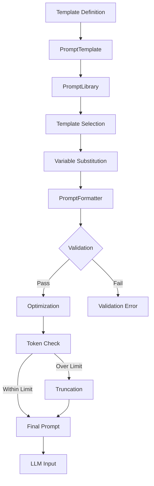

# PAMOLA.CORE LLM Prompt Management Module Documentation

**Module:** `pamola_core.utils.nlp.llm.prompt`  
**Version:** 1.1.0  
**Status:** Stable  
**Last Updated:** January 2025

## Table of Contents
1. [Overview](#overview)
2. [Key Features](#key-features)
3. [Architecture](#architecture)
4. [Core Components](#core-components)
5. [API Reference](#api-reference)
6. [Usage Examples](#usage-examples)
7. [Built-in Templates](#built-in-templates)
8. [Best Practices](#best-practices)
9. [Performance Considerations](#performance-considerations)

## Overview

The `prompt.py` module provides comprehensive utilities for managing, formatting, and optimizing prompts for Large Language Models within the PAMOLA.CORE framework. It offers a template-based approach to prompt management with support for multiple languages, various prompting strategies, and automatic optimization.

### Purpose

This module serves as the prompt engineering layer in the LLM pipeline, responsible for:
- Managing reusable prompt templates with versioning
- Ensuring consistent prompt formatting across the system
- Optimizing prompts for token limits and model constraints
- Supporting multiple prompting strategies (direct, few-shot, chain-of-thought)
- Providing pre-configured prompts for common privacy-preserving tasks

## Key Features

### 1. **Template Management**
- Template-based prompt system with variable substitution
- Version control for prompt templates
- Multi-language support (English, Russian, etc.)
- Template import/export capabilities
- Example management for templates

### 2. **Prompt Strategies**
- Direct prompting
- Instruction-following format
- Chat/conversation format
- Few-shot learning
- Chain-of-thought reasoning
- Role-playing prompts

### 3. **Validation & Optimization**
- Required variable validation
- Non-empty value enforcement
- Token counting and estimation
- Smart truncation strategies
- Trailing punctuation cleanup

### 4. **Pre-configured Templates**
- Anonymization prompts (Russian/English)
- Skill extraction prompts
- Chat-based anonymization
- Few-shot learning examples

### 5. **Advanced Features**
- Prompt chain building
- A/B testing support through versioning
- Context window management
- Dynamic variable substitution

## Architecture

### Module Structure

```
prompt.py
├── Constants
│   ├── DEFAULT_MAX_PROMPT_LENGTH = 4000
│   ├── TOKEN_CHAR_RATIO = 4
│   └── Pattern Definitions
├── Enumerations
│   └── PromptStrategy          # Available prompt strategies
├── Exceptions
│   └── PromptValidationError   # Validation failures
├── Core Classes
│   ├── PromptTemplate          # Template container with metadata
│   ├── PromptConfig            # Configuration for formatting
│   ├── PromptLibrary           # Template library management
│   ├── PromptFormatter         # Formatting and optimization
│   └── PromptChainBuilder      # Chain-of-thought builder
└── Utility Functions
    ├── create_prompt_formatter()
    └── load_prompt_library()
```

### Data Flow



## Core Components

### PromptTemplate

Container for prompt templates with comprehensive metadata.

```python
@dataclass
class PromptTemplate:
    name: str                              # Template identifier
    template: str                          # Template with {variable} placeholders
    description: str = ""                  # Template description
    strategy: PromptStrategy = DIRECT      # Prompting strategy
    language: str = "en"                   # Language code
    version: str = "1.0.0"                 # Template version
    variables: List[str] = []              # Required variables
    optional_variables: List[str] = []     # Optional variables
    metadata: Dict[str, Any] = {}          # Additional metadata
    examples: List[Dict[str, str]] = []    # Example values
    require_non_empty: bool = True         # Enforce non-empty values
    
    def validate_variables(self, provided_vars: Dict[str, Any]) -> None:
        """Validate required variables are provided and non-empty."""
    
    def format(self, **kwargs) -> str:
        """Format template with provided variables."""
```

### PromptConfig

Configuration for prompt formatting and optimization.

```python
@dataclass
class PromptConfig:
    max_length: int = 4000                      # Max prompt length
    truncation_strategy: str = "end"            # Truncation strategy
    preserve_examples: bool = True              # Keep examples when truncating
    add_ellipsis: bool = True                   # Add ... when truncating
    token_counter: Optional[Callable] = None    # Custom token counter
    enable_validation: bool = True              # Enable validation
    strip_extra_whitespace: bool = True         # Clean whitespace
    sanitize_trailing_punctuation: bool = True  # Remove trailing colons
```

### PromptLibrary

Manages collections of prompt templates.

```python
class PromptLibrary:
    def __init__(self, custom_templates: Optional[Dict[str, PromptTemplate]] = None):
        """Initialize with built-in and custom templates."""
    
    def get(self, name: str) -> PromptTemplate:
        """Get template by name."""
    
    def add(self, template: PromptTemplate, overwrite: bool = False) -> None:
        """Add template to library."""
    
    def list_templates(self, language: Optional[str] = None,
                       strategy: Optional[PromptStrategy] = None) -> List[str]:
        """List available templates with filtering."""
    
    def export_to_file(self, filepath: Union[str, Path]) -> None:
        """Export templates to JSON."""
    
    def import_from_file(self, filepath: Union[str, Path],
                         overwrite: bool = False) -> None:
        """Import templates from JSON."""
```

### PromptFormatter

Handles prompt formatting, optimization, and token management.

```python
class PromptFormatter:
    def __init__(self, config: Optional[PromptConfig] = None):
        """Initialize with configuration."""
    
    def estimate_tokens(self, text: str) -> int:
        """Estimate token count."""
    
    def truncate_text(self, text: str, max_tokens: int) -> Tuple[str, int]:
        """Truncate text to fit token limit."""
    
    def clean_whitespace(self, text: str) -> str:
        """Clean extra whitespace."""
    
    def sanitize_colon_suffix(self, text: str) -> str:
        """Remove trailing punctuation."""
    
    def format_prompt(self, template: PromptTemplate,
                      variables: Dict[str, Any]) -> str:
        """Format and optimize prompt."""
```

### PromptChainBuilder

Builder for creating chain-of-thought prompts.

```python
class PromptChainBuilder:
    def set_context(self, context: str) -> 'PromptChainBuilder':
        """Set initial context."""
    
    def add_step(self, step: str) -> 'PromptChainBuilder':
        """Add reasoning step."""
    
    def add_example(self, input_text: str, output_text: str) -> 'PromptChainBuilder':
        """Add example pair."""
    
    def build(self, final_instruction: str) -> str:
        """Build complete prompt."""
```

## API Reference

### PromptStrategy Enumeration

| Value | Description |
|-------|-------------|
| `DIRECT` | Simple direct prompt |
| `INSTRUCTION` | Instruction-following format |
| `CHAT` | Chat/conversation format |
| `FEW_SHOT` | Few-shot learning format |
| `CHAIN_OF_THOUGHT` | Step-by-step reasoning |
| `ROLE_PLAY` | Role-based prompting |

### Main Functions

| Function | Description | Parameters | Returns |
|----------|-------------|------------|---------|
| `create_prompt_formatter()` | Create formatter | `config: Optional[PromptConfig]` | `PromptFormatter` |
| `load_prompt_library()` | Load template library | `template_file: Optional[Path]` | `PromptLibrary` |

### Template Methods

| Method | Description | Parameters | Returns |
|--------|-------------|------------|---------|
| `validate_variables()` | Validate required vars | `provided_vars: Dict[str, Any]` | None (raises on error) |
| `format()` | Format with variables | `**kwargs` | `str` |
| `to_dict()` | Convert to dictionary | None | `Dict[str, Any]` |
| `from_dict()` | Create from dictionary | `data: Dict[str, Any]` | `PromptTemplate` |

## Usage Examples

### Basic Template Usage

```python
from pamola_core.utils.nlp.llm.prompt import PromptTemplate, PromptStrategy

# Create a simple template
template = PromptTemplate(
    name="summarize",
    template="Summarize the following text in {max_words} words:\n\n{text}",
    description="Text summarization prompt",
    strategy=PromptStrategy.INSTRUCTION,
    variables=["text", "max_words"]
)

# Format the template
prompt = template.format(
    text="Long article content here...",
    max_words=100
)
print(prompt)
```

### Using the Prompt Library

```python
from pamola_core.utils.nlp.llm.prompt import load_prompt_library

# Load library with built-in templates
library = load_prompt_library()

# Get anonymization template
template = library.get("anonymize_experience_ru")

# Format with text
prompt = template.format(
    text="Работал в Google с 2020 года как Senior Developer"
)
print(prompt)

# List available templates
russian_templates = library.list_templates(language="ru")
print(f"Russian templates: {russian_templates}")
```

### Custom Template Creation

```python
from pamola_core.utils.nlp.llm.prompt import (
    PromptTemplate, PromptLibrary, PromptStrategy
)

# Create custom template
custom_template = PromptTemplate(
    name="entity_extraction",
    template="""Extract all {entity_type} entities from the text below.
Format as a comma-separated list.

Text: {text}

Entities:""",
    description="Extract specific entity types",
    strategy=PromptStrategy.INSTRUCTION,
    variables=["text", "entity_type"],
    require_non_empty=True
)

# Add to library
library = PromptLibrary()
library.add(custom_template)

# Use the template
prompt = custom_template.format(
    text="John works at Microsoft in Seattle",
    entity_type="organization"
)
```

### Prompt Formatting and Optimization

```python
from pamola_core.utils.nlp.llm.prompt import (
    PromptFormatter, PromptConfig, PromptTemplate
)

# Configure formatter
config = PromptConfig(
    max_length=1000,
    truncation_strategy="smart",
    sanitize_trailing_punctuation=True
)
formatter = PromptFormatter(config)

# Create template with potential issues
template = PromptTemplate(
    name="process",
    template="Process this text: {text}:",  # Note trailing colon
    variables=["text"]
)

# Format with long text
long_text = "Very long text " * 500
prompt = formatter.format_prompt(
    template,
    {"text": long_text}
)

# The formatter will:
# 1. Truncate text to fit token limit
# 2. Remove the trailing colon
# 3. Clean up whitespace
print(f"Final prompt length: {len(prompt)}")
```

### Chain-of-Thought Prompting

```python
from pamola_core.utils.nlp.llm.prompt import PromptChainBuilder

# Build chain-of-thought prompt
builder = PromptChainBuilder()
prompt = (builder
    .set_context("We need to anonymize personal information in resumes")
    .add_step("Identify all personal identifiers (names, companies, locations)")
    .add_step("Determine appropriate generic replacements")
    .add_step("Replace identifiers while preserving context")
    .add_example(
        "John Smith at Google",
        "[PERSON] at [TECH_COMPANY]"
    )
    .build("Now anonymize this text: Senior Developer at Apple Inc.")
)

print(prompt)
```

### Few-Shot Learning Setup

```python
from pamola_core.utils.nlp.llm.prompt import PromptTemplate, PromptStrategy

# Create few-shot template
few_shot = PromptTemplate(
    name="few_shot_classification",
    template="""Classify work experience by seniority level.

Example 1:
Text: "Junior Developer with 1 year experience"
Level: Junior

Example 2:
Text: "Lead Engineer managing team of 10"
Level: Senior

Example 3:
Text: "CTO responsible for technology strategy"
Level: Executive

Now classify:
Text: "{text}"
Level:""",
    description="Few-shot seniority classification",
    strategy=PromptStrategy.FEW_SHOT,
    variables=["text"]
)

# Use the template
prompt = few_shot.format(
    text="Senior Software Engineer with 5 years experience"
)
```

### Export/Import Templates

```python
from pamola_core.utils.nlp.llm.prompt import PromptLibrary
from pathlib import Path

# Create library with custom templates
library = PromptLibrary()

# Add custom templates...
# library.add(custom_template1)
# library.add(custom_template2)

# Export to file
library.export_to_file("my_templates.json")

# Later, import templates
new_library = PromptLibrary()
new_library.import_from_file("my_templates.json")

# Access imported templates
template = new_library.get("custom_template1")
```

### Validation and Error Handling

```python
from pamola_core.utils.nlp.llm.prompt import (
    PromptTemplate, PromptValidationError
)

# Template with required variables
template = PromptTemplate(
    name="strict",
    template="Process {required_field} with {optional_field}",
    variables=["required_field"],
    optional_variables=["optional_field"],
    require_non_empty=True
)

# This will raise PromptValidationError - missing required variable
try:
    prompt = template.format(optional_field="value")
except PromptValidationError as e:
    print(f"Validation error: {e}")

# This will also raise - empty required variable
try:
    prompt = template.format(required_field="")
except PromptValidationError as e:
    print(f"Validation error: {e}")

# This works - required field provided
prompt = template.format(
    required_field="important data"
    # optional_field can be omitted
)
```

## Built-in Templates

### Available Templates

| Template Name | Language | Strategy | Description |
|--------------|----------|----------|-------------|
| `anonymize_experience_ru` | Russian | Instruction | Anonymize work experience |
| `anonymize_experience_en` | English | Instruction | Anonymize work experience |
| `extract_skills` | English | Instruction | Extract professional skills |
| `chat_anonymize` | English | Chat | Chat-based anonymization |
| `few_shot_anonymize` | English | Few-shot | Few-shot anonymization examples |

### Template Example

```python
# Built-in Russian anonymization template
template = library.get("anonymize_experience_ru")
print(template.template)
"""
Перепиши следующий текст опыта работы, удалив все личные и 
идентифицирующие данные (названия компаний, конкретные проекты, 
имена, специфичные технологии). Сохрани общий смысл и 
профессиональные навыки.

Исходный текст: {text}

Анонимизированный текст:
"""
```

## Best Practices

### 1. Template Design

```python
# Good: Clear instructions, structured format
good_template = PromptTemplate(
    name="clear_task",
    template="""Task: {task_description}

Input: {input_text}

Requirements:
- {requirement_1}
- {requirement_2}

Output:""",
    variables=["task_description", "input_text", 
               "requirement_1", "requirement_2"]
)

# Bad: Ambiguous, no structure
bad_template = PromptTemplate(
    name="vague_task",
    template="Do {something} with {text}",
    variables=["something", "text"]
)
```

### 2. Variable Validation

```python
# Always validate critical inputs
def safe_format_prompt(template: PromptTemplate, 
                      user_input: str) -> Optional[str]:
    """Safely format prompt with validation."""
    # Sanitize user input
    if not user_input or len(user_input.strip()) == 0:
        logger.warning("Empty user input provided")
        return None
    
    # Additional validation
    if len(user_input) > 10000:
        logger.warning("Input too long, truncating")
        user_input = user_input[:10000]
    
    try:
        return template.format(text=user_input)
    except PromptValidationError as e:
        logger.error(f"Prompt validation failed: {e}")
        return None
```

### 3. Token Management

```python
# Configure formatter for specific models
MODEL_CONFIGS = {
    "gpt-3.5": PromptConfig(max_length=4000),
    "gpt-4": PromptConfig(max_length=8000),
    "claude": PromptConfig(max_length=100000),
}

def get_formatter_for_model(model: str) -> PromptFormatter:
    """Get configured formatter for specific model."""
    config = MODEL_CONFIGS.get(model, PromptConfig())
    return PromptFormatter(config)
```

### 4. Template Versioning

```python
# Maintain template versions for A/B testing
templates_v1 = PromptTemplate(
    name="anonymize_v1",
    template="Anonymize: {text}",
    version="1.0.0"
)

templates_v2 = PromptTemplate(
    name="anonymize_v2",
    template="Remove all personal information from: {text}",
    version="2.0.0"
)

# Track performance by version
def track_template_performance(template: PromptTemplate, 
                             success: bool):
    """Log template performance for analysis."""
    logger.info(f"Template {template.name} v{template.version}: "
                f"{'success' if success else 'failure'}")
```

## Performance Considerations

### Token Estimation

1. **Tiktoken Integration**: Accurate but slower
   ```python
   # Use tiktoken for accurate counts when available
   config = PromptConfig(
       token_counter=lambda text: len(tiktoken_encoding.encode(text))
   )
   ```

2. **Character-Based**: Fast approximation
   ```python
   # Default character-based estimation
   estimated_tokens = len(text) // 4  # TOKEN_CHAR_RATIO
   ```

### Template Caching

```python
# Cache formatted prompts for repeated use
from functools import lru_cache

@lru_cache(maxsize=128)
def get_cached_prompt(template_name: str, 
                     text_hash: str) -> str:
    """Get cached prompt for repeated inputs."""
    template = library.get(template_name)
    # Reconstruct text from hash lookup
    text = text_cache.get(text_hash)
    return template.format(text=text)
```

### Batch Processing

```python
# Process multiple prompts efficiently
def batch_format_prompts(template: PromptTemplate,
                        texts: List[str]) -> List[str]:
    """Format multiple prompts efficiently."""
    formatter = PromptFormatter()
    prompts = []
    
    for text in texts:
        try:
            prompt = formatter.format_prompt(
                template,
                {"text": text}
            )
            prompts.append(prompt)
        except Exception as e:
            logger.error(f"Failed to format prompt: {e}")
            prompts.append(None)
    
    return prompts
```

## Summary

The prompt management module provides a robust framework for working with LLM prompts:

- **Template System**: Reusable, versioned prompt templates
- **Multi-Strategy Support**: Direct, instruction, chat, few-shot formats
- **Validation**: Comprehensive variable and content validation
- **Optimization**: Automatic truncation and formatting
- **Extensibility**: Easy to add custom templates and strategies

This module serves as the foundation for consistent and effective LLM interactions across the PAMOLA.CORE framework, with special focus on privacy-preserving operations like anonymization.