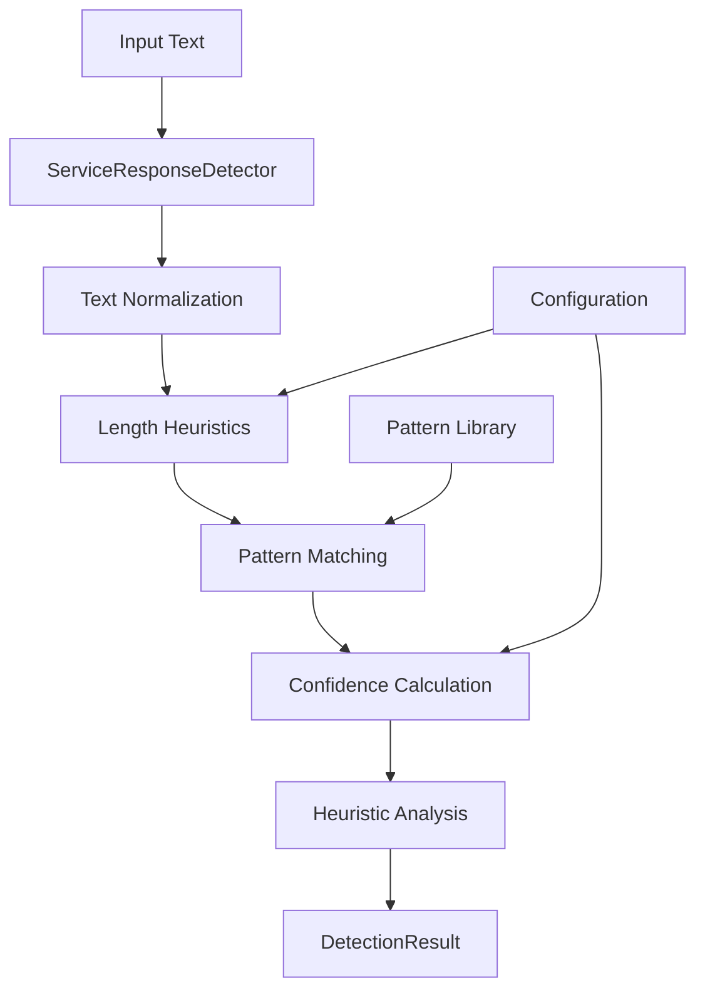

# PAMOLA.CORE LLM Service Response Detector Module Documentation

**Module:** `pamola_core.utils.nlp.llm.service_detector`  
**Version:** 1.0.0  
**Status:** Stable  
**Last Updated:** January 2025

## 1. Purpose and Overview

The Service Response Detector module provides sophisticated detection of service/meta responses from Large Language Models (LLMs). Service responses are messages where the LLM asks for clarification, provides acknowledgments, or otherwise fails to complete the requested task. These responses need to be filtered out to maintain data quality in LLM-powered data processing pipelines.

This module serves as a critical quality control component in the PAMOLA.CORE LLM utilities, ensuring that only meaningful, task-completing responses are processed downstream. It uses a comprehensive pattern matching system with confidence scoring to identify various types of service responses in both Russian and English.

## 2. Key Features

### Pattern-Based Detection
- **Comprehensive Pattern Library**: Over 350 pre-compiled regex patterns for Russian and English
- **Multiple Categories**: Six distinct categories of service responses
- **Priority-Based Matching**: Patterns tested in order of specificity
- **Performance Optimized**: Pre-compiled patterns with singleton caching

### Confidence Scoring
- **Weighted Scoring System**: Different pattern types have different confidence weights
- **Match Quality Analysis**: Considers match position, length, and completeness
- **Configurable Thresholds**: Adjustable confidence levels for different use cases
- **Heuristic Enhancement**: Additional checks for edge cases

### Categorization System
- **REQUEST_FOR_INPUT**: LLM requesting text or clarification
- **ACKNOWLEDGMENT**: Simple confirmations without content
- **ERROR_RESPONSE**: Technical errors or processing failures
- **META_COMMENTARY**: Comments about the task rather than results
- **CLARIFICATION**: Requests for additional details
- **REFUSAL**: Explicit task refusal

### Performance Features
- **Thread-Safe Operations**: Safe for concurrent use
- **Singleton Pattern**: Default detector instance for optimal performance
- **Pattern Statistics**: Track pattern effectiveness
- **Debug Logging**: Detailed logging for troubleshooting

## 3. Architecture

### Class Hierarchy

```
ServiceResponseDetector
├── PatternConfig (configuration)
├── DetectionResult (output structure)
└── ServiceCategory (enum from enums module)
```

### Component Dependencies

```python
from .enums import ServiceCategory  # Category enumeration
from typing import Dict, List, Optional, Pattern, Tuple
from dataclasses import dataclass, field
import re, logging, threading, time
```

### Data Flow



## 4. Core API Reference

### Primary Classes

#### PatternConfig

Configuration for service response pattern matching.

```python
@dataclass
class PatternConfig:
    confidence_threshold: float = 0.7
    min_response_length: int = 5
    max_response_length: int = 500
    case_sensitive: bool = False
    enable_debug_logging: bool = False
    pattern_weights: Dict[str, float] = field(default_factory=lambda: {
        'exact_match': 1.0,
        'strong_indicator': 0.9,
        'moderate_indicator': 0.7,
        'weak_indicator': 0.5
    })
```

#### DetectionResult

Result of service response detection with metadata.

```python
@dataclass
class DetectionResult:
    is_service_response: bool
    confidence: float
    category: Optional[ServiceCategory]
    matched_patterns: List[str] = field(default_factory=list)
    reasons: List[str] = field(default_factory=list)
    processing_time: float = 0.0
```

#### ServiceResponseDetector

Main detector class providing pattern matching and analysis.

```python
class ServiceResponseDetector:
    def __init__(self, config: Optional[PatternConfig] = None)
    
    def detect_with_confidence(
        self, text: str
    ) -> Tuple[bool, float, Optional[ServiceCategory]]
    
    def detect_detailed(self, text: str) -> DetectionResult
    
    def add_custom_pattern(
        self,
        category: ServiceCategory,
        language: str,
        pattern: str,
        recompile: bool = True
    )
    
    def get_statistics(self) -> Dict[str, Any]
    
    def test_pattern(
        self, pattern: str, test_cases: List[str]
    ) -> Dict[str, Any]
```

### Convenience Functions

```python
def create_default_detector() -> ServiceResponseDetector
def create_strict_detector() -> ServiceResponseDetector
def create_lenient_detector() -> ServiceResponseDetector
def quick_service_check(text: str) -> bool
```

## 5. Usage Examples

### Basic Detection

```python
from pamola_core.utils.nlp.llm.service_detector import ServiceResponseDetector

# Create detector
detector = ServiceResponseDetector()

# Check a response
text = "Пожалуйста, предоставьте текст для анонимизации"
is_service, confidence, category = detector.detect_with_confidence(text)

if is_service:
    print(f"Service response detected: {category.value}")
    print(f"Confidence: {confidence:.2f}")
    # Handle service response
else:
    # Process legitimate response
    pass
```

### Detailed Detection

```python
from pamola_core.utils.nlp.llm.service_detector import ServiceResponseDetector

detector = ServiceResponseDetector()

# Get detailed results
text = "I need the text to anonymize before I can proceed"
result = detector.detect_detailed(text)

print(f"Is service response: {result.is_service_response}")
print(f"Confidence: {result.confidence:.2f}")
print(f"Category: {result.category}")
print(f"Matched patterns: {result.matched_patterns}")
print(f"Reasons: {result.reasons}")
print(f"Processing time: {result.processing_time:.3f}s")
```

### Custom Configuration

```python
from pamola_core.utils.nlp.llm.service_detector import (
    ServiceResponseDetector, 
    PatternConfig
)

# Create custom configuration
config = PatternConfig(
    confidence_threshold=0.8,      # Higher threshold
    min_response_length=10,        # Ignore very short responses
    max_response_length=300,       # Service responses are typically short
    enable_debug_logging=True      # Enable debug logging
)

# Create detector with custom config
detector = ServiceResponseDetector(config)

# Use in processing pipeline
responses = ["Response 1", "Response 2", "..."]
valid_responses = []

for response in responses:
    is_service, confidence, _ = detector.detect_with_confidence(response)
    if not is_service:
        valid_responses.append(response)
```

### Using Pre-configured Detectors

```python
from pamola_core.utils.nlp.llm.service_detector import (
    create_strict_detector,
    create_lenient_detector,
    quick_service_check
)

# Strict detector for high-quality filtering
strict = create_strict_detector()
is_service, _, _ = strict.detect_with_confidence(text)

# Lenient detector for minimal filtering
lenient = create_lenient_detector()
is_service, _, _ = lenient.detect_with_confidence(text)

# Quick check using singleton detector
if quick_service_check(text):
    print("Service response detected")
```

### Adding Custom Patterns

```python
from pamola_core.utils.nlp.llm.service_detector import ServiceResponseDetector
from pamola_core.utils.nlp.llm.enums import ServiceCategory

detector = ServiceResponseDetector()

# Add custom pattern for a specific use case
detector.add_custom_pattern(
    category=ServiceCategory.REQUEST_FOR_INPUT,
    language='english',
    pattern=r"(?i)please\s+upload.*document",
    recompile=True
)

# Test the new pattern
test_cases = [
    "Please upload the document for processing",
    "The document has been processed"
]
results = detector.test_pattern(
    r"(?i)please\s+upload.*document",
    test_cases
)
print(results)
```

### Integration with LLM Processing

```python
from pamola_core.utils.nlp.llm.service_detector import ServiceResponseDetector
from pamola_core.utils.nlp.llm.client import create_llm_client

# Initialize components
detector = ServiceResponseDetector()
llm_client = create_llm_client('lmstudio', **config)

# Process with filtering
def get_valid_response(prompt: str, max_retries: int = 3) -> Optional[str]:
    for attempt in range(max_retries):
        response = llm_client.generate(prompt)
        
        # Check if service response
        is_service, confidence, category = detector.detect_with_confidence(
            response.text
        )
        
        if not is_service:
            return response.text
        
        # Handle service response
        if category == ServiceCategory.REQUEST_FOR_INPUT:
            prompt += "\n\nText to process: [your text here]"
        elif category == ServiceCategory.ERROR_RESPONSE:
            logger.error(f"LLM error: {response.text}")
            break
    
    return None
```

### Performance Monitoring

```python
from pamola_core.utils.nlp.llm.service_detector import ServiceResponseDetector

detector = ServiceResponseDetector()

# Process many responses
for response in large_response_list:
    detector.detect_with_confidence(response)

# Get statistics
stats = detector.get_statistics()
print(f"Total detections: {stats['total_detections']}")
print(f"Average detection time: {stats['average_detection_time']:.4f}s")
print(f"Active patterns: {stats['active_patterns']}")

# View pattern effectiveness
for pattern_id, pattern_stats in stats['pattern_statistics'].items():
    print(f"{pattern_id}: {pattern_stats['matches']} matches")
```

## 6. Pattern System

### Pattern Categories

The detector uses six categories of patterns, each targeting specific types of service responses:

1. **REQUEST_FOR_INPUT**: Most specific, highest priority
   - "Пожалуйста, предоставьте текст"
   - "Please provide the text"

2. **ERROR_RESPONSE**: Technical failures
   - "Произошла ошибка"
   - "Error processing request"

3. **REFUSAL**: Explicit task refusal
   - "Не могу выполнить задачу"
   - "Cannot complete task"

4. **CLARIFICATION**: Requests for more information
   - "Уточните, пожалуйста"
   - "Could you clarify"

5. **META_COMMENTARY**: Comments about the task
   - "[This is a note]"
   - "Примечание:"

6. **ACKNOWLEDGMENT**: Simple confirmations
   - "Хорошо"
   - "Sure"

### Pattern Matching Process

1. **Normalization**: Input text is trimmed and normalized
2. **Length Check**: Very short/long texts handled specially
3. **Priority Matching**: Categories tested in order of specificity
4. **Confidence Calculation**: Based on match quality and position
5. **Heuristic Analysis**: Additional checks for edge cases

## 7. Best Practices

### Configuration Guidelines

```python
# For high-quality data processing
config = PatternConfig(
    confidence_threshold=0.8,  # Strict threshold
    min_response_length=20,    # Filter very short responses
    max_response_length=400    # Service responses are concise
)

# For exploratory analysis
config = PatternConfig(
    confidence_threshold=0.5,  # Lenient threshold
    min_response_length=5,     # Allow short responses
    max_response_length=1000   # Allow longer responses
)
```

### Performance Optimization

1. **Use Singleton**: For repeated detections, use `quick_service_check()`
2. **Batch Processing**: Process multiple texts with same detector instance
3. **Custom Patterns**: Add domain-specific patterns for better accuracy
4. **Monitor Statistics**: Track pattern effectiveness and adjust

### Error Handling

```python
try:
    is_service, confidence, category = detector.detect_with_confidence(text)
except Exception as e:
    logger.error(f"Detection failed: {e}")
    # Assume not service response on error
    is_service = False
```

## 8. Thread Safety

The detector is designed to be thread-safe:

- Pattern compilation is atomic
- Statistics updates use thread locks
- Custom pattern addition is synchronized
- Singleton access uses double-checked locking

```python
# Safe for concurrent use
import concurrent.futures

detector = ServiceResponseDetector()

with concurrent.futures.ThreadPoolExecutor() as executor:
    futures = [
        executor.submit(detector.detect_with_confidence, text)
        for text in texts
    ]
    results = [f.result() for f in futures]
```

## 9. Limitations and Considerations

### Current Limitations

1. **Language Support**: Currently supports Russian and English only
2. **Pattern-Based**: May miss novel service response formats
3. **Context-Free**: Doesn't consider conversation history
4. **Binary Classification**: No support for partial service responses

### Future Enhancements

- Machine learning-based detection
- Pattern learning from feedback
- Multi-language support
- Context-aware detection
- Confidence calibration

### Performance Characteristics

- **Initialization**: ~50ms for pattern compilation
- **Detection Speed**: ~1-5ms per text
- **Memory Usage**: ~5MB for patterns and metadata
- **Thread Overhead**: Minimal with singleton pattern

## 10. Troubleshooting

### Common Issues

1. **False Positives**: Adjust confidence threshold or add custom patterns
2. **Missed Service Responses**: Check min_response_length setting
3. **Performance Issues**: Use singleton detector, avoid recompilation
4. **Memory Usage**: Monitor pattern statistics, remove unused patterns

### Debug Mode

```python
# Enable debug logging
config = PatternConfig(enable_debug_logging=True)
detector = ServiceResponseDetector(config)

# Debug information will be logged
import logging
logging.basicConfig(level=logging.DEBUG)
```

## Summary

The Service Response Detector is a critical component for maintaining data quality in LLM-powered pipelines. It provides fast, accurate detection of various types of service responses through a comprehensive pattern matching system with confidence scoring. The module is designed for high performance, thread safety, and easy integration into existing workflows.