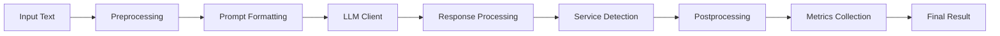

# PAMOLA.CORE LLM Package Documentation

**Package:** `pamola_core.utils.nlp.llm`  
**Version:** 2.0.0  
**Status:** Stable  
**Last Updated:** January 2025

## Package Overview

The PAMOLA.CORE LLM package provides a comprehensive, production-ready framework for integrating Large Language Models into privacy-preserving data processing pipelines. Designed specifically for text anonymization and privacy-enhancing transformations, this package offers a complete solution from client connectivity to response processing.

### Key Capabilities

1. **Multi-Provider Support**: Unified interface for LM Studio, OpenAI, Anthropic, and custom LLM providers
2. **Complete Processing Pipeline**: Preprocessing → LLM Processing → Postprocessing with quality control
3. **Privacy-Focused**: Built-in templates and patterns for anonymization tasks
4. **Performance Optimized**: Caching, batching, and resource management
5. **Production Ready**: Comprehensive metrics, error handling, and monitoring

### Architecture Overview

```
pamola_core.utils.nlp.llm/
├── __init__.py           # Package initialization and exports
├── client.py             # LLM client connectivity layer
├── config.py             # Configuration management and model presets
├── config_helpers.py     # Configuration utilities (if present)
├── data_contracts.py     # Type-safe data structures for pipeline
├── enums.py              # Centralized enumerations
├── metrics.py            # Performance and quality metrics
├── postprocessing.py     # Response validation and transformation
├── preprocessing.py      # Text preparation and normalization
├── processing.py         # Main processing orchestration
├── prompt.py             # Prompt template management
└── service_detector.py   # Service response filtering
```

### Processing Flow



## Module Summary

### 1. Client Module (`client.py`)

**Purpose**: Provides unified interface for connecting to various LLM providers.

**Key Classes**:
- `BaseLLMClient`: Abstract base class for all LLM clients
- `LMStudioClient`: WebSocket-based client for LM Studio
- `LLMGenerationParams`: Generation parameters
- `LLMResponse`: Structured response container

**Main Functions**:
```python
create_llm_client(provider: str, **kwargs) -> BaseLLMClient
```

### 2. Configuration Module (`config.py`)

**Purpose**: Manages LLM configurations, model presets, and provider-specific parameters.

**Key Classes**:
- `LLMConfig`: Connection and API configuration
- `ProcessingConfig`: Text processing settings
- `GenerationConfig`: Generation parameters
- `CacheConfig`: Caching configuration
- `MonitoringConfig`: Debug and monitoring settings

**Model Aliases**:
- `QUALITY`: High-quality output model
- `BALANCED`: Balance of speed and quality
- `FAST`: Fast processing model
- `ULTRA_FAST`: Minimal latency model

**Main Functions**:
```python
resolve_model_name(model_input: str) -> str
validate_model_name(model_name: str, available_models: Optional[List[str]] = None) -> Tuple[bool, str, ValidationResult]
check_model_availability(model_name: str, lm_studio_url: str = "http://localhost:1234/v1") -> bool
create_default_config(provider: Union[str, Provider] = Provider.LMSTUDIO, model_name: str = "QUALITY") -> Dict[str, Any]
```

### 3. Data Contracts Module (`data_contracts.py`)

**Purpose**: Defines type-safe data structures for pipeline communication.

**Key Classes**:
- `PreprocessResult`: Preprocessing stage output
- `PostprocessResult`: Postprocessing stage output
- `ProcessingPipelineResult`: Complete pipeline result
- `BatchProcessingStats`: Batch processing statistics

**Helper Functions**:
```python
create_failed_preprocess_result(text: str, canonical_text: str = "", error_message: str = "Processing failed", original_length: int = 0, processing_duration: float = 0.0) -> PreprocessResult
create_service_response_result(original_response: str, service_category: str, processing_duration: float = 0.0) -> PostprocessResult
create_successful_preprocess_result(original_text: str, processed_text: str, canonical_text: str = "", estimated_tokens: int = 0, was_truncated: bool = False, truncated_tokens: int = 0, processing_duration: float = 0.0) -> PreprocessResult
validate_processing_result(result: ProcessingPipelineResult) -> List[str]
```

### 4. Enumerations Module (`enums.py`)

**Purpose**: Central source of truth for all enumeration types.

**Key Enums**:
- `ResponseType`: VALID, SERVICE, ERROR, EMPTY, INVALID
- `ProcessingStage`: PREPROCESSING, LLM_PROCESSING, POSTPROCESSING, COMPLETE
- `Provider`: LMSTUDIO, OPENAI, ANTHROPIC, HUGGINGFACE, CUSTOM
- `CacheType`: MEMORY, FILE, REDIS, NONE
- `TokenEstimationMethod`: SIMPLE, TIKTOKEN, CUSTOM
- `TruncationStrategy`: END, MIDDLE, SMART
- `ServiceCategory`: REQUEST_FOR_INPUT, ACKNOWLEDGMENT, ERROR_RESPONSE, etc.

### 5. Metrics Module (`metrics.py`)

**Purpose**: Comprehensive metrics collection and analysis for LLM operations.

**Key Classes**:
- `ProcessingResult`: Single operation metrics
- `BatchResult`: Batch operation metrics
- `LatencyMetrics`: Latency statistics
- `ThroughputMetrics`: Throughput measurements
- `TokenMetrics`: Token usage tracking
- `CacheMetrics`: Cache performance
- `MetricsCollector`: Time-series metric collection
- `MetricsAggregator`: Multi-source aggregation

**Main Functions**:
```python
calculate_percentiles(values: List[float], percentiles: List[int] = [50, 75, 90, 95, 99]) -> Dict[int, float]
format_latency_ms(seconds: float) -> str
create_metrics_summary(metrics: AggregatedMetrics) -> str
```

### 6. Preprocessing Module (`preprocessing.py`)

**Purpose**: Prepares text for LLM processing with validation, normalization, and token management.

**Key Classes**:
- `TextNormalizer`: Text cleaning and normalization
- `TokenEstimator`: Token count estimation
- `TextTruncator`: Intelligent text truncation
- `MarkerManager`: Processing marker handling
- `TextPreprocessor`: Main preprocessing orchestrator

**Main Functions**:
```python
preprocess_text(text: str, max_tokens: int = 1000, truncation_strategy: str = "smart", processing_marker: str = "~") -> PreprocessResult
normalize_text(text: Any) -> str
estimate_tokens(text: str, method: str = "simple") -> int
truncate_text(text: str, max_tokens: int, strategy: str = "smart") -> Tuple[str, bool, int]
canonicalize_text(text: str, processing_marker: str = "~") -> str
```

### 7. Prompt Module (`prompt.py`)

**Purpose**: Template-based prompt management with multi-language support.

**Key Classes**:
- `PromptTemplate`: Template container with metadata
- `PromptConfig`: Formatting configuration
- `PromptLibrary`: Template library management
- `PromptFormatter`: Formatting and optimization
- `PromptChainBuilder`: Chain-of-thought builder

**Built-in Templates**:
- `anonymize_experience_ru`: Russian anonymization
- `anonymize_experience_en`: English anonymization
- `extract_skills`: Skill extraction
- `chat_anonymize`: Chat-based anonymization
- `few_shot_anonymize`: Few-shot examples

**Main Functions**:
```python
create_prompt_formatter(config: Optional[PromptConfig] = None) -> PromptFormatter
load_prompt_library(template_file: Optional[Path] = None) -> PromptLibrary
```

### 8. Service Detector Module (`service_detector.py`)

**Purpose**: Detects and filters service/meta responses from LLMs.

**Key Classes**:
- `ServiceResponseDetector`: Main detector class
- `PatternConfig`: Detection configuration
- `DetectionResult`: Detection output with metadata

**Main Functions**:
```python
create_default_detector() -> ServiceResponseDetector
create_strict_detector() -> ServiceResponseDetector
create_lenient_detector() -> ServiceResponseDetector
quick_service_check(text: str) -> bool
```

### 9. Processing Module (`processing.py`)

**Note**: Main orchestration module (implementation details not provided in source documents).

### 10. Postprocessing Module (`postprocessing.py`)

**Status**: Under development for anonymization quality assurance.

**Planned Features**:
- Entity consistency verification
- Anonymization completeness checking
- Referential integrity maintenance
- Privacy level compliance validation
- Reversibility mapping generation

## Quick Start Guide

### Basic Usage

```python
from pamola_core.utils.nlp.llm import (
    create_llm_client,
    TextPreprocessor,
    load_prompt_library,
    ServiceResponseDetector,
    MetricsCollector
)

# 1. Initialize components
client = create_llm_client('lmstudio', model_name='QUALITY')
preprocessor = TextPreprocessor()
library = load_prompt_library()
detector = ServiceResponseDetector()
collector = MetricsCollector()

# 2. Process text
text = "John Smith works at Google in Mountain View"

# Preprocess
preprocess_result = preprocessor.preprocess(text)

# Format prompt
template = library.get("anonymize_experience_en")
prompt = template.format(text=preprocess_result.text)

# Generate response
client.connect()
response = client.generate(prompt)

# Check for service response
is_service, confidence, category = detector.detect_with_confidence(response.text)

if not is_service:
    # Process valid response
    result = ProcessingResult(
        text=response.text,
        success=True,
        processing_time=response.response_time
    )
    collector.add_result(result)

client.disconnect()

# Get metrics
metrics = collector.get_current_metrics()
print(f"Average latency: {metrics.latency.mean * 1000:.1f}ms")
```

### Configuration Example

```python
from pamola_core.utils.nlp.llm.config import (
    LLMConfig,
    ProcessingConfig,
    GenerationConfig,
    create_default_config
)

# Create complete configuration
config = create_default_config(
    provider='lmstudio',
    model_name='FAST'  # Resolves to actual model
)

# Or build custom configuration
llm_config = LLMConfig(
    provider='lmstudio',
    model_name='QUALITY',
    timeout=60,
    max_retries=3
)

processing_config = ProcessingConfig(
    batch_size=10,
    max_input_tokens=1000,
    truncation_strategy='smart'
)

generation_config = GenerationConfig(
    temperature=0.3,
    max_tokens=512,
    stop_sequences=["</text>", "\n\n"]
)
```

## Best Practices

1. **Always preprocess text** before sending to LLM
2. **Use appropriate model aliases** for your use case
3. **Check for service responses** to maintain data quality
4. **Monitor metrics** for performance optimization
5. **Use built-in templates** for consistency
6. **Handle errors gracefully** with retry logic
7. **Configure based on model capabilities** and limits
8. **Batch process** when possible for efficiency

## Package Dependencies

- **Standard Library**: logging, os, time, abc, dataclasses, enum, typing, pathlib
- **Internal**: Imports from pamola_core.utils.nlp.base for error handling
- **Optional**: lmstudio (for LM Studio provider), requests (for availability checking)

## Summary

The PAMOLA.CORE LLM package provides a complete, production-ready solution for integrating Large Language Models into privacy-preserving data processing pipelines. With its modular architecture, comprehensive configuration system, and focus on anonymization tasks, it offers both flexibility and ease of use for developers working on privacy-enhancing applications.