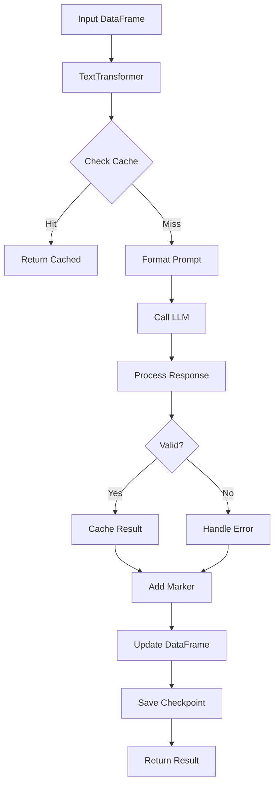

# PAMOLA.CORE Text Transformer Module Documentation

## Overview

The Text Transformer module (`pamola_core/utils/nlp/text_transformer.py`) is the primary interface for using Large Language Models (LLMs) to process and anonymize long text fields within the PAMOLA.CORE framework. It provides a high-level, production-ready API that orchestrates LLM operations, batch processing, caching, and progress tracking while maintaining data privacy and processing efficiency.

## Key Features

### 1. **High-Level LLM Interface**
- Unified interface for multiple LLM providers (LMStudio, OpenAI, etc.)
- Automatic connection management and retry logic
- Model-specific parameter optimization
- Provider-agnostic text processing

### 2. **Intelligent Caching System**
- Multiple cache backends (memory, disk, Redis)
- Text canonicalization for consistent cache keys
- TTL-based cache expiration
- Cache hit rate optimization

### 3. **Batch Processing**
- Configurable batch sizes for optimal throughput
- Memory-efficient processing of large datasets
- Automatic memory cleanup and garbage collection
- Progress tracking with ETA estimation

### 4. **Robust Error Handling**
- Automatic retry with exponential backoff
- Connection failure recovery
- Invalid response detection
- Comprehensive error logging

### 5. **Processing State Management**
- Checkpoint support for long-running operations
- Skip already-processed records
- Stop flag support for graceful interruption
- Processing markers to track completion

### 6. **Comprehensive Metrics**
- Token usage tracking (input/output)
- Processing time statistics
- Cache hit rates
- Error rates and types
- Model performance metrics

## Architecture

### Component Integration

```
┌─────────────────────────────────────────────────────────────┐
│                    TextTransformer                          │
├─────────────────────────────────────────────────────────────┤
│ Core Components:                                            │
│ - LLM Client Management (create_llm_client)                 │
│ - Cache Management (TextCache, RedisCache, etc.)           │
│ - Batch Processing (BatchProcessor)                         │
│ - Progress Tracking (track_operation_safely)                │
│ - Metrics Collection (MetricsCollector)                    │
├─────────────────────────────────────────────────────────────┤
│ Processing Utilities:                                       │
│ - Text Normalization (TextNormalizer)                      │
│ - Token Estimation (TokenEstimator)                        │
│ - Text Truncation (TextTruncator)                          │
│ - Response Processing (ResponseProcessor)                   │
│ - Marker Management (MarkerManager)                         │
│ - Prompt Formatting (PromptFormatter)                       │
└─────────────────────────────────────────────────────────────┘
```

### Data Flow



## Installation & Dependencies

### Required Dependencies

```python
# Core PAMOLA dependencies
from pamola_core.utils.nlp.cache import get_cache, CacheBase
from pamola_core.utils.nlp.llm.client import create_llm_client, BaseLLMClient
from pamola_core.utils.nlp.llm.config import LLMConfig, ProcessingConfig, GenerationConfig
from pamola_core.utils.nlp.llm.metrics import MetricsCollector
from pamola_core.utils.nlp.llm.processing import TextNormalizer, TokenEstimator
from pamola_core.utils.nlp.llm.prompt import PromptTemplate, PromptLibrary
from pamola_core.utils.progress import track_operation_safely

# External dependencies
import pandas as pd
import json
import logging
```

## Core Classes

### TextTransformer

The main class for LLM-based text transformation.

#### Constructor

```python
def __init__(
    self,
    llm_config: Union[Dict[str, Any], LLMConfig],
    processing_config: Union[Dict[str, Any], ProcessingConfig],
    generation_config: Union[Dict[str, Any], GenerationConfig],
    prompt_template: Union[str, Dict[str, Any], PromptTemplate],
    task_dir: Union[str, Path],
    cache_config: Optional[Union[Dict[str, Any], CacheConfig]] = None,
    monitoring_config: Optional[Union[Dict[str, Any], MonitoringConfig]] = None
)
```

#### Parameters

| Parameter | Type | Description |
|-----------|------|-------------|
| `llm_config` | LLMConfig or dict | LLM connection settings (provider, model, API key) |
| `processing_config` | ProcessingConfig or dict | Processing behavior (batch size, markers, retries) |
| `generation_config` | GenerationConfig or dict | Text generation parameters (temperature, max_tokens) |
| `prompt_template` | str, dict, or PromptTemplate | Prompt template or template name from library |
| `task_dir` | str or Path | Directory for task artifacts and checkpoints |
| `cache_config` | CacheConfig or dict | Cache configuration (optional) |
| `monitoring_config` | MonitoringConfig or dict | Monitoring settings (optional) |

## Usage Examples

### Basic Usage

```python
from pamola_core.utils.nlp.text_transformer import TextTransformer
import pandas as pd

# Create sample data
df = pd.DataFrame({
    'id': [1, 2, 3],
    'experience': [
        'Worked at Google as a Senior Engineer for 5 years',
        'MBA from Harvard, previously CEO at TechCorp',
        'Developed iOS apps at Apple, met Tim Cook'
    ]
})

# Initialize transformer
transformer = TextTransformer(
    llm_config={
        'provider': 'lmstudio',
        'model_name': 'gemma-2-2b-it',
        'api_url': 'ws://localhost:8080'
    },
    processing_config={
        'batch_size': 10,
        'use_processing_marker': True,
        'max_input_tokens': 1000
    },
    generation_config={
        'temperature': 0.3,
        'max_tokens': 500,
        'top_p': 0.9
    },
    prompt_template='anonymize_experience_ru',  # Built-in template
    task_dir='./output/anonymization_task'
)

# Process DataFrame
result_df = transformer.process_dataframe(
    df,
    source_column='experience',
    target_column='experience_anonymized',
    error_column='error_msg'
)

# Check results
print(result_df[['experience', 'experience_anonymized']])
```

### Advanced Configuration

```python
# Custom prompt template
custom_prompt = {
    'name': 'custom_anonymizer',
    'template': """Перефразируйте следующий текст, удалив все персональные данные:

Текст: {text}

Анонимизированный текст:""",
    'variables': ['text'],
    'description': 'Custom anonymization prompt'
}

# Advanced configuration
transformer = TextTransformer(
    llm_config={
        'provider': 'lmstudio',
        'model_name': 'mistral-7b-instruct',
        'api_url': 'ws://localhost:8080',
        'timeout': 60,
        'max_retries': 3,
        'retry_delay': 2
    },
    processing_config={
        'batch_size': 5,
        'use_processing_marker': True,
        'processing_marker': '✓',
        'skip_processed': True,
        'max_input_tokens': 2000,
        'truncation_strategy': 'end',
        'memory_cleanup_interval': 100
    },
    generation_config={
        'temperature': 0.2,
        'max_tokens': 1000,
        'top_p': 0.95,
        'top_k': 50,
        'repeat_penalty': 1.1,
        'stop_sequences': ['\n\n', 'Текст:']
    },
    prompt_template=custom_prompt,
    task_dir='./output/custom_task',
    cache_config={
        'enabled': True,
        'cache_type': 'text',  # Optimized for text
        'ttl': 3600  # 1 hour
    },
    monitoring_config={
        'collect_metrics': True,
        'profile_memory': True,
        'debug_mode': False
    }
)
```

### Processing with Checkpoints

```python
# Process large dataset with checkpoint support
result_df = transformer.process_dataframe(
    df,
    source_column='biography',
    target_column='biography_anon',
    error_column='processing_error',
    start_id=1000,        # Start from ID 1000
    end_id=5000,          # Process up to ID 5000
    id_column='user_id',  # Use user_id for filtering
    skip_processed=True,  # Skip already processed
    max_records=1000,     # Limit to 1000 records
    progress_callback=lambda current, total: print(f"Progress: {current}/{total}")
)

# Checkpoints are automatically saved and can resume if interrupted
```

### Batch Processing Large Files

```python
# Process large CSV in chunks
chunk_size = 10000
processed_chunks = []

for chunk in pd.read_csv('large_dataset.csv', chunksize=chunk_size):
    # Process each chunk
    processed_chunk = transformer.process_dataframe(
        chunk,
        source_column='text_field',
        target_column='text_anonymized'
    )
    
    # Save processed chunk
    processed_chunks.append(processed_chunk)
    
    # Optionally save intermediate results
    processed_chunk.to_csv(
        f'output/chunk_{len(processed_chunks)}.csv',
        index=False
    )

# Combine all chunks
final_df = pd.concat(processed_chunks, ignore_index=True)
```

### Using Different Cache Backends

```python
# Memory cache (fastest, limited by RAM)
cache_config = {
    'enabled': True,
    'cache_type': 'memory',
    'ttl': 1800
}

# Disk cache (persistent, slower)
cache_config = {
    'enabled': True,
    'cache_type': 'disk',
    'ttl': 86400  # 24 hours
}

# Redis cache (distributed, scalable)
cache_config = {
    'enabled': True,
    'cache_type': 'redis',
    'ttl': 3600,
    'redis_url': 'redis://localhost:6379/0'
}
```

### Metrics and Monitoring

```python
# Process data
result_df = transformer.process_dataframe(df, 'text', 'text_anon')

# Get metrics
metrics = transformer.get_metrics()
print(f"Total processed: {metrics['performance']['total_processed']}")
print(f"Cache hit rate: {metrics['cache']['hit_rate']:.1%}")
print(f"Average tokens/sec: {metrics['performance']['avg_tokens_per_second']:.1f}")

# Print human-readable summary
transformer.print_metrics_summary()

# Export metrics to file
transformer.export_metrics('./output/processing_metrics.json')

# Example metrics output:
# {
#     "performance": {
#         "total_processed": 1000,
#         "successful": 995,
#         "failed": 5,
#         "avg_processing_time": 0.45,
#         "total_tokens_input": 125000,
#         "total_tokens_output": 110000
#     },
#     "cache": {
#         "hits": 450,
#         "misses": 550,
#         "hit_rate": 0.45
#     },
#     "errors": {
#         "connection_errors": 2,
#         "invalid_responses": 3
#     }
# }
```

## Configuration Options

### LLM Configuration

```python
llm_config = {
    'provider': 'lmstudio',           # Provider: 'lmstudio', 'openai', etc.
    'model_name': 'gemma-2-2b-it',   # Model identifier
    'api_url': 'ws://localhost:8080', # API endpoint
    'api_key': None,                  # API key if required
    'timeout': 30,                    # Request timeout in seconds
    'max_retries': 3,                 # Maximum retry attempts
    'retry_delay': 1,                 # Delay between retries
    'ttl': 300                        # Connection TTL
}
```

### Processing Configuration

```python
processing_config = {
    'batch_size': 10,                 # Records per batch
    'use_processing_marker': True,    # Add markers to processed text
    'processing_marker': '✓',         # Marker character
    'skip_processed': True,           # Skip marked records
    'max_input_tokens': 1000,         # Maximum input tokens
    'truncation_strategy': 'end',     # 'start', 'end', or 'middle'
    'memory_cleanup_interval': 100,   # GC interval
    'max_records': None,              # Maximum records to process
    'token_estimation_method': 'tiktoken'  # Token counting method
}
```

### Generation Configuration

```python
generation_config = {
    'temperature': 0.3,               # Randomness (0.0-1.0)
    'max_tokens': 500,                # Maximum output tokens
    'top_p': 0.9,                     # Nucleus sampling
    'top_k': 50,                      # Top-k sampling
    'repeat_penalty': 1.1,            # Repetition penalty
    'stop_sequences': [],             # Stop generation sequences
    'stream': False                   # Streaming mode
}
```

## Best Practices

### 1. **Optimize Batch Size**
```python
# Start with smaller batches and increase based on performance
# Monitor memory usage and adjust accordingly
processing_config = {
    'batch_size': 5,  # Start small
    'memory_cleanup_interval': 50  # Frequent cleanup
}
```

### 2. **Use Appropriate Cache**
```python
# For production with multiple workers
cache_config = {
    'enabled': True,
    'cache_type': 'redis',  # Distributed cache
    'ttl': 3600
}

# For single-instance processing
cache_config = {
    'enabled': True,
    'cache_type': 'text',  # Memory cache optimized for text
    'ttl': 1800
}
```

### 3. **Handle Errors Gracefully**
```python
# Always include error column
result_df = transformer.process_dataframe(
    df,
    source_column='text',
    target_column='text_processed',
    error_column='error'  # Capture errors
)

# Check for errors
errors = result_df[result_df['error'].notna()]
if not errors.empty:
    print(f"Errors found: {len(errors)}")
    print(errors[['id', 'error']].head())
```

### 4. **Monitor Resource Usage**
```python
# Enable monitoring for production
monitoring_config = {
    'collect_metrics': True,
    'profile_memory': True,
    'debug_mode': False,
    'debug_log_file': './debug.log'
}

# Periodically check metrics
metrics = transformer.get_metrics()
if metrics['performance']['avg_processing_time'] > 1.0:
    logger.warning("Processing is slow, consider optimization")
```

### 5. **Use Checkpoints for Large Datasets**
```python
# Process in manageable chunks with checkpoints
for start in range(0, total_records, 10000):
    transformer.process_dataframe(
        df,
        source_column='text',
        target_column='text_anon',
        start_id=start,
        end_id=start + 10000,
        id_column='id'
    )
    # Checkpoints are automatically saved
```

## Troubleshooting

### Common Issues

1. **Connection Errors**
```python
# Check LLM server is running
# Verify API URL and credentials
# Increase timeout for slow models
llm_config = {
    'timeout': 60,  # Increase timeout
    'max_retries': 5  # More retries
}
```

2. **Memory Issues**
```python
# Reduce batch size
processing_config = {'batch_size': 1}

# Enable aggressive memory cleanup
processing_config = {'memory_cleanup_interval': 10}

# Process in smaller chunks
max_records = 100  # Process fewer records at once
```

3. **Cache Collisions**
```python
# Text canonicalization prevents this
# Ensure using 'text' cache type for text data
cache_config = {'cache_type': 'text'}
```

4. **Slow Processing**
```python
# Check cache hit rate
metrics = transformer.get_metrics()
print(f"Cache hit rate: {metrics['cache']['hit_rate']}")

# Optimize prompt length
processing_config = {'max_input_tokens': 500}

# Use faster model
llm_config = {'model_name': 'gemma-2-2b-it'}  # Smaller, faster
```

### Debug Mode

```python
# Enable debug logging
monitoring_config = {
    'debug_mode': True,
    'debug_log_file': './llm_debug.log'
}

# Check debug log for:
# - Raw LLM requests/responses
# - Token counts
# - Processing times
# - Cache operations
```

## Performance Optimization

### 1. **Token Optimization**
```python
# Limit input tokens
processing_config = {
    'max_input_tokens': 500,
    'truncation_strategy': 'end'  # Keep beginning
}

# Optimize prompt
prompt_template = {
    'template': 'Кратко анонимизируйте: {text}'  # Shorter prompt
}
```

### 2. **Parallel Processing**
```python
# Split DataFrame for parallel processing
from concurrent.futures import ThreadPoolExecutor

def process_partition(partition):
    transformer = TextTransformer(...)
    return transformer.process_dataframe(partition, ...)

# Process partitions in parallel
with ThreadPoolExecutor(max_workers=4) as executor:
    partitions = np.array_split(df, 4)
    results = list(executor.map(process_partition, partitions))

final_df = pd.concat(results)
```

### 3. **Cache Warming**
```python
# Pre-process common patterns
common_texts = df['text'].value_counts().head(100).index

for text in common_texts:
    transformer._process_single_text(text)
    
# Now process full dataset with warmed cache
```

## Summary

The Text Transformer module provides a robust, production-ready solution for using LLMs to process and anonymize text data at scale. Its intelligent caching, batch processing, and comprehensive error handling make it suitable for processing large datasets while maintaining data quality and privacy.

Key takeaways:
- Use appropriate batch sizes based on your hardware
- Enable caching for better performance
- Monitor metrics to identify bottlenecks
- Use checkpoints for long-running operations
- Choose the right model for your speed/quality tradeoff

For additional support, refer to the PAMOLA.CORE documentation or the module's inline documentation.