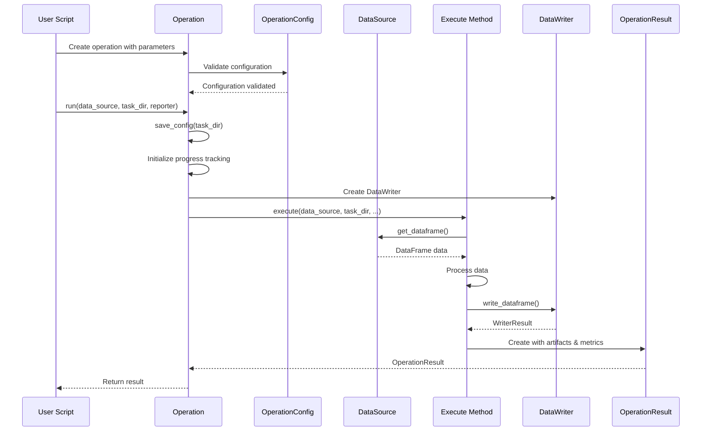

# PAMOLA.CORE Operations Framework - Comprehensive Documentation

## Executive Summary

The PAMOLA.CORE Operations Framework provides a unified, standardized architecture for implementing privacy-enhancing data operations within the PAMOLA (Privacy And Management Of Large Anonymization) system. This framework ensures consistency, reusability, and maintainability across all data anonymization and privacy operations while providing robust support for large-scale data processing, encryption, caching, and comprehensive error handling.

## Framework Overview

### Core Design Principles

1. **Modularity**: Each operation is an independent, self-contained component with a well-defined interface
2. **Standardization**: All operations follow a consistent execution pattern and return standardized results
3. **Extensibility**: New operation types can be easily added through inheritance from base classes
4. **Traceability**: Built-in support for logging, metrics collection, and artifact management
5. **Performance**: Integrated support for caching, vectorization, chunking, and memory optimization
6. **Security**: Native encryption support for sensitive data throughout the processing pipeline
7. **Testability**: Comprehensive testing utilities for unit and integration testing

### Package Structure

```
pamola_core/utils/ops/
├── __init__.py                  # Package initialization, base OpsError class
├── op_base.py                   # Base operation classes and execution lifecycle
├── op_config.py                 # Configuration validation and management
├── op_cache.py                  # Result caching system with async support
├── op_data_source.py            # Unified data source abstraction
├── op_data_source_helpers.py    # Helper functions for data sources
├── op_data_reader.py            # Multi-format data reading capabilities
├── op_data_writer.py            # Standardized output writing
├── op_data_processing.py        # Common data processing utilities
├── op_field_utils.py            # Field manipulation and naming utilities
├── op_registry.py               # Operation discovery and registration
├── op_result.py                 # Operation result and artifact management
├── op_test_helpers.py           # Testing utilities and mocks
└── templates/                   # Templates for new operations
    ├── operation_skeleton.py    # Base template for new operations
    └── config_example.json      # Example configuration schema
```

## Architecture and Data Flow

### System Architecture

```
┌─────────────────────────────────────────────────────────────────┐
│                      User Applications/Scripts                  │
└─────────────────────────────────┬──────────────────────────────┘
                                  │
┌─────────────────────────────────┼───────────────────────────────┐
│                    PAMOLA.CORE Operations Framework             │
│                                                                 │
│  ┌──────────────────────────────────────────────────────────┐   │
│  │                    Operation Lifecycle                   │   │
│  │  ┌──────────┐  ┌──────────┐  ┌──────────┐  ┌─────────┐   │   │
│  │  │Initialize│→ │Configure │→ │ Execute  │→ │ Result  │   │   │
│  │  └──────────┘  └──────────┘  └──────────┘  └─────────┘   │   │
│  └──────────────────────────────────────────────────────────┘   │
│                                                                 │
│  ┌──────────────────────────────────────────────────────────┐   │
│  │                    Core Components                       │   │
│  │  ┌─────────────┐  ┌────────────┐  ┌────────────────────┐ │   │
│  │  │BaseOperation│  │DataSource  │  │OperationRegistry   │ │   │
│  │  └─────────────┘  └────────────┘  └────────────────────┘ │   │
│  │  ┌────────────┐  ┌────────────┐  ┌─────────────────────┐ │   │
│  │  │DataWriter  │  │DataReader  │  │OperationResult      │ │   │
│  │  └────────────┘  └────────────┘  └─────────────────────┘ │   │
│  └──────────────────────────────────────────────────────────┘   │
│                                                                 │
│  ┌──────────────────────────────────────────────────────────┐   │
│  │                    Support Utilities                     │   │
│  │  ┌────────────┐  ┌────────────┐  ┌────────────────────┐  │   │
│  │  │Field Utils │  │Data Proc   │  │Cache System        │  │   │
│  │  └────────────┘  └────────────┘  └────────────────────┘  │   │
│  │  ┌────────────┐  ┌────────────┐  ┌────────────────────┐  │   │
│  │  │Config Mgmt │  │Test Helpers│  │Progress Tracking   │  │   │
│  │  └────────────┘  └────────────┘  └────────────────────┘  │   │
│  └──────────────────────────────────────────────────────────┘   │
└─────────────────────────────────────────────────────────────────┘
```

### Operation Execution Flow



## Core Component Reference

### 1. Base Operations (`op_base.py`)

The foundation of the framework, providing abstract base classes for all operations.

#### BaseOperation Class

**Purpose**: Abstract base class providing lifecycle management, configuration serialization, and error handling.

**Key Methods**:
- `__init__(name, description, scope, config, use_encryption, encryption_key, use_vectorization)`
- `save_config(task_dir)` - Serialize configuration atomically
- `execute(data_source, task_dir, reporter, progress_tracker, **kwargs)` - Abstract method for operation logic
- `run(data_source, task_dir, reporter, track_progress, parallel_processes, **kwargs)` - Lifecycle management wrapper

**Specialized Classes**:
- `FieldOperation`: For operations on specific fields/columns
- `DataFrameOperation`: For operations on entire datasets

### 2. Data Source (`op_data_source.py`)

**Purpose**: Unified interface for data access regardless of source (memory, file, database).

**Key Features**:
- Format-agnostic data loading
- Schema validation and enforcement
- Memory optimization through chunking
- Multi-file dataset support
- Transparent encryption handling

**Key Methods**:
- `get_dataframe(name, load_if_path, columns, nrows, ...)` - Get DataFrame with optional loading
- `get_dataframe_chunks(name, chunk_size, ...)` - Memory-efficient chunk processing
- `validate_schema(name, expected_schema)` - Schema validation
- `optimize_memory(threshold_percent)` - Automatic memory management

### 3. Data Writer (`op_data_writer.py`)

**Purpose**: Standardized output writing with consistent directory structure.

**Key Features**:
- Multiple format support (CSV, Parquet, JSON, visualizations)
- Automatic directory structure management
- Encryption integration
- Progress tracking
- Timestamping support

**Key Methods**:
- `write_dataframe(df, name, format, subdir, timestamp_in_name, encryption_key)`
- `write_json(data, name, subdir, ...)`
- `write_visualization(figure, name, format, ...)`
- `write_metrics(metrics, name, ...)`

### 4. Operation Result (`op_result.py`)

**Purpose**: Standardized result structure for all operations.

**Key Components**:
- `OperationStatus`: Enumeration (SUCCESS, WARNING, ERROR, SKIPPED, PARTIAL_SUCCESS, PENDING)
- `OperationArtifact`: File metadata and validation
- `ArtifactGroup`: Logical grouping of related artifacts

**Key Methods**:
- `add_artifact(artifact_type, path, description, category, tags, group)`
- `register_artifact_via_writer(writer, obj, subdir, name, ...)`
- `add_metric(name, value)` / `add_nested_metric(category, name, value)`
- `validate_artifacts()` - Comprehensive artifact validation

### 5. Field Utilities (`op_field_utils.py`)

**Purpose**: Standardized field manipulation and naming conventions.

**Key Functions**:
- `generate_output_field_name(field_name, mode, output_field_name, operation_suffix)`
- `generate_ka_field_name(quasi_identifiers, prefix, max_length)`
- `infer_field_type(series, check_patterns, sample_size)`
- `apply_condition_operator(series, condition_values, operator)`
- `create_composite_key(df, fields, separator, null_handling, hash_key)`

### 6. Data Processing Utilities (`op_data_processing.py`)

**Purpose**: Common data processing operations for memory efficiency.

**Key Functions**:
- `optimize_dataframe_dtypes(df, categorical_threshold, downcast_integers, downcast_floats)`
- `get_dataframe_chunks(df, chunk_size)`
- `process_null_values(series, strategy, fill_value)`
- `safe_convert_to_numeric(series, errors)`
- `get_memory_usage(df)`

### 7. Operation Registry (`op_registry.py`)

**Purpose**: Dynamic operation discovery and registration.

**Key Functions**:
- `register_operation(operation_class, override, dependencies, version)`
- `get_operation_class(operation_name)`
- `list_operations(category)`
- `create_operation_instance(operation_name, **kwargs)`
- `discover_operations(package_name)`

### 8. Cache System (`op_cache.py`)

**Purpose**: Performance optimization through result caching.

**Key Features**:
- Async support for non-blocking operations
- Configurable cache size and expiration
- Deterministic cache key generation

**Key Methods**:
- `get_cache(cache_key, operation_type)` / `async_get_cache(...)`
- `save_cache(data, cache_key, operation_type, metadata)` / `async_save_cache(...)`
- `generate_cache_key(operation_name, parameters, data_hash)`

## Implementation Guidelines

### Creating a Custom Operation

```python
from pamola_core.utils.ops.op_base import DataFrameOperation
from pamola_core.utils.ops.op_result import OperationResult, OperationStatus
from pamola_core.utils.ops.op_config import OperationConfig
from pamola_core.utils.ops.op_data_writer import DataWriter

class MyAnonymizationOperation(DataFrameOperation):
    """Custom anonymization operation."""
    
    def __init__(self, name="MyAnonymization", method="generalization", **kwargs):
        # Define configuration schema
        config_schema = {
            "type": "object",
            "properties": {
                "method": {"type": "string", "enum": ["generalization", "suppression"]},
                "level": {"type": "integer", "minimum": 1, "maximum": 5}
            },
            "required": ["method"]
        }
        
        # Create configuration
        config = OperationConfig(method=method, **kwargs)
        config.schema = config_schema
        
        # Initialize base class
        super().__init__(
            name=name,
            description="Anonymize data using specified method",
            config=config
        )
        
    def execute(self, data_source, task_dir, reporter, progress_tracker=None, **kwargs):
        # Initialize writer
        writer = DataWriter(task_dir, self.logger, progress_tracker)
        
        # Get data
        df, error = data_source.get_dataframe("main")
        if df is None:
            return OperationResult(
                status=OperationStatus.ERROR,
                error_message=f"Failed to load data: {error.get('message')}"
            )
        
        # Process data
        anonymized_df = self._anonymize_data(df, self.config.get("method"))
        
        # Save results
        result = OperationResult(status=OperationStatus.SUCCESS)
        
        # Write output using register_artifact_via_writer
        output_artifact = result.register_artifact_via_writer(
            writer=writer,
            obj=anonymized_df,
            subdir="output",
            name="anonymized_data",
            description="Anonymized dataset",
            tags=["anonymized", self.config.get("method")]
        )
        
        # Add metrics
        result.add_metric("records_processed", len(df))
        result.add_metric("method_used", self.config.get("method"))
        
        return result
```

### Best Practices

#### 1. Operation Design
- Inherit from appropriate base class (FieldOperation or DataFrameOperation)
- Override only the `execute()` method, never `run()`
- Use OperationConfig for all parameters
- Document all configuration parameters in docstrings

#### 2. Data Handling
- Always use DataSource for data access
- Support chunked processing for large datasets
- Validate data types and schemas early
- Preserve original data when possible

#### 3. Error Handling
- Return OperationResult with appropriate status
- Include detailed error messages
- Let base class handle exception logging
- Validate inputs before processing

#### 4. Performance
- Use caching for expensive operations
- Process large datasets in chunks
- Optimize DataFrame dtypes when possible
- Monitor and report memory usage

#### 5. Security
- Use encryption for sensitive outputs
- Never log sensitive data
- Follow secure coding practices
- Validate all external inputs

#### 6. Testing
- Use op_test_helpers for test setup
- Test both success and failure paths
- Verify artifact creation
- Mock external dependencies

## Integration Patterns

### Pipeline Integration

```python
# Create a processing pipeline
from pamola_core.utils.ops.op_registry import create_operation_instance
from pamola_core.utils.ops.op_data_source import DataSource

# Initialize data source
data_source = DataSource.from_file_path("input_data.csv", name="main")

# Create operations
profiling_op = create_operation_instance("DataProfilingOperation")
anonymization_op = create_operation_instance("MyAnonymizationOperation", method="generalization")
quality_op = create_operation_instance("DataQualityOperation")

# Run pipeline
results = []
for op in [profiling_op, anonymization_op, quality_op]:
    result = op.run(
        data_source=data_source,
        task_dir=f"/path/to/task_{op.name}",
        reporter=reporter
    )
    results.append(result)
    
    if result.status != OperationStatus.SUCCESS:
        logger.error(f"Operation {op.name} failed: {result.error_message}")
        break
```

### Caching Integration

```python
def execute(self, data_source, task_dir, reporter, **kwargs):
    # Generate cache key
    cache_key = operation_cache.generate_cache_key(
        operation_name=self.name,
        parameters=self.config.to_dict()
    )
    
    # Try cache first
    cached = operation_cache.get_cache(cache_key)
    if cached:
        return self._create_result_from_cache(cached)
    
    # Normal processing
    result = self._process_data(data_source, task_dir, reporter)
    
    # Cache result
    operation_cache.save_cache(
        data=result.to_reporter_details(),
        cache_key=cache_key
    )
    
    return result
```

## Performance Considerations

### Memory Management
- Use `optimize_dataframe_dtypes()` for large datasets
- Process data in chunks when dataset > 100MB
- Release unused DataFrames with `data_source.release_dataframe()`
- Monitor memory with `get_memory_usage()`

### Format Selection
- **CSV**: Interoperability, human-readable, small datasets
- **Parquet**: Large datasets, complex schemas, compression needed
- **JSON**: Configuration, metrics, metadata

### Parallelization
- Use Dask for datasets > 1GB
- Set appropriate chunk sizes (typically 10,000-100,000 rows)
- Consider `parallel_processes` parameter in `run()`

## Security Guidelines

### Encryption
- Always encrypt sensitive data outputs
- Use environment variables for encryption keys
- Never hardcode keys in source code
- Implement key rotation policies

### Data Protection
- Minimize data in memory
- Securely delete temporary files
- Validate all inputs
- Sanitize error messages

## Testing Framework

### Unit Testing

```python
from pamola_core.utils.ops.op_test_helpers import (
    MockDataSource,
    StubDataWriter,
    create_test_operation_env,
    assert_artifact_exists,
    assert_metrics_content
)

def test_operation():
    # Setup test environment
    tmp_path, reporter = create_test_operation_env(Path("/tmp"))
    
    # Create mock data
    df = pd.DataFrame({"id": [1, 2, 3], "value": [10, 20, 30]})
    data_source = MockDataSource.from_dataframe(df)
    
    # Run operation
    op = MyOperation()
    result = op.run(data_source, tmp_path, reporter)
    
    # Verify results
    assert result.status == OperationStatus.SUCCESS
    assert_artifact_exists(tmp_path, "output", "processed_*.csv")
    assert_metrics_content(tmp_path, {"records_processed": 3})
```

## Common Pitfalls and Solutions

### Pitfall 1: Memory Exhaustion
**Problem**: Loading entire large datasets into memory
**Solution**: Use chunked processing and Dask for large files

### Pitfall 2: Inconsistent Field Naming
**Problem**: Different operations use different naming conventions
**Solution**: Use `op_field_utils.generate_output_field_name()`

### Pitfall 3: Missing Error Handling
**Problem**: Operations crash on unexpected data
**Solution**: Validate inputs and return appropriate OperationStatus

### Pitfall 4: Poor Performance
**Problem**: Repeated expensive computations
**Solution**: Implement caching using `op_cache`

### Pitfall 5: Security Vulnerabilities
**Problem**: Sensitive data exposed in logs or unencrypted files
**Solution**: Use encryption and careful logging practices

## Version Compatibility

The framework follows semantic versioning:
- **Major**: Breaking changes to core interfaces
- **Minor**: New features, backward compatible
- **Patch**: Bug fixes, performance improvements

Current stable version: 2.0.0

## Summary

The PAMOLA.CORE Operations Framework provides a comprehensive, standardized foundation for building privacy-enhancing data operations. By following the patterns and practices outlined in this documentation, developers can create robust, efficient, and secure operations that integrate seamlessly into the PAMOLA ecosystem.

The framework's emphasis on standardization, performance, and security ensures that operations are not only functionally correct but also production-ready, with proper error handling, monitoring, and optimization capabilities built in from the start.