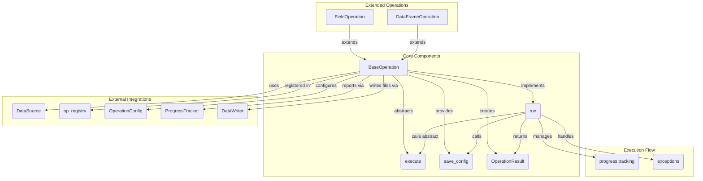
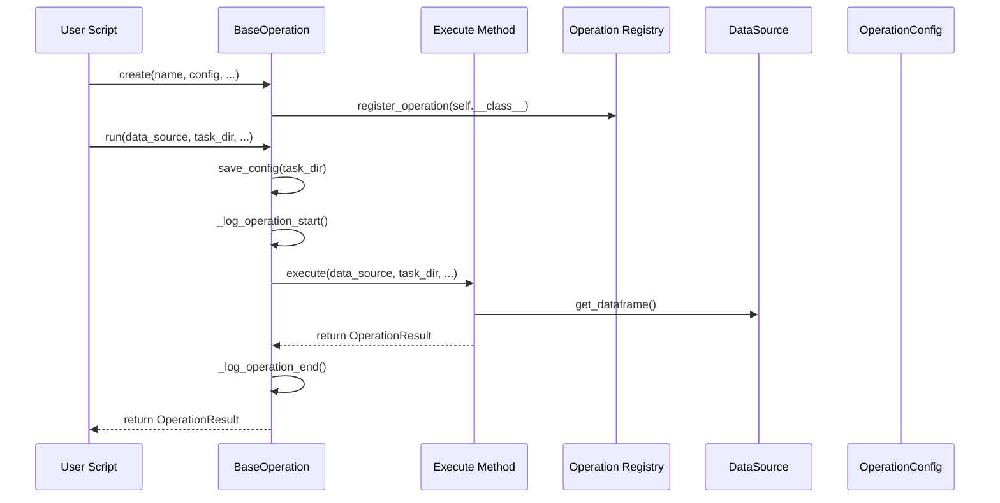

# PAMOLA.CORE Operation Base Classes

## Overview

This module provides the foundational architecture for operations in the PAMOLA (Privacy And Management Of Large Anonymization) Pamola Core framework. It defines the base classes, lifecycle management, configuration serialization, and progress tracking mechanisms that standardize how data privacy operations are implemented and executed.

The framework standardizes I/O operations through `pamola_core.utils.ops.op_data_writer.DataWriter`, ensuring consistent directory structure, file formats, encryption support, and timestamping across all operations.

## Architecture

The module consists of several key components that work together to provide a standardized operation framework:

```
BaseOperation
  ├── Configuration Management (save_config)
  ├── Execution Lifecycle (run → execute)
  ├── Progress Tracking
  ├── Error Handling
  ├── Artifact Management
  └── Extended by:
       ├── FieldOperation (for field-specific tasks)
       └── DataFrameOperation (for dataset-level tasks)
```

### Operation Registration

When initializing a `BaseOperation`, the operation is automatically registered in the operation registry via:

```python
register_operation(self.__class__)
```

This enables discovery and lookup of operations throughout the PAMOLA Core framework.

### Component Integration



### System Integration Architecture

```
┌────────────────────────────────────────────────────────────────────────────┐
│                          User Applications / Scripts                       │
└─────────────────┬─────────────────────────────────────┬────────────────────┘
                  │                                     │
                  ▼                                     ▼
┌───────────────────────────┐              ┌────────────────────────────────┐
│    Task Orchestration     │              │     Reporting & Monitoring     │
│    (External Scripts)     │              │     (Dashboard, Reports)       │
└───────────────┬───────────┘              └───────────────┬────────────────┘
                │                                          │
                ▼                                          ▼
┌────────────────────────────────────────────────────────────────────────────┐
│                          PAMOLA Core Framework                             │
│                                                                            │
│  ┌────────────────────┐   ┌───────────────────┐   ┌────────────────────┐   │
│  │   BaseOperation    │◄──┤  op_base.py       │──►│ OperationRegistry  │   │
│  └───────┬────────────┘   └───────────────────┘   └────────────────────┘   │
│          │                                                                 │
│  ┌───────▼──────────┐    ┌────────────────────┐  ┌──────────────────────┐  │
│  │FieldOperation    │    │DataFrameOperation  │  │Specialized Operations│  │
│  └──────────────────┘    └────────────────────┘  └──────────────────────┘  │
│                                                                            │
└────────────┬────────────────────┬─────────────────┬──────────────┬─────────┘
             │                    │                 │              │
    ┌────────▼────────┐    ┌──────▼──────┐   ┌──────▼────┐  ┌──────▼────────────┐
    │ Data Sources    │    │File System  │   │Encryption │  │Visualizations     │
    │ (RDBMS, Files)  │    │(task_dir)   │   │Services   │  │(Plots, Dashboards)
    └─────────────────┘    └─────────────┘   └───────────┘  └───────────────────┘
```

### Integration with External Components

The Operation Framework interacts with various external components:

1. **User Applications & Scripts**
   - External Python scripts create and run operations
   - User interfaces can build operation configurations dynamically
   - Automation systems can orchestrate sequences of operations

2. **Task Orchestration**
   - External workflow managers sequence operations into pipelines
   - Scheduling systems trigger operations on schedule
   - Dependency management ensures operations run in correct order

3. **Reporting & Monitoring**
   - Dashboards consume operation results and metrics
   - Alerting systems monitor operation errors
   - Audit logs track operation execution for compliance

4. **Data Sources**
   - Database systems provide data for operations
   - File systems store input datasets
   - Data lakes and warehouses supply large-scale datasets
   - APIs provide external data feeds

5. **File System**
   - Task directories store operation artifacts
   - Configuration files are serialized to disk
   - Logs are stored in `{task_dir}/logs/` directory
   - Output files are organized in `{task_dir}/output/` 
   - Dictionaries and extracts are saved in `{task_dir}/dictionaries/`

6. **Encryption Services**
   - Key management systems provide encryption keys
   - Cryptographic libraries perform encryption/decryption
   - Security policies determine encryption requirements

7. **Visualizations**
   - Plotting libraries render operation results
   - Dashboards visualize metrics
   - Interactive tools explore operation outputs

### Data Flow



## Pamola Core Components

### BaseOperation

The abstract base class for all operations, providing the framework for:
- Initialization with common parameters
- Execution lifecycle management
- Configuration serialization
- Progress tracking
- Error handling
- Reporter integration

### OperationScope

A utility class that defines the scope of an operation:
- Fields to operate on
- Datasets to process
- Named field groups

### Specialized Operations

#### FieldOperation

A specialized base class for operations that process specific fields, such as:
- Field profiling
- Field-level anonymization
- Field-level synthetic data generation

#### DataFrameOperation

A specialized base class for operations that process entire DataFrames, such as:
- Dataset profiling
- Dataset transformation
- Dataset anonymization

## Key Methods and Parameters

| Method                 | Description                                  | Parameters                                                                                        | Return Value      | Req-ID      |
| ---------------------- | -------------------------------------------- | ------------------------------------------------------------------------------------------------- | ----------------- | ----------- |
| `__init__`             | Initialize an operation                      | `name`, `description`, `scope`, `config`, `use_encryption`, `encryption_key`, `use_vectorization` | N/A               | -           |
| `save_config`          | Serialize configuration to JSON atomically   | `task_dir: Path`                                                                                  | `None`            | REQ-OPS-004 |
| `execute`              | Abstract method to implement operation logic | `data_source`, `task_dir`, `reporter`, `progress_tracker`, `**kwargs`                             | `OperationResult` | -           |
| `run`                  | Execute with lifecycle management            | `data_source`, `task_dir`, `reporter`, `track_progress`, `parallel_processes`, `**kwargs`         | `OperationResult` | -           |
| `_prepare_directories` | Create standard directory structure          | `task_dir`                                                                                        | `Dict[str, Path]` | -           |
| `get_execution_time`   | Get last execution duration                  | None                                                                                              | `Optional[float]` | -           |
| `get_version`          | Get operation version                        | None                                                                                              | `str`             | -           |

### save_config Method

This method serializes the operation's configuration to a JSON file:

```python
def save_config(self, task_dir: Path) -> None:
    """
    Serialize this operation's config to JSON.
    
    Writes the configuration to {task_dir}/config.json atomically,
    including operation name and version information.
    
    Parameters:
    -----------
    task_dir : Path
        Directory where the configuration file should be saved
        
    Raises:
    -------
    ConfigSaveError
        If the configuration cannot be saved
    """
```

Behavior:
- Calls `self.config.to_dict()` to get the configuration as a dictionary
- Adds "operation_name" and "version" fields to the dictionary
- Writes to a temporary file first (atomic operation)
- Uses `os.replace()` to atomically rename the temporary file to the final name
- Logs the successful save operation

Usage example:
```python
# Inside BaseOperation.run()
try:
    self.save_config(task_dir)
except ConfigSaveError as e:
    self.logger.error(f"Failed to save configuration: {str(e)}")
    # Continue execution despite config save failure
```

## Configuration Parameters

| Parameter | Type | Default | Description |
|-----------|------|---------|-------------|
| `name` | `str` | Required | Name of the operation |
| `description` | `str` | `""` | Description of what the operation does |
| `scope` | `OperationScope` | `None` | Defines fields and datasets to operate on |
| `config` | `OperationConfig` | `None` | Configuration parameters for operation |
| `use_encryption` | `bool` | `False` | Whether to encrypt output files |
| `encryption_key` | `Union[str, Path]` | `None` | Key for encryption |
| `use_vectorization` | `bool` | `False` | Whether to use vectorized processing |

## Usage Examples

### Creating a Custom Operation

```python
from pamola_core.utils.ops.op_base import DataFrameOperation
from pamola_core.utils.ops.op_result import OperationResult, OperationStatus
from pamola_core.utils.ops.op_config import OperationConfig
from pamola_core.utils.ops.op_data_writer import DataWriter

class MyCustomOperation(DataFrameOperation):
    """Custom operation for data transformation."""
    
    def __init__(self, name="MyCustomOp", threshold=0.5, **kwargs):
        # Create configuration
        config = OperationConfig(threshold=threshold)
        
        # Initialize base class
        super().__init__(
            name=name,
            description="Custom data transformation operation",
            config=config,
            **kwargs
        )
        
    def execute(self, data_source, task_dir, reporter, progress_tracker=None, **kwargs):
        # Get directories
        dirs = self._prepare_directories(task_dir)
        
        # Get data
        df, error = data_source.get_dataframe("main")
        if df is None:
            return OperationResult(
                status=OperationStatus.ERROR,
                error_message=f"Failed to load data: {error.get('message')}"
            )
        
        # Process data (example)
        threshold = self.config.get("threshold", 0.5)
        result_df = df[df["score"] > threshold]
        
        # Initialize DataWriter for standardized I/O
        writer = DataWriter(task_dir)
        
        # Save results using DataWriter
        result = writer.write_dataframe(
            result_df, 
            name="filtered_data", 
            format="csv",
            encryption_key=kwargs.get("encryption_key")
        )
        
        # Create result with metrics
        op_result = OperationResult(status=OperationStatus.SUCCESS)
        op_result.add_metric("records_before", len(df))
        op_result.add_metric("records_after", len(result_df))
        op_result.add_artifact("filtered_data", result.path)
        
        return op_result
```

### Complete Usage Example

```python
from pathlib import Path
from pamola_core.utils.ops.op_data_source import DataSource
from my_module import MyCustomOperation

# Create operation
my_op = MyCustomOperation(
    threshold=0.75,
    use_encryption=True,
    encryption_key="my_secret_key"
)

# Create data source
data_source = DataSource.from_file_path("input_data.csv", name="main", load=True)

# Define task directory
task_dir = Path("/tmp/my_custom_task")

# Create a simple reporter (optional)
class Reporter:
    def add_operation(self, name, status=None, details=None):
        print(f"Operation {name}: {status}")

# Run the operation
result = my_op.run(
    data_source=data_source,
    task_dir=task_dir,
    reporter=Reporter(),
    track_progress=True
)

# After execution, the task_dir will contain:
#  - config.json            (operation configuration)
#  - logs/                  (operation logs)
#  - output/                (operation outputs)
#      - filtered_data.csv  (or with timestamp if specified)
#  - dictionaries/          (extracted mappings, if any)

# Check result
if result.status == OperationStatus.SUCCESS:
    print(f"Operation completed successfully with metrics: {result.metrics}")
    print(f"Artifacts: {result.artifacts}")
else:
    print(f"Operation failed: {result.error_message}")
```

## Best Practices

1. **Inheritance Structure**
   - Inherit from `FieldOperation` for field-specific operations
   - Inherit from `DataFrameOperation` for dataset-level operations
   - Override only the `execute()` method, not `run()`

2. **Configuration Management**
   - Create and use a specific `OperationConfig` for each operation
   - Define all parameters in the configuration to ensure reproducibility
   - Document all configuration parameters in docstrings

3. **Error Handling**
   - Return `OperationResult` with `OperationStatus.ERROR` for failures
   - Include meaningful error messages in the result
   - Let the base class handle exception logging and reporting

4. **Progress Reporting**
   - Update the `progress_tracker` during long-running operations
   - Use `task_dir` for all output files to maintain structure
   - Add metrics and artifacts to the `OperationResult`

5. **Security**
   - Use `use_encryption=True` for sensitive outputs
   - Never log sensitive parameters (covered automatically)
   - Follow the directory structure for proper organization

6. **I/O Operations**
   - Use `DataWriter` for all file writing operations
   - Follow the standard directory structure:
     - `{task_dir}/output/` for operation outputs
     - `{task_dir}/dictionaries/` for mappings and extracts
     - `{task_dir}/logs/` for operation logs

## Limitations and Constraints

1. **Execution Model**
   - Operations are designed for batch processing, not streaming
   - Each operation runs independently without built-in pipeline capabilities
   - External orchestration is needed for complex workflows

2. **Serialization**
   - Configuration serialization only supports JSON-serializable values
   - Complex objects must be simplified before configuration

3. **Performance**
   - Base implementation has no built-in parallelization (besides `use_vectorization`)
   - Large DataFrames should use chunking via DataSource utilities
   - Memory management must be handled by operation implementations

4. **Integration**
   - Operations rely on a consistent directory structure
   - Changes to `task_dir` structure may break operations
   - Operation registration happens automatically but can be disabled

5. **Extensibility**
   - Adding new operation types requires creating new base classes
   - Custom result types require extending `OperationResult`

## Summary

The `op_base.py` module provides a comprehensive framework for implementing privacy-enhancing operations in a standardized way. By inheriting from the base classes and implementing the `execute()` method, developers can create operations that benefit from consistent lifecycle management, configuration serialization, progress tracking, and error handling.