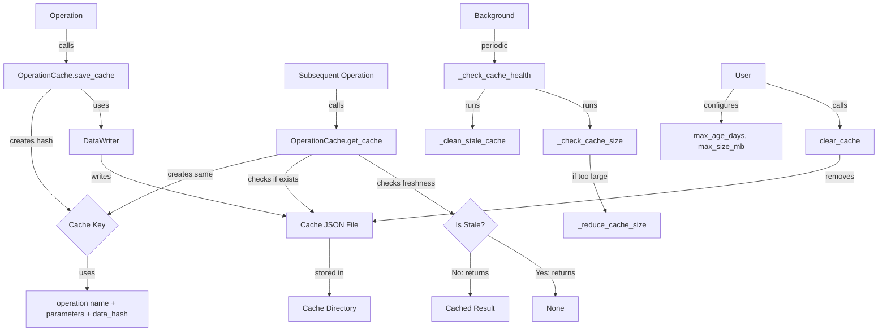

# PAMOLA.CORE Operation Cache Module Documentation

## 1. Purpose and Overview

The PAMOLA.CORE Operation Cache module (`op_cache.py`) provides a comprehensive caching system for operation results within the PAMOLA privacy-preserving data processing framework. It allows computationally intensive operations to store and reuse results when inputs haven't changed, significantly improving performance for repeated operations in data processing workflows.

The Operation Cache functions as a critical optimization component in the PAMOLA.CORE operations framework, enabling efficient execution of complex privacy-enhancing and data transformation tasks. By storing the results of previous operations with identical parameters, the cache can dramatically reduce execution time for common or repetitive operations, making the overall system more responsive and resource-efficient.

## 2. Key Features

- **Configurable Cache Management**: Customizable cache directory location, maximum age, and size limits
- **Thread-Safe Operations**: Built-in locking mechanism for safe concurrent access
- **Automatic Aging**: Stale cache items are automatically removed based on configurable time thresholds
- **Size Management**: Cache size is automatically maintained below configurable limits by removing oldest items
- **Hash-Based Keys**: Deterministic cache key generation based on operation name, parameters, and input data hashes
- **Context Manager Support**: Clean integration with Python's context management protocol
- **Asynchronous API**: Optional non-blocking asynchronous methods for high-performance applications
- **Integration with DataWriter**: Uses the DataWriter class for standardized file operations
- **Error Handling**: Comprehensive error reporting and logging
- **Statistics and Reporting**: Optional tracking of cache hits, misses, and resource usage

## 3. Architecture

### Integration Architecture

The OperationCache is positioned as a fundamental utility within the PAMOLA.CORE operations framework, serving as a performance optimization layer for all operation types:

```
┌────────────────────────────────────────────────────────────────┐
│                      User-Level Scripts                        │
└─────────────────────────────────┬──────────────────────────────┘
                                  │
                                  ▼
┌────────────────────────────────────────────────────────────────┐
│                     Operations Framework                       │
│  ┌─────────────────┐ ┌────────────────┐ ┌───────────────────┐  │
│  │   BaseOperation │ │ OperationResult│ │  OperationRegistry│  │
│  └────────┬────────┘ └───────┬────────┘ └──────────┬────────┘  │
│           │                  │                     │           │
└───────────┼──────────────────┼─────────────────────┼───────────┘
            │                  │                     │
            ▼                  ▼                     ▼
┌─────────────────────────────────────────────────────────────────┐
│                     Core Utility Modules                        │
│  ┌────────────┐  ┌────────────┐  ┌───────────────┐  ┌─────────┐ │
│  │DataWriter  │  │DataReader  │  │OperationCache │  │Progress │ │
│  └─────┬──────┘  └─────┬──────┘  └───────┬───────┘  └─────────┘ │
│        │               │                 │                      │
│        ▼               ▼                 ▼                      │
│  ┌──────────────────────────────────────────────────────────┐   │
│  │                       io.py                              │   │
│  └──────────────────────────────────────────────────────────┘   │
└─────────────────────────────────────────────────────────────────┘
```

### Component Architecture

The OperationCache is built as a class with synchronized methods for cache management:

```
┌─────────────────────────────────────────────────────────────┐
│                    OperationCache Class                     │
│                                                             │
│  ┌─────────────────────┐  ┌────────────────────────────┐    │
│  │ Core Methods        │  │ Asynchronous Methods       │    │
│  │                     │  │                            │    │
│  │ ◆ get_cache()       │  │ ◆ async_get_cache()        │    │
│  │ ◆ save_cache()      │  │ ◆ async_save_cache()       │    │
│  │ ◆ clear_cache()     │  │ ◆ async_clear_cache()      │    │
│  │ ◆ generate_cache_key│  │ ◆ async_generate_cache_key()    │
│  └─────────────────────┘  └────────────────────────────┘    │
│                                                             │
│  ┌─────────────────────┐  ┌────────────────────────────┐    │
│  │ Helper Methods      │  │ Error & Statistics Types   │    │
│  │                     │  │                            │    │
│  │ ◆ _get_cache_file_path │ ◆ OpsError                 │    │
│  │ ◆ _is_cache_stale() │  │ ◆ CacheError               │    │
│  │ ◆ _check_cache_health  │ ◆ get_cache_stats()        │    │
│  │ ◆ _clean_stale_cache│  │                            │    │
│  │ ◆ _reduce_cache_size│  │                            │    │
│  └─────────────────────┘  └────────────────────────────┘    │
└─────────────────────────────────────────────────────────────┘
```

### Data Flow



## 4. Pamola Core API Reference

| Method | Description | Key Parameters | Returns |
|--------|-------------|----------------|---------|
| `__init__()` | Initialize an OperationCache instance | `cache_dir`: Directory to store cache (default: ~/.pamolacache)<br>`max_age_days`: Maximum age before cache is stale (default: 7.0)<br>`max_size_mb`: Maximum size of cache directory (default: 500.0) | None |
| `get_cache()` | Retrieve cached results for a key | `cache_key`: Unique identifier for cache item<br>`operation_type`: Optional type for organization | Dict[str, Any] or None |
| `async_get_cache()` | Asynchronous version of get_cache | Same as get_cache | Dict[str, Any] or None |
| `save_cache()` | Save data to cache | `data`: Data to cache<br>`cache_key`: Unique identifier<br>`operation_type`: Optional type<br>`metadata`: Optional additional metadata | bool |
| `async_save_cache()` | Asynchronous version of save_cache | Same as save_cache | bool |
| `clear_cache()` | Clear cache files | `cache_key`: Specific key to clear (optional)<br>`operation_type`: Type to clear (optional) | int (number of files cleared) |
| `async_clear_cache()` | Asynchronous version of clear_cache | Same as clear_cache | int |
| `generate_cache_key()` | Generate a unique cache key | `operation_name`: Name of the operation<br>`parameters`: Operation parameters<br>`data_hash`: Optional hash of input data | str |
| `async_generate_cache_key()` | Asynchronous version of generate_cache_key | Same as generate_cache_key | str |
| `get_cache_stats()` | Get cache performance statistics | None | Dict with cache statistics |

## 5. Usage Examples

### Basic Caching

```python
from pamola_core.utils.ops.op_cache import OperationCache

# Create a cache instance
cache = OperationCache(
    cache_dir="/path/to/cache",
    max_age_days=14.0,
    max_size_mb=1000.0
)

# Example operation parameters
operation_name = "data_profiling"
parameters = {
    "fields": ["name", "age", "address"],
    "sample_size": 1000,
    "include_metrics": True
}

# Generate a cache key
cache_key = cache.generate_cache_key(operation_name, parameters)

# Try to get cached result
cached_result = cache.get_cache(cache_key, operation_type="profiling")

if cached_result is not None:
    print("Using cached profiling result")
    profiling_result = cached_result
else:
    print("Cache miss, running profiling operation")
    # Perform expensive operation
    profiling_result = run_expensive_profiling(parameters)
    
    # Save result to cache
    cache.save_cache(
        data=profiling_result,
        cache_key=cache_key,
        operation_type="profiling",
        metadata={"timestamp": "2025-05-03T14:30:00", "source": "customer_data.csv"}
    )

print(f"Profiling showed {len(profiling_result['outliers'])} outliers")
```

### Using Context Manager

```python
from pamola_core.utils.ops.op_cache import OperationCache
import time

# Use the cache with a context manager
with OperationCache() as cache:
    # Example operation parameters
    operation_name = "clustering"
    parameters = {
        "algorithm": "kmeans",
        "n_clusters": 5,
        "random_seed": 42
    }
    
    # Generate a cache key
    cache_key = cache.generate_cache_key(operation_name, parameters)
    
    # Check cache
    cached_result = cache.get_cache(cache_key)
    
    if cached_result is not None:
        print("Using cached clustering result")
        clusters = cached_result
    else:
        print("Running clustering operation...")
        # Simulate long-running computation
        time.sleep(2)
        clusters = {"clusters": [f"Cluster_{i}" for i in range(5)]}
        
        # Cache the result
        cache.save_cache(data=clusters, cache_key=cache_key)
    
    # Resources automatically cleaned up when exiting context
```

### Data-Dependent Caching

```python
from pamola_core.utils.ops.op_cache import OperationCache
import pandas as pd
import hashlib

# Create a cache instance
cache = OperationCache()

# Create a data hash based on content
def hash_dataframe(df):
    # Create a deterministic representation of the DataFrame
    df_str = df.to_csv(index=False)
    # Generate MD5 hash (for cache key purposes, not cryptographic security)
    hasher = hashlib.md5()
    hasher.update(df_str.encode('utf-8'))
    return hasher.hexdigest()

# Input data
df = pd.DataFrame({
    'id': [1, 2, 3, 4, 5],
    'value': [10, 20, 30, 40, 50]
})

# Create a hash of the input data
data_hash = hash_dataframe(df)

# Operation details
operation_name = "statistical_analysis"
parameters = {
    "percentiles": [25, 50, 75, 90],
    "include_outliers": True
}

# Generate a content-aware cache key
cache_key = cache.generate_cache_key(operation_name, parameters, data_hash)

# Try to get cached result
cached_result = cache.get_cache(cache_key, operation_type="statistics")

if cached_result is not None:
    print("Using cached statistical analysis")
    stats = cached_result
else:
    print("Performing statistical analysis...")
    # Perform analysis
    stats = {
        "mean": df['value'].mean(),
        "median": df['value'].median(),
        "percentiles": {p: df['value'].quantile(p/100) for p in parameters["percentiles"]},
        "outliers": [] if not parameters["include_outliers"] else []
    }
    
    # Save to cache
    cache.save_cache(data=stats, cache_key=cache_key, operation_type="statistics")

print(f"Mean: {stats['mean']}, Median: {stats['median']}")
```

### Asynchronous Access

```python
import asyncio
from pamola_core.utils.ops.op_cache import OperationCache

async def process_data_async():
    # Create a cache instance
    cache = OperationCache()
    
    # Example operation parameters
    operation_name = "async_processing"
    parameters = {
        "batch_size": 1000,
        "iterations": 5,
        "algorithm": "fast_mode"
    }
    
    # Generate a cache key asynchronously
    cache_key = await cache.async_generate_cache_key(operation_name, parameters)
    
    # Try to get cached result asynchronously
    cached_result = await cache.async_get_cache(cache_key)
    
    if cached_result is not None:
        print("Using cached result")
        result = cached_result
    else:
        print("Cache miss, performing async operation")
        # Simulate async operation
        await asyncio.sleep(1)  # Placeholder for actual async work
        result = {"status": "success", "items_processed": 5000}
        
        # Save result to cache asynchronously
        await cache.async_save_cache(
            data=result,
            cache_key=cache_key
        )
    
    return result

# Run the async function
async def main():
    result = await process_data_async()
    print(f"Operation processed {result['items_processed']} items")

# Execute the async main function
asyncio.run(main())
```

### Cache Management and Statistics

```python
from pamola_core.utils.ops.op_cache import OperationCache

# Create a cache instance
cache = OperationCache(
    max_age_days=30.0,
    max_size_mb=2000.0
)

# Get cache statistics
stats = cache.get_cache_stats()
print(f"Current cache size: {stats['cache_size_mb']:.2f} MB")
print(f"Number of cached files: {stats['file_count']}")
print(f"Maximum cache size: {stats['max_size_mb']:.2f} MB")
print(f"Maximum cache age: {stats['max_age_days']:.1f} days")

# Clear cache for a specific operation type
num_cleared = cache.clear_cache(operation_type="profiling")
print(f"Cleared {num_cleared} profiling cache files")

# Clear a specific cache entry
cache.clear_cache(cache_key="clustering_a3f7b9e2d1c8")

# Clear all cache
num_cleared = cache.clear_cache()
print(f"Cleared all {num_cleared} cache files")
```

### Integration with BaseOperation

```python
from pamola_core.utils.ops.op_cache import operation_cache
from pamola_core.utils.ops.op_base import BaseOperation
from pamola_core.utils.ops.op_result import OperationResult, OperationStatus
import hashlib
import time

class CachedOperation(BaseOperation):
    """Example operation that uses caching."""
    
    def __init__(self, name, use_cache=True, **kwargs):
        super().__init__(name=name, **kwargs)
        self.use_cache = use_cache
        self.version = "1.0.0"
    
    def execute(self, data_source, task_dir, reporter=None, **kwargs):
        # Start timing
        start_time = time.time()
        
        # Check if we should use cache
        if self.use_cache:
            # Generate a cache key based on operation parameters
            cache_key = operation_cache.generate_cache_key(
                operation_name=self.name,
                parameters=kwargs
            )
            
            # Try to get cached result
            cached_result = operation_cache.get_cache(
                cache_key=cache_key,
                operation_type=self.__class__.__name__
            )
            
            if cached_result is not None:
                self.logger.info(f"Using cached result for {self.name}")
                
                # Create result from cached data
                result = OperationResult(
                    status=OperationStatus.SUCCESS,
                    data=cached_result,
                    execution_time=time.time() - start_time
                )
                
                return result
        
        # Cache miss or caching disabled, perform the actual operation
        self.logger.info(f"Performing operation {self.name}")
        
        # Simulate complex work
        time.sleep(2)
        
        # Create operation result
        operation_data = {
            "result_value": 42,
            "processed_items": 100,
            "quality_score": 0.95
        }
        
        result = OperationResult(
            status=OperationStatus.SUCCESS,
            data=operation_data,
            execution_time=time.time() - start_time
        )
        
        # Cache the result if caching is enabled
        if self.use_cache:
            operation_cache.save_cache(
                data=operation_data,
                cache_key=cache_key,
                operation_type=self.__class__.__name__,
                metadata={"timestamp": time.time()}
            )
        
        return result

# Usage
operation = CachedOperation("example_operation", use_cache=True)
```

## 6. Limitations and Best Practices

### Current Limitations

1. **Single-Process Locking**: The cache uses thread-level locking with `threading.Lock()`, which works for multi-threaded applications but not for multi-process scenarios without additional synchronization.

2. **Encryption Support**: While file writing through DataWriter supports encryption, the cache does not currently encrypt the cached data itself by default.

3. **Hash Algorithms**: The current implementation uses MD5 for cache key generation, which is suitable for non-cryptographic purposes but should be updated to more secure hashing algorithms in future versions.

4. **Distributed Cache**: No built-in support for distributed cache backends like Redis or Memcached, which would be beneficial for multi-node deployments.

5. **Cache Validation**: Limited validation of cache contents when retrieving, assuming cache structure is consistent.

### Best Practices

#### Cache Key Generation

1. **Deterministic Parameters**: Ensure operation parameters are deterministic and properly ordered for consistent key generation:
   ```python
   # Good: Sorted keys for deterministic behavior
   parameters = {
       "algorithm": "kmeans",
       "n_clusters": 5,
       "random_seed": 42
   }
   
   # Bad: Using non-deterministic values in parameters
   parameters = {
       "timestamp": time.time(),  # Changes each run
       "algorithm": "kmeans"
   }
   ```

2. **Data-Dependent Caching**: Include a hash of the input data when operation results depend on data content:
   ```python
   # Create a hash of the input data
   def hash_input_data(df):
       return hashlib.md5(df.to_csv().encode()).hexdigest()
   
   data_hash = hash_input_data(input_df)
   cache_key = operation_cache.generate_cache_key(
       operation_name="my_operation",
       parameters=operation_params,
       data_hash=data_hash
   )
   ```

3. **Versioning**: Include version information in the operation name or parameters to invalidate cache when implementation changes:
   ```python
   parameters = {
       "algorithm": "kmeans",
       "version": "2.0.0",  # Increment when implementation changes
       "n_clusters": 5
   }
   ```

#### Memory and Disk Management

1. **Cache Size Management**: Set appropriate `max_size_mb` based on available disk space and expected cache usage:
   ```python
   # For development with limited disk space
   cache = OperationCache(max_size_mb=100.0)
   
   # For production with plenty of disk space
   cache = OperationCache(max_size_mb=5000.0)
   ```

2. **Cache Age Management**: Adjust `max_age_days` based on how frequently your data and operations change:
   ```python
   # For rapidly changing data/operations
   cache = OperationCache(max_age_days=1.0)
   
   # For stable data/operations
   cache = OperationCache(max_age_days=30.0)
   ```

3. **Explicit Cache Clearing**: Implement explicit cache clearing when necessary:
   ```python
   # Clear cache for a specific operation after data update
   def update_data_and_invalidate_cache(new_data):
       # Update the data
       save_data(new_data)
       
       # Invalidate relevant cache entries
       operation_cache.clear_cache(operation_type="data_dependent_operation")
   ```

#### Cache Organization

1. **Operation Types**: Use consistent operation types to organize the cache:
   ```python
   # Good: Consistent operation types
   cached_result = operation_cache.get_cache(cache_key, operation_type="profiling")
   operation_cache.save_cache(data, cache_key, operation_type="profiling")
   
   # Bad: Inconsistent operation types
   cached_result = operation_cache.get_cache(cache_key, operation_type="profiling")
   operation_cache.save_cache(data, cache_key, operation_type="profile_data")
   ```

2. **Metadata Usage**: Include useful metadata with cached results:
   ```python
   operation_cache.save_cache(
       data=result_data,
       cache_key=cache_key,
       operation_type="anonymization",
       metadata={
           "timestamp": time.time(),
           "user": current_user,
           "data_source": "customers_2025_q1.csv",
           "parameters_hash": parameters_hash,
           "source_records": 15428
       }
   )
   ```

#### Performance Optimization

1. **Selective Caching**: Only cache operations that are computationally expensive or have stable results:
   ```python
   # Good candidate for caching (expensive, deterministic)
   def compute_complex_statistics(df):
       # ... complex computation taking seconds or minutes
       return stats
   
   # Poor candidate for caching (fast, simple)
   def count_records(df):
       return len(df)
   ```

2. **Asynchronous Access**: Use asynchronous methods for non-blocking cache operations in async contexts:
   ```python
   async def process_batch(batch_data):
       # Use async cache methods in async functions
       cached_result = await operation_cache.async_get_cache(cache_key)
       
       if cached_result is None:
           result = await compute_result_async(batch_data)
           await operation_cache.async_save_cache(result, cache_key)
           return result
       return cached_result
   ```

3. **Custom Cache Instances**: Create specialized cache instances for different parts of the application:
   ```python
   # Long-lived cache for stable operations
   STABLE_CACHE = OperationCache(
       cache_dir="/path/to/stable_cache",
       max_age_days=90.0
   )
   
   # Short-lived cache for volatile operations
   VOLATILE_CACHE = OperationCache(
       cache_dir="/path/to/volatile_cache",
       max_age_days=1.0
   )
   ```

#### Future Compatibility

1. **Python Version Compatibility**: Use the provided alternative implementations for Python < 3.9:
   ```python
   # For Python < 3.9
   async def async_get_cache(self, cache_key, operation_type=None):
       loop = asyncio.get_event_loop()
       return await loop.run_in_executor(
           None, self.get_cache, cache_key, operation_type
       )
   ```

2. **Preparing for Distributed Caching**: Structure code to be ready for future distributed cache backends:
   ```python
   # Encapsulate cache access in a service class
   class CacheService:
       def __init__(self, distributed=False, redis_url=None):
           if distributed and redis_url:
               # Future: Initialize distributed cache
               self.cache = None  # Placeholder for Redis client
           else:
               # Current: Use local file cache
               self.cache = OperationCache()
       
       def get(self, key, type_=None):
           # Abstract access method
           if isinstance(self.cache, OperationCache):
               return self.cache.get_cache(key, type_)
           else:
               # Future: Implement for distributed cache
               pass
   ```

By following these guidelines, you can ensure optimal use of the OperationCache module within the PAMOLA.CORE framework, with proper handling of performance, organization, and future compatibility concerns.