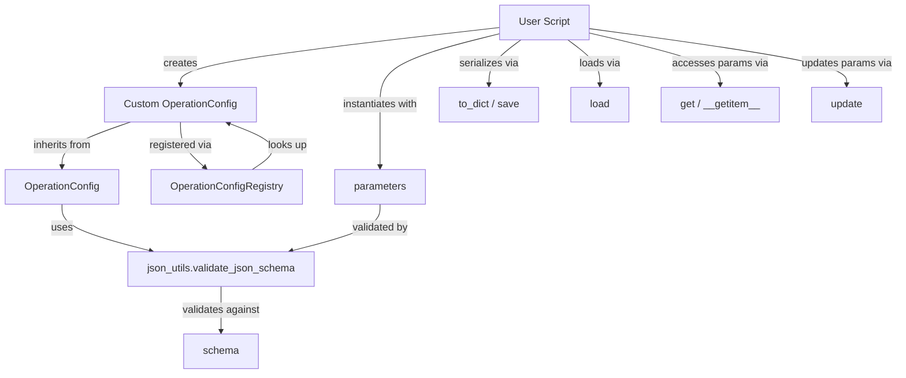
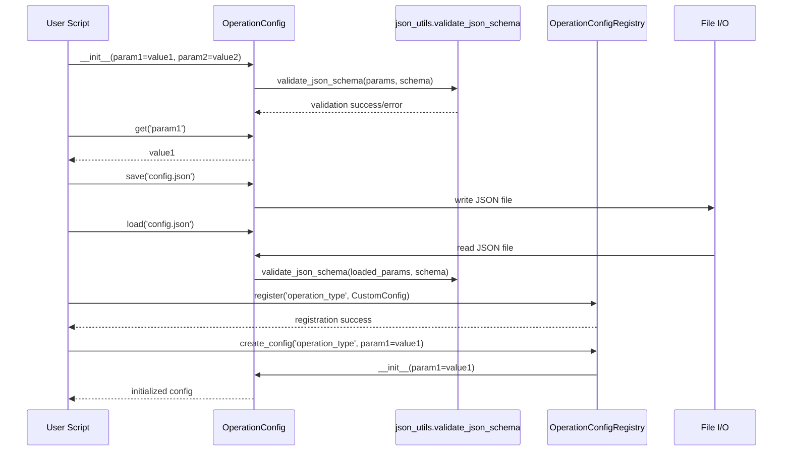

# PAMOLA.CORE Operation Configuration Module Documentation

## 1. Purpose and Overview

The PAMOLA.CORE Operation Configuration module (`op_config.py`) provides the framework for defining, validating, and managing configuration parameters for operations within the PAMOLA privacy-preserving data processing framework. It serves as a standardized mechanism for all operations to ensure proper parameter validation, serialization, and deserialization while supporting a consistent approach to error handling and type safety.

The Operation Configuration module functions as a crucial component of the Operation Framework in PAMOLA.CORE, ensuring that operations have properly validated parameters with appropriate defaults, serialization support, and registry capabilities. This guarantees that operations can be reliably configured, executed, and reproduced across different environments and workflows.

## 2. Key Features

- **JSON Schema Validation**: Parameter validation against declarative JSON schemas with graceful fallback
- **Type-Safe Configuration**: Generic typing support for configuration classes
- **Configuration Registry**: Registry system for operation-specific configurations
- **Serialization Support**: Methods for saving and loading configurations from JSON files
- **Dictionary Conversion**: Easy conversion of configuration to dictionaries for serialization
- **Parameter Access**: Multiple methods for accessing configuration parameters
- **Parameter Updates**: Support for updating configuration while maintaining validation
- **Error Handling**: Standardized error classes for configuration-related errors
- **Type Annotations**: Comprehensive type hints for better IDE support and static analysis

## 3. Architecture

### Integration Architecture

The OperationConfig is positioned as a pamola core component within the PAMOLA.CORE operations framework, providing configuration management for all operation types:

```
┌────────────────────────────────────────────────────────────────┐
│                      User-Level Scripts                        │
└─────────────────────────────────┬──────────────────────────────┘
                                  │
                                  ▼
┌────────────────────────────────────────────────────────────────┐
│                     Operations Framework                       │
│  ┌─────────────────┐ ┌────────────────┐ ┌───────────────────┐  │
│  │   BaseOperation │ │ OperationResult│ │  OperationRegistry│  │
│  └────────┬────────┘ └───────┬────────┘ └──────────┬────────┘  │
│           │                  │                     │           │
└───────────┼──────────────────┼─────────────────────┼───────────┘
            │                  │                     │
            ▼                  ▼                     ▼
┌─────────────────────────────────────────────────────────────────┐
│                     Core Utility Modules                        │
│  ┌──────────────┐ ┌───────────────────────┐  ┌─────────────┐    │
│  │OperationConfig │OperationConfigRegistry│  │DataWriter   │    │
│  └─────┬────────┘ └────────┬──────────────┘  └─────┬───────┘    │
│        │                   │                       │            │
│        ▼                   ▼                       ▼            │
│  ┌────────────────────────────────────────────────────────┐     │
│  │                 json_utils.validate_json_schema        │     │
│  └────────────────────────────────────────────────────────┘     │
└─────────────────────────────────────────────────────────────────┘
```

### Component Architecture

The OperationConfig is built as a generic class with key methods for configuration management:

```
┌─────────────────────────────────────────────────────────────┐
│                    OperationConfig Class                    │
│                                                             │
│  ┌─────────────────────┐  ┌────────────────────────────┐    │
│  │ Core Properties     │  │ Serialization Methods      │    │
│  │                     │  │                            │    │
│  │ ◆ schema            │  │ ◆ to_dict()                │    │
│  │ ◆ _params           │  │ ◆ save()                   │    │
│  │                     │  │ ◆ load()                   │    │
│  └─────────────────────┘  └────────────────────────────┘    │
│                                                             │
│  ┌─────────────────────┐  ┌────────────────────────────┐    │
│  │ Access Methods      │  │ Validation Methods         │    │
│  │                     │  │                            │    │
│  │ ◆ get()             │  │ ◆ _validate_params()       │    │
│  │ ◆ __getitem__()     │  │ ◆ update()                 │    │
│  │ ◆ __contains__()    │  │ ◆ __init__()               │    │
│  └─────────────────────┘  └────────────────────────────┘    │
└─────────────────────────────────────────────────────────────┘
```

```
┌─────────────────────────────────────────────────────────────┐
│                OperationConfigRegistry Class                │
│                                                             │
│  ┌─────────────────────┐  ┌────────────────────────────┐    │
│  │ Registry Management │  │ Configuration Creation     │    │
│  │                     │  │                            │    │
│  │ ◆ register()        │  │ ◆ create_config()          │    │
│  │ ◆ get_config_class()│  │                            │    │
│  │                     │  │                            │    │
│  └─────────────────────┘  └────────────────────────────┘    │
└─────────────────────────────────────────────────────────────┘
```

### Data Flow





## 4. Pamola Core API Reference

| Class Method | Description | Key Parameters | Returns | Req-ID |
|--------------|-------------|----------------|---------|--------|
| `OperationConfig.__init__` | Initialize configuration with parameters | `**kwargs`: Configuration parameters | None | REQ-OPS-002 |
| `OperationConfig._validate_params` | Validate parameters against schema | `params`: Dictionary of parameters | None | REQ-OPS-002 |
| `OperationConfig.save` | Save configuration to a JSON file | `path`: Path to save the file | None | REQ-OPS-004 |
| `OperationConfig.load` | Load configuration from a JSON file | `path`: Path to the file | `OperationConfig` | REQ-OPS-004 |
| `OperationConfig.get` | Get a configuration parameter | `key`: Parameter name<br>`default`: Default value | Any | - |
| `OperationConfig.__getitem__` | Get a parameter by key | `key`: Parameter name | Any | - |
| `OperationConfig.__contains__` | Check if a parameter exists | `key`: Parameter name | bool | - |
| `OperationConfig.to_dict` | Convert to dictionary | None | Dict[str, Any] | - |
| `OperationConfig.update` | Update configuration parameters | `**kwargs`: New parameters | None | - |
| `OperationConfigRegistry.register` | Register a configuration class | `operation_type`: Operation identifier<br>`config_class`: Configuration class | None | - |
| `OperationConfigRegistry.get_config_class` | Get configuration class for operation | `operation_type`: Operation identifier | Type[OperationConfig] or None | - |
| `OperationConfigRegistry.create_config` | Create configuration instance | `operation_type`: Operation identifier<br>`**kwargs`: Configuration parameters | OperationConfig or None | - |

### _validate_params Method

The validation method ensures parameters conform to the schema:

```python
def _validate_params(self, params: Dict[str, Any]) -> None:
    """
    Validate parameters against the schema.

    Parameters:
    -----------
    params : Dict[str, Any]
        Parameters to validate

    Raises:
    -------
    ConfigError
        If parameters don't conform to schema.
        
    Satisfies:
    ----------
    REQ-OPS-002: Provides schema validation for operation parameters.
    """
    # Use the helper function from json_utils for validation
    from pamola_core.utils.io_helpers.json_utils import validate_json_schema
    validate_json_schema(params, self.schema, ConfigError)
```

### load Method

This class method loads configuration from a JSON file:

```python
@classmethod
def load(cls: Type[T], path: Union[str, Path]) -> T:
    """
    Load configuration from a JSON file.

    Parameters:
    -----------
    path : Union[str, Path]
        Path to the configuration file

    Returns:
    --------
    OperationConfig
        Loaded configuration
        
    Raises:
    -------
    ConfigError
        If the loaded data doesn't conform to schema.
        
    Satisfies:
    ----------
    REQ-OPS-004: Supports loading configuration from JSON.
    """
    path = Path(path) if isinstance(path, str) else path
    with open(path, 'r') as f:
        params = json.load(f)
    return cls(**params)
```

## 5. Usage Examples

### Creating a Custom Configuration

```python
from pamola_core.utils.ops.op_config import OperationConfig
from typing import Dict, Any

class ProfilerConfig(OperationConfig):
    """Configuration for data profiling operations."""
    
    # Define JSON schema for configuration validation
    schema: Dict[str, Any] = {
        "type": "object",
        "properties": {
            "fields": {
                "type": "array",
                "items": {"type": "string"}
            },
            "sample_size": {
                "type": "integer",
                "minimum": 1,
                "maximum": 1000000
            },
            "include_metrics": {
                "type": "boolean"
            }
        },
        "required": ["fields"]
    }
    
    def __init__(self, fields, sample_size=10000, include_metrics=True, **kwargs):
        """
        Initialize profiler configuration.
        
        Parameters:
        -----------
        fields : list
            List of fields to profile
        sample_size : int
            Number of records to sample (default: 10000)
        include_metrics : bool
            Whether to include detailed metrics (default: True)
        """
        super().__init__(
            fields=fields,
            sample_size=sample_size,
            include_metrics=include_metrics,
            **kwargs
        )

# Create a configuration instance
profiler_config = ProfilerConfig(
    fields=["name", "age", "address", "email"],
    sample_size=50000
)

# Access parameters
print(f"Fields to profile: {profiler_config['fields']}")
print(f"Sample size: {profiler_config.get('sample_size')}")
print(f"Include metrics: {profiler_config.get('include_metrics')}")

# Convert to dictionary
config_dict = profiler_config.to_dict()
print(f"Full configuration: {config_dict}")
```

### Saving and Loading Configuration

```python
from pamola_core.utils.ops.op_config import OperationConfig
from pathlib import Path
import tempfile

# Create a configuration with custom parameters
config = OperationConfig(
    operation_name="example_operation",
    field_list=["field1", "field2", "field3"],
    threshold=0.75,
    max_iterations=5,
    include_stats=True
)

# Create a temporary directory for the example
with tempfile.TemporaryDirectory() as temp_dir:
    # Create path for saving
    config_path = Path(temp_dir) / "operation_config.json"
    
    # Save configuration to file
    config.save(config_path)
    print(f"Saved configuration to {config_path}")
    
    # Later, load the configuration
    loaded_config = OperationConfig.load(config_path)
    
    # Verify loaded values
    assert loaded_config.get("operation_name") == "example_operation"
    assert loaded_config.get("field_list") == ["field1", "field2", "field3"]
    assert loaded_config.get("threshold") == 0.75
    assert loaded_config.get("max_iterations") == 5
    assert loaded_config.get("include_stats") is True
    
    print("Configuration loaded successfully with all values verified")
```

### Using the Configuration Registry

```python
from pamola_core.utils.ops.op_config import OperationConfig, OperationConfigRegistry
from typing import Dict, Any

# Define configuration classes for different operations
class ProfilerConfig(OperationConfig):
    """Configuration for profiling operations."""
    schema: Dict[str, Any] = {
        "type": "object",
        "properties": {
            "fields": {"type": "array", "items": {"type": "string"}},
            "sample_size": {"type": "integer", "minimum": 1}
        },
        "required": ["fields"]
    }

class AnonymizerConfig(OperationConfig):
    """Configuration for anonymization operations."""
    schema: Dict[str, Any] = {
        "type": "object",
        "properties": {
            "method": {"type": "string", "enum": ["mask", "generalize", "suppress"]},
            "fields": {"type": "array", "items": {"type": "string"}},
            "level": {"type": "string", "enum": ["low", "medium", "high"]}
        },
        "required": ["method", "fields"]
    }

# Register configuration classes
OperationConfigRegistry.register("profiler", ProfilerConfig)
OperationConfigRegistry.register("anonymizer", AnonymizerConfig)

# Create configurations using the registry
profiler_config = OperationConfigRegistry.create_config(
    "profiler",
    fields=["name", "email", "phone"],
    sample_size=10000
)

anonymizer_config = OperationConfigRegistry.create_config(
    "anonymizer",
    method="mask",
    fields=["email", "phone"],
    level="high"
)

# Use the configurations
print(f"Profiler config: {profiler_config.to_dict()}")
print(f"Anonymizer config: {anonymizer_config.to_dict()}")

# Look up configuration classes
profiler_class = OperationConfigRegistry.get_config_class("profiler")
print(f"Profiler class: {profiler_class.__name__}")
```

### Integration with BaseOperation

```python
from pamola_core.utils.ops.op_base import BaseOperation
from pamola_core.utils.ops.op_config import OperationConfig
from pamola_core.utils.ops.op_result import OperationResult, OperationStatus
from typing import Dict, Any
from pathlib import Path

# Define a custom configuration
class CustomOperationConfig(OperationConfig):
    """Configuration for custom operation."""
    schema: Dict[str, Any] = {
        "type": "object",
        "properties": {
            "threshold": {"type": "number", "minimum": 0, "maximum": 1},
            "fields": {"type": "array", "items": {"type": "string"}},
            "max_iterations": {"type": "integer", "minimum": 1}
        },
        "required": ["threshold", "fields"]
    }

# Custom operation using the configuration
class CustomOperation(BaseOperation):
    """Custom operation with specialized configuration."""
    
    def __init__(self, name="CustomOperation", **kwargs):
        # Create the configuration
        config = CustomOperationConfig(
            threshold=kwargs.pop("threshold", 0.5),
            fields=kwargs.pop("fields", []),
            max_iterations=kwargs.pop("max_iterations", 10)
        )
        
        # Initialize base class with the configuration
        super().__init__(
            name=name,
            description="Custom operation with specialized configuration",
            config=config,
            **kwargs
        )
    
    def execute(self, data_source, task_dir, reporter=None, progress_tracker=None, **kwargs):
        # Access configuration parameters
        threshold = self.config.get("threshold")
        fields = self.config.get("fields")
        max_iterations = self.config.get("max_iterations")
        
        # Log parameters
        self.logger.info(f"Starting {self.name} with threshold={threshold}, "
                         f"fields={fields}, max_iterations={max_iterations}")
        
        # Example execution logic
        result = OperationResult(status=OperationStatus.SUCCESS)
        result.add_metric("config_values", {
            "threshold": threshold,
            "field_count": len(fields),
            "max_iterations": max_iterations
        })
        
        return result

# Create and run the operation
custom_op = CustomOperation(
    threshold=0.75,
    fields=["name", "email", "address"],
    max_iterations=5
)

# Example execution - actual implementation would provide real data_source
result = custom_op.run(
    data_source=None,  # Placeholder for actual data source
    task_dir=Path("/tmp/custom_op_example")
)

# Configuration is automatically saved to {task_dir}/config.json
```

### Validation and Error Handling

```python
from pamola_core.utils.ops.op_config import OperationConfig, ConfigError
from typing import Dict, Any

# Define a configuration with strict schema
class StrictConfig(OperationConfig):
    """Configuration with strict validation."""
    schema: Dict[str, Any] = {
        "type": "object",
        "properties": {
            "name": {"type": "string", "minLength": 3},
            "age": {"type": "integer", "minimum": 18, "maximum": 100},
            "email": {"type": "string", "format": "email"}
        },
        "required": ["name", "age", "email"]
    }

# Example of handling validation errors
try:
    # This will fail validation - age out of range
    config = StrictConfig(
        name="John Doe",
        age=15,  # Below minimum of 18
        email="john.doe@example.com"
    )
except ConfigError as e:
    print(f"Validation error: {str(e)}")

# This will pass validation
try:
    config = StrictConfig(
        name="John Doe",
        age=25,
        email="john.doe@example.com"
    )
    print("Validation passed")
    
    # Update with invalid parameter
    try:
        config.update(age=150)  # Above maximum of 100
    except ConfigError as e:
        print(f"Update validation error: {str(e)}")
        
except ConfigError as e:
    print(f"Unexpected validation error: {str(e)}")
```

## 6. Limitations and Best Practices

### Current Limitations

1. **Schema Complexity**: The JSON schema validation is limited by the capabilities of the jsonschema library, and complex validation logic may require custom validators.

2. **Optional Dependencies**: The jsonschema library is an optional dependency, so validation may be skipped if not installed, potentially allowing invalid configurations.

3. **Type System**: While the module uses type annotations, runtime type checking relies on the JSON schema validation, which may not cover all edge cases.

4. **Performance**: Validation can be resource-intensive for large or complex schemas, potentially affecting operation initialization time.

5. **Nested Configuration**: The default implementation doesn't provide special handling for deeply nested configuration structures, requiring manual access paths.

### Best Practices

#### Schema Design

1. **Clear Property Definitions**: Define clear property types and constraints in schemas:
   ```python
   schema = {
       "type": "object",
       "properties": {
           "threshold": {
               "type": "number",
               "minimum": 0,
               "maximum": 1,
               "description": "Threshold value between 0 and 1"
           }
       }
   }
   ```

2. **Required Properties**: Always define which properties are required:
   ```python
   schema = {
       "type": "object",
       "properties": { ... },
       "required": ["threshold", "method", "fields"]
   }
   ```

3. **Validation Messages**: Use detailed property descriptions to improve error messages:
   ```python
   "sample_size": {
       "type": "integer",
       "minimum": 1,
       "maximum": 1000000,
       "description": "Number of samples (1-1,000,000)"
   }
   ```

#### Configuration Usage

1. **Default Values**: Provide sensible defaults for optional parameters:
   ```python
   def __init__(self, required_param, optional_param=100):
       super().__init__(
           required_param=required_param,
           optional_param=optional_param
       )
   ```

2. **Type Conversion**: Convert input values to the expected types when needed:
   ```python
   # Convert string to Path object
   path = Path(path) if isinstance(path, str) else path
   
   # Convert value to list if not already
   fields = [fields] if isinstance(fields, str) else fields
   ```

3. **Value Access**: Use `.get()` with defaults for optional parameters:
   ```python
   # Safe access with default
   sample_size = config.get("sample_size", 1000)
   
   # Or use direct access when required
   fields = config["fields"]  # Raises KeyError if missing
   ```

#### Registry Management

1. **Consistent Registration**: Register all configuration classes at module import time:
   ```python
   # At the end of your module
   OperationConfigRegistry.register("my_operation", MyOperationConfig)
   ```

2. **Error Handling**: Handle missing configuration classes gracefully:
   ```python
   config_class = OperationConfigRegistry.get_config_class(operation_type)
   if config_class is None:
       # Handle missing config class
       logger.warning(f"No configuration for {operation_type}, using default")
       config_class = DefaultConfig
   ```

3. **Operation Type Naming**: Use consistent naming conventions for operation types:
   ```python
   # Use module name + class name pattern
   operation_type = "profiling.field_profiler"
   ```

#### Serialization

1. **Secure Storage**: Be careful with sensitive configuration values:
   ```python
   # Redact sensitive values when converting to dict
   def to_dict(self):
       config = super().to_dict()
       if "api_key" in config:
           config["api_key"] = "***REDACTED***"
       return config
   ```

2. **Versioning**: Include version information in configuration:
   ```python
   def __init__(self, **kwargs):
       kwargs["config_version"] = "1.2.0"
       super().__init__(**kwargs)
   ```

3. **File Naming**: Use consistent file naming for configurations:
   ```python
   config_path = task_dir / f"{operation_name}_config.json"
   ```
Following these guidelines, you can ensure optimal use of the OperationConfig module within the PAMOLA.CORE framework, with proper handling of validation, serialization, and integration concerns.