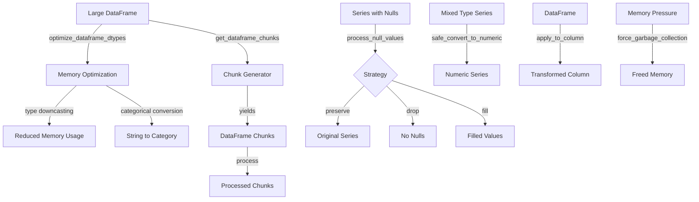

# PAMOLA.CORE Data Processing Utilities Module Documentation

## 1. Purpose and Overview

The PAMOLA.CORE Data Processing Utilities module (`op_data_processing.py`) provides essential data processing utilities for all operation types within the PAMOLA privacy-preserving data processing framework. It focuses on fundamental DataFrame transformations, memory optimization, and efficient chunk processing capabilities that are commonly needed across different operations.

The Data Processing Utilities module serves as a foundational component of the PAMOLA.CORE operations framework, providing domain-general utilities that enable efficient processing of large datasets while maintaining memory constraints. By centralizing these common operations, the module ensures consistency and reduces code duplication across the framework.

## 2. Key Features

- **Memory-Efficient Type Optimization**: Automatic DataFrame dtype optimization to reduce memory usage
- **Chunk Generation**: Simple and efficient chunk generation for large dataset processing
- **Null Value Handling**: Basic strategies for handling null values in data
- **Type Conversion**: Safe conversion utilities for numeric data
- **Memory Usage Analysis**: Tools to analyze and report memory consumption
- **Column Operations**: Utilities for applying functions to DataFrame columns
- **Data Sampling**: Simple sampling capabilities for data exploration
- **Garbage Collection**: Explicit memory cleanup utilities

## 3. Architecture

### Integration Architecture

The Data Processing Utilities module is positioned as a core utility within the PAMOLA.CORE operations framework:

```
┌────────────────────────────────────────────────────────────────┐
│                      User-Level Scripts                        │
└─────────────────────────────────┬──────────────────────────────┘
                                  │
                                  ▼
┌────────────────────────────────────────────────────────────────┐
│                     Operations Framework                       │
│  ┌─────────────────┐ ┌────────────────┐ ┌───────────────────┐  │
│  │   BaseOperation │ │ OperationResult│ │  OperationRegistry│  │
│  └────────┬────────┘ └───────┬────────┘ └──────────┬────────┘  │
│           │                  │                     │           │
└───────────┼──────────────────┼─────────────────────┼───────────┘
            │                  │                     │
            ▼                  ▼                     ▼
┌───────────────────────────────────────────────────────────────┐
│                     Core Utility Modules                      │
│  ┌─────────────────┐  ┌────────────┐  ┌────────────────────┐  │
│  │Data Processing  │  │Field Utils │  │OperationConfig     │  │
│  └─────┬───────────┘  └─────┬──────┘  └───────┬────────────┘  │
│        │                    │                 │               │
│        ▼                    ▼                 ▼               │
│  ┌────────────────────────────────────────────────────────┐   │
│  │           All Operation Types                          │   │
│  │    (Anonymization, Profiling, Quality, Metrics)        │   │
│  └────────────────────────────────────────────────────────┘   │
└───────────────────────────────────────────────────────────────┘
```

### Component Architecture

The Data Processing Utilities module consists of focused functional groups:

```
┌─────────────────────────────────────────────────────────────┐
│                 Data Processing Utilities Module            │
│                                                             │
│  ┌─────────────────────┐  ┌────────────────────────────┐    │
│  │ Memory Optimization │  │ Data Transformation        │    │
│  │                     │  │                            │    │
│  │ ◆ optimize_         │  │ ◆ process_null_values()    │    │
│  │   dataframe_dtypes()│  │ ◆ safe_convert_to_         │    │
│  │ ◆ get_memory_       │  │   numeric()                │    │
│  │   usage()           │  │ ◆ apply_to_column()        │    │
│  │ ◆ force_garbage_    │  │                            │    │
│  │   collection()      │  │                            │    │
│  └─────────────────────┘  └────────────────────────────┘    │
│                                                             │
│  ┌─────────────────────┐  ┌────────────────────────────┐    │
│  │ Chunk Processing    │  │ Data Sampling              │    │
│  │                     │  │                            │    │
│  │ ◆ get_dataframe_    │  │ ◆ create_sample()          │    │
│  │   chunks()          │  │                            │    │
│  └─────────────────────┘  └────────────────────────────┘    │
└─────────────────────────────────────────────────────────────┘
```

### Data Flow



## 4. Core API Reference

### Memory Optimization Functions

|Function|Description|Key Parameters|Returns|
|---|---|---|---|
|`optimize_dataframe_dtypes()`|Optimize DataFrame types for memory|`df`: DataFrame to optimize<br>`categorical_threshold`: Ratio for categorical conversion<br>`downcast_integers`: Downcast ints<br>`downcast_floats`: Downcast floats<br>`inplace`: Modify in place|`Tuple[pd.DataFrame, Dict]`: (optimized_df, optimization_info)|
|`get_memory_usage()`|Get DataFrame memory statistics|`df`: DataFrame to analyze|`Dict[str, float]`: Memory stats in MB|
|`force_garbage_collection()`|Force Python garbage collection|None|None|

### Data Transformation Functions

|Function|Description|Key Parameters|Returns|
|---|---|---|---|
|`process_null_values()`|Handle null values by strategy|`series`: Series to process<br>`strategy`: "preserve", "drop", "fill"<br>`fill_value`: Value for filling|`pd.Series`: Processed series|
|`safe_convert_to_numeric()`|Convert to numeric with error handling|`series`: Series to convert<br>`errors`: Error handling strategy|`pd.Series`: Numeric series|
|`apply_to_column()`|Apply function to DataFrame column|`df`: DataFrame<br>`column`: Column name<br>`func`: Function to apply<br>`result_column`: Optional result column|`pd.DataFrame`: Modified DataFrame|

### Chunk Processing Functions

|Function|Description|Key Parameters|Returns|
|---|---|---|---|
|`get_dataframe_chunks()`|Generate DataFrame chunks|`df`: DataFrame to chunk<br>`chunk_size`: Rows per chunk|`Generator[pd.DataFrame]`: Chunk generator|

### Data Sampling Functions

|Function|Description|Key Parameters|Returns|
|---|---|---|---|
|`create_sample()`|Create DataFrame sample|`df`: DataFrame to sample<br>`n`: Number of rows<br>`frac`: Fraction to sample<br>`random_state`: Random seed|`pd.DataFrame`: Sampled data|

## 5. Usage Examples

### Memory Optimization

```python
from pamola_core.utils.ops.op_data_processing import optimize_dataframe_dtypes, get_memory_usage
import pandas as pd

# Create a sample DataFrame with suboptimal types
df = pd.DataFrame({
    'id': range(1000),
    'category': ['A'] * 400 + ['B'] * 300 + ['C'] * 300,
    'value': [1.5] * 1000,
    'large_int': [100] * 1000
})

# Check initial memory usage
initial_memory = get_memory_usage(df)
print(f"Initial memory: {initial_memory['total_mb']} MB")

# Optimize data types
optimized_df, optimization_info = optimize_dataframe_dtypes(
    df,
    categorical_threshold=0.5,
    downcast_integers=True,
    downcast_floats=True
)

# Check results
print(f"Memory saved: {optimization_info['memory_saved_mb']} MB")
print(f"Memory saved: {optimization_info['memory_saved_percent']}%")
print(f"Type changes: {optimization_info['type_changes']}")
```

### Chunk Processing

```python
from pamola_core.utils.ops.op_data_processing import get_dataframe_chunks
import pandas as pd

# Create a large DataFrame
large_df = pd.DataFrame({
    'id': range(100000),
    'value': range(100000)
})

# Process in chunks to save memory
results = []
for chunk in get_dataframe_chunks(large_df, chunk_size=10000):
    # Process each chunk
    chunk_result = chunk['value'].sum()
    results.append(chunk_result)
    print(f"Processed chunk with {len(chunk)} rows")

total_sum = sum(results)
print(f"Total sum: {total_sum}")
```

### Null Value Handling

```python
from pamola_core.utils.ops.op_data_processing import process_null_values
import pandas as pd
import numpy as np

# Create series with null values
series = pd.Series([1, 2, np.nan, 4, np.nan, 6])

# Different null handling strategies
preserved = process_null_values(series, strategy="preserve")
print(f"Preserved: {preserved.tolist()}")  # [1, 2, nan, 4, nan, 6]

dropped = process_null_values(series, strategy="drop")
print(f"Dropped: {dropped.tolist()}")  # [1, 2, 4, 6]

filled = process_null_values(series, strategy="fill", fill_value=0)
print(f"Filled: {filled.tolist()}")  # [1, 2, 0, 4, 0, 6]

# Auto-fill with appropriate defaults
filled_auto = process_null_values(series, strategy="fill")
print(f"Auto-filled: {filled_auto.tolist()}")  # [1, 2, 0, 4, 0, 6]
```

### Safe Type Conversion

```python
from pamola_core.utils.ops.op_data_processing import safe_convert_to_numeric
import pandas as pd

# Mixed type series
mixed_series = pd.Series(['1', '2', '3.5', 'invalid', '5'])

# Convert with different error handling
coerced = safe_convert_to_numeric(mixed_series, errors='coerce')
print(coerced)  # [1.0, 2.0, 3.5, NaN, 5.0]

# Ignore errors (returns original)
ignored = safe_convert_to_numeric(mixed_series, errors='ignore')
print(ignored)  # ['1', '2', '3.5', 'invalid', '5']
```

### Column Operations

```python
from pamola_core.utils.ops.op_data_processing import apply_to_column
import pandas as pd

# Create sample DataFrame
df = pd.DataFrame({
    'name': ['alice', 'bob', 'charlie'],
    'age': [25, 30, 35],
    'salary': [50000, 60000, 70000]
})

# Apply function to column in place
df = apply_to_column(df, 'name', str.upper)
print(df['name'])  # ['ALICE', 'BOB', 'CHARLIE']

# Apply function to create new column
df = apply_to_column(
    df, 
    'salary', 
    lambda x: x * 1.1,  # 10% increase
    result_column='new_salary'
)
print(df[['salary', 'new_salary']])
```

### Memory Management

```python
from pamola_core.utils.ops.op_data_processing import (
    get_memory_usage, 
    force_garbage_collection,
    create_sample
)
import pandas as pd

# Create large DataFrame
large_df = pd.DataFrame({
    'id': range(1000000),
    'data': ['x' * 100] * 1000000  # Large strings
})

# Check memory usage
memory_stats = get_memory_usage(large_df)
print(f"Total memory: {memory_stats['total_mb']} MB")
print(f"Per row: {memory_stats['per_row_bytes']} bytes")

# Create a sample for testing
sample_df = create_sample(large_df, n=1000, random_state=42)
print(f"Sample size: {len(sample_df)}")

# Clear the large DataFrame and force cleanup
del large_df
force_garbage_collection()
print("Memory cleaned up")
```

## 6. Limitations and Best Practices

### Current Limitations

1. **Simple Focus**: The module intentionally provides only basic utilities to maintain simplicity.
    
2. **No Complex Analytics**: Advanced analytics and metrics are left to specialized modules.
    
3. **Limited Validation**: Minimal input validation to keep functions lightweight.
    
4. **No Benchmarking**: Performance benchmarking is excluded to avoid complexity.
    

### Best Practices

#### Memory Optimization

1. **Profile First**: Check memory usage before optimization:
    
    ```python
    # Good: Check if optimization is needed
    memory = get_memory_usage(df)
    if memory['total_mb'] > 100:
        df, _ = optimize_dataframe_dtypes(df)
    ```
    
2. **Categorical Threshold**: Set appropriate thresholds:
    
    ```python
    # Good: Reasonable threshold
    df, _ = optimize_dataframe_dtypes(df, categorical_threshold=0.5)
    
    # Bad: Too aggressive
    df, _ = optimize_dataframe_dtypes(df, categorical_threshold=0.95)
    ```
    

#### Chunk Processing

1. **Appropriate Chunk Size**: Balance memory and performance:
    
    ```python
    # Good: Reasonable chunk size
    chunks = get_dataframe_chunks(df, chunk_size=10000)
    
    # Bad: Too small (inefficient)
    chunks = get_dataframe_chunks(df, chunk_size=10)
    ```
    
2. **Process and Release**: Don't accumulate chunks:
    
    ```python
    # Good: Process immediately
    for chunk in get_dataframe_chunks(df):
        process_chunk(chunk)  # Process and discard
    
    # Bad: Accumulating all chunks
    all_chunks = list(get_dataframe_chunks(df))  # Defeats purpose
    ```
    

#### Null Handling

1. **Choose Strategy Wisely**: Consider the use case:
    
    ```python
    # For statistics: drop nulls
    clean_data = process_null_values(series, strategy="drop")
    
    # For identifiers: preserve nulls
    ids = process_null_values(series, strategy="preserve")
    ```
    
2. **Explicit Fill Values**: Be explicit about replacements:
    
    ```python
    # Good: Clear fill value
    filled = process_null_values(series, strategy="fill", fill_value=-999)
    
    # Bad: Relying on defaults
    filled = process_null_values(series, strategy="fill")  # What's the fill value?
    ```
    

#### Type Conversion

1. **Handle Conversion Errors**: Always consider invalid values:
    
    ```python
    # Good: Handle errors gracefully
    numeric = safe_convert_to_numeric(series, errors='coerce')
    if numeric.isna().any():
        logger.warning(f"Found {numeric.isna().sum()} invalid values")
    ```
    
2. **Check Results**: Verify conversion success:
    
    ```python
    # Good: Verify conversion
    result = safe_convert_to_numeric(series)
    if result.dtype == 'object':
        # Conversion failed, handle appropriately
        pass
    ```
    

By following these guidelines, developers can effectively use the Data Processing Utilities module to handle common data operations efficiently within the PAMOLA.CORE framework.

## 7. Version History

- **2.0.0** - Simplified API, removed complex analytics and benchmarking
- **1.0.0** - Initial implementation with comprehensive utilities