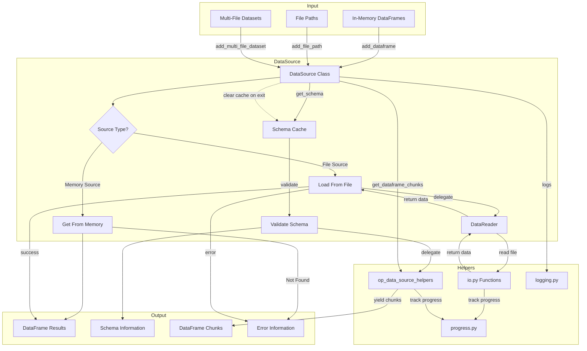

# Data Source Module Documentation

## Overview

The `op_data_source.py` module provides a standardized abstraction layer for accessing and manipulating data from various sources within the PAMOLA.CORE framework. As the primary interface between operations and data, it ensures consistent data access regardless of the underlying storage format, allowing operations to focus on their specific tasks without needing to handle the complexities of data loading and format management.

## Key Features

- **Unified Data Interface**: Seamless access to data from DataFrames in memory or various file formats
- **Format Agnostic**: Automatic detection and handling of CSV, Parquet, Excel, JSON, and other formats
- **Schema Validation**: Comprehensive data schema validation and compatibility checking
- **Memory Optimization**: Efficient handling of large datasets through chunking and memory management
- **Multi-file Support**: Ability to work with and combine multiple files as a single logical dataset
- **Transparent Encryption**: Integrated support for encrypted data sources through the crypto utilities
- **Progress Tracking**: Built-in progress reporting for long-running operations
- **Rich Error Handling**: Standardized error reporting with detailed diagnostic information

## Architecture

The `DataSource` class serves as a central component in the PAMOLA.CORE operations framework, interfacing between operations and various data utilities:

```
┌──────────────────────────────────────────────────────────────┐
│                  PAMOLA.CORE Architecture                    │
└──────────────────────────────────────────────────────────────┘
                              │
                              ▼
┌──────────────────────────────────────────────────────────────┐
│                     Core Utilities                           │
│                                                              │
│  ┌──────────┐  ┌──────────┐  ┌────────────┐  ┌──────────┐    │
│  │ logging  │  │    io    │  │  progress  │  │   other  │    │
│  │   .py    │  │   .py    │  │    .py     │  │   utils  │    │
│  └──────────┘  └──────────┘  └────────────┘  └──────────┘    │
│        ▲              ▲              ▲                       │
└────────┼──────────────┼──────────────┼───────────────────────┘
         │              │              │
┌────────┼──────────────┼──────────────┼───────────────────────┐
│        │              │              │ Operation Framework   │
│        │              │              │                       │
│  ┌─────┴──────────────┴──────────────┴─────┐  ┌────────────┐ │
│  │         DataSource (This Module)        │  │op_registry │ │
│  │         op_data_source.py               │  │    .py     │ │
│  └───────────────────────────────────┬─────┘  └────────────┘ │
│                        ▲              │                       │
│                        │              │                       │
│  ┌────────────────┐    │              │    ┌────────────┐    │
│  │  DataReader    │◄───┘              └───►│  op_base   │    │
│  │op_data_reader.py                        │    .py     │    │
│  └────────────────┘                        └────────────┘    │
│                                                 ▲            │
└─────────────────────────────────────────────────┼────────────┘
                                                  │
┌────────────────────────────────────────────────┼────────────┐
│                Core Operations                  │            │
│                                                 │            │
│  ┌─────────────┐ ┌────────────┐  ┌─────────────┴─┐ ┌───────┐│
│  │Anonymization│ │ Profiling  │  │    Metrics    │ │Attack ││
│  │ Operations  │ │ Operations │  │   Operations  │ │ Sim   ││
│  └─────────────┘ └────────────┘  └───────────────┘ └───────┘│
└──────────────────────────────────────────────────────────────┘
```

## Data Flow

The following diagram illustrates how data flows through the DataSource component:



## Key Methods and Parameters

### Constructor and Pamola Core Methods

| Method | Description | Parameters | Returns |
|--------|-------------|------------|---------|
| `__init__()` | Initializes a DataSource | `dataframes`: Dict of named DataFrames (optional)<br>`file_paths`: Dict of named file paths (optional) | - |
| `__enter__()` | Support for context manager protocol | - | DataSource instance |
| `__exit__()` | Clean up resources when exiting context | `exc_type`, `exc_val`, `exc_tb`: Exception info | bool |

### Data Management Methods

| Method | Description | Parameters | Returns |
|--------|-------------|------------|---------|
| `add_dataframe()` | Add a DataFrame to the data source | `name`: Name for the DataFrame<br>`df`: The DataFrame to add | - |
| `add_file_path()` | Add a file path to the data source | `name`: Name for the file<br>`path`: Path to the file | - |
| `add_multi_file_dataset()` | Add a multi-file dataset | `name`: Name for the dataset<br>`file_paths`: List of file paths<br>`load`: Whether to load immediately<br>`columns`: Columns to load<br>`min_valid_files`: Minimum required files<br>`error_on_empty`: Whether to raise error if empty<br>`encoding`, `delimiter`, `quotechar`: File format options<br>`encryption_key`: Key for encrypted files<br>`show_progress`: Whether to display progress | - |
| `release_dataframe()` | Release a DataFrame from memory | `name`: Name of the DataFrame to release | bool: Success |

### Data Access Methods

| Method | Description | Parameters | Returns |
|--------|-------------|------------|---------|
| `get_dataframe()` | Get a DataFrame by name | `name`: DataFrame name<br>`load_if_path`: Load from file if needed<br>`columns`: Columns to include<br>`nrows`: Max rows to read<br>`skiprows`: Rows to skip<br>`encoding`, `delimiter`, `quotechar`: File format options<br>`use_dask`: Whether to use Dask<br>`memory_limit`: Auto-switch to Dask threshold<br>`encryption_key`: Key for encrypted files<br>`show_progress`: Whether to display progress<br>`validate_schema`: Schema to validate against | (DataFrame or None, error_info or None) |
| `get_file_path()` | Get a file path by name | `name`: Name of the file | Path or None |
| `get_dataframe_chunks()` | Get chunks of a DataFrame | `name`: DataFrame name<br>`chunk_size`: Size of each chunk<br>`columns`: Columns to include<br>`encoding`, `delimiter`, `quotechar`: File format options<br>`encryption_key`: Key for encrypted files<br>`show_progress`: Whether to display progress | Generator[DataFrame] |

### Schema and Analysis Methods

| Method | Description | Parameters | Returns |
|--------|-------------|------------|---------|
| `get_schema()` | Get schema information | `name`: DataFrame name | Dict or None |
| `validate_schema()` | Validate a DataFrame's schema | `name`: DataFrame name<br>`expected_schema`: Expected schema | (bool, List[str]) |
| `analyze_dataframe()` | Analyze DataFrame structure | `name`: DataFrame name | Dict or None |
| `create_sample()` | Create a sample of a DataFrame | `name`: DataFrame name<br>`sample_size`: Number of rows<br>`random_seed`: Seed for reproducibility | (DataFrame or None, error_info or None) |

### Memory and Resource Methods

| Method | Description | Parameters | Returns |
|--------|-------------|------------|---------|
| `estimate_memory_usage()` | Estimate memory requirements | `name`: DataFrame or file name | Dict or None |
| `optimize_memory()` | Optimize memory usage | `threshold_percent`: Memory usage threshold | Dict |
| `get_encryption_info()` | Get file encryption info | `name`: File name | Dict or None |
| `get_file_metadata()` | Get file metadata | `name`: File name | Dict or None |
| `get_task_encryption_key()` | Get encryption key for a task | `task_id`: ID of the task | Dict or None |

### Factory Methods

| Method | Description | Parameters | Returns |
|--------|-------------|------------|---------|
| `from_dataframe()` | Create from a DataFrame | `df`: Source DataFrame<br>`name`: Name for the DataFrame | DataSource |
| `from_file_path()` | Create from a file path | `path`: Path to the file<br>`name`: Name for the file<br>`load`: Whether to load immediately | DataSource |
| `from_multi_file_dataset()` | Create from multiple files | `paths`: List of file paths<br>`name`: Name for the dataset<br>`load`: Whether to load immediately<br>`encoding`, `delimiter`, `quotechar`: File format options<br>`encryption_key`: Key for encrypted files<br>`show_progress`: Whether to display progress | DataSource |

## Usage Examples

### Basic Usage with In-Memory DataFrames

```python
import pandas as pd
from pamola_core.utils.ops.op_data_source import DataSource

# Create a DataFrame
df = pd.DataFrame({
    'id': [1, 2, 3, 4, 5],
    'name': ['Alice', 'Bob', 'Charlie', 'David', 'Eve'],
    'salary': [50000, 60000, 55000, 65000, 70000]
})

# Create a DataSource from the DataFrame
data_source = DataSource.from_dataframe(df, name="employees")

# Access the DataFrame
employees_df, error_info = data_source.get_dataframe("employees")
if employees_df is not None:
    print(f"Number of employees: {len(employees_df)}")
else:
    print(f"Error: {error_info['message']}")
```

### Working with File Paths

```python
from pathlib import Path
from pamola_core.utils.ops.op_data_source import DataSource

# Create a DataSource with a file path
data_source = DataSource.from_file_path("data/employees.csv", name="employees", load=True)

# Access the loaded DataFrame
employees_df, error_info = data_source.get_dataframe("employees")

# Add another file path without loading
data_source.add_file_path("departments", "data/departments.csv")

# Load it on demand with specific parameters
departments_df, error_info = data_source.get_dataframe(
    "departments", 
    encoding="utf-8", 
    delimiter=",", 
    columns=["dept_id", "dept_name"]
)
```

### Processing Large DataFrames in Chunks

```python
from pamola_core.utils.ops.op_data_source import DataSource
import pandas as pd

# Create a large DataFrame
large_df = pd.DataFrame({
    'id': range(1, 100001),
    'value': [i * 2 for i in range(1, 100001)]
})

# Create a DataSource
data_source = DataSource.from_dataframe(large_df, name="large_data")

# Process the DataFrame in chunks
total_sum = 0
for chunk in data_source.get_dataframe_chunks("large_data", chunk_size=10000):
    # Process each chunk
    chunk_sum = chunk['value'].sum()
    total_sum += chunk_sum
    print(f"Processed chunk with {len(chunk)} rows, chunk sum: {chunk_sum}")

print(f"Total sum: {total_sum}")
```

### Working with Multiple Files

```python
from pathlib import Path
from pamola_core.utils.ops.op_data_source import DataSource

# List of CSV files containing monthly data
monthly_files = [
    "data/january.csv",
    "data/february.csv",
    "data/march.csv"
]

# Create a DataSource for the multi-file dataset
data_source = DataSource.from_multi_file_dataset(
    paths=monthly_files, 
    name="quarterly_data", 
    load=True,
    encoding="utf-8",
    delimiter=","
)

# Access the combined DataFrame
quarterly_df, error_info = data_source.get_dataframe("quarterly_data")
if quarterly_df is not None:
    print(f"Total records across all months: {len(quarterly_df)}")
```

### Using Context Manager for Resource Cleanup

```python
from pamola_core.utils.ops.op_data_source import DataSource
import pandas as pd

# Create a large DataFrame
large_df = pd.DataFrame({
    'id': range(1, 100001),
    'value': [i * 2 for i in range(1, 100001)]
})

# Use DataSource with context manager
with DataSource.from_dataframe(large_df, name="large_data") as data_source:
    # Perform operations
    for chunk in data_source.get_dataframe_chunks("large_data", chunk_size=10000):
        # Process each chunk
        print(f"Processing chunk with {len(chunk)} rows")
    
    # Resources will be automatically cleaned up when exiting the context
```

### Schema Validation

```python
from pamola_core.utils.ops.op_data_source import DataSource
import pandas as pd

# Create a DataFrame
df = pd.DataFrame({
    'id': [1, 2, 3],
    'name': ['Alice', 'Bob', 'Charlie'],
    'age': [25, 30, 35]
})

# Create a DataSource
data_source = DataSource.from_dataframe(df, name="users")

# Define expected schema
expected_schema = {
    'columns': ['id', 'name', 'age', 'email'],  # Note: 'email' is missing in the actual DataFrame
    'dtypes': {
        'id': 'int64',
        'name': 'object',
        'age': 'int64',
        'email': 'object'
    },
    'constraints': [
        {'type': 'non_null', 'column': 'id'},
        {'type': 'unique', 'column': 'id'}
    ]
}

# Validate schema
is_valid, errors = data_source.validate_schema("users", expected_schema)

if not is_valid:
    print("Schema validation failed:")
    for error in errors:
        print(f"- {error}")
```

### Memory Optimization and Analysis

```python
from pamola_core.utils.ops.op_data_source import DataSource
import pandas as pd
import numpy as np

# Create several DataFrames with different sizes
df1 = pd.DataFrame({'id': range(1000000), 'data': np.random.random(1000000)})
df2 = pd.DataFrame({'id': range(500000), 'data': np.random.random(500000)})

# Create a DataSource with both DataFrames
data_source = DataSource()
data_source.add_dataframe("large", df1)
data_source.add_dataframe("medium", df2)

# Analyze a DataFrame
analysis = data_source.analyze_dataframe("large")
print(f"Memory usage: {analysis['memory_usage']['total_mb']:.2f} MB")
print(f"Potential optimizations: {len(analysis['potential_optimizations'])}")

# Optimize memory usage when it exceeds 70% threshold
result = data_source.optimize_memory(threshold_percent=70.0)
print(f"Memory optimization status: {result['status']}")
print(f"Released DataFrames: {result['released_dataframes']}")
print(f"Initial memory: {result['initial_memory']['total_mb']:.2f} MB")
print(f"Final memory: {result['final_memory']['total_mb']:.2f} MB")
```

## Limitations and Considerations

1. **Memory Management**: DataFrames are kept in memory by default, which can lead to high memory usage for large datasets. Use chunking or the `release_dataframe()` method to manage memory.

2. **File Format Support**: Only specific file formats are supported out of the box. For custom formats, the integration with `io.py` needs to be extended.

3. **Encryption Performance**: Encrypted file operations involve temporary file creation, which can impact performance for large files or frequent operations.

4. **Schema Evolution**: Changes to data schemas are not automatically tracked over time. Implement version control for evolving schemas if needed.

5. **Concurrent Access**: No built-in file locking mechanisms for concurrent access from multiple processes. External synchronization might be needed.

6. **Error Propagation**: Error information is returned alongside results rather than raised as exceptions, requiring explicit error handling in client code.

## Best Practices

1. **Use Factory Methods**: Prefer using factory methods (`from_dataframe()`, `from_file_path()`, etc.) for cleaner and more readable code.

2. **Context Managers**: Use the DataSource with context managers (`with` statement) to ensure proper resource cleanup.

3. **Chunk Large Datasets**: Always use `get_dataframe_chunks()` when processing large datasets to manage memory efficiently.

4. **Validate Early**: Validate schemas before processing to catch data inconsistencies early and prevent downstream errors.

5. **Release Resources**: Explicitly call `release_dataframe()` for large DataFrames when they are no longer needed.

6. **Check Error Information**: Always check the error_info returned from methods to handle errors properly.

7. **Optimize Memory**: Use `optimize_memory()` periodically during long-running operations with multiple large datasets.

8. **Consistent Naming**: Use consistent naming conventions for dataframes, file paths, and datasets within your application.

9. **Parameterize Format Options**: Explicitly specify encoding, delimiter, and other format options to ensure consistent data loading across environments.

10. **Delegate File Operations**: Never bypass the DataSource abstraction for file operations to maintain consistency and benefit from centralized error handling and progress tracking.