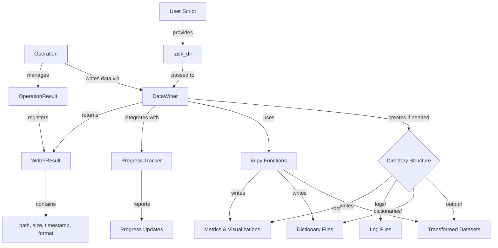

# PAMOLA.CORE Data Writer Module Documentation

## 1. Purpose and Overview

The PAMOLA.CORE Data Writer module (`op_data_writer.py`) provides a unified and consistent interface for writing operation outputs within the PAMOLA privacy-preserving data processing framework. It serves as the standardized mechanism for all operations to save their results, metrics, visualizations, and dictionaries while maintaining a consistent directory structure and supporting essential features like encryption, progress tracking, and memory-efficient handling of large datasets.

The Data Writer functions as the companion to the Data Reader module, completing the I/O subsystem for operations within PAMOLA.CORE. While operations focus on their specific privacy-enhancing transformation logic, the Data Writer handles all file output concerns, ensuring that artifacts are stored in the correct locations with proper metadata, encryption, and format handling.

## 2. Key Features

- **Standardized Directory Structure**: Automatically creates and maintains the `task_dir` structure with designated subdirectories for outputs, dictionaries, and logs
- **Multiple Format Support**: Handles various formats including CSV, Parquet, JSON, and visualizations
- **Encryption Integration**: Seamless encryption of sensitive outputs using the PAMOLA.CORE encryption subsystem
- **Large Dataset Support**: Special handling for Dask DataFrames with automatic partitioning for memory efficiency
- **Progress Tracking**: Integration with the PAMOLA.CORE progress tracking system for long-running operations
- **Automatic Timestamping**: Optional timestamp inclusion in filenames for versioning and audit purposes
- **Rich Result Objects**: Returns detailed metadata about written files including paths, sizes, and timestamps
- **Metrics Enrichment**: Automatic metadata addition to metrics files for better traceability
- **Consistent Error Handling**: Standardized error reporting and logging

## 3. Architecture

### Integration Architecture

The DataWriter is positioned as a pamola core utility within the PAMOLA.CORE operations framework, serving as the standardized output mechanism for all operation types:

```
┌────────────────────────────────────────────────────────────────┐
│                      User-Level Scripts                        │
└─────────────────────────────────┬──────────────────────────────┘
                                  │
                                  ▼
┌────────────────────────────────────────────────────────────────┐
│                     Operations Framework                       │
│  ┌─────────────────┐ ┌────────────────┐ ┌───────────────────┐  │
│  │   BaseOperation │ │ OperationResult│ │  OperationRegistry│  │
│  └────────┬────────┘ └───────┬────────┘ └──────────┬────────┘  │
│           │                  │                     │           │
└───────────┼──────────────────┼─────────────────────┼───────────┘
            │                  │                     │
            ▼                  ▼                     ▼
┌───────────────────────────────────────────────────────────────┐
│                     Core Utility Modules                      │
│  ┌────────────┐  ┌────────────┐  ┌─────────────┐  ┌─────────┐ │
│  │DataWriter  │◄─┤DataReader  │  │Visualization│  │Progress │ │
│  └─────┬──────┘  └────────────┘  └─────────────┘  └─────────┘ │
│        │                                                       │
│        ▼                                                       │
│  ┌────────────────────────────────────────────────────────┐   │
│  │                       io.py                            │   │
│  └────────────────────────────────────────────────────────┘   │
└───────────────────────────────────────────────────────────────┘
```

### Component Architecture

The DataWriter is built as a class with specialized methods for different data types, all utilizing the underlying I/O subsystem:

```
┌─────────────────────────────────────────────────────────────┐
│                    DataWriter Class                         │
│                                                             │
│  ┌─────────────────────┐  ┌────────────────────────────┐    │
│  │ Core Methods        │  │ Specialized Methods        │    │
│  │                     │  │                            │    │
│  │ ◆ write_dataframe() │  │ ◆ write_metrics()          │    │
│  │ ◆ write_json()      │  │ ◆ write_dictionary()       │    │
│  │ ◆ write_visualization│  │ ◆ append_to_json_array()  │    │
│  │                     │  │ ◆ merge_json_objects()     │    │
│  └─────────────────────┘  └────────────────────────────┘    │
│                                                             │
│  ┌─────────────────────┐  ┌────────────────────────────┐    │
│  │ Helper Methods      │  │ Result & Error Types       │    │
│  │                     │  │                            │    │
│  │ ◆ _ensure_directories│ │ ◆ WriterResult            │    │
│  │ ◆ _get_output_path() │ │ ◆ DataWriteError          │    │
│  │ ◆ _write_dask_dataframe│                           │    │
│  │ ◆ _get_caller_info() │  │                            │    │
│  └─────────────────────┘  └────────────────────────────┘    │
└─────────────────────────────────────────────────────────────┘
```

### Data Flow



## 4. Pamola Core API Reference

| Method | Description | Key Parameters | Returns |
|--------|-------------|----------------|---------|
| `__init__()` | Initialize a DataWriter instance | `task_dir`: Base directory for outputs<br>`logger`: Logger instance<br>`progress_tracker`: Optional progress tracker | None |
| `write_dataframe()` | Write a DataFrame to a file | `df`: DataFrame or Dask DataFrame<br>`name`: Base filename<br>`format`: Output format (csv, parquet)<br>`subdir`: Subdirectory (default: "output")<br>`timestamp_in_name`: Whether to add timestamp<br>`encryption_key`: Optional encryption key | `WriterResult` |
| `write_json()` | Write a JSON object to a file | `data`: JSON-serializable data<br>`name`: Base filename<br>`subdir`: Optional subdirectory<br>`timestamp_in_name`: Whether to add timestamp<br>`encryption_key`: Optional encryption key<br>`pretty`: Whether to format with indentation | `WriterResult` |
| `write_visualization()` | Save a visualization to a file | `figure`: Visualization figure<br>`name`: Base filename<br>`subdir`: Optional subdirectory<br>`format`: Output format (png, svg, etc.)<br>`timestamp_in_name`: Whether to add timestamp<br>`encryption_key`: Optional encryption key | `WriterResult` |
| `write_dictionary()` | Save a dictionary to the dictionaries/ dir | `data`: Dictionary to save<br>`name`: Base filename<br>`format`: Output format (json, csv, parquet)<br>`timestamp_in_name`: Whether to add timestamp<br>`encryption_key`: Optional encryption key | `WriterResult` |
| `write_metrics()` | Save metrics to the root task directory | `metrics`: Metrics data<br>`name`: Base filename<br>`timestamp_in_name`: Whether to add timestamp (default: True)<br>`encryption_key`: Optional encryption key | `WriterResult` |
| `append_to_json_array()` | Append an item to a JSON array file | `item`: Item to append<br>`name`: Filename of JSON array<br>`subdir`: Optional subdirectory<br>`encryption_key`: Optional encryption key<br>`create_if_missing`: Create file if not exists | `WriterResult` |
| `merge_json_objects()` | Merge data with an existing JSON file | `data`: Data to merge<br>`name`: Filename<br>`subdir`: Optional subdirectory<br>`encryption_key`: Optional encryption key<br>`recursive_merge`: Whether to merge nested objects | `WriterResult` |

## 5. Usage Examples

### Basic DataFrame Writing

```python
from pamola_core.utils.ops.op_data_writer import DataWriter
import pandas as pd

# Sample data
df = pd.DataFrame({
    'id': range(1, 101),
    'name': [f"User_{i}" for i in range(1, 101)],
    'value': [i * 10 for i in range(1, 101)]
})

# Initialize a writer with task directory
writer = DataWriter(task_dir="/path/to/task_001")

# Write the DataFrame as CSV to task_dir/output/users.csv
result = writer.write_dataframe(
    df=df,
    name="users",
    format="csv",
    # subdir="output" is default
    timestamp_in_name=False
)

print(f"CSV written to {result.path}, size: {result.size_bytes} bytes")

# Write the same DataFrame as Parquet with encryption
encrypted_result = writer.write_dataframe(
    df=df,
    name="users_encrypted",
    format="parquet",
    encryption_key="secure_encryption_key_123",
    timestamp_in_name=True
)

print(f"Encrypted Parquet written to {encrypted_result.path}")
```

### Writing Metrics and Visualizations

```python
import matplotlib.pyplot as plt
from pamola_core.utils.ops.op_data_writer import DataWriter

# Initialize a writer
writer = DataWriter(task_dir="/path/to/task_002")

# Create a sample visualization
plt.figure(figsize=(10, 6))
plt.bar(['A', 'B', 'C', 'D'], [10, 25, 15, 30])
plt.title("Sample Metrics")
plt.ylabel("Values")
plt.tight_layout()

# Save the visualization to task_dir/metric_chart.png
viz_result = writer.write_visualization(
    figure=plt.gcf(),
    name="metric_chart",
    format="png"
)

# Collect metrics from an operation
metrics = {
    "counts": {"A": 10, "B": 25, "C": 15, "D": 30},
    "statistics": {
        "mean": 20,
        "median": 17.5,
        "std_dev": 8.66
    },
    "quality_score": 0.85
}

# Save metrics to task_dir/operation_metrics_TIMESTAMP.json
metrics_result = writer.write_metrics(
    metrics=metrics,
    name="operation_metrics"
    # timestamp_in_name=True is default for metrics
)

print(f"Metrics saved to {metrics_result.path}")
```

### Working with Dictionaries and JSON

```python
from pamola_core.utils.ops.op_data_writer import DataWriter

# Initialize a writer
writer = DataWriter(task_dir="/path/to/task_003")

# Create a frequency dictionary
frequency_dict = {
    "apple": 523,
    "banana": 378,
    "cherry": 412,
    "date": 89,
    "elderberry": 42
}

# Save to dictionaries/frequency_counts.json
dict_result = writer.write_dictionary(
    data=frequency_dict,
    name="frequency_counts",
    format="json"
)

# Create a log entry
log_entry = {
    "timestamp": "2025-05-03T14:32:15",
    "operation": "text_anonymization",
    "fields_processed": 12,
    "records_affected": 156
}

# Append to an operation log array
writer.append_to_json_array(
    item=log_entry,
    name="operation_log",
    create_if_missing=True
)

# Update configuration
config_updates = {
    "anonymization": {
        "level": "high",
        "fields": ["name", "address", "phone"]
    }
}

# Merge with existing configuration
writer.merge_json_objects(
    data=config_updates,
    name="configuration",
    create_if_missing=True,
    recursive_merge=True
)
```

### Integration with Progress Tracking

```python
from pamola_core.utils.ops.op_data_writer import DataWriter
from pamola_core.utils.progress import HierarchicalProgressTracker
import pandas as pd

# Initialize a progress tracker
progress = HierarchicalProgressTracker(
    total=100,
    description="Processing Dataset",
    unit="steps"
)

# Initialize a writer with the progress tracker
writer = DataWriter(
    task_dir="/path/to/task_004",
    progress_tracker=progress
)

# Generate a large DataFrame
df = pd.DataFrame({
    'id': range(1, 100001),
    'data': [f"Data_{i}" for i in range(1, 100001)],
    'value': [i * 0.1 for i in range(1, 100001)]
})

# The writer will create progress subtasks for the writing operation
# and update the main progress tracker automatically
result = writer.write_dataframe(
    df=df,
    name="large_dataset",
    format="parquet",
    timestamp_in_name=True
)

progress.update(100, {"status": "complete"})
progress.close()
```

### Handling Dask DataFrames

```python
import dask.dataframe as dd
import pandas as pd
from pamola_core.utils.ops.op_data_writer import DataWriter

# Initialize a writer
writer = DataWriter(task_dir="/path/to/task_005")

# Create a Dask DataFrame from pandas
pdf = pd.DataFrame({
    'id': range(1, 1000001),
    'value': [i * 0.5 for i in range(1, 1000001)]
})
ddf = dd.from_pandas(pdf, npartitions=10)

# For small Dask DataFrames, the writer will convert to pandas
small_result = writer.write_dataframe(
    df=ddf.head(10000, compute=False),  # Still a Dask DataFrame
    name="small_dask_data",
    format="csv"
)

# For large Dask DataFrames, the writer will use partitioned output
large_result = writer.write_dataframe(
    df=ddf,
    name="large_dask_data",
    format="parquet"
)

# For CSV with many partitions, files are written as part-*.csv
# For Parquet, a directory of parquet files is created
print(f"Dask DataFrame written to directory: {large_result.path}")
```

## 6. Limitations and Best Practices

### Current Limitations

1. **Encryption for Partitioned Outputs**: When writing large Dask DataFrames with partitioning, encryption is not fully supported for each partition file. For highly sensitive data requiring encryption, consider materializing the Dask DataFrame first.

2. **Progress Tracking Granularity**: Progress reporting for Dask DataFrames is estimation-based and doesn't track each partition's progress individually.

3. **Format Support**: Currently focused on CSV, Parquet, and JSON. Other formats like Excel, HDF5, or database connections require custom handling.

4. **Streaming Writes**: No true streaming write support for continuous data generation scenarios.

5. **Distributed Storage**: No direct integration with cloud storage (S3, Azure Blob, etc.) - relies on local filesystem.

### Best Practices

#### Directory Structure

1. **Consistent Task Directories**: Always organize related operations under the same parent task directory for proper artifact linking.

2. **Task Directory Naming**: Use clear naming conventions for task directories that reflect the processing pipeline stage (e.g., `task_001_profiling`, `task_002_anonymization`).

3. **Legacy File Handling**: If there might be legacy files from previous runs, use `timestamp_in_name=True` to avoid unexpected overwrites.

#### Data Safety

1. **Encryption Usage**: Always use encryption for sensitive data files, especially:
   - Original data with identifiers
   - Intermediate files with quasi-identifiers
   - Linkage or mapping dictionaries
   
2. **Key Management**: Never hardcode encryption keys in scripts. Use environment variables or a secure key management system.

3. **Secure Deletion**: If temporary files are created, ensure they are securely deleted after use.

#### Performance Optimization

1. **Format Selection**:
   - CSV: Use for interoperability, human-readability, or when required by downstream systems
   - Parquet: Prefer for large datasets, complex schemas, or when further processing is needed
   - JSON: Best for configuration, metrics, and metadata

2. **Large Dataset Handling**:
   - For datasets >100MB, prefer Parquet over CSV for both speed and size
   - For datasets >1GB, consider using Dask DataFrames with partitioning
   - When working with large datasets, use `timestamp_in_name=False` to avoid unnecessary file copies

3. **Memory Efficiency**:
   - For very large files, process data in chunks using DataReader and write incrementally
   - Monitor memory usage during writes and consider Dask if memory pressure is high

#### Integration Patterns

1. **Operation Integration**:
   ```python
   # In your operation's execute() method:
   def execute(self, data_source, task_dir, **kwargs):
       # Initialize the writer
       writer = DataWriter(task_dir, self.logger, self.progress_tracker)
       
       # Process data
       result_df = self.process_data(data_source.get_dataframe())
       
       # Write the transformed data
       output_result = writer.write_dataframe(result_df, "transformed_data")
       
       # Generate and write metrics
       metrics = self.calculate_metrics(result_df)
       metrics_result = writer.write_metrics(metrics, "operation_metrics")
       
       # Register artifacts with operation result
       operation_result = OperationResult()
       operation_result.register_artifact(output_result.path, "output_data")
       operation_result.register_artifact(metrics_result.path, "metrics")
       
       return operation_result
   ```

2. **Error Handling**:
   ```python
   try:
       result = writer.write_dataframe(df, "data")
   except DataWriteError as e:
       self.logger.error(f"Failed to write data: {e}")
       # Implement fallback strategy or graceful failure
   ```

3. **Progress Integration**:
   - Share a single progress tracker between operations and the writer
   - For long-running operations, create a dedicated subtask for the write phase

By following these guidelines, you can ensure optimal use of the DataWriter module within the PAMOLA.CORE framework, with proper handling of performance, security, and integration concerns.