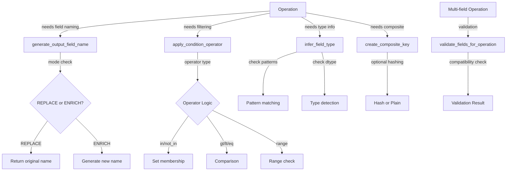

# PAMOLA.CORE Field Utilities Module Documentation

## 1. Purpose and Overview

The PAMOLA.CORE Field Utilities module (`op_field_utils.py`) provides essential field manipulation utilities for the PAMOLA privacy-preserving data processing framework. It standardizes field naming conventions, conditional operations, field type inference, and cross-field operations across all operation types within the framework.

The Field Utilities module serves as a foundational component of the PAMOLA.CORE operations framework, ensuring consistent field handling, naming conventions, and manipulation capabilities. This standardization is crucial for maintaining interoperability between different operations and enabling complex multi-field workflows.

## 2. Key Features

- **Standardized Field Naming**: Consistent output field name generation for REPLACE/ENRICH modes
- **Universal Conditional Operators**: Comprehensive set of operators for field filtering and conditions
- **Field Type Inference**: Automatic detection of field types including patterns (email, phone, IP, etc.)
- **K-Anonymity Support**: Specialized field name generation for k-anonymity metrics
- **Cross-Field Operations**: Support for composite keys and multi-field conditions
- **Field Compatibility Validation**: Validation of field compatibility for various operations
- **Basic Statistics**: Field-agnostic statistics collection
- **Privacy Metrics Integration**: Standardized naming for privacy-related metric fields

## 3. Architecture

### Integration Architecture

The Field Utilities module is positioned as a core utility within the PAMOLA.CORE operations framework, providing field manipulation capabilities to all operation types:

```
┌────────────────────────────────────────────────────────────────┐
│                      User-Level Scripts                        │
└─────────────────────────────────┬──────────────────────────────┘
                                  │
                                  ▼
┌────────────────────────────────────────────────────────────────┐
│                     Operations Framework                       │
│  ┌─────────────────┐ ┌────────────────┐ ┌───────────────────┐  │
│  │   BaseOperation │ │ OperationResult│ │  OperationRegistry│  │
│  └────────┬────────┘ └───────┬────────┘ └──────────┬────────┘  │
│           │                  │                     │           │
└───────────┼──────────────────┼─────────────────────┼───────────┘
            │                  │                     │
            ▼                  ▼                     ▼
┌───────────────────────────────────────────────────────────────┐
│                     Core Utility Modules                      │
│  ┌────────────┐  ┌─────────────────┐  ┌────────────────────┐  │
│  │Field Utils │  │Data Processing  │  │OperationConfig     │  │
│  └─────┬──────┘  └────────┬────────┘  └───────┬────────────┘  │
│        │                  │                   │               │
│        ▼                  ▼                   ▼               │
│  ┌─────────────────────────────────────────────────────────┐  │
│  │           Operations (Anonymization, Profiling, etc.)   │  │
│  └─────────────────────────────────────────────────────────┘  │
└───────────────────────────────────────────────────────────────┘
```

### Component Architecture

The Field Utilities module consists of several functional groups:

```
┌─────────────────────────────────────────────────────────────┐
│                    Field Utilities Module                   │
│                                                             │
│  ┌─────────────────────┐  ┌────────────────────────────┐    │
│  │ Naming Functions    │  │ Conditional Operations     │    │
│  │                     │  │                            │    │
│  │ ◆ generate_output_  │  │ ◆ apply_condition_         │    │
│  │   field_name()      │  │   operator()               │    │
│  │ ◆ generate_ka_      │  │ ◆ create_field_mask()      │    │
│  │   field_name()      │  │ ◆ create_multi_field_      │    │
│  │ ◆ generate_privacy_ │  │   mask()                   │    │
│  │   metric_field_name │  │                            │    │
│  └─────────────────────┘  └────────────────────────────┘    │
│                                                             │
│  ┌─────────────────────┐  ┌────────────────────────────┐    │
│  │ Type & Validation   │  │ Cross-Field Operations     │    │
│  │                     │  │                            │    │
│  │ ◆ infer_field_type()│  │ ◆ create_composite_key()   │    │
│  │ ◆ validate_field_   │  │ ◆ create_reversible_       │    │
│  │   compatibility()   │  │   composite_key()          │    │
│  │ ◆ get_field_        │  │ ◆ validate_fields_for_     │    │
│  │   statistics()      │  │   operation()              │    │
│  └─────────────────────┘  └────────────────────────────┘    │
└─────────────────────────────────────────────────────────────┘
```

### Data Flow



## 4. Core API Reference

### Field Naming Functions

|Function|Description|Key Parameters|Returns|
|---|---|---|---|
|`generate_output_field_name()`|Generate standardized output field name|`field_name`: Original field<br>`mode`: "REPLACE" or "ENRICH"<br>`output_field_name`: Explicit name<br>`operation_suffix`: Suffix for ENRICH<br>`column_prefix`: Prefix for new fields|`str`: Output field name|
|`generate_ka_field_name()`|Generate k-anonymity metric field name|`quasi_identifiers`: List of QI fields<br>`prefix`: Field prefix<br>`max_length`: Chars per identifier<br>`separator`: Between abbreviations|`str`: KA field name|
|`generate_privacy_metric_field_name()`|Generate privacy metric field name|`field_name`: Base field<br>`metric_type`: Type of metric<br>`quasi_identifiers`: For k-anonymity|`str`: Metric field name|

### Conditional Operations Functions

|Function|Description|Key Parameters|Returns|
|---|---|---|---|
|`apply_condition_operator()`|Apply conditional operator to series|`series`: Data to filter<br>`condition_values`: Values for condition<br>`operator`: Operator type|`pd.Series`: Boolean mask|
|`create_field_mask()`|Create boolean mask for field processing|`df`: DataFrame<br>`field_name`: Field to mask<br>`condition_field`: Field for condition<br>`condition_values`: Values<br>`condition_operator`: Operator|`pd.Series`: Boolean mask|
|`create_multi_field_mask()`|Create mask from multiple conditions|`df`: DataFrame<br>`conditions`: List of conditions<br>`logic`: "AND" or "OR"|`pd.Series`: Boolean mask|

### Field Analysis Functions

|Function|Description|Key Parameters|Returns|
|---|---|---|---|
|`infer_field_type()`|Infer semantic type of field|`series`: Field to analyze<br>`check_patterns`: Check for patterns<br>`sample_size`: Rows to sample|`str`: Field type|
|`validate_field_compatibility()`|Validate compatibility between fields|`source_field`: Source series<br>`target_field`: Target series<br>`operation_type`: Type of operation|`Dict[str, Any]`: Validation result|
|`get_field_statistics()`|Get basic field statistics|`series`: Field to analyze<br>`include_percentiles`: Include percentiles|`Dict[str, Any]`: Statistics|

### Cross-Field Operations Functions

|Function|Description|Key Parameters|Returns|
|---|---|---|---|
|`create_composite_key()`|Create composite key from fields|`df`: DataFrame<br>`fields`: Fields to combine<br>`separator`: Between values<br>`null_handling`: Null strategy<br>`hash_key`: Whether to hash<br>`hash_algorithm`: Hash type|`pd.Series`: Composite keys|
|`create_reversible_composite_key()`|Create reversible encoded key|`df`: DataFrame<br>`fields`: Fields to combine<br>`encoding`: "base64" or "hex"|`Tuple[pd.Series, Dict]`: (keys, decoding_info)|
|`validate_fields_for_operation()`|Validate fields for cross-field ops|`df`: DataFrame<br>`fields`: List of fields<br>`operation_type`: Operation type|`Dict[str, Any]`: Validation result|

## 5. Usage Examples

### Basic Field Naming

```python
from pamola_core.utils.ops.op_field_utils import generate_output_field_name

# REPLACE mode - returns original field name
output_field = generate_output_field_name("salary", "REPLACE")
print(output_field)  # "salary"

# ENRICH mode - generates new field name
output_field = generate_output_field_name(
    "salary", 
    "ENRICH", 
    operation_suffix="masked"
)
print(output_field)  # "_salary_masked"

# ENRICH mode with explicit name
output_field = generate_output_field_name(
    "salary", 
    "ENRICH", 
    output_field_name="salary_anonymized"
)
print(output_field)  # "salary_anonymized"
```

### K-Anonymity Field Naming

```python
from pamola_core.utils.ops.op_field_utils import generate_ka_field_name, generate_privacy_metric_field_name

# Generate k-anonymity field name
quasi_identifiers = ["age", "city", "postal_code"]
ka_field = generate_ka_field_name(quasi_identifiers)
print(ka_field)  # "KA_age_cit_pos"

# Generate privacy metric field name
risk_field = generate_privacy_metric_field_name("email", "risk_score")
print(risk_field)  # "email_risk_score"

# K-anonymity metric field
ka_metric = generate_privacy_metric_field_name(
    "", 
    "k_anonymity", 
    ["age", "salary_range"]
)
print(ka_metric)  # "KA_age_sal"
```

### Field Type Inference

```python
from pamola_core.utils.ops.op_field_utils import infer_field_type
import pandas as pd

# Email field detection
email_series = pd.Series(['user@example.com', 'test@domain.org', 'admin@site.net'])
field_type = infer_field_type(email_series)
print(field_type)  # "email"

# Numeric field detection
numeric_series = pd.Series([1, 2, 3, 4, 5])
field_type = infer_field_type(numeric_series)
print(field_type)  # "numeric"

# Phone number detection
phone_series = pd.Series(['555-1234', '555-5678', '555-9012'])
field_type = infer_field_type(phone_series)
print(field_type)  # "phone"
```

### Conditional Operations

```python
from pamola_core.utils.ops.op_field_utils import apply_condition_operator, create_field_mask
import pandas as pd

# Create sample data
df = pd.DataFrame({
    'age': [25, 30, 35, 40, 45],
    'salary': [30000, 45000, 60000, 75000, 90000],
    'department': ['IT', 'HR', 'IT', 'Finance', 'IT']
})

# Apply condition operator
age_series = df['age']
mask = apply_condition_operator(age_series, [30, 40], "in")
print(mask)  # [False, True, False, True, False]

# Range condition
mask = apply_condition_operator(age_series, [30, 40], "range")
print(mask)  # [False, True, True, True, False]

# Create field mask with condition on another field
mask = create_field_mask(
    df, 
    'salary',
    condition_field='department',
    condition_values=['IT'],
    condition_operator='in'
)
print(mask)  # [True, False, True, False, True]
```

### Composite Key Creation

```python
from pamola_core.utils.ops.op_field_utils import create_composite_key, create_reversible_composite_key
import pandas as pd

# Create sample data
df = pd.DataFrame({
    'city': ['New York', 'Los Angeles', 'Chicago'],
    'state': ['NY', 'CA', 'IL'],
    'postal_code': ['10001', '90001', '60601']
})

# Create simple composite key
composite = create_composite_key(df, ['city', 'state'])
print(composite)
# 0    New York_NY
# 1    Los Angeles_CA
# 2    Chicago_IL

# Create hashed composite key
hashed = create_composite_key(
    df, 
    ['city', 'state', 'postal_code'],
    hash_key=True,
    hash_algorithm='sha256'
)
print(hashed)  # SHA256 hashes

# Create reversible composite key
encoded, info = create_reversible_composite_key(df, ['city', 'state'])
print(encoded)  # Base64 encoded values
print(info)    # Decoding information
```

### Multi-Field Operations

```python
from pamola_core.utils.ops.op_field_utils import create_multi_field_mask, validate_fields_for_operation
import pandas as pd

# Create sample data
df = pd.DataFrame({
    'age': [25, 35, 45, 55],
    'income': [30000, 50000, 70000, 90000],
    'risk_score': [0.2, 0.5, 0.7, 0.9]
})

# Create multi-field mask
conditions = [
    {"field": "age", "operator": "gt", "values": [30]},
    {"field": "income", "operator": "ge", "values": [50000]},
    {"field": "risk_score", "operator": "lt", "values": [0.8]}
]

mask = create_multi_field_mask(df, conditions, logic="AND")
print(mask)  # [False, True, True, False]

# Validate fields for microaggregation
validation = validate_fields_for_operation(
    df,
    ['age', 'income'],
    'microaggregation'
)
print(validation)  # {'valid': True, 'issues': [], ...}
```

## 6. Limitations and Best Practices

### Current Limitations

1. **Pattern Matching**: Field type inference patterns are regex-based and may not catch all variations of data formats.
    
2. **Performance**: Pattern matching on large datasets can be slow; sampling is used to mitigate this.
    
3. **Composite Keys**: Large composite keys with many fields can consume significant memory.
    
4. **Type Inference**: Limited to common patterns; custom patterns require extension of FIELD_PATTERNS.
    

### Best Practices

#### Field Naming

1. **Consistent Prefixes**: Use consistent prefixes for enriched fields:
    
    ```python
    # Good: Consistent prefix
    column_prefix = "_anon_"
    
    # Bad: Varying prefixes
    column_prefix = "_" if simple else "__anonymized_"
    ```
    
2. **Descriptive Suffixes**: Use clear operation suffixes:
    
    ```python
    # Good: Clear what was done
    operation_suffix = "generalized"
    operation_suffix = "masked"
    
    # Bad: Unclear abbreviations
    operation_suffix = "gen"
    operation_suffix = "msk"
    ```
    

#### Conditional Operations

1. **Validate Inputs**: Always validate condition values:
    
    ```python
    # Good: Check before applying
    if condition_values and len(condition_values) > 0:
        mask = apply_condition_operator(series, condition_values, "in")
    
    # Bad: Assume values exist
    mask = apply_condition_operator(series, condition_values, "in")
    ```
    
2. **Handle Edge Cases**: Consider empty results:
    
    ```python
    # Good: Handle empty mask
    mask = create_field_mask(df, field_name, ...)
    if mask.sum() == 0:
        logger.warning("No records match the condition")
    ```
    

#### Type Inference

1. **Sample Size**: Use appropriate sample sizes:
    
    ```python
    # Good: Reasonable sample for large data
    field_type = infer_field_type(series, sample_size=1000)
    
    # Bad: Too small sample
    field_type = infer_field_type(series, sample_size=10)
    ```
    
2. **Fallback Handling**: Handle unknown types:
    
    ```python
    field_type = infer_field_type(series)
    if field_type == "unknown":
        # Use generic processing
        field_type = "string"  # Safe default
    ```
    

#### Cross-Field Operations

1. **Null Handling**: Choose appropriate null handling:
    
    ```python
    # For identifiers: skip nulls
    key = create_composite_key(df, fields, null_handling="skip")
    
    # For analytics: replace nulls
    key = create_composite_key(df, fields, null_handling="replace")
    ```
    
2. **Memory Efficiency**: Hash large composite keys:
    
    ```python
    # Good: Hash when many fields
    if len(fields) > 5:
        key = create_composite_key(df, fields, hash_key=True)
    ```
    

By following these guidelines, developers can effectively use the Field Utilities module to handle field operations consistently across the PAMOLA.CORE framework.

## 7. Version History

- **1.2.0** - Added cross-field operations and composite key generation
- **1.1.0** - Added field type inference and K-anonymity field naming
- **1.0.0** - Initial implementation with basic field utilities