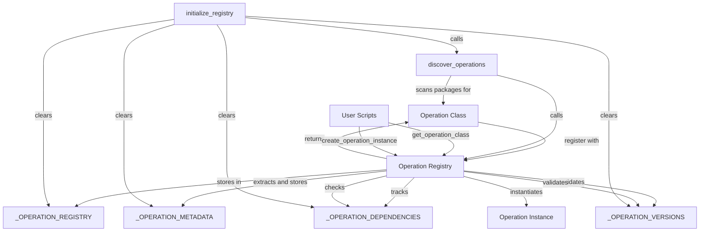
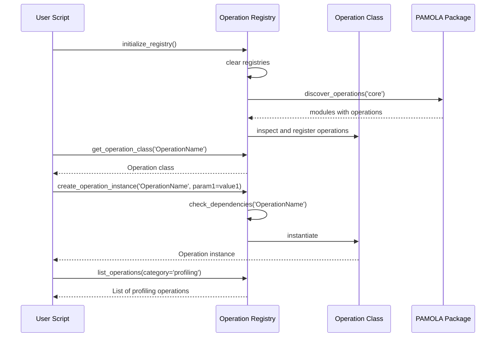

# PAMOLA.CORE Operation Registry Module Documentation

## 1. Purpose and Overview

The PAMOLA.CORE Operation Registry module (`op_registry.py`) provides a comprehensive system for registering, discovering, and retrieving operation classes throughout the PAMOLA privacy-preserving data processing framework. It serves as a central registry that allows operations to be referenced by name and provides metadata about available operations, enabling dynamic discovery and instantiation of operations across the system.

The Operation Registry functions as a cornerstone of the PAMOLA.CORE operations framework, ensuring that operations can be easily discovered, validated for compatibility, and instantiated with appropriate parameters. This registry pattern enables loose coupling between operation consumers and implementations, supporting extensibility and modular design throughout the framework.

## 2. Key Features

- **Operation Registration**: Simple API for registering operation classes with optional version and dependency information
- **Operation Discovery**: Automatic scanning and registration of operations in packages and modules
- **Version Management**: Support for semantic versioning and compatibility checking
- **Dependency Resolution**: Tracking and validation of inter-operation dependencies
- **Metadata Extraction**: Automatic extraction of operation parameters, categories, and descriptions
- **Registry Queries**: Methods for listing available operations and filtering by category
- **Automatic Instantiation**: Helpers for creating operation instances with appropriate parameters
- **Error Handling**: Standardized error classes for registration and lookup failures
- **Type Annotations**: Comprehensive type hints for better IDE support and static analysis

## 3. Architecture

### Integration Architecture

The Operation Registry is positioned as a pamola core utility module within the PAMOLA.CORE operations framework:

```
┌────────────────────────────────────────────────────────────────┐
│                      User-Level Scripts                        │
└─────────────────────────────────┬──────────────────────────────┘
                                  │
                                  ▼
┌────────────────────────────────────────────────────────────────┐
│                     Operations Framework                       │
│  ┌─────────────────┐ ┌────────────────┐ ┌───────────────────┐  │
│  │   BaseOperation │ │ OperationResult│ │  OperationRegistry│  │
│  └────────┬────────┘ └───────┬────────┘ └──────────┬────────┘  │
│           │                  │                     │           │
└───────────┼──────────────────┼─────────────────────┼───────────┘
            │                  │                     │
            ▼                  ▼                     ▼
┌─────────────────────────────────────────────────────────────────┐
│                     Core Utility Modules                        │
│  ┌──────────────┐ ┌───────────────────────┐  ┌─────────────┐    │
│  │OperationConfig │OperationConfigRegistry│  │DataWriter   │    │
│  └─────┬────────┘ └────────┬──────────────┘  └─────┬───────┘    │
│        │                   │                       │            │
│        ▼                   ▼                       ▼            │
│  ┌────────────────────────────────────────────────────────┐     │
│  │        Lower-level utilities (io, logging, etc.)       │     │
│  └────────────────────────────────────────────────────────┘     │
└─────────────────────────────────────────────────────────────────┘
```

### Component Architecture

The Operation Registry is implemented as a collection of global functions and dictionaries that provide the registration and lookup capabilities:

```
┌─────────────────────────────────────────────────────────────────┐
│                Operation Registry Module                        │
│                                                                 │
│  ┌──────────────────────────┐  ┌─────────────────────────────┐  │
│  │ Global Dictionaries      │  │ Registration Functions      │  │
│  │                          │  │                             │  │
│  │ ◆ _OPERATION_REGISTRY    │  │◆ register_operation()       │  │
│  │ ◆ _OPERATION_METADATA    │  │◆ unregister_operation()     │  │
│  │ ◆ _OPERATION_DEPENDENCIES   │◆ discover_operations()      │  │
│  │ ◆ _OPERATION_VERSIONS    │  │◆ initialize_registry()      │  │
│  └──────────────────────────┘  └─────────────────────────────┘  │
│                                                                 │
│  ┌────────────────────────┐  ┌───────────────────────────────┐  │
│  │ Lookup Functions       │  │ Validation Functions          │  │
│  │                        │  │                               │  │
│  │ ◆ get_operation_class  │  │◆ check_dependencies()         │  │
│  │ ◆ get_operation_metadata  │◆ check_version_compatibility  │  │
│  │ ◆ get_operation_version│  │                               │  │
│  │ ◆ list_operations()    │  │                               │  │
│  └────────────────────────┘  └───────────────────────────────┘  │
│                                                                 │
│  ┌───────────────────────────────┐  ┌───────────────────────┐   │
│  │ Helper Functions              │  │ Error Classes         │   │
│  │                               │  │                       │   │
│  │ ◆ _extract_init_parameters    │  │ ◆ OpsError            │   │
│  │ ◆ _determine_operation_category  │ ◆ RegistryError       │   │
│  │ ◆ _is_valid_semver()          │  │                       │   │
│  │ ◆ _parse_version_constraint   │  │                       │   │
│  └───────────────────────────────┘  └───────────────────────┘   │
└─────────────────────────────────────────────────────────────────┘
```

### Data Flow





## 4. Pamola Core API Reference

| Function | Description | Key Parameters | Returns | Req-ID |
|----------|-------------|----------------|---------|--------|
| `register_operation` | Register an operation class | `operation_class`: Class to register<br>`override`: Override existing registration<br>`dependencies`: List of dependencies<br>`version`: Operation version | `bool`: Success status | REQ-OPS-007 |
| `unregister_operation` | Remove operation from registry | `operation_name`: Name of operation | `bool`: Success status | - |
| `get_operation_class` | Get operation class by name | `operation_name`: Name of operation | `Optional[Type]`: Operation class or None | - |
| `get_operation_metadata` | Get metadata for operation | `operation_name`: Name of operation | `Optional[Dict[str, Any]]`: Metadata or None | - |
| `get_operation_version` | Get version of operation | `operation_name`: Name of operation | `Optional[str]`: Version string or None | - |
| `get_operation_dependencies` | Get dependencies of operation | `operation_name`: Name of operation | `List[Dict[str, str]]`: List of dependencies | - |
| `check_dependencies` | Check if dependencies are satisfied | `operation_name`: Name of operation | `Tuple[bool, List[str]]`: (all_satisfied, unsatisfied_dependencies) | - |
| `check_version_compatibility` | Check if version satisfies constraint | `version_str`: Version to check<br>`constraint`: Version constraint | `bool`: Compatibility status | - |
| `list_operations` | List registered operations | `category`: Optional category filter | `List[str]`: List of operation names | - |
| `list_categories` | List available categories | None | `List[str]`: List of categories | - |
| `get_operations_by_category` | Get operations organized by category | None | `Dict[str, List[str]]`: Category mapping | - |
| `create_operation_instance` | Create instance of operation | `operation_name`: Name of operation<br>`**kwargs`: Parameters for constructor | `Optional[Any]`: Operation instance or None | - |
| `discover_operations` | Discover and register operations in package | `package_name`: Package to scan | `int`: Number of operations registered | - |
| `initialize_registry` | Initialize registry with all operations | None | `int`: Number of operations registered | - |

### register_operation Function

```python
def register_operation(operation_class,
                       override: bool = False,
                       dependencies: Optional[List[Dict[str, str]]] = None,
                       version: Optional[str] = None) -> bool:
    """
    Register an operation class in the registry.

    Satisfies REQ-OPS-007: Provides operation registration for discovery.

    Parameters:
    -----------
    operation_class : Type
        The operation class to register
    override : bool
        Whether to override an existing registration with the same name
    dependencies : List[Dict[str, str]], optional
        List of dependencies for the operation, each with 'name' and 'version' keys
    version : str, optional
        Version of the operation (defaults to the class's version attribute if present)

    Returns:
    --------
    bool
        True if registration was successful, False otherwise
    """
```

Behavior:
- Validates that the class inherits from BaseOperation
- Checks if operation is already registered and respects the override flag
- Extracts version from class attribute if not provided
- Validates version format using semantic versioning
- Extracts metadata such as module, description, parameters, and category
- Adds the operation to the registry dictionaries
- Logs the registration at the debug level

### discover_operations Function

```python
def discover_operations(package_name: str = 'core') -> int:
    """
    Discover and register operations from a package.

    Recursively imports modules in the specified package and registers
    all found operation classes.

    Parameters:
    -----------
    package_name : str
        Name of the package to scan for operations

    Returns:
    --------
    int
        Number of operations registered
    """
```

Behavior:
- Recursively imports modules within the specified package
- For each module, finds classes that inherit from BaseOperation
- Extracts version and dependencies from class attributes
- Registers discovered operations automatically
- Returns the count of newly registered operations

## 5. Usage Examples

### Basic Registration and Lookup

```python
from pamola_core.utils.ops.op_registry import (
    register_operation, 
    get_operation_class,
    get_operation_metadata
)
from pamola_core.utils.ops.op_base import BaseOperation

# Define a custom operation
class MyCustomOperation(BaseOperation):
    """Custom operation for demonstration purposes."""
    
    version = "1.2.0"  # Operation version
    
    def __init__(self, name="CustomOp", threshold=0.5, **kwargs):
        super().__init__(
            name=name,
            description="Custom operation for testing registration",
            **kwargs
        )
        self.threshold = threshold
    
    def execute(self, data_source, task_dir, reporter, progress_tracker=None, **kwargs):
        # Operation implementation...
        pass

# Register the operation
success = register_operation(MyCustomOperation)
print(f"Registration successful: {success}")

# Look up the operation by name
operation_class = get_operation_class("MyCustomOperation")
if operation_class:
    # Create an instance
    instance = operation_class(threshold=0.75)
    print(f"Created instance: {instance.name}, threshold={instance.threshold}")

# Get metadata for the operation
metadata = get_operation_metadata("MyCustomOperation")
if metadata:
    print(f"Operation module: {metadata['module']}")
    print(f"Operation category: {metadata['category']}")
    print(f"Operation version: {metadata['version']}")
    
    # Print parameter information
    print("Parameters:")
    for param_name, param_info in metadata['parameters'].items():
        print(f"  - {param_name}: {param_info['annotation']}")
        if param_info['has_default']:
            print(f"    Default: {param_info['default']}")
```

### Automatic Discovery

```python
from pamola_core.utils.ops.op_registry import discover_operations, list_operations, get_operations_by_category

# Discover all operations in the 'core' package
num_operations = discover_operations(package_name='core')
print(f"Discovered {num_operations} operations")

# List all registered operations
all_operations = list_operations()
print(f"Total registered operations: {len(all_operations)}")
print(f"Operations: {', '.join(all_operations)}")

# List operations by category
operations_by_category = get_operations_by_category()
for category, ops in operations_by_category.items():
    print(f"\nCategory: {category}")
    for op in ops:
        print(f"  - {op}")

# List operations in a specific category
profiling_operations = list_operations(category='profiling')
print(f"\nProfiling operations: {', '.join(profiling_operations)}")
```

### Dependency Management

```python
from pamola_core.utils.ops.op_registry import (
    register_operation, 
    get_operation_dependencies,
    check_dependencies,
    check_version_compatibility
)
from pamola_core.utils.ops.op_base import BaseOperation

# Define operations with dependencies
class BaseProcessor(BaseOperation):
    """Base processing operation."""
    version = "1.0.0"
    
    def execute(self, data_source, task_dir, reporter, progress_tracker=None, **kwargs):
        pass

class AdvancedProcessor(BaseOperation):
    """Advanced processing operation."""
    version = "2.1.0"
    dependencies = [
        {"name": "BaseProcessor", "version": ">=1.0.0"}
    ]
    
    def execute(self, data_source, task_dir, reporter, progress_tracker=None, **kwargs):
        pass

class ComplexProcessor(BaseOperation):
    """Complex processing operation."""
    version = "0.9.0"
    dependencies = [
        {"name": "AdvancedProcessor", "version": ">=2.0.0"},
        {"name": "BaseProcessor", "version": ">=1.0.0"}
    ]
    
    def execute(self, data_source, task_dir, reporter, progress_tracker=None, **kwargs):
        pass

# Register operations
register_operation(BaseProcessor)
register_operation(AdvancedProcessor)
register_operation(ComplexProcessor)

# Check dependencies for an operation
dependencies = get_operation_dependencies("ComplexProcessor")
print(f"Dependencies of ComplexProcessor: {dependencies}")

# Verify if dependencies are satisfied
are_satisfied, unsatisfied = check_dependencies("ComplexProcessor")
if are_satisfied:
    print("All dependencies are satisfied")
else:
    print(f"Unsatisfied dependencies: {', '.join(unsatisfied)}")

# Check specific version compatibility
is_compatible = check_version_compatibility("2.1.0", ">=2.0.0")
print(f"Version 2.1.0 compatible with >=2.0.0? {is_compatible}")

is_compatible = check_version_compatibility("1.5.0", "1.x.x")
print(f"Version 1.5.0 compatible with 1.x.x? {is_compatible}")
```

### Creating Operation Instances

```python
from pamola_core.utils.ops.op_registry import (
    register_operation,
    create_operation_instance,
    initialize_registry
)
from pamola_core.utils.ops.op_base import BaseOperation

# Sample operation with parameters
class ParameterizedOperation(BaseOperation):
    """Operation with various parameter types."""
    version = "1.0.0"
    
    def __init__(self, 
                 name="ParamOp",
                 field_name=None,
                 threshold=0.5,
                 iterations=10,
                 enabled=True,
                 options=None,
                 **kwargs):
        super().__init__(
            name=name,
            description="Operation with parameters for testing",
            **kwargs
        )
        self.field_name = field_name
        self.threshold = threshold
        self.iterations = iterations
        self.enabled = enabled
        self.options = options or {}
    
    def execute(self, data_source, task_dir, reporter, progress_tracker=None, **kwargs):
        # Implementation...
        pass

# Register the operation
register_operation(ParameterizedOperation)

# Create an instance using the factory function
instance = create_operation_instance(
    "ParameterizedOperation",
    field_name="email",
    threshold=0.75,
    iterations=5,
    options={"mode": "strict", "validate": True}
)

if instance:
    print(f"Created instance: {instance.name}")
    print(f"Field name: {instance.field_name}")
    print(f"Threshold: {instance.threshold}")
    print(f"Iterations: {instance.iterations}")
    print(f"Enabled: {instance.enabled}")
    print(f"Options: {instance.options}")
else:
    print("Failed to create instance")
```

### Initializing and Resetting the Registry

```python
from pamola_core.utils.ops.op_registry import (
    initialize_registry,
    list_operations,
    register_operation
)
from pamola_core.utils.ops.op_base import BaseOperation

# Define a test operation
class TestOperation(BaseOperation):
    """Test operation for registry demonstration."""
    version = "1.0.0"
    
    def execute(self, data_source, task_dir, reporter, progress_tracker=None, **kwargs):
        pass

# Register manually
register_operation(TestOperation)
print(f"Operations after manual registration: {list_operations()}")

# Initialize (clear and rebuild) the registry
num_registered = initialize_registry()
print(f"Registered {num_registered} operations after initialization")
print(f"Operations after initialization: {list_operations()}")
```

## 6. Limitations and Best Practices

### Current Limitations

1. **Global State**: The registry uses global dictionaries, making it less suitable for scenarios where multiple independent registries are needed.

2. **Thread Safety**: The current implementation does not include explicit thread safety mechanisms, which should be considered in multithreaded environments.

3. **Performance**: Large-scale scanning with `discover_operations()` might be slow due to module imports and inspection.

4. **Registry Persistence**: The registry is in-memory only and not persisted between application restarts.

5. **Circular Dependencies**: There is limited protection against circular dependencies, which could cause issues in complex operation graphs.

### Best Practices

#### Registration Patterns

1. **Module-Level Registration**:
   ```python
   # At the end of your operation module
   from pamola_core.utils.ops.op_registry import register_operation
   register_operation(MyOperation)
   ```

2. **Registration with Dependencies**:
   ```python
   # Define specific version requirements
   register_operation(
       AdvancedOperation,
       dependencies=[
           {"name": "BaseOperation", "version": ">=1.2.0"},
           {"name": "UtilityOperation", "version": "1.x.x"}
       ]
   )
   ```

3. **Explicit Version Information**:
   ```python
   class MyOperation(BaseOperation):
       # Define version as class attribute
       version = "1.3.2"
       
       # Or register with explicit version
       register_operation(MyOperation, version="1.3.2")
   ```

#### Discovery and Lookup

1. **Centralized Initialization**:
   ```python
   # In your application startup
   from pamola_core.utils.ops.op_registry import initialize_registry
   
   def app_startup():
       num_ops = initialize_registry()
       logger.info(f"Initialized operation registry with {num_ops} operations")
   ```

2. **Category-Based Organization**:
   ```python
   # Group operations logically
   profiling_ops = list_operations(category='profiling')
   anonymization_ops = list_operations(category='anonymization')
   
   # Display available operations by category
   categories = get_operations_by_category()
   for category, operations in categories.items():
       print(f"{category}: {', '.join(operations)}")
   ```

3. **Error Handling for Lookup**:
   ```python
   # Safely access operation classes
   operation_class = get_operation_class("MyOperation")
   if operation_class is None:
       logger.error(f"Operation 'MyOperation' not found")
       # Handle missing operation...
   else:
       instance = operation_class(**params)
   ```

#### Instance Creation

1. **Factory Pattern**:
   ```python
   # Create operation from configuration
   def create_from_config(config):
       operation_name = config.get("operation_type")
       params = config.get("parameters", {})
       
       return create_operation_instance(operation_name, **params)
   ```

2. **Dependency Checking**:
   ```python
   # Verify dependencies before creation
   satisfied, unsatisfied = check_dependencies(operation_name)
   if not satisfied:
       logger.error(f"Cannot create {operation_name}: "
                    f"missing dependencies: {', '.join(unsatisfied)}")
       return None
   ```

3. **Parameterized Creation**:
   ```python
   # Create with appropriate parameters
   instance = create_operation_instance(
       "ProfilerOperation",
       fields=["name", "email", "address"],
       sample_size=10000,
       include_visualizations=True
   )
   ```

#### Versioning

1. **Semantic Versioning**:
   - Use proper semantic versioning (Major.Minor.Patch)
   - Increment Major for backward-incompatible changes
   - Increment Minor for new features
   - Increment Patch for bug fixes

2. **Version Constraints**:
   ```python
   # Different constraint formats
   check_version_compatibility("1.2.3", ">=1.0.0")  # Minimum version
   check_version_compatibility("1.2.3", "1.x.x")    # Major version match
   check_version_compatibility("1.2.3", "<2.0.0")   # Maximum version
   ```

3. **Version Documentation**:
   ```python
   class MyOperation(BaseOperation):
       """
       My custom operation.
       
       Version history:
       - 1.0.0: Initial implementation
       - 1.1.0: Added feature X
       - 1.1.1: Fixed bug Y
       - 1.2.0: Added feature Z
       """
       version = "1.2.0"
   ```

By following these guidelines, you can ensure optimal use of the Operation Registry module within the PAMOLA.CORE framework, with proper handling of discovery, versioning, and dependency management.